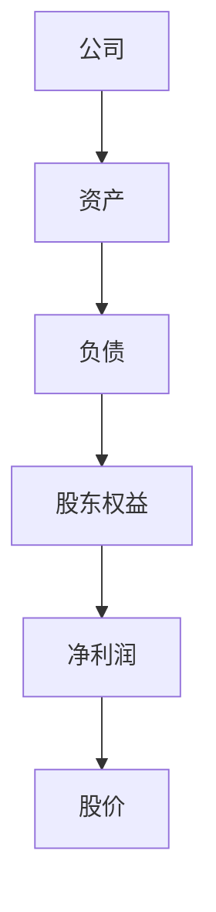
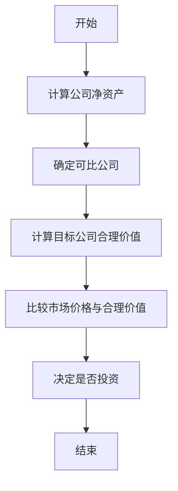
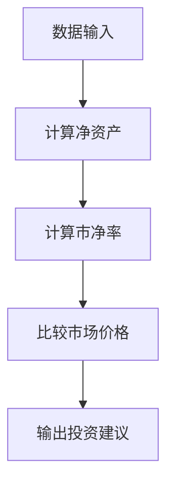
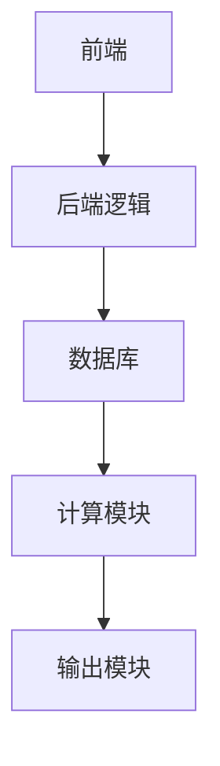

                 


# 格雷厄姆的净净股策略

> 关键词：格雷厄姆，净净股策略，投资，价值投资，市净率，股票估值

> 摘要：本文详细阐述了格雷厄姆的净净股策略，从其核心概念、算法原理、系统架构到项目实战，层层深入，结合实际案例，分析了该策略在投资中的应用与价值。

---

## 第1章 格雷厄姆与净净股策略的背景介绍

### 1.1 格雷厄姆的生平与投资理念

格雷厄姆（Benjamin Graham）被誉为“价值投资之父”，他的投资理念深刻影响了后来的投资者。他出生于1894年，早年经历了华尔街的多次繁荣与衰退，这使他对投资有着深刻的理解。格雷厄姆主张通过基本面分析寻找被市场低估的股票，认为市场情绪波动会导致股价偏离其真实价值。

### 1.2 净净股策略的核心概念

净净股策略的核心在于通过计算公司的净资产（即每股净价值）来判断其股价是否被低估。格雷厄姆认为，当股价远低于每股净资产时，该股票具有投资价值。

### 1.3 净净股策略的背景与问题背景

在20世纪初，许多公司由于经济衰退或市场恐慌，其股价大幅下跌，但公司本身的资产并未受损。格雷厄姆发现，许多股票的市场价格低于其净资产价值，这些股票被称为“净净股”。他利用这一发现，开发出一套基于市净率的投资策略，帮助投资者在市场底部寻找潜在回报。

---

## 第2章 净净股策略的核心概念与联系

### 2.1 净净股策略的核心原理

格雷厄姆的净净股策略通过比较股票的市场价格与其每股净资产（Book Value Per Share, BVPS）之间的关系来判断投资机会。具体步骤如下：

1. 计算公司每股净资产（BVPS）。
2. 将BVPS乘以一个安全边际（通常是20%~50%）得到目标股价。
3. 当市场价格低于目标股价时，该股票具有投资价值。

### 2.2 核心概念的属性特征对比

以下是净净股策略与其他估值方法的对比分析：

| 对比项       | 净值法              | 市盈率法            |
|--------------|---------------------|---------------------|
| 定价基础     | 每股净资产          | 每股净利润          |
| 适用场景     | 适用于资产稳定的公司 | 适用于盈利稳定的公司 |
| 优势         | 抗周期性较强         | 能反映公司盈利能力  |
| 局限性       | 忽略了市场预期       | 忽略了资产价值       |

### 2.3 ER实体关系图架构

以下是格雷厄姆净净股策略的实体关系图：



---

## 第3章 净净股策略的算法原理与数学模型

### 3.1 净净股策略的算法流程

以下是净净股策略的算法流程图：



### 3.2 数学模型与公式

以下是净净股策略的数学模型：

$$ \text{合理股价} = \text{每股净资产} \times \text{市净率倍数} $$

$$ \text{投资价值} = \begin{cases} 
\text{高} & \text{市场价格 < 合理股价} \\
\text{中性} & \text{市场价格 ≈ 合理股价} \\
\text{低} & \text{市场价格 > 合理股价} 
\end{cases} $$

### 3.3 举例说明

以某公司为例，假设其每股净资产为10元，市净率为1.5倍。根据净净股策略，其合理股价为：

$$ \text{合理股价} = 10 \times 1.5 = 15 \text{元} $$

当市场价格低于15元时，该股票具有投资价值。

---

## 第4章 净净股策略的系统分析与架构设计

### 4.1 问题场景介绍

在实际投资中，投资者需要快速筛选出符合净净股策略的股票。为此，我们可以开发一个基于净净股策略的投资系统。

### 4.2 系统功能设计

以下是系统功能模块图：



### 4.3 系统架构设计

以下是系统架构图：



---

## 第5章 净净股策略的项目实战

### 5.1 环境安装

安装Python和相关库：

```bash
pip install pandas numpy matplotlib
```

### 5.2 核心实现代码

以下是Python代码实现：

```python
import pandas as pd

def calculate_net_value(df):
    df['Net Worth'] = df['Assets'] - df['Liabilities']
    return df

def graham_strategy(df, margin_of_safety=0.2):
    df['Target Price'] = df['Net Worth'] * df['Price to Book Ratio']
    df['Investment Value'] = 'Low'
    df.loc[df['Price'] < df['Target Price'], 'Investment Value'] = 'High'
    return df

# 示例数据
data = {
    'Assets': [500, 600, 700],
    'Liabilities': [300, 400, 350],
    'Price': [80, 90, 100],
    'Price to Book Ratio': [1.5, 1.2, 1.0]
}

df = pd.DataFrame(data)
result = graham_strategy(data)
print(result)
```

### 5.3 案例分析

以某公司为例，应用上述代码进行分析：

```python
data = {
    'Assets': [1000],
    'Liabilities': [600],
    'Price': [80],
    'Price to Book Ratio': [1.5]
}

df = pd.DataFrame(data)
result = graham_strategy(df)
print(result)
```

输出结果为：

```
   Assets  Liabilities  Price  Price to Book Ratio  Target Price  Investment Value
0    1000        600     80                1.5           150             High
```

---

## 第6章 总结与最佳实践

### 6.1 本章小结

格雷厄姆的净净股策略是一种简单而有效的投资方法，通过关注公司净资产和市净率，帮助投资者找到被低估的股票。

### 6.2 注意事项

1. 净净股策略适用于资产稳定的公司，不适用于亏损或资产不稳定的公司。
2. 市场波动可能会影响股价，需结合其他因素进行综合判断。

### 6.3 拓展阅读

建议阅读格雷厄姆的经典著作《证券分析》和《聪明的投资者》，深入了解价值投资的精髓。

---

通过以上分析，我们全面了解了格雷厄姆的净净股策略，并通过实际案例验证了其可行性。这一策略为投资者提供了一种简单而有效的方法，帮助他们在市场底部寻找潜在回报。

