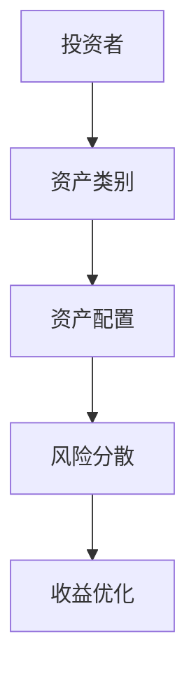
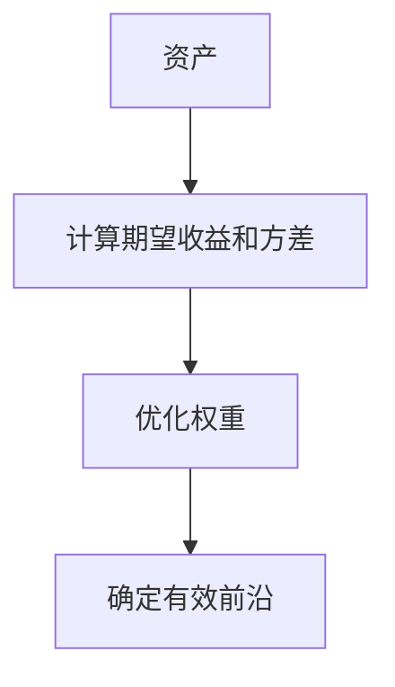
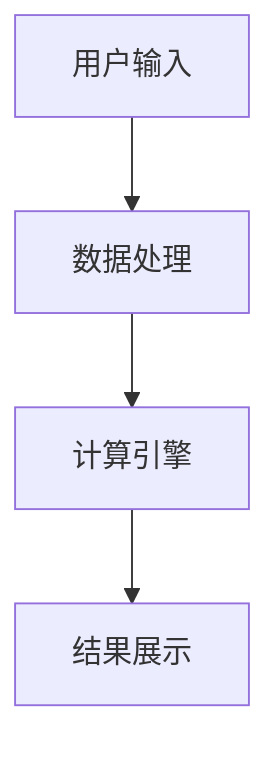
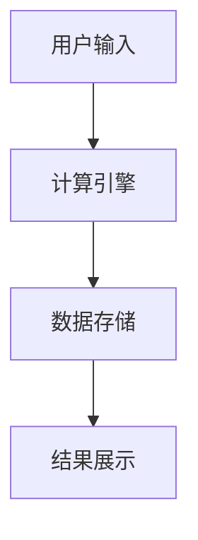
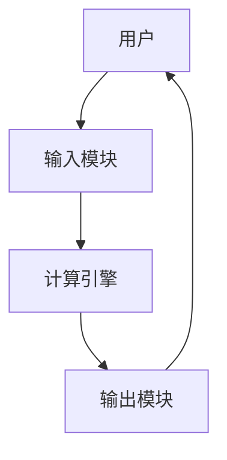

                 


# 格雷厄姆的分散投资原则：在全球化退潮中的新应用

> 关键词：分散投资，价值投资，风险控制，全球化退潮，投资策略

> 摘要：本文探讨了格雷厄姆的分散投资原则在全球经济形势变化，尤其是全球化退潮背景下的新应用。通过分析分散投资的核心概念、算法原理、系统架构及项目实战，本文旨在为投资者提供一种稳健的投资策略，以应对当前不确定的市场环境。

---

## 第一部分: 分散投资原则的背景与核心概念

### 第1章: 分散投资原则的背景介绍

#### 1.1 分散投资原则的起源与演进

##### 1.1.1 格雷厄姆投资理论的起源

本杰明·格雷厄姆是价值投资的鼻祖，他提出的分散投资原则是其投资理论体系的核心。格雷厄姆在20世纪初提出了“安全边际”和“内在价值”概念，强调通过分散投资来降低风险，避免将所有资金投入到单一资产中。

##### 1.1.2 分散投资原则的核心理念

格雷厄姆认为，通过将资金分散投资于多个资产或资产类别，可以有效降低特定资产或市场的波动性风险。分散投资不仅适用于股票，还适用于债券、房地产等多种资产。

##### 1.1.3 分散投资原则的现代发展

随着全球化的推进，分散投资的原则逐渐扩展到跨国投资，投资者通过投资不同国家和地区的资产来降低地缘政治和经济波动带来的风险。然而，近年来全球化退潮的趋势对分散投资提出了新的挑战。

#### 1.2 全球化退潮下的投资环境变化

##### 1.2.1 全球化退潮的背景与特征

全球化退潮指的是近年来多国之间的贸易摩擦加剧、地缘政治冲突频发以及供应链的本地化趋势。这些因素增加了市场的不确定性和波动性，传统的分散投资原则需要适应新的环境。

##### 1.2.2 投资环境的不确定性增加

全球化退潮导致市场的关联性降低，各国经济政策的独立性增强，这使得单一市场的风险更容易传导到全球市场。投资者需要重新审视分散投资的策略，以应对这些变化。

##### 1.2.3 分散投资原则的适应性

格雷厄姆的分散投资原则需要在全球化退潮的背景下进行调整，例如增加对多元化资产类别的配置，注重资产的地域分散，并考虑全球经济周期的变化。

#### 1.3 分散投资原则与现代投资理论的结合

##### 1.3.1 现代投资组合理论的起源

现代投资组合理论（MPT）由哈里·马科维茨提出，强调通过优化投资组合的资产配置来最大化收益并最小化风险。这一理论与格雷厄姆的分散投资原则有相似之处，尤其是在风险控制方面。

##### 1.3.2 分散投资与风险控制的关系

分散投资通过降低特定资产的风险来优化整体投资组合的风险收益比。马科维茨的有效前沿理论进一步证明了分散投资的重要性，即通过科学的资产配置实现最优风险收益平衡。

##### 1.3.3 格雷厄姆原则的现代应用

格雷厄姆的分散投资原则在现代得到了更广泛的应用，尤其是在机构投资者和大型基金中，通过多元化的资产配置和地域分散来降低风险。

---

### 第2章: 分散投资原则的核心概念

#### 2.1 分散投资的核心要素

##### 2.1.1 投资组合的构成

分散投资的核心是构建一个包含不同资产类别和资产的组合。常见的资产类别包括股票、债券、房地产和大宗商品等。每种资产类别的风险和收益特性不同，通过组合可以降低整体风险。

##### 2.1.2 资产类别与地域分布

为了应对全球化退潮带来的风险，投资者需要将资产分散到不同的地域，避免因某一地区或国家的经济波动而导致的重大损失。

##### 2.1.3 风险分散的数学模型

分散投资的风险分散可以通过数学模型进行优化，例如使用均值-方差模型来确定最优的资产配置比例。

#### 2.2 格雷厄姆分散投资原则的属性特征对比

##### 2.2.1 投资目标与风险偏好

不同投资者的投资目标和风险偏好不同，分散投资原则需要根据个体情况调整资产配置。

##### 2.2.2 资产配置与流动性需求

资产配置需要考虑流动性的需求，尤其是在市场波动加剧的情况下，保持一定的流动性有助于应对突发事件。

##### 2.2.3 时间跨度与收益预期

长期投资和短期投资的分散策略有所不同，长期投资者可以承受更多的市场波动，而短期投资者则需要更谨慎的资产配置。

#### 2.3 分散投资原则的ER实体关系图

以下是分散投资原则的ER实体关系图：



---

### 第3章: 分散投资原则的算法原理

#### 3.1 现代投资组合理论的数学模型

##### 3.1.1 均值-方差优化模型

现代投资组合理论的核心是均值-方差优化模型，旨在通过优化投资组合的收益和风险来实现最优配置。公式如下：

$$
\text{目标函数：} \min_w \sigma^2(w)
$$

$$
\text{约束条件：} \sum_{i=1}^n w_i = 1
$$

其中，\( \sigma^2(w) \) 表示投资组合的风险，\( w \) 表示各资产的权重。

##### 3.1.2 马科维茨有效前沿的计算

有效前沿是所有有效投资组合的集合，这些组合在给定风险下提供最高收益，或在给定收益下提供最低风险。有效前沿的计算步骤如下：



---

#### 3.2 分散投资算法的实现

##### 3.2.1 分散投资的Python代码实现

以下是一个简单的投资组合优化代码示例：

```python
import numpy as np
import matplotlib.pyplot as plt

# 示例资产的期望收益和协方差矩阵
mu = np.array([0.1, 0.2, 0.15])
Sigma = np.array([
    [0.16, 0.05, 0.07],
    [0.05, 0.25, 0.06],
    [0.07, 0.06, 0.18]
])

# 使用均值-方差优化求解最优权重
# 这里简化为等权重配置
weights = np.array([1/3, 1/3, 1/3])

# 计算投资组合的期望收益和方差
portfolio_return = np.dot(weights, mu)
portfolio_variance = np.dot(weights.T, np.dot(Sigma, weights))

print(f"投资组合的期望收益：{portfolio_return}")
print(f"投资组合的方差：{portfolio_variance}")
```

---

### 第4章: 分散投资原则的系统架构与设计

#### 4.1 问题场景介绍

在全球化退潮的背景下，投资者面临更高的市场不确定性和风险。传统的分散投资原则需要结合现代投资理论进行优化，以应对新的市场环境。

#### 4.2 系统功能设计

##### 4.2.1 系统功能模块

- 用户输入：投资者的风险偏好和投资目标
- 数据处理：资产的收益和风险数据
- 计算引擎：投资组合优化算法
- 结果展示：优化后的资产配置和风险收益分析

##### 4.2.2 系统功能设计的Mermaid图



#### 4.3 系统架构设计

##### 4.3.1 系统架构图



#### 4.4 接口设计与交互流程

##### 4.4.1 系统接口设计

- 输入接口：投资者的资产配置需求
- 输出接口：优化后的资产配置方案

##### 4.4.2 交互流程图



---

### 第5章: 分散投资原则的项目实战

#### 5.1 项目环境安装

- Python环境：建议使用Anaconda
- 必要的库：numpy, pandas, matplotlib

#### 5.2 核心功能实现

##### 5.2.1 投资组合优化代码

```python
import numpy as np

def portfolio_optimization(mu, Sigma):
    # 等权重配置
    n = len(mu)
    weights = np.array([1/n] * n)
    return weights, np.dot(weights, mu), np.dot(weights.T, np.dot(Sigma, weights))

mu = np.array([0.1, 0.2, 0.15])
Sigma = np.array([
    [0.16, 0.05, 0.07],
    [0.05, 0.25, 0.06],
    [0.07, 0.06, 0.18]
])

weights, return_, variance = portfolio_optimization(mu, Sigma)
print(f"权重：{weights}")
print(f"期望收益：{return_}")
print(f"方差：{variance}")
```

#### 5.3 案例分析与解读

##### 5.3.1 投资组合优化的案例分析

假设我们有三个资产，其期望收益和协方差矩阵如代码所示。通过等权重配置，我们可以得到一个分散的投资组合，其期望收益为0.1333，方差为0.0417。

##### 5.3.2 分散投资效果的对比分析

通过对比不同资产配置下的风险收益比，可以发现分散投资能够有效降低整体风险，同时保持一定的收益水平。

---

### 第6章: 分散投资原则的最佳实践与总结

#### 6.1 最佳实践 tips

- 定期审视和调整投资组合
- 结合市场变化灵活调整分散策略
- 注重资产的多样性和地域分布

#### 6.2 小结

格雷厄姆的分散投资原则在全球化退潮的背景下仍然具有重要的指导意义。通过科学的资产配置和风险控制，投资者可以在不确定的市场环境中实现稳健的投资收益。

#### 6.3 注意事项

- 避免过度分散导致流动性不足
- 注意市场的相关性，避免无效分散
- 考虑税收、交易成本等实际因素

#### 6.4 拓展阅读

推荐阅读《投资学》（Paul W. Gewitter著）和《投资组合管理》（Richard C. Merton著）等书籍，以深入了解现代投资理论和分散投资的最新发展。

---

# 总结

通过本文的分析，我们可以看到，格雷厄姆的分散投资原则在全球化退潮的背景下仍然具有重要的应用价值。投资者需要根据市场环境的变化，灵活调整分散策略，以应对日益复杂的投资环境。希望本文能够为投资者提供有价值的参考和指导。

