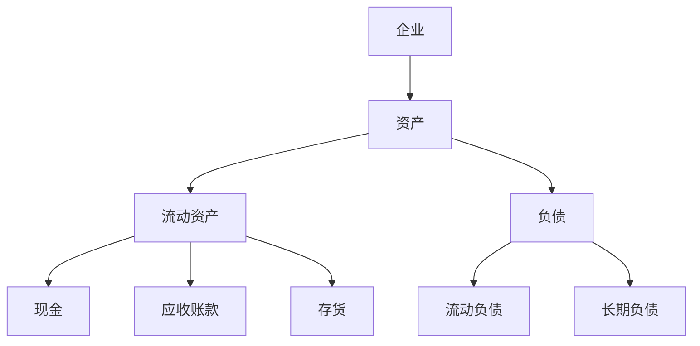
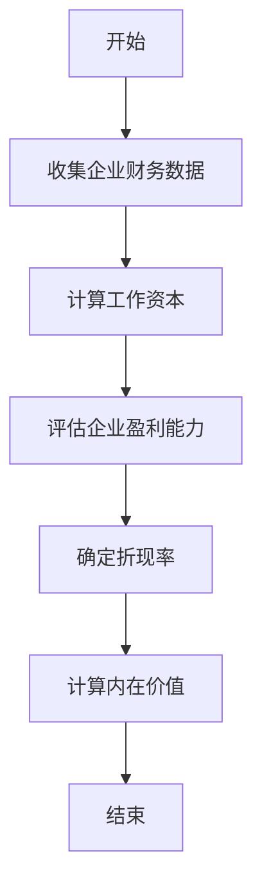
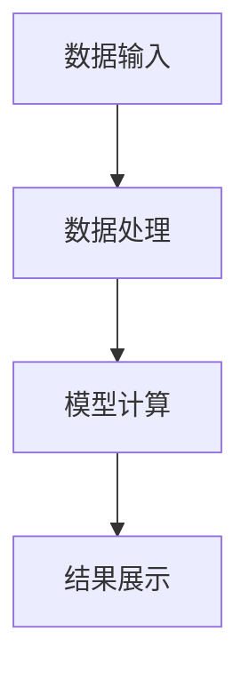

                 


# 格雷厄姆的工作资本分析在现代企业估值中的应用

> 关键词：格雷厄姆，工作资本分析，企业估值，价值投资，投资策略

> 摘要：本文深入探讨了格雷厄姆提出的工作资本分析方法在现代企业估值中的应用。通过分析其核心概念、算法原理及系统架构，结合实际案例，展示了如何将这一经典方法与现代投资策略相结合，为企业估值提供新的视角和实践指导。

---

# 第一部分: 格雷厄姆工作资本分析的背景与核心概念

## 第1章: 工作资本分析的起源与发展

### 1.1 工作资本分析的起源

#### 1.1.1 格雷厄姆的生平与投资理念
本杰明·格雷厄姆（Benjamin Graham）是价值投资的鼻祖，他的投资理念强调安全边际和对公司内在价值的深入分析。他主张投资者应以低于公司内在价值的价格买入股票，从而确保投资的安全性。

#### 1.1.2 工作资本分析的提出背景
20世纪初，美国股市的波动性和企业财务透明度的不足，使得投资者难以准确评估企业的价值。格雷厄姆在这一背景下提出了工作资本分析法，旨在通过分析企业的财务数据，发现被市场低估的企业。

#### 1.1.3 工作资本分析的核心思想
格雷厄姆认为，企业的内在价值可以通过对其未来现金流的折现来评估。他强调对企业盈利能力、成长性和财务状况的全面分析，以确定其合理估值。

### 1.2 工作资本分析的核心概念

#### 1.2.1 工作资本的定义与组成
工作资本（Working Capital）是指企业日常运营中所需的流动资金，包括现金、应收账款、存货等。格雷厄姆通过分析工作资本的变化，评估企业的财务健康状况和运营效率。

#### 1.2.2 核心概念的属性特征对比（表格形式）

| 概念          | 定义与特征                                                                 |
|---------------|---------------------------------------------------------------------------|
| 工作资本      | 流动资产减去流动负债，衡量企业短期偿债能力和运营效率。                   |
| 净利润        | 企业在一个会计期间内的收益减去支出，反映企业盈利能力。                 |
| 折现率        | 将未来现金流折算为现值的利率，反映投资的机会成本和风险。               |
| 内在价值      | 考虑企业未来现金流的现值，反映企业的真实价值。                         |

#### 1.2.3 工作资本分析的ER实体关系图


---

## 第2章: 工作资本分析的现代发展

### 2.1 现代企业估值的核心问题

#### 2.1.1 企业估值的基本原理
企业估值是通过对企业未来现金流的预测，结合适当的折现率，计算其现值，以确定其合理估值。

#### 2.1.2 现代企业估值方法的对比分析
| 方法         | 优点                     | 缺点                     |
|--------------|--------------------------|--------------------------|
| 市盈率法     | 简单易用                 | 受行业影响较大           |
| 现金流折现法 | 考虑未来现金流             | 需准确预测现金流         |
| 股权自由现金流法 | 考虑资本结构             | 计算复杂               |

#### 2.1.3 工作资本分析的适用场景
工作资本分析适用于那些现金流稳定、财务状况健康的成熟企业，尤其适合制造业和零售业。

### 2.2 工作资本分析与现代企业估值的结合

#### 2.2.1 格雷厄姆分析法的现代演变
现代投资者在使用工作资本分析时，通常结合其他估值方法（如市盈率、市净率）进行综合评估。

#### 2.2.2 工作资本分析在企业估值中的地位
工作资本分析是企业估值的重要组成部分，它帮助投资者评估企业的短期偿债能力和运营效率。

#### 2.2.3 现代企业估值中的创新与挑战
现代企业估值中，投资者需要考虑更多因素，如宏观经济环境、行业竞争状况和企业战略等，这对工作资本分析提出了更高的要求。

---

# 第二部分: 工作资本分析的算法原理与数学模型

## 第3章: 工作资本分析的算法原理

### 3.1 工作资本分析的步骤与流程



### 3.2 算法实现的Python代码示例

```python
import pandas as pd
import numpy as np

def calculate_working_capital(financial_data):
    # 计算流动资产和流动负债
    current_assets = financial_data['现金'] + financial_data['应收账款'] + financial_data['存货']
    current_liabilities = financial_data['应付账款'] + financial_data['短期负债']
    working_capital = current_assets - current_liabilities
    return working_capital

# 示例数据
data = {
    '现金': 100,
    '应收账款': 50,
    '存货': 80,
    '应付账款': 60,
    '短期负债': 40
}
wc = calculate_working_capital(data)
print(f"工作资本: {wc}")
```

### 3.3 数学模型与公式

#### 3.3.1 核心公式推导
$$
\text{内在价值} = \frac{\text{净利润} \times (1 + g)}{r}
$$
其中，\( g \) 是增长率，\( r \) 是折现率。

#### 3.3.2 公式应用实例
假设某企业净利润为 $100，增长率 \( g = 5\% \)，折现率 \( r = 10\% \)。则：
$$
\text{内在价值} = \frac{100 \times 1.05}{0.10} = 1050
$$

---

## 第4章: 工作资本分析的数学模型

### 4.1 核心公式与模型

#### 4.1.1 内在价值计算公式
$$
V = \frac{E \times (1 + g)}{r}
$$
其中，\( V \) 是内在价值，\( E \) 是净利润，\( g \) 是增长率，\( r \) 是折现率。

#### 4.1.2 折现率与增长率的关系
$$
r = \text{无风险利率} + \text{风险溢价}
$$

#### 4.1.3 模型假设与边界条件
- 假设企业未来现金流稳定增长。
- 边界条件：增长率不超过折现率，避免未来现金流无限放大。

---

# 第三部分: 系统分析与架构设计

## 第5章: 系统分析与架构设计

### 5.1 系统分析

#### 5.1.1 问题场景介绍
投资者需要通过分析企业的财务数据，评估其内在价值，做出投资决策。

#### 5.1.2 需求分析
- 数据采集：收集企业的财务报表数据。
- 数据处理：计算工作资本、净利润等关键指标。
- 模型计算：应用工作资本分析模型，计算内在价值。
- 结果展示：输出估值结果和投资建议。

#### 5.1.3 系统功能设计



---

## 第6章: 项目实战

### 6.1 环境安装与配置

#### 6.1.1 Python环境安装
安装Python和必要的库（如pandas、numpy）。

### 6.2 系统核心实现源代码

```python
def calculate_intrinsic_value(net_profit, growth_rate, discount_rate):
    return (net_profit * (1 + growth_rate)) / discount_rate

# 示例数据
net_profit = 100
growth_rate = 0.05
discount_rate = 0.10

iv = calculate_intrinsic_value(net_profit, growth_rate, discount_rate)
print(f"内在价值: {iv}")
```

### 6.3 实际案例分析

#### 6.3.1 案例背景
某制造企业，净利润为 $200，预计未来三年增长率为 8%，折现率为 12%。

#### 6.3.2 数据处理与计算
$$
\text{内在价值} = \frac{200 \times 1.08}{0.12} = 1800
$$

#### 6.3.3 投资建议
企业当前股价为 $1500，低于内在价值，建议买入。

---

## 第7章: 最佳实践与小结

### 7.1 最佳实践
- 结合其他估值方法，如市盈率和市净率，进行综合评估。
- 定期更新财务数据和市场环境，调整估值模型。

### 7.2 小结
格雷厄姆的工作资本分析方法虽然经典，但在现代企业估值中仍然具有重要的应用价值。通过结合现代技术手段，如大数据和人工智能，可以进一步提升估值的准确性和效率。

### 7.3 注意事项
- 确保数据来源可靠，避免因数据错误导致估值偏差。
- 合理设定模型参数，如增长率和折现率，避免过度乐观或保守。

### 7.4 拓展阅读
- 格雷厄姆的《 Intelligent Investor》
- 现代投资组合理论的相关文献

---

# 结语

通过本文的探讨，读者可以深入理解格雷厄姆的工作资本分析方法，并将其应用于现代企业估值中。无论是从理论还是实践的角度，这种方法都为我们提供了重要的启示和指导。未来，随着技术的进步和市场的变化，工作资本分析将继续在企业估值中发挥重要作用。

