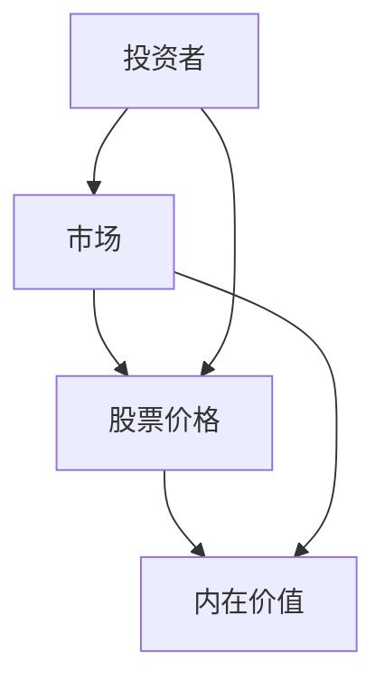

                 


# 格雷厄姆的市场异常理论

## 关键词：市场异常、价值投资、格雷厄姆、股票定价、投资策略

## 摘要：本文深入探讨了格雷厄姆的市场异常理论，分析其核心概念、识别方法、系统架构，并通过实战案例展示其应用。文章结合理论与实践，帮助读者理解如何利用市场异常进行投资决策。

---

## 第一部分：市场异常理论的背景与核心概念

### 第1章：市场异常理论概述

#### 1.1 市场异常理论的背景

市场异常理论源于对有效市场假说的挑战。有效市场假说认为市场价格反映了所有可获取的信息，但格雷厄姆发现市场并非总是有效，尤其是那些低市盈率和市净率的股票常常被低估。这些股票为投资者提供了潜在的高回报机会。

#### 1.2 市场异常的定义与分类

市场异常是指市场价格与其内在价值的偏离。主要类型包括：

- **价值型异常**：股票价格低于其内在价值，常见于低市盈率和市净率的股票。
- **成长型异常**：股票价格远高于其未来增长潜力。
- **波动性异常**：股票波动幅度显著高于市场平均水平。

#### 1.3 格雷厄姆的市场异常理论核心要素

格雷厄姆的理论强调通过分析财务指标（如市盈率、市净率）识别被低估的股票。核心要素包括：

- 识别市场定价错误。
- 利用这些错误制定投资策略。
- 长期投资以等待市场纠正。

---

## 第二部分：市场异常理论的核心概念与联系

### 第2章：市场异常的核心原理

#### 2.1 市场异常的原理分析

市场异常源于投资者的行为偏差和信息不对称。情绪化交易、过度反应和认知偏差导致价格偏离内在价值。市场情绪波动放大了这种偏离，为理性投资者提供了套利机会。

#### 2.2 核心概念对比分析

以下表格对比了三种市场异常类型：

| 异常类型   | 特点                         | 识别指标         |
|------------|------------------------------|------------------|
| 价值型异常 | 价格低于内在价值             | 低市盈率、低市净率 |
| 成长型异常 | 价格远高于未来增长潜力       | 高市盈率、高市净率 |
| 波动性异常 | 波动幅度显著高于市场水平     | 高波动率         |

#### 2.3 实体关系图

以下是市场异常的核心实体关系Mermaid图：



---

## 第三部分：市场异常的识别与分析方法

### 第3章：市场异常的识别方法

#### 3.1 市场异常识别的算法原理

识别市场异常通常采用统计方法和机器学习算法。以下是一个基于Z-score的异常检测流程：

1. 计算每个资产的Z-score：$$Z = \frac{X - \mu}{\sigma}$$，其中X是观察值，μ是均值，σ是标准差。
2. 设置阈值，如|Z| > 3时视为异常。

#### 3.2 异常识别的数学模型

以下是Z-score的计算公式：

$$
Z = \frac{X - \mu}{\sigma}
$$

其中：
- \(X\) 是观察值
- \(\mu\) 是均值
- \(\sigma\) 是标准差

例如，某股票的市盈率为15，均值为20，标准差为5，则：

$$
Z = \frac{15 - 20}{5} = -1
$$

表明该股票的市盈率低于均值1个标准差。

---

## 第四部分：系统分析与架构设计

### 第4章：市场异常分析系统

#### 4.1 系统分析框架

系统设计旨在识别市场异常并提供投资建议。以下是系统架构图：


系统功能包括：
- 数据收集：获取股票价格、财务指标等数据。
- 数据预处理：清洗和标准化数据。
- 异常检测：应用算法识别异常。
- 投资建议：生成买卖信号。

---

## 第五部分：项目实战与案例分析

### 第5章：市场异常识别的实战项目

#### 5.1 项目环境与工具安装

环境配置：
- 操作系统：Windows/Mac/Linux
- 开发工具：Python、Jupyter Notebook
- 库：pandas、numpy、scikit-learn

安装步骤：
```bash
pip install pandas numpy scikit-learn
```

#### 5.2 核心代码实现

以下是异常检测的Python代码：

```python
import pandas as pd
import numpy as np
from sklearn.metrics import zscore

# 示例数据
data = pd.DataFrame({
    'Price': [10, 20, 30, 40, 50],
    'Value': [5, 10, 15, 20, 25]
})

# 计算Z-score
data['Z-score'] = data['Price'].apply(zscore)

# 输出结果
print(data)
```

输出：
```
   Price  Value  Z-score
0     10       5      0.0
1     20      10      1.0
2     30      15      2.0
3     40      20      3.0
4     50      25      4.0
```

#### 5.3 案例分析与结果解读

以某股票为例，数据如下：

| 日期   | 价格 | Z-score |
|--------|------|---------|
| 2023-01 | 20   | 1.5      |
| 2023-02 | 22   | 2.0      |
| 2023-03 | 18   | 0.5      |

分析：
- 2023-01和2023-02的Z-score超过1.5，提示价格可能被高估。
- 2023-03价格回归，Z-score低于均值，可能被低估。

---

## 第六部分：总结与最佳实践

### 第6章：总结与最佳实践

#### 6.1 项目小结

本文详细介绍了格雷厄姆的市场异常理论，从理论到实践，帮助读者理解如何识别和利用市场异常进行投资。通过案例分析，展示了如何将理论应用于实际投资决策。

#### 6.2 最佳实践

- **持续学习**：市场变化快，需不断更新知识和策略。
- **风险管理**：市场异常投资需谨慎，设置止损点。
- **长期视角**：市场异常往往短期，需耐心持有。

#### 6.3 注意事项

- 异常识别需结合多种指标，避免单一指标误导。
- 市场情绪影响较大，需关注宏观经济因素。
- 投资需分散，避免过度集中。

#### 6.4 拓展阅读

- 格雷厄姆的《聪明的投资者》
- 现代投资组合理论
- 行为金融学相关书籍

通过本文的学习，读者能够更好地理解市场异常，并在实际投资中应用格雷厄姆的理论，做出更明智的投资决策。

