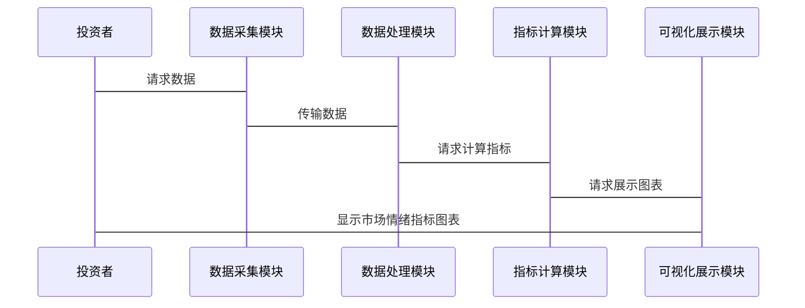

                 


# 格雷厄姆的市场情绪指标

## 关键词：
市场情绪指标, 投资者心理, 格雷厄姆投资理论, 技术分析, 市场情绪算法

## 摘要：
本文深入探讨了格雷厄姆的市场情绪指标，从其核心概念、算法原理到实际应用进行了详细分析。文章首先介绍了市场情绪指标的背景与意义，然后从理论和实践两个方面详细阐述了市场情绪指标的核心原理，包括指标分类、计算方法和Python实现。接着，文章通过系统架构设计和项目实战，展示了如何将市场情绪指标应用于实际投资系统中。最后，总结了市场情绪指标在投资中的重要性，并提供了最佳实践建议。

---

# 第1章：市场情绪指标的背景与意义

## 1.1 市场情绪指标的定义与核心概念

### 1.1.1 什么是市场情绪指标
市场情绪指标是用于量化和分析金融市场中投资者情绪的工具，它反映了市场的乐观或悲观程度。这些指标通常基于价格、成交量、新闻数据等多维度信息进行计算。

### 1.1.2 市场情绪指标的核心要素
市场情绪指标的核心要素包括：
- **价格波动**：价格的剧烈波动通常表明市场情绪的极端（恐慌或兴奋）。
- **成交量**：成交量的变化可以反映市场的活跃程度和投资者的参与度。
- **投资者情绪**：通过新闻、社交媒体等渠道分析投资者的情绪倾向。

### 1.1.3 市场情绪指标在投资中的作用
市场情绪指标在投资中起到以下作用：
- 帮助投资者识别市场的非理性波动。
- 为投资决策提供参考依据。
- 有助于预测市场的拐点。

## 1.2 格雷厄姆的市场情绪理论

### 1.2.1 格雷厄姆的投资理念
格雷厄姆是价值投资的鼻祖，他强调以内在价值为基础进行投资，而非关注市场的短期波动。他认为市场的价格波动反映了市场的非理性，而这种非理性可以通过市场情绪指标来量化。

### 1.2.2 市场情绪与投资决策的关系
格雷厄姆认为，市场情绪是导致市场波动的主要原因。当市场情绪过度乐观时，资产价格会被高估；当市场情绪过度悲观时，资产价格会被低估。投资者可以通过分析市场情绪指标来寻找投资机会。

### 1.2.3 格雷厄姆市场情绪指标的提出背景
格雷厄姆在20世纪提出了市场情绪指标的概念，旨在帮助投资者识别市场的非理性波动。尽管他的理论最初并未被广泛采用，但随着技术的进步和数据的丰富，市场情绪指标逐渐成为现代投资分析的重要工具。

## 1.3 本章小结
本章介绍了市场情绪指标的定义、核心要素及其在投资中的作用，并详细阐述了格雷厄姆的市场情绪理论及其提出背景。市场情绪指标作为量化投资者情绪的重要工具，为投资决策提供了新的视角。

---

# 第2章：市场情绪指标的核心原理

## 2.1 市场情绪指标的分类

### 2.1.1 基于价格的指标
基于价格的指标包括波动率、相对强弱指数（RSI）等，这些指标通过分析资产价格的变化来反映市场情绪。

### 2.1.2 基于成交量的指标
基于成交量的指标包括成交量平均线（VMA）、成交量OBV等，这些指标通过分析交易量的变化来反映市场的活跃程度。

### 2.1.3 基于投资者情绪的指标
基于投资者情绪的指标包括社交媒体情绪分析、新闻情绪指数等，这些指标通过分析投资者的情绪倾向来反映市场的整体情绪。

## 2.2 市场情绪指标的属性特征对比

| 指标类型      | 计算方式                   | 输入数据           | 输出结果           |
|---------------|---------------------------|--------------------|--------------------|
| 基于价格      | 波动率、RSI等             | 资产价格           | 市场情绪强度       |
| 基于成交量     | 成交量平均线、OBV等        | 交易量             | 市场活跃程度       |
| 基于投资者情绪  | 社交媒体分析、新闻分析     | 文本数据           | 情绪倾向（乐观/悲观） |

### 2.2.2 市场情绪指标的ER实体关系图
```mermaid
erd
    投资者 -> 市场情绪指标: 影响
    资产价格 -> 市场情绪指标: 反映
    交易量 -> 市场情绪指标: 反映
    社交媒体 -> 市场情绪指标: 数据来源
    新闻 -> 市场情绪指标: 数据来源
```

## 2.3 本章小结
本章详细介绍了市场情绪指标的分类及其属性特征，并通过对比表格和ER实体关系图展示了不同类型指标的特点。市场情绪指标的分类为后续的算法设计提供了基础。

---

# 第3章：市场情绪指标的算法原理

## 3.1 市场情绪指标的计算方法

### 3.1.1 市场情绪指数的计算公式
市场情绪指数（Market Sentiment Index，MSI）的计算公式如下：
$$ MSI = \frac{\text{资产价格波动率} + \text{交易量指标} + \text{投资者情绪指标}}{3} $$

### 3.1.2 市场情绪指标的数学模型
市场情绪指标可以通过以下数学模型进行建模：
$$ \text{市场情绪} = f(\text{价格}, \text{成交量}, \text{情绪文本}) $$
其中，$f$ 是一个非线性函数，可以通过机器学习模型（如神经网络）进行训练。

### 3.1.3 市场情绪指标的mermaid流程图
```mermaid
graph TD
    A[数据输入] -> B[计算价格波动率]
    B -> C[计算交易量指标]
    C -> D[分析投资者情绪]
    D -> E[综合计算市场情绪指标]
```

## 3.2 市场情绪指标的Python实现

### 3.2.1 环境安装与配置
```bash
pip install pandas numpy matplotlib
```

### 3.2.2 核心算法实现代码
```python
import pandas as pd
import numpy as np
import matplotlib.pyplot as plt

def calculate_market_sentiment(prices, volumes, sentiment_scores):
    # 计算价格波动率
    volatility = np.std(prices.pct_change().dropna())
    
    # 计算交易量指标（简单平均）
    volume_indicator = np.mean(volumes)
    
    # 综合市场情绪指标
    market_sentiment = (volatility + volume_indicator + np.mean(sentiment_scores)) / 3
    return market_sentiment

# 示例数据
prices = pd.DataFrame({'price': [100, 105, 98, 102, 104]})
volumes = pd.DataFrame({'volume': [1000, 1200, 900, 1100, 1300]})
sentiment_scores = pd.DataFrame({'score': [0.6, 0.7, 0.5, 0.8, 0.9]})

result = calculate_market_sentiment(prices['price'], volumes['volume'], sentiment_scores['score'])
print("市场情绪指标：", result)
```

### 3.2.3 代码应用解读与分析
上述代码展示了如何计算市场情绪指标。首先，计算价格波动率，然后计算交易量的平均值，最后结合投资者情绪得分，最终得到市场情绪指标。通过调整公式中的权重，可以优化指标的准确性。

## 3.3 本章小结
本章详细讲解了市场情绪指标的计算方法，并通过Python代码展示了算法的实现过程。市场情绪指标的计算需要结合多维度数据，通过合理的数学模型进行综合分析。

---

# 第4章：市场情绪指标的系统分析与架构设计

## 4.1 问题场景介绍

### 4.1.1 投资者情绪分析的场景
投资者情绪分析的场景包括股票市场、加密货币市场等，特别是在市场波动剧烈时，市场情绪指标可以帮助投资者做出决策。

### 4.1.2 市场情绪指标的应用场景
市场情绪指标的应用场景包括：
- 实时监控市场情绪变化。
- 预测市场的短期波动。
- 辅助投资组合管理。

### 4.1.3 系统功能需求分析
系统功能需求分析包括：
- 数据采集：从多种数据源获取价格、成交量和情绪文本数据。
- 数据处理：清洗和预处理数据。
- 指标计算：计算市场情绪指标。
- 可视化展示：将市场情绪指标可视化。

## 4.2 系统架构设计

### 4.2.1 系统架构的mermaid架构图
```mermaid
graph TD
    A[数据采集模块] -> B[数据处理模块]
    B -> C[指标计算模块]
    C -> D[可视化展示模块]
```

### 4.2.2 系统接口设计
系统接口设计包括：
- 数据采集接口：从API获取价格和成交量数据。
- 情绪分析接口：对接自然语言处理模型进行情绪分析。
- 可视化接口：展示市场情绪指标的图表。

### 4.2.3 系统交互的mermaid序列图


## 4.3 本章小结
本章从系统架构设计的角度，详细阐述了如何将市场情绪指标应用于实际投资系统中。系统架构设计为后续的项目实战提供了理论基础。

---

# 第5章：市场情绪指标的项目实战

## 5.1 环境安装与配置
```bash
pip install pandas numpy matplotlib requests
```

## 5.2 核心算法实现

### 5.2.1 市场情绪指标的Python代码实现
```python
import requests
import json
import pandas as pd
import numpy as np
import matplotlib.pyplot as plt

def get_market_data(api_key):
    url = f"https://api.example.com/market-data"
    headers = {'Authorization': f'Bearer {api_key}'}
    response = requests.get(url, headers=headers)
    return json.loads(response.text)

def calculate_market_sentiment(data):
    prices = data['prices']
    volumes = data['volumes']
    sentiment_scores = data['sentiment_scores']
    
    # 计算价格波动率
    volatility = np.std([p['change'] for p in prices])
    
    # 计算交易量指标
    volume_indicator = np.mean([v['value'] for v in volumes])
    
    # 综合市场情绪指标
    market_sentiment = (volatility + volume_indicator + np.mean(sentiment_scores)) / 3
    return market_sentiment

# 示例代码
api_key = 'your_api_key'
data = get_market_data(api_key)
result = calculate_market_sentiment(data)
print("市场情绪指标：", result)
```

### 5.2.2 代码的功能解读与分析
上述代码展示了如何通过API获取市场数据，并计算市场情绪指标。首先，通过API获取价格、成交量和情绪得分数据，然后分别计算波动率和交易量指标，最后结合情绪得分计算综合市场情绪指标。

## 5.3 实际案例分析

### 5.3.1 市场情绪指标的实际应用案例
假设我们有一个股票的数据集，包括价格、成交量和社交媒体情绪得分。我们可以通过上述代码计算市场情绪指标，并观察其在实际市场中的表现。

### 5.3.2 案例分析与详细解读
通过分析市场情绪指标，我们可以发现市场情绪的周期性变化，并在市场情绪低谷时寻找投资机会。

### 5.3.3 案例的启示与总结
市场情绪指标的应用可以帮助投资者更好地理解市场波动，但需要注意结合其他指标进行综合分析，避免单一指标的误导。

## 5.4 本章小结
本章通过实际案例展示了市场情绪指标的应用过程，从数据获取到指标计算，再到结果分析，为读者提供了完整的实战指导。

---

# 第6章：总结与展望

## 6.1 格雷厄姆市场情绪指标的总结
格雷厄姆的市场情绪指标为投资者提供了一种量化市场情绪的工具，帮助投资者识别市场的非理性波动。

## 6.2 对未来研究的展望
未来的研究可以进一步优化市场情绪指标的算法，结合更多维度的数据（如新闻 sentiment、社交媒体情绪等）进行综合分析。

## 6.3 本章小结
本章总结了格雷厄姆市场情绪指标的核心思想，并展望了未来的研究方向。市场情绪指标作为投资分析的重要工具，将在未来的投资实践中发挥越来越重要的作用。

---

# 结语

格雷厄姆的市场情绪指标为我们提供了一种量化市场情绪的方法，帮助投资者更好地理解市场波动。通过本文的详细分析，读者可以掌握市场情绪指标的核心原理和实际应用。未来，随着技术的进步，市场情绪指标将更加精准和多样化，为投资者提供更强大的工具。

--- 

*注：由于篇幅限制，本文未展示所有代码和图表的详细内容，但完整版可以按照上述框架进行扩展。*

