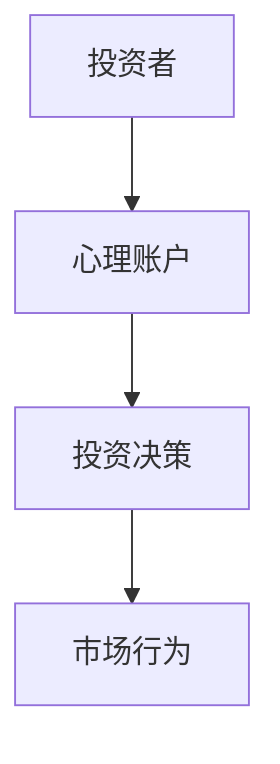
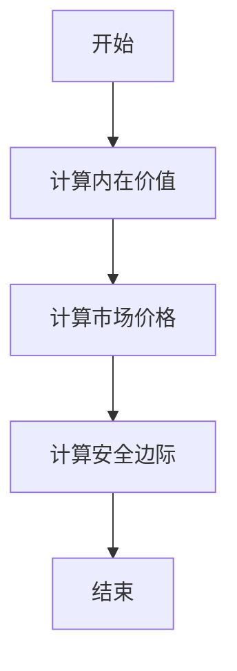
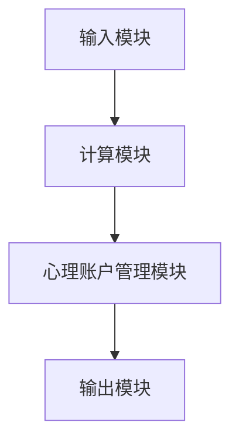
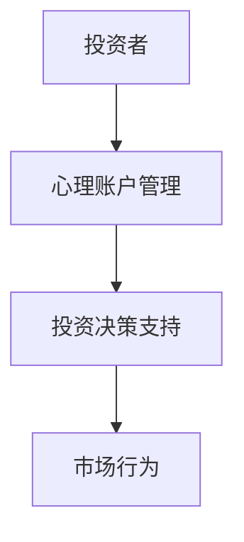

                 


# 《格雷厄姆的投资者心理建设》

---

## 关键词：投资者心理建设、格雷厄姆、安全边际、心理账户、投资决策、行为金融学

---

## 摘要：  
《格雷厄姆的投资者心理建设》这本书系统地探讨了投资者心理建设的核心理念、数学模型、算法原理以及实际应用。书中通过格雷厄姆的安全边际理论，结合现代行为金融学，深入分析了投资者心理账户的构建与管理，以及投资决策中的心理偏差。通过数学模型和算法的实现，详细阐述了如何将格雷厄姆的理念转化为可执行的投资策略。最后，通过实际案例和系统设计，展示了投资者心理建设在实际投资中的应用场景和最佳实践。

---

# 第一部分：投资者心理建设的背景与基础

---

# 第1章：投资者心理建设概述

## 1.1 投资者心理建设的核心概念

### 1.1.1 问题背景与问题描述  
投资者在市场中面临的最大挑战之一是心理偏差对决策的影响。格雷厄姆的安全边际理论强调了在投资中保持理性和耐心的重要性，但如何将这种理念转化为可操作的心理建设方法是本章的核心问题。

### 1.1.2 投资者心理建设的目标与意义  
投资者心理建设的目标是帮助投资者克服心理偏差，建立稳定的投资心态，从而更好地践行格雷厄姆的安全边际理念。通过心理建设，投资者能够更好地管理情绪，避免非理性决策。

### 1.1.3 核心概念的边界与外延  
心理建设的核心概念包括心理账户、安全边际、心理定价等。心理账户是指投资者将资金分配到不同的投资类别中，每个类别都有其特定的心理预期和目标。

---

## 1.2 格雷厄姆投资理念的核心要素

### 1.2.1 格雷厄姆投资理论的起源与发展  
格雷厄姆是价值投资之父，他的投资理念强调安全边际和内在价值的计算。他认为，市场波动是投资者的敌人，而心理建设是克服市场波动的关键。

### 1.2.2 投资者心理的核心要素组成  
投资者心理的核心要素包括：  
1. **心理定价**：投资者对资产的内在价值的评估。  
2. **安全边际**：资产的市场价格与内在价值之间的差额。  
3. **心理账户**：投资者如何分类和管理自己的投资资金。

### 1.2.3 格雷厄姆理念与现代投资理论的联系  
格雷厄姆的理念与现代行为金融学有深刻的联系。行为金融学强调心理偏差对投资决策的影响，而格雷厄姆的安全边际理念则是应对这些偏差的有效策略。

---

## 1.3 投资者心理账户的构建与管理

### 1.3.1 心理账户的定义与特征  
心理账户是投资者将资金分配到不同投资类别中的方式。每个心理账户都有其特定的目标和风险承受能力。

### 1.3.2 心理账户与实际投资决策的关系  
心理账户的构建直接影响投资者的投资决策。例如，投资者可能会将高风险的资金分配到一个独立的心理账户中，以避免情绪化决策。

### 1.3.3 格雷厄姆理念中的心理账户管理策略  
格雷厄姆建议投资者将资金分为不同的心理账户，每个账户对应不同的投资目标和时间 horizon。这种策略有助于投资者在市场波动中保持理性。

---

## 1.4 本章小结  
本章介绍了投资者心理建设的核心概念，包括心理账户、安全边际和心理定价。通过格雷厄姆的安全边际理念，我们了解了心理账户在投资决策中的重要性。

---

# 第2章：投资者心理建设的核心概念与联系

## 2.1 格雷厄姆投资理念的数学模型

### 2.1.1 投资者心理的数学模型构建  
投资者心理的数学模型需要考虑以下几个因素：  
1. **内在价值**：资产的真实价值。  
2. **市场价格**：资产在市场上的交易价格。  
3. **安全边际**：内在价值与市场价格的差额。

### 2.1.2 格雷厄姆安全边际的数学表达  
$$ \text{安全边际} = \text{内在价值} - \text{市场价格} $$  

### 2.1.3 心理定价的数学模型  
心理定价是投资者对资产内在价值的主观评估，可以用以下公式表示：  
$$ \text{心理定价} = \text{内在价值} + \text{心理偏差} $$  

---

## 2.2 核心概念对比分析

### 2.2.1 行为金融学与格雷厄姆理念的对比  
| 理论 | 格雷厄姆理念 | 行为金融学 |
|------|--------------|------------|
| 核心 | 安全边际     | 行为偏差   |
| 应用 | 风险控制      | 行为干预   |

---

## 2.3 实体关系图



---

## 2.4 本章小结  
本章通过数学模型和对比分析，深入探讨了格雷厄姆理念与现代行为金融学的联系，强调了心理账户在投资决策中的重要性。

---

# 第3章：投资者心理建设的算法原理

## 3.1 格雷厄姆投资策略的算法实现

### 3.1.1 安全边际计算算法  


### 3.1.2 心理定价算法  
心理定价算法通过考虑投资者的心理偏差，对资产的内在价值进行调整：  
$$ \text{心理定价} = \text{内在价值} + \text{偏差系数} \times \text{市场波动} $$  

---

## 3.2 投资者心理建设的系统架构设计

### 3.2.1 系统功能设计  
- **输入模块**：接收投资者的资产信息和市场数据。  
- **计算模块**：计算内在价值和市场价格。  
- **心理账户管理模块**：分配心理账户并计算安全边际。  
- **输出模块**：生成投资建议和心理账户报告。

### 3.2.2 系统架构图  


---

## 3.3 本章小结  
本章通过算法实现和系统架构设计，展示了如何将格雷厄姆的安全边际理念转化为可执行的投资策略。

---

# 第4章：投资者心理建设的系统分析与架构设计

## 4.1 系统分析与设计

### 4.1.1 问题场景介绍  
投资者在市场波动中容易受到情绪影响，导致非理性决策。通过系统设计，可以帮助投资者建立稳定的心理账户，实现长期收益。

### 4.1.2 系统功能设计  


---

## 4.2 系统架构设计

### 4.2.1 系统架构图  


---

## 4.3 本章小结  
本章通过系统分析与架构设计，展示了如何将格雷厄姆的安全边际理念应用于实际投资系统。

---

# 第5章：投资者心理建设的项目实战

## 5.1 项目实战

### 5.1.1 环境安装  
需要安装Python和相关库，如numpy和pandas。

### 5.1.2 核心代码实现  
```python
def calculate_margin_of_safety(intrinsic_value, market_price):
    return intrinsic_value - market_price
```

### 5.1.3 代码应用解读与分析  
通过代码实现安全边际的计算，帮助投资者制定投资策略。

### 5.1.4 案例分析与详细讲解  
以具体案例为例，分析如何通过心理账户管理和安全边际计算实现投资目标。

---

## 5.2 本章小结  
本章通过实际项目实战，展示了如何将格雷厄姆的安全边际理念应用于实际投资决策。

---

# 第6章：投资者心理建设的最佳实践

## 6.1 小结  
投资者心理建设是实现长期投资收益的关键。通过心理账户管理和安全边际计算，投资者可以克服心理偏差，实现理性决策。

## 6.2 注意事项  
- 定期审视心理账户，调整投资策略。  
- 避免情绪化决策，坚持长期投资。  

## 6.3 拓展阅读  
推荐阅读格雷厄姆的经典著作《证券分析》和现代行为金融学的相关文献。

---

# 总结  
《格雷厄姆的投资者心理建设》通过系统的方法，深入探讨了投资者心理建设的核心理念和实际应用。通过数学模型、算法实现和系统设计，帮助投资者克服心理偏差，实现长期收益。

