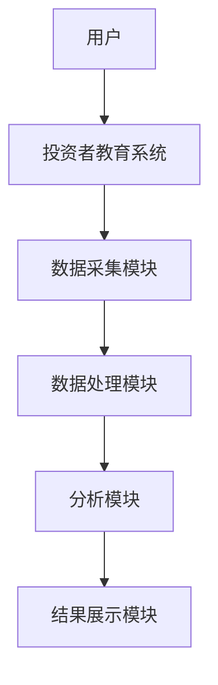
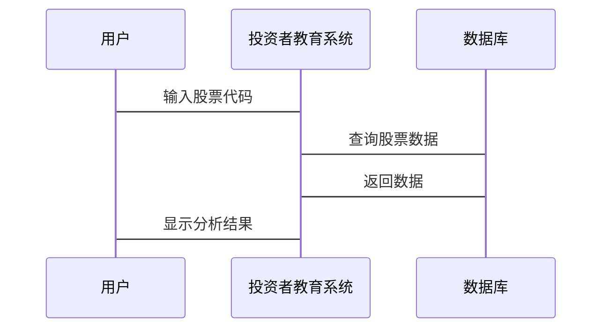

                 

# 《格雷厄姆的投资者教育理念》

## 关键词：投资者教育，格雷厄姆，价值投资，安全边际，长期投资

## 摘要：本文深入探讨了格雷厄姆的投资者教育理念，从安全边际和价值评估的核心概念，到数学模型的构建，再到系统设计和项目实战，全面解析了如何将格雷厄姆的理论应用于现代投资实践。文章通过详细的背景介绍、系统的架构设计和实际案例分析，为读者提供了全面的理论指导和实践参考。

---

## 第1章：投资者教育的背景与问题背景

### 1.1 投资者教育的现状

#### 1.1.1 当前投资者教育的主要形式

投资者教育的形式多种多样，包括书籍、在线课程、研讨会、模拟投资游戏等。然而，许多投资者教育内容过于简化或侧重短期交易技巧，缺乏对长期投资策略的深入探讨。

#### 1.1.2 投资者教育中的主要问题

1. **信息过载**：投资者面对海量信息，难以筛选出有价值的内容。
2. **短期导向**：许多投资者教育侧重于短期收益，忽视了长期投资的重要性。
3. **缺乏系统性**：投资者教育内容零散，缺乏系统性的理论指导。

#### 1.1.3 投资者教育的重要性与必要性

投资者教育是帮助个人和机构投资者做出明智决策的关键。有效的投资者教育能够提升投资者的金融素养，避免盲目投资，降低市场波动性。

---

### 1.2 格雷厄姆投资者教育理念的起源

#### 1.2.1 格雷厄姆的学术背景

本杰明·格雷厄姆（Benjamin Graham）是20世纪著名的投资学家，被誉为“价值投资之父”。他通过《 Intelligent Investor》一书，奠定了现代价值投资理论的基础。

#### 1.2.2 格雷厄姆投资理念的核心思想

格雷厄姆强调安全边际和内在价值，主张以低于内在价值的价格买入优质股票，长期持有，避免短期市场波动的影响。

#### 1.2.3 格雷厄姆理念对现代投资者教育的影响

格雷厄姆的理念为投资者教育提供了系统的理论框架，强调理性分析和长期投资，影响了巴菲特、彼得·林奇等众多投资大师。

---

## 第2章：安全边际与价值评估

### 2.1 安全边际的核心概念

#### 2.1.1 安全边际的定义

安全边际是指股票的内在价值与市场价格之间的差距。通过确保市场价格低于内在价值，投资者能够降低风险，获得安全边际。

#### 2.1.2 安全边际的计算方法

1. 计算股票的内在价值。
2. 比较内在价值与市场价格。
3. 确定安全边际的宽度。

#### 2.1.3 安全边际在投资决策中的应用

安全边际用于筛选投资标的，确保投资决策的稳健性。例如，当市场价格低于内在价值时，投资者可以考虑买入。

#### 2.1.4 安全边际与风险控制的关系

较大的安全边际意味着更低的投资风险，较小的安全边际则意味着更高的风险。通过合理配置资产，投资者可以在风险可控的前提下追求收益。

#### 2.1.5 安全边际的动态变化

市场波动会导致安全边际的变化。投资者需要定期评估投资组合中的安全边际，及时调整投资策略。

---

### 2.2 价值评估的核心要素

#### 2.2.1 股票的内在价值

股票的内在价值是基于公司基本面分析得出的未来现金流的现值。计算公式如下：

$$
\text{内在价值} = \frac{\text{预期现金流}}{\text{折现率}}
$$

其中，折现率通常由投资者的预期回报率决定。

#### 2.2.2 财务报表分析的关键指标

1. **收入与利润**：评估公司的盈利能力。
2. **资产负债表**：分析公司的资产结构和债务情况。
3. **现金流量表**：了解公司的现金流状况。

#### 2.2.3 行业分析与竞争优势评估

行业分析帮助确定公司的行业地位，竞争优势评估则分析公司在行业中的竞争优势，如成本优势、技术优势等。

---

## 第3章：价值评估的数学模型

### 3.1 内在价值的计算公式

股票的内在价值可以通过以下公式计算：

$$
\text{内在价值} = \frac{\text{预期现金流}}{\text{折现率}}
$$

其中，折现率通常基于投资者的风险偏好和市场利率。

### 3.2 安全边际的计算流程

1. 计算目标公司的内在价值。
2. 比较内在价值与当前市场价格。
3. 计算安全边际：$$\text{安全边际} = \text{内在价值} - \text{市场价格}$$

---

## 第4章：系统分析与架构设计

### 4.1 系统功能设计

#### 4.1.1 用户界面设计

用户友好的界面设计，包括输入股票代码、显示计算结果、安全边际分析等。

#### 4.1.2 数据分析模块

模块功能：
- 数据采集：从数据库获取股票的基本信息和财务数据。
- 数据处理：清洗和转换数据，计算关键指标。
- 数据分析：计算内在价值和安全边际。

#### 4.1.3 投资策略生成模块

根据安全边际分析结果，生成投资策略，如买入、持有或卖出建议。

### 4.2 系统架构设计

使用Mermaid绘制系统架构图：

### 4.3 系统接口设计

系统接口包括：
- 输入接口：接收股票代码和相关数据。
- 输出接口：显示分析结果和投资建议。

### 4.4 系统交互流程

使用Mermaid绘制交互流程图：

---

## 第5章：基于格雷厄姆理念的股票选择系统

### 5.1 系统核心实现

#### 5.1.1 环境安装与配置

安装Python、Pandas、Matplotlib等工具，配置开发环境。

#### 5.1.2 核心算法实现

核心算法包括数据采集、价值评估和安全边际计算。

#### 5.1.3 系统功能测试

测试系统各模块的正确性和稳定性。

### 5.2 实际案例分析

#### 5.2.1 案例一：某公司股票的内在价值计算

假设某公司预期现金流为$100万，折现率为10%，则内在价值为$100万 / 0.1 = $1,000万。

#### 5.2.2 案例二：安全边际的应用与投资决策

如果市场价格为$900万，安全边际为$1,000万 - $900万 = $100万，建议买入。

---

## 第6章：格雷厄姆理念的总结与实践

### 6.1 核心理念总结

1. **安全边际**：确保投资标的的市场价格低于内在价值。
2. **价值评估**：基于公司基本面分析，计算内在价值。
3. **长期投资**：避免短期市场波动，坚持长期投资策略。

### 6.2 投资者的最佳实践

1. **理性分析**：避免情绪化决策，坚持基本面分析。
2. **风险管理**：合理配置资产，控制投资风险。
3. **持续学习**：不断提升投资知识和技能。

### 6.3 未来展望与注意事项

1. **格雷厄姆理念的现代应用**：结合大数据和人工智能，优化投资决策。
2. **投资中的常见误区**：避免盲目跟风，坚持独立思考。
3. **应对市场变化**：灵活调整投资策略，适应市场变化。

---

## 总结

格雷厄姆的投资者教育理念为现代投资提供了系统的理论框架。通过安全边际和价值评估的核心概念，结合数学模型和系统设计，投资者可以做出更明智的投资决策。本文通过详细的背景介绍、系统的架构设计和实际案例分析，为读者提供了全面的理论指导和实践参考。未来，随着技术的进步，格雷厄姆理念将得到更广泛的应用和发展。

