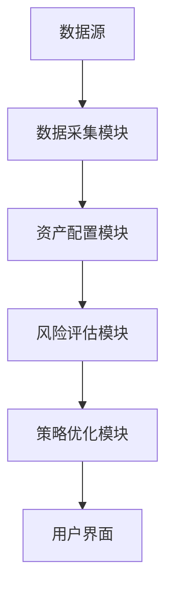
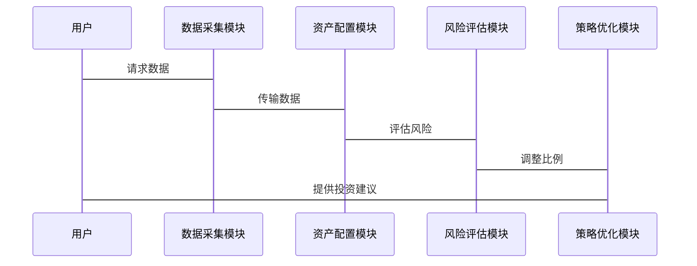

                 


# 格雷厄姆的股债平衡策略在现代市场中的应用

## 关键词：格雷厄姆，股债平衡，投资策略，现代市场，风险管理

## 摘要：本文深入探讨了格雷厄姆的股债平衡策略在现代市场中的应用，分析了其理论基础、数学模型、系统架构设计以及实际案例。通过对比股票与债券的特征，结合动态资产配置和量化方法，展示了如何优化股债比例以平衡风险与收益。文章还提供了系统设计和项目实战，帮助读者理解和应用这一策略。

---

## 第一部分: 股债平衡策略的背景与核心概念

### 第1章: 格雷厄姆投资理论与股债平衡策略

#### 1.1 格雷厄姆投资理论概述
- 1.1.1 价值投资的起源与发展
  - 本杰明·格雷厄姆是价值投资的鼻祖，提出了“安全边际”概念。
  - 他的理论强调以合理价格购买具有内在价值的股票，避免市场波动的影响。
- 1.1.2 格雷厄姆的价值投资理念
  - 强调长期投资，关注企业的基本面，而非市场情绪。
  - 倡导分散投资，降低风险。
- 1.1.3 股债平衡策略的提出背景
  - 20世纪30年代经济大萧条后，格雷厄姆意识到单一资产类别的风险。
  - 提出通过平衡股票和债券的投资比例，以稳定收益并分散风险。

#### 1.2 股债平衡策略的核心概念
- 1.2.1 股票与债券的基本特征对比
  - 股票：高风险、高回报，波动性大，收益主要来自资本增值和股息。
  - 债券：低风险、稳定收益，波动性小，收益主要来自固定利息。
- 1.2.2 股债平衡策略的定义与目标
  - 在投资组合中按一定比例配置股票和债券，以平衡风险和收益。
  - 通过动态调整比例，适应市场环境变化。
- 1.2.3 现代市场环境下的策略调整
  - 现代市场波动性增加，股债平衡策略需结合量化方法优化。

---

## 第二部分: 格雷厄姆股债平衡策略的数学模型与算法

### 第2章: 股债平衡策略的数学模型

#### 2.1 股债平衡的数学模型
- 2.1.1 资产配置的数学表达式
  - 设股票权重为w，债券权重为(1-w)。
  - 投资组合的预期收益：E = w * r_stock + (1-w) * r_bond
  - 风险（波动性）：σ = sqrt(w^2 * σ_stock^2 + (1-w)^2 * σ_bond^2 + 2w(1-w) * Cov(stock, bond))
- 2.1.2 风险与收益的平衡方程
  - 在给定风险水平下，选择最大化预期收益的w。
  - 使用均值-方差优化模型：min σ^2，max E，约束条件为w ∈ [0,1]。
- 2.1.3 股债比例的动态调整公式
  - 根据市场状况调整w：w = w_base + α * (market_trend - μ)，其中α为调整系数，μ为均值。

#### 2.2 股债平衡策略的算法原理
- 2.2.1 基于历史数据的股债比例计算
  - 计算历史收益和波动性，使用回测数据优化w。
- 2.2.2 现代投资组合理论在股债平衡中的应用
  - 使用马科维茨的有效前沿理论，找到最优资产配置。
- 2.2.3 动态资产配置的优化算法
  - 使用动态规划或遗传算法优化w，适应市场变化。

---

## 第三部分: 格雷厄姆股债平衡策略的系统架构设计

### 第3章: 系统功能设计与架构

#### 3.1 系统功能设计
- 3.1.1 数据采集模块
  - 获取股票和债券的历史数据，包括价格、收益率、波动性等。
- 3.1.2 资产配置模块
  - 计算最优w，基于数学模型和优化算法。
- 3.1.3 风险评估模块
  - 评估当前市场风险，动态调整w。
- 3.1.4 策略优化模块
  - 根据市场变化优化股债比例，生成投资建议。

#### 3.2 系统架构图


#### 3.3 接口设计与交互流程
- 3.3.1 系统接口定义
  - 数据接口：提供API获取实时数据。
  - 用户接口：显示投资建议和调整比例。
- 3.3.2 用户交互流程图


---

## 第四部分: 格雷厄姆股债平衡策略的项目实战

### 第4章: 项目实现与案例分析

#### 4.1 项目环境与工具安装
- Python环境：建议使用Anaconda，安装pandas、numpy、matplotlib等库。
- 数据来源：使用Yahoo Finance API获取数据。

#### 4.2 核心代码实现
```python
import pandas as pd
import numpy as np

# 示例：计算最优股债比例
def calculate_weights(risk_aversion):
    # 假设股票和债券的预期收益和波动性
    r_stock = 0.12
    r_bond = 0.05
    σ_stock = 0.2
    σ_bond = 0.08
    Cov = 0.03

    # 计算最优权重
    numerator = (r_stock - r_bond) * (σ_bond**2)
    denominator = (σ_stock**2 - 2 * Cov * σ_stock + σ_bond**2)
    w_stock = numerator / denominator
    w_bond = 1 - w_stock

    return w_stock, w_bond

# 示例调用
risk_aversion = 0.03
w_stock, w_bond = calculate_weights(risk_aversion)
print(f"股票权重: {w_stock:.2f}, 债券权重: {w_bond:.2f}")
```

#### 4.3 案例分析与解读
- 案例背景：2020年疫情后的市场波动。
- 策略应用：根据模型计算，调整股债比例至40%股票，60%债券，以降低波动性。
- 结果分析：投资组合在市场波动中表现稳定，收益与风险平衡。

---

## 第五部分: 总结与展望

### 第5章: 总结与未来展望

#### 5.1 总结
- 格雷厄姆的股债平衡策略在现代市场中仍具有重要价值。
- 通过动态调整比例，结合量化方法，可优化投资组合的风险收益比。

#### 5.2 未来展望
- 结合机器学习优化股债比例。
- 扩展至多资产类别，构建更复杂的资产配置模型。

#### 5.3 投资策略建议
- 定期再平衡投资组合，适应市场变化。
- 分散投资，降低集中风险。
- 关注长期目标，避免短期波动影响决策。

---

通过以上分析，我们可以看到格雷厄姆的股债平衡策略在现代市场中的广泛应用潜力。结合数学模型、系统设计和实际案例，投资者可以更好地应用这一策略，实现稳健的投资收益。

