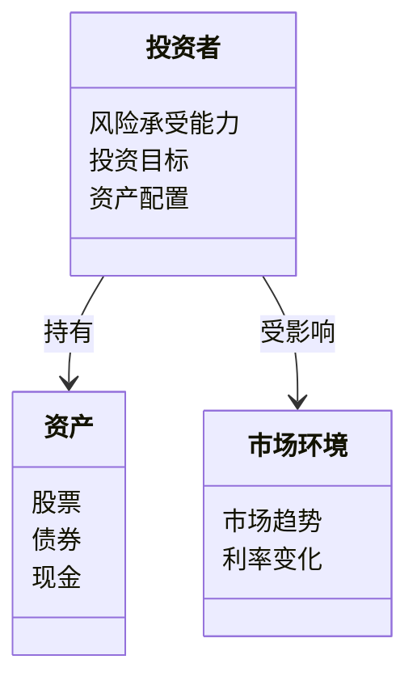

                 


# 格雷厄姆的防御型和进取型投资者区别

> 关键词：防御型投资者，进取型投资者，格雷厄姆，投资策略，价值投资，风险控制

> 摘要：本文深入分析了格雷厄姆提出的防御型和进取型投资者之间的区别。通过定义、目标、风险承受能力、投资策略和心理因素等多维度的对比，探讨了这两种投资者在投资过程中的不同特点和适用场景。结合数学模型和实际案例，本文为读者提供了清晰的理解框架，帮助投资者根据自身情况选择合适的投资策略。

---

## 第一部分：背景介绍

### 1.1 投资的基本概念与格雷厄姆的背景

#### 1.1.1 投资的定义与分类
投资是指将资金投入到资产中，以期获得未来收益的行为。根据投资目标和风险偏好，投资者可以分为**防御型投资者**和**进取型投资者**。防御型投资者注重本金安全和稳定收益，而进取型投资者则追求高收益，愿意承担更高的风险。

#### 1.1.2 金融市场的基本构成
金融市场包括股票市场、债券市场、基金市场等，投资者通过购买资产参与市场，期望获得资本增值或收益。不同市场和资产类别适合不同类型的投资者。

#### 1.1.3 投资者的角色与类型
投资者可以是个人、机构或基金。格雷厄姆的研究主要集中在个人投资者，尤其是普通散户。他的理论强调了投资者的心理素质和策略选择。

---

### 1.2 格雷厄姆的生平与投资理论

#### 1.2.1 格雷厄姆的生平简介
本杰明·格雷厄姆（Benjamin Graham）是20世纪著名的投资学家，被誉为“价值投资之父”。他出生于1894年，曾在哥伦比亚大学教授投资课程，并著有经典书籍《 Intelligent Investor》。

#### 1.2.2 格雷厄姆的价值投资理念
格雷厄姆的核心理念是**“安全边际”**，即以低于内在价值的价格买入资产，以降低投资风险。他强调长期投资、分散投资和基本面分析。

#### 1.2.3 格雷厄姆的著作与影响
《 Intelligent Investor》是格雷厄姆的代表作，书中提出了防御型和进取型投资者的概念，对现代投资理论产生了深远影响。

---

## 第二部分：防御型与进取型投资者的核心区别

### 2.1 防御型投资者的定义与特征

#### 2.1.1 防御型投资者的定义
防御型投资者注重本金安全和稳定的收益，追求长期稳定的回报，而非短期暴利。他们通常选择低风险、低波动性的资产，如债券、蓝筹股和指数基金。

#### 2.1.2 防御型投资者的核心特征
- **风险厌恶**：对本金损失有强烈的规避心理。
- **稳健收益**：追求稳定的回报，而非超额收益。
- **长期投资**：倾向于长期持有优质资产，避免频繁交易。

#### 2.1.3 防御型投资者的投资策略
防御型投资者注重基本面分析，选择具有稳定盈利能力、良好财务状况和高分红率的公司。他们通常分散投资，降低单一资产的风险。

---

### 2.2 进取型投资者的定义与特征

#### 2.2.1 进取型投资者的定义
进取型投资者愿意承担较高的风险，以追求超额收益。他们通常投资于高增长股票、新兴行业或创业公司，期望通过短期资本增值获得回报。

#### 2.2.2 进取型投资者的核心特征
- **高风险承受能力**：愿意承担更大的波动性和本金损失风险。
- **追求超额收益**：希望通过投资获得高于市场平均水平的回报。
- **短期与长期并重**：可能参与短期交易，但也关注长期增长潜力。

#### 2.2.3 进取型投资者的投资策略
进取型投资者倾向于选择高增长、高潜力的资产，注重技术分析和市场趋势。他们可能集中投资于少数资产，以期获得超额收益。

---

### 2.3 防御型与进取型投资者的对比分析

#### 2.3.1 投资目标的对比
| **对比维度** | **防御型投资者** | **进取型投资者** |
|--------------|------------------|------------------|
| **目标**      | 稳定收益          | 超额收益          |
| **时间跨度**  | 长期             | 短期与长期结合   |

#### 2.3.2 投资风险的对比
| **风险类型** | **防御型投资者** | **进取型投资者** |
|--------------|------------------|------------------|
| **本金风险**  | 低               | 高               |
| **收益波动**  | 低               | 高               |

#### 2.3.3 心理因素的对比
| **心理特征** | **防御型投资者** | **进取型投资者** |
|--------------|------------------|------------------|
| **风险厌恶**  | 高               | 低               |
| **耐心与纪律** | 高               | 中等             |

---

## 第三部分：格雷厄姆的投资策略与防御型投资者

### 3.1 防御型投资者的选股标准

#### 3.1.1 低市盈率与市净率
防御型投资者倾向于选择市盈率（P/E）和市净率（P/B）低于行业平均水平的股票，这些股票通常具有较高的安全边际。

#### 3.1.2 高股息率与股息支付率
防御型投资者偏好高股息率的股票，因为稳定的股息收入可以提供持续的现金流。

#### 3.1.3 公司财务状况的稳健性
防御型投资者注重公司的财务健康状况，包括低负债率、稳定的现金流和健康的利润率。

---

### 3.2 防御型投资者的风险控制策略

#### 3.2.1 投资组合的分散化
通过投资不同行业、不同资产类别的股票，降低单一资产的风险。

#### 3.2.2 安全边际的概念与应用
防御型投资者在购买股票时，确保买入价格低于公司的内在价值，从而降低投资风险。

#### 3.2.3 风险厌恶与止损机制
防御型投资者通常设置止损点，以避免亏损过大。

---

## 第四部分：格雷厄姆与进取型投资者的矛盾与调和

### 4.1 进取型投资者的典型特征

#### 4.1.1 高风险承受能力
进取型投资者愿意承担更大的风险，以追求更高的回报。

#### 4.1.2 追求超额收益
他们倾向于选择具有高增长潜力的股票，通过市场波动获利。

#### 4.1.3 对市场波动的适应能力
进取型投资者能够较好地适应市场的波动，抓住短期机会。

---

### 4.2 格雷厄姆对进取型投资者的评价

#### 4.2.1 格雷厄姆对进取型投资者的肯定
格雷厄姆认为，进取型投资者在市场上涨时能够获得更高的收益。

#### 4.2.2 格雷厄姆对进取型投资者的警示
他提醒进取型投资者，高风险意味着高亏损的可能性，必须具备良好的市场判断能力。

#### 4.2.3 格雷厄姆对不同类型投资者的建议
格雷厄姆建议投资者根据自身的风险承受能力和投资目标选择合适的投资策略。

---

## 第五部分：实战案例分析

### 5.1 防御型投资者的实战案例

#### 5.1.1 稳健型投资者的股票选择
假设当前市场环境下，防御型投资者可以选择一只市盈率低于行业平均水平、股息率较高的蓝筹股，如公用事业公司或消费品公司。

#### 5.1.2 防御型投资者的资产配置
防御型投资者的资产配置可能包括60%的股票（低风险股票）、30%的债券和10%的现金。

---

### 5.2 进取型投资者的实战案例

#### 5.2.1 高增长股票的选择
进取型投资者可以选择市盈率较高、但增长潜力大的科技公司股票。

#### 5.2.2 短期交易策略
他们可能参与股票的短线交易，捕捉市场波动带来的收益。

---

## 第六部分：系统分析与架构设计

### 6.1 系统功能设计（领域模型）



---

### 6.2 系统架构设计


---

## 第七部分：项目实战

### 7.1 环境安装与工具准备
- 安装Python和相关库（如pandas、numpy、matplotlib）
- 使用Jupyter Notebook进行数据分析

### 7.2 核心代码实现

```python
import pandas as pd
import numpy as np
import matplotlib.pyplot as plt

# 示例：计算防御型和进取型投资者的收益对比
defensive Investors = pd.read_csv('defensive.csv')
aggressive Investors = pd.read_csv('aggressive.csv')

plt.plot(defensive_Investors['回报'], label='防御型投资者')
plt.plot(aggressive_Investors['回报'], label='进取型投资者')
plt.xlabel('时间')
plt.ylabel('回报率')
plt.legend()
plt.show()
```

---

## 第八部分：最佳实践与小结

### 8.1 最佳实践
- 防御型投资者应注重资产分散化和安全边际。
- 进取型投资者应具备良好的市场判断能力和风险控制能力。

### 8.2 小结
格雷厄姆的防御型和进取型投资者区别为投资者提供了清晰的参考框架。选择适合自己的投资策略，结合市场环境和个人风险偏好，是实现长期投资目标的关键。

### 8.3 注意事项
- 投资者应根据市场变化调整策略。
- 避免盲目跟风，注重基本面分析。

### 8.4 拓展阅读
- 《 Intelligent Investor》
- 格雷厄姆的其他著作和投资理论

---

通过以上分析，我们可以清晰地看到防御型和进取型投资者的区别，以及格雷厄姆理论在实际投资中的应用。希望本文能为读者提供有价值的参考和启发。

