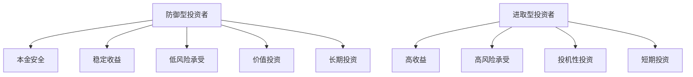

                 


# 防御型和进取型投资者的核心概念与联系

## 第4章：防御型投资者的核心概念

### 4.1 防御型投资者的核心要素

#### 4.1.1 风险厌恶
防御型投资者通常表现出对风险的强烈厌恶。他们倾向于选择那些能够最小化潜在损失的投资，而不会为了追求更高的收益而承担过高的风险。这种风险厌恶的核心在于他们更注重资本的安全性，而非资本的增长速度。格雷厄姆在《证券分析》中提到，防御型投资者通常会关注那些具有稳定历史表现和良好财务状况的公司，以确保他们的投资本金不会遭受重大损失。

#### 4.1.2 安全边际
安全边际是防御型投资者策略中的一个关键概念。格雷厄姆提出，投资者应该以低于内在价值的价格购买资产，这样即使市场出现波动，投资者也能在价格回归内在价值时获得收益。安全边际的计算通常涉及到对资产的深入分析，包括对公司财务状况、行业地位、盈利能力等多方面的考量。通过建立安全边际，防御型投资者能够在市场下跌时保持投资的稳定性。

#### 4.1.3 资产保护优先
防御型投资者在投资过程中，通常将资产的保护放在首位。他们倾向于选择那些具有高度流动性和稳定性的资产，以确保在需要时能够迅速变现。这种优先级的设定使得防御型投资者在市场波动时能够保持冷静，避免因恐慌而做出错误的投资决策。

### 4.2 防御型投资者的核心原理

防御型投资者的核心原理建立在对风险的严格控制和对安全性的高度重视上。他们通常采用一种稳健的投资策略，注重长期稳定的收益，而非短期的高回报。这种策略的核心在于通过分散投资、选择优质资产以及严格的风险管理来降低投资组合的整体风险。

防御型投资者通常会采用以下几种核心原理：
1. **分散投资**：通过将资金分配到不同资产类别、行业和地理区域，降低投资组合的整体风险。
2. **价值投资**：选择那些市场价格低于内在价值的资产进行投资，以确保在市场波动时能够获得安全边际。
3. **长期持有**：防御型投资者倾向于长期持有优质资产，避免频繁交易带来的额外成本和风险。

### 4.3 防御型和进取型投资者的核心要素对比

为了更好地理解防御型和进取型投资者之间的区别，我们可以从以下几个核心要素进行对比：

#### 核心要素对比表

| 核心要素        | 防御型投资者                      | 进取型投资者                      |
|-----------------|-----------------------------------|-----------------------------------|
| 投资目标        | 本金安全和稳定收益              | 追求高收益                      |
| 风险承受能力    | 低风险承受能力                  | 高风险承受能力                  |
| 投资策略        | 价值投资、分散投资              | 投机性投资、集中投资              |
| 投资期限        | 长期投资                        | 短期投资                        |
| 适合的市场环境  | 稳定或低迷的市场环境              | �活跃或上升的市场环境              |

通过对比表可以看出，防御型投资者更注重本金的安全性和投资的稳定性，而进取型投资者则更倾向于追求高收益，愿意承担更高的风险。

### 4.4 防御型和进取型投资者的ER实体关系图

为了更清晰地理解防御型和进取型投资者之间的关系，我们可以用实体关系图（ER图）来进行描述。以下是用Mermaid语法绘制的ER实体关系图：

```mermaid
erDiagram
    class 防御型投资者 {
        本金安全
        稳定收益
        低风险承受
    }
    class 进取型投资者 {
        高收益
        高风险承受
    }
    class 投资策略 {
        价值投资
        投机性投资
    }
    防御型投资者 --|> 投资策略 : 选择价值投资
    进取型投资者 --|> 投资策略 : 选择投机性投资
```

从上述ER图可以看出，防御型投资者和进取型投资者在投资策略上存在明显的差异，前者倾向于选择价值投资，而后者则倾向于选择投机性投资。

### 4.5 防御型投资者的核心原理

防御型投资者的核心原理可以总结为以下几个方面：

1. **本金安全**：防御型投资者的第一目标是确保本金的安全。他们通常会选择那些具有稳定财务状况和良好行业地位的公司进行投资，以避免因公司财务状况恶化而导致的本金损失。

2. **安全边际**：防御型投资者在选择投资标的时，会特别关注资产的市场价格与内在价值之间的差异。他们倾向于在市场价格低于内在价值时进行投资，以确保在市场波动时能够获得安全边际。

3. **分散投资**：防御型投资者通常会采用分散投资的策略，将资金分配到不同的资产类别、行业和地理区域，以降低投资组合的整体风险。

4. **长期持有**：防御型投资者倾向于长期持有优质资产，避免频繁交易带来的额外成本和风险。

5. **价值投资**：防御型投资者通常采用价值投资策略，关注那些市场价格低于内在价值的资产，以确保在市场回归理性时能够获得收益。

### 4.6 进取型投资者的核心要素

与防御型投资者不同，进取型投资者更注重投资的收益，愿意承担更高的风险以追求更高的回报。以下是进取型投资者的核心要素：

1. **高收益目标**：进取型投资者的核心目标是追求高收益，他们通常会选择那些具有高增长潜力的资产进行投资。

2. **高风险承受能力**：进取型投资者愿意承担更高的风险，以换取更高的收益。他们通常会投资于那些具有高波动性的资产，如股票、加密货币等。

3. **投机性投资**：进取型投资者通常采用投机性投资策略，关注市场的短期波动，试图通过频繁交易获利。

4. **集中投资**：进取型投资者倾向于集中投资，将大部分资金投入到少数几个具有高增长潜力的资产中，以追求更高的收益。

5. **短期投资**：与防御型投资者不同，进取型投资者更倾向于短期投资，关注市场的短期波动，试图通过快速买卖获利。

### 4.7 防御型和进取型投资者的核心要素对比分析

通过对比分析可以看出，防御型和进取型投资者在投资目标、风险承受能力、投资策略等方面存在明显的差异。防御型投资者更注重本金的安全和投资的稳定性，而进取型投资者则更注重收益，愿意承担更高的风险。

### 4.8 防御型和进取型投资者的核心要素对比的Mermaid流程图

以下是用Mermaid语法绘制的防御型和进取型投资者的核心要素对比流程图：



从上述流程图可以看出，防御型投资者和进取型投资者在投资策略和目标上存在明显的差异。

### 4.9 防御型投资者的核心原理

防御型投资者的核心原理可以总结为以下几个方面：

1. **本金安全**：防御型投资者的第一目标是确保本金的安全。他们通常会选择那些具有稳定财务状况和良好行业地位的公司进行投资，以避免因公司财务状况恶化而导致的本金损失。

2. **安全边际**：防御型投资者在选择投资标的时，会特别关注资产的市场价格与内在价值之间的差异。他们倾向于在市场价格低于内在价值时进行投资，以确保在市场波动时能够获得安全边际。

3. **分散投资**：防御型投资者通常会采用分散投资的策略，将资金分配到不同的资产类别、行业和地理区域，以降低投资组合的整体风险。

4. **长期持有**：防御型投资者倾向于长期持有优质资产，避免频繁交易带来的额外成本和风险。

5. **价值投资**：防御型投资者通常采用价值投资策略，关注那些市场价格低于内在价值的资产，以确保在市场回归理性时能够获得收益。

### 4.10 进取型投资者的核心要素

与防御型投资者不同，进取型投资者更注重投资的收益，愿意承担更高的风险以追求更高的回报。以下是进取型投资者的核心要素：

1. **高收益目标**：进取型投资者的核心目标是追求高收益，他们通常会选择那些具有高增长潜力的资产进行投资。

2. **高风险承受能力**：进取型投资者愿意承担更高的风险，以换取更高的收益。他们通常会投资于那些具有高波动性的资产，如股票、加密货币等。

3. **投机性投资**：进取型投资者通常采用投机性投资策略，关注市场的短期波动，试图通过频繁交易获利。

4. **集中投资**：进取型投资者倾向于集中投资，将大部分资金投入到少数几个具有高增长潜力的资产中，以追求更高的收益。

5. **短期投资**：与防御型投资者不同，进取型投资者更倾向于短期投资，关注市场的短期波动，试图通过快速买卖获利。

### 4.11 防御型和进取型投资者的核心要素对比分析

通过对比分析可以看出，防御型和进取型投资者在投资目标、风险承受能力、投资策略等方面存在明显的差异。防御型投资者更注重本金的安全和投资的稳定性，而进取型投资者则更注重收益，愿意承担更高的风险。

### 4.12 防御型和进取型投资者的核心要素对比的Mermaid流程图

以下是用Mermaid语法绘制的防御型和进取型投资者的核心要素对比流程图：


从上述流程图可以看出，防御型投资者和进取型投资者在投资策略和目标上存在明显的差异。

### 4.13 防御型和进取型投资者的核心要素对比的总结

通过上述分析可以看出，防御型和进取型投资者在核心要素上存在明显的差异。防御型投资者更注重本金的安全和投资的稳定性，而进取型投资者则更注重收益，愿意承担更高的风险。投资者在选择投资策略时，需要根据自身的风险承受能力和收益目标，选择适合自己的投资策略。

### 4.14 防御型和进取型投资者的核心要素对比的数学模型

为了更好地理解防御型和进取型投资者之间的差异，我们可以建立一个简单的数学模型来描述他们的投资行为。

#### 防御型投资者的数学模型

防御型投资者通常采用价值投资策略，选择那些市场价格低于内在价值的资产进行投资。假设我们有一个资产的内在价值为V，市场价格为P。防御型投资者会在P < V时进行投资，并在P回归V时卖出，以获得安全边际。

数学模型如下：

$$
\text{投资决策} = 
\begin{cases}
\text{买入} & \text{如果 } P < V \\
\text{持有} & \text{如果 } P = V \\
\text{卖出} & \text{如果 } P > V \\
\end{cases}
$$

#### 进取型投资者的数学模型

进取型投资者通常采用投机性投资策略，关注市场的短期波动，试图通过频繁交易获利。假设我们有一个资产的价格波动可以用随机游走模型来描述，进

