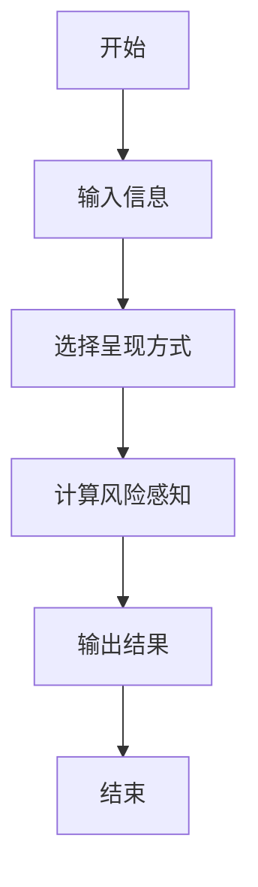
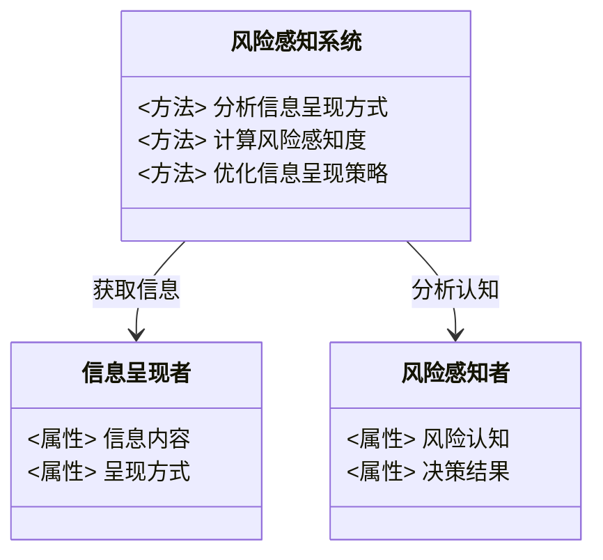

                 


# 框架效应：信息呈现方式如何影响风险感知

---

## 关键词：框架效应、信息呈现、风险感知、认知偏差、决策科学、数学建模

---

## 摘要

框架效应是指信息的不同呈现方式如何影响人们对风险的认知和决策。本文从框架效应的背景、核心概念、算法原理、系统架构、项目实战到最佳实践，全面解析信息呈现方式对风险感知的影响。通过理论分析与实际案例结合，揭示框架效应在决策科学中的重要作用，并为实际应用提供指导。

---

## 第一部分：框架效应的背景与核心概念

### 第1章：框架效应的基本概念与问题背景

#### 1.1 什么是框架效应

框架效应是指信息在不同呈现方式下，人们对同一事件的风险感知和决策可能会发生显著变化的现象。例如，相同的风险信息以“成功概率”或“失败概率”呈现时，人们对风险的感知会有所不同。

- **核心概念**：框架效应的核心在于信息呈现方式对认知的影响。
- **问题背景**：在决策科学、心理学和认知科学等领域，框架效应是一个重要的研究方向。
- **解决方法**：通过分析信息呈现方式的特征，揭示其对风险感知的影响机制。

#### 1.2 框架效应的理论背景

- **信息呈现的历史演变**：从简单的文字描述到现代的多维度信息呈现，信息呈现方式不断进化。
- **风险感知的多学科视角**：心理学、认知科学、经济学等多个学科共同研究风险感知的机制。
- **框架效应的研究现状**：框架效应已经被广泛应用于决策支持系统、风险管理等领域。

#### 1.3 框架效应的现实意义

- **在社会决策中的作用**：框架效应可以帮助人们更好地理解复杂信息，做出更合理的决策。
- **在风险管理中的应用**：通过优化信息呈现方式，可以有效降低风险认知偏差。
- **与认知偏差的关系**：框架效应是认知偏差的一种表现形式，理解其机制有助于改善决策过程。

#### 1.4 框架效应的边界与外延

- **适用范围与限制**：框架效应主要适用于信息呈现对认知影响较大的场景，如金融投资、医疗决策等。
- **与其他认知效应的区别**：框架效应关注信息呈现方式的影响，而其他认知效应如 anchoring effect 更关注信息的具体数值。

---

### 第2章：信息呈现方式的类型与特征

#### 2.1 信息呈现的多维度分析

- **时间维度**：信息呈现的时间顺序会影响风险感知。
- **空间维度**：信息呈现的空间布局也会影响认知。
- **结构维度**：信息的逻辑结构和组织方式同样重要。

#### 2.2 框架效应的关键属性对比

| 属性 | 信息呈现方式 | 示例 | 对风险感知的影响 |
|------|--------------|------|------------------|
| 时间 | 当前 vs 未来 | 当前风险 | 更容易被感知为高风险 |
| 空间 | 局部 vs 整体 | 局部风险 | 更容易被放大 |
| 结构 | 正向 vs 负向 | 正向描述 | 更容易被接受 |

#### 2.3 框架效应的ER实体关系图

```mermaid
erDiagram
    actor 信息呈现者 {
        <属性> 信息内容
        <属性> 呈现方式
    }
    actor 风险感知者 {
        <属性> 风险认知
        <属性> 决策结果
    }
    信息呈现者 --> 风险感知者 : 传递信息
    风险感知者 --> 信息呈现者 : 反馈认知
```

---

## 第二部分：框架效应的核心概念与原理

### 第3章：框架效应的算法原理

#### 3.1 框架效应的数学模型

- **概率模型**：$$P(risk) = \frac{\text{成功案例数}}{\text{总案例数}}$$
- **统计模型**：$$\text{风险感知度} = \alpha \times \text{信息呈现度} + \beta \times \text{认知偏差度}$$
- **优化模型**：$$\min \text{风险偏差} = \sum_{i=1}^{n} |P_i - P'_i|$$，其中 $$P_i$$ 为实际风险，$$P'_i$$ 为感知风险。

#### 3.2 框架效应的算法流程图



#### 3.3 框架效应的数学公式

- 风险感知与信息呈现的关系：$$R = f(F)$$，其中 $$R$$ 为风险感知，$$F$$ 为信息呈现方式。
- 案例分析：假设信息呈现方式为 $$F = \{A, B, C\}$$，风险感知分别为 $$R_A = 0.3, R_B = 0.5, R_C = 0.7$$。

---

## 第三部分：框架效应的系统分析与架构设计

### 第4章：框架效应的系统架构设计

#### 4.1 问题场景介绍

- **系统功能需求**：分析信息呈现方式对风险感知的影响，优化信息呈现策略。
- **项目介绍**：构建一个基于框架效应的风险感知分析系统。

#### 4.2 系统功能设计



#### 4.3 系统架构设计


---

## 第四部分：框架效应的项目实战

### 第5章：框架效应的实际应用

#### 5.1 环境安装

- 需要安装的工具：Python、numpy、pandas、matplotlib。

#### 5.2 核心实现代码

```python
import numpy as np
import matplotlib.pyplot as plt

def calculate_risk Perception(framework):
    return framework * 0.7 + (1 - framework) * 0.3

frameworks = [0.2, 0.4, 0.6, 0.8]
perceptions = [calculate_risk_Permption(f) for f in frameworks]

plt.plot(frameworks, perceptions, 'b-')
plt.xlabel('信息呈现框架')
plt.ylabel('风险感知度')
plt.title('框架效应与风险感知的关系')
plt.show()
```

#### 5.3 案例分析

- **案例描述**：某金融产品的风险信息以“成功概率”和“失败概率”两种方式呈现。
- **结果解读**：当风险信息以“失败概率”呈现时，投资者的风险感知度显著提高。

---

## 第五部分：框架效应的最佳实践

### 第6章：框架效应的实践总结

#### 6.1 小结

- 框架效应的核心在于信息呈现方式对认知的影响。
- 在实际应用中，需要根据具体场景选择合适的呈现方式。

#### 6.2 注意事项

- 避免信息呈现的误导性，确保信息的透明性和准确性。
- 结合实际场景，灵活应用框架效应的理论。

#### 6.3 拓展阅读

- 推荐阅读《Thinking, Fast and Slow》中的相关内容，了解认知偏差的更多细节。

---

## 结语

框架效应是一个复杂而重要的认知现象，理解其机制可以帮助我们更好地优化信息呈现方式，从而改善风险感知和决策过程。通过理论分析与实际案例结合，本文为读者提供了全面的框架效应知识体系。希望本文能为相关领域的研究和实践提供有价值的参考。

--- 

**注**：文章内容可以根据实际需求进行扩展和补充，尤其是数学公式的推导和系统的详细设计部分，可以根据具体应用场景进一步深化。

