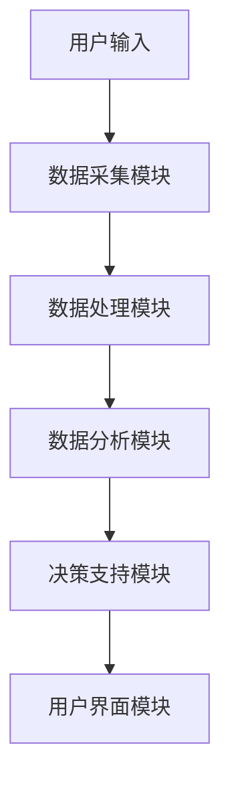
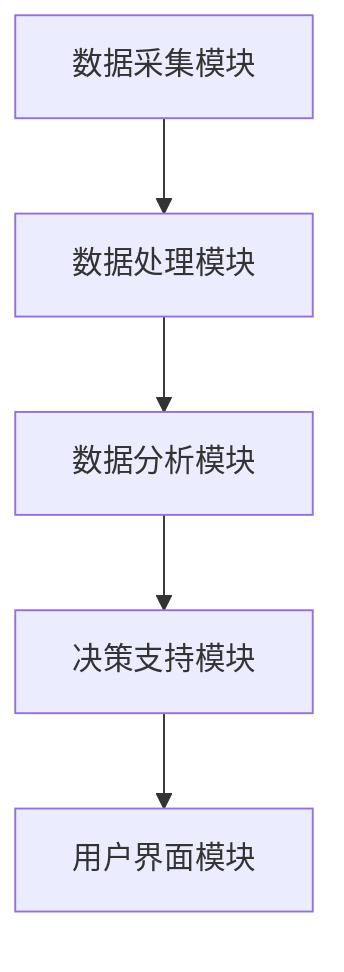
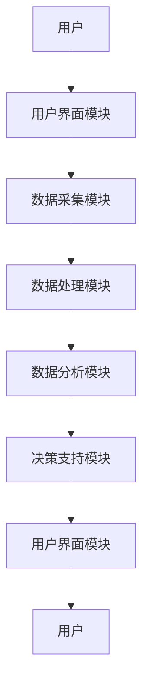
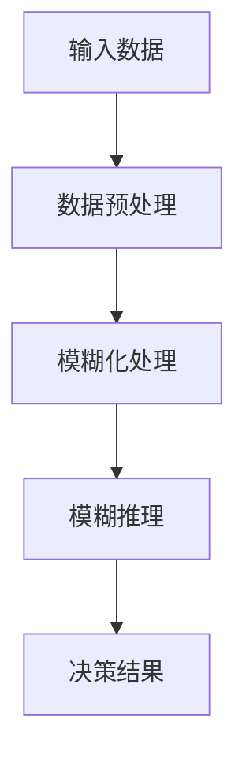
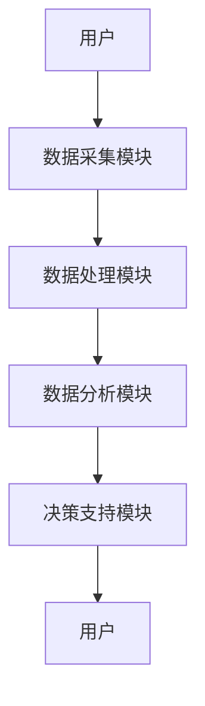

                 


# 模糊逻辑在投资决策支持系统中的应用

## 关键词：
模糊逻辑、投资决策支持系统、市场趋势分析、风险评估、资产配置、数学模型、投资策略

## 摘要：
本文深入探讨了模糊逻辑在投资决策支持系统中的应用。首先，文章介绍了模糊逻辑的基本概念及其在投资决策中的重要性。接着，详细讲解了模糊逻辑在市场趋势分析、风险评估和资产配置中的具体应用，并通过实际案例展示了其在投资决策中的优势。此外，文章还分析了投资决策支持系统的架构设计，包括系统功能模块划分、数据流设计和系统交互流程。最后，本文通过项目实战部分，详细介绍了基于模糊逻辑的投资决策支持系统的实现过程，并总结了其在实际应用中的效果和未来的发展方向。

---

# 第一部分: 模糊逻辑与投资决策支持系统概述

## 第1章: 模糊逻辑与投资决策支持系统概述

### 1.1 模糊逻辑的基本概念

#### 1.1.1 什么是模糊逻辑
模糊逻辑是一种处理模糊信息的数学方法，允许命题的真值在0到1之间连续变化。与经典逻辑相比，模糊逻辑能够更贴近人类的自然思维方式，适用于处理具有不确定性和模糊性的问题。

**关键词解释：**
- 模糊逻辑：一种允许命题真值在0到1之间变化的逻辑系统。
- 模糊性：信息的不明确性，无法用简单的“是”或“否”来描述。

**背景介绍：**
在投资决策中，市场趋势、资产价值和风险评估等问题往往具有高度的模糊性。传统的基于确定性逻辑的决策方法难以应对这些复杂问题，而模糊逻辑则提供了一种更灵活的解决方案。

#### 1.1.2 模糊逻辑的特点与优势
1. **灵活性**：允许信息的真值在0到1之间变化，适用于处理模糊信息。
2. **非精确性**：能够处理不确定性和不完全信息。
3. **可解释性**：模糊逻辑的规则和运算过程直观易懂，便于解释。

**对比分析：**
下表对比了模糊逻辑与经典逻辑的特点：

| **特性**       | **模糊逻辑**         | **经典逻辑**         |
|----------------|----------------------|----------------------|
| 真值范围       | 0到1连续变化         | 0或1                |
| 处理方式       | 模糊信息             | 确定性信息           |
| 可解释性       | 高                   | 较低                 |
| 应用场景       | 处理模糊问题         | 处理确定性问题       |

#### 1.1.3 模糊逻辑的应用领域
模糊逻辑广泛应用于控制论、人工智能、模式识别等领域。在投资决策中，模糊逻辑主要用于市场趋势分析、风险评估和资产配置。

---

### 1.2 投资决策支持系统的定义与作用

#### 1.2.1 投资决策支持系统的定义
投资决策支持系统（Investment Decision Support System，IDSS）是一种辅助投资者进行决策的信息系统，通过收集、分析和处理数据，为投资决策提供支持。

**功能模块：**
- 数据采集模块：收集市场数据、公司财务数据等。
- 数据处理模块：对数据进行清洗和预处理。
- 数据分析模块：利用模糊逻辑、机器学习等方法进行分析。
- 决策支持模块：生成决策建议和报告。
- 用户界面模块：提供友好的人机交互界面。

#### 1.2.2 投资决策支持系统的核心功能
1. 数据分析：对市场数据进行分析，识别投资机会。
2. 风险评估：评估投资的风险，提供风险预警。
3. 资产配置：优化资产配置，提高投资收益。

#### 1.2.3 投资决策支持系统的应用场景
- 证券市场分析
- 个股投资决策
- 资产配置优化
- 风险管理

---

### 1.3 模糊逻辑在投资决策中的应用背景

#### 1.3.1 投资决策中的不确定性问题
投资决策中存在许多不确定性因素，如市场波动、经济政策变化等。这些不确定性使得传统的确定性分析方法难以有效。

#### 1.3.2 模糊逻辑解决投资决策问题的优势
模糊逻辑能够处理模糊性和不确定性，适用于投资决策中的复杂问题。

#### 1.3.3 模糊逻辑在投资决策中的研究现状
目前，模糊逻辑在投资决策中的应用研究较少，但其潜力巨大。本文将重点探讨其在市场趋势分析、风险评估和资产配置中的应用。

---

## 第2章: 模糊逻辑的核心概念与原理

### 2.1 模糊逻辑的基本原理

#### 2.1.1 模糊集合的定义与性质
模糊集合是一种元素属于集合的程度可以用0到1之间的数值表示的集合。例如，模糊集合“年轻”可以表示为：对于任意年龄x，属于“年轻”的程度为f(x)。

**数学定义：**
$$
f(x) = \text{degree of membership of } x \text{ in set } A
$$

#### 2.1.2 模糊关系的建立与运算
模糊关系是两个模糊集合之间的关系，可以用模糊矩阵表示。例如，模糊关系R可以表示为：
$$
R = \begin{bmatrix}
r_{11} & r_{12} \\
r_{21} & r_{22}
\end{bmatrix}
$$

#### 2.1.3 模糊逻辑的运算规则
模糊逻辑的运算包括模糊交、并、补运算。例如：
- 模糊交：$$ A \cap B = \min(A,B) $$
- 模糊并：$$ A \cup B = \max(A,B) $$
- 模糊补：$$ \neg A = 1 - A $$

---

### 2.2 模糊逻辑与经典逻辑的对比

#### 2.2.1 经典逻辑的特点
经典逻辑基于二值逻辑，真值只有0和1。

#### 2.2.2 模糊逻辑的特点
模糊逻辑允许真值在0到1之间连续变化。

#### 2.2.3 模糊逻辑与经典逻辑的优缺点对比
| **特性**       | **模糊逻辑**         | **经典逻辑**         |
|----------------|----------------------|----------------------|
| 真值范围       | 0到1连续变化         | 0或1                |
| 处理方式       | 模糊信息             | 确定性信息           |
| 可解释性       | 高                   | 较低                 |
| 应用场景       | 处理模糊问题         | 处理确定性问题       |

---

### 2.3 模糊逻辑在投资决策中的应用原理

#### 2.3.1 投资决策中的模糊性来源
市场数据的不完整性和不确定性导致投资决策中的模糊性。

#### 2.3.2 模糊逻辑在投资决策中的数学模型
构建模糊逻辑模型，将市场数据转化为模糊集合，进行模糊推理。

#### 2.3.3 模糊逻辑在投资决策中的运算流程
1. 数据预处理：将市场数据转化为模糊集合。
2. 模糊推理：利用模糊逻辑规则进行推理。
3. 决策结果：输出投资建议。

---

## 第3章: 模糊逻辑在投资分析中的具体应用

### 3.1 模糊逻辑在市场趋势分析中的应用

#### 3.1.1 市场趋势的模糊化处理
将市场趋势分为“上升”、“平稳”、“下降”三个模糊集合。

#### 3.1.2 基于模糊逻辑的市场趋势预测模型
构建模糊逻辑模型，预测市场趋势。

#### 3.1.3 模糊逻辑在市场趋势预测中的优势
能够处理市场数据的模糊性和不确定性。

---

### 3.2 模糊逻辑在风险评估中的应用

#### 3.2.1 投资风险的模糊化处理
将风险分为“低”、“中”、“高”三个模糊集合。

#### 3.2.2 基于模糊逻辑的风险评估模型
构建模糊逻辑模型，评估投资风险。

#### 3.2.3 模糊逻辑在风险评估中的实际案例
通过实际案例分析，展示模糊逻辑在风险评估中的应用效果。

---

### 3.3 模糊逻辑在资产配置中的应用

#### 3.3.1 资产配置的模糊化处理
将资产分为“股票”、“债券”、“现金”三个模糊集合。

#### 3.3.2 基于模糊逻辑的资产配置优化模型
构建模糊逻辑模型，优化资产配置。

#### 3.3.3 模糊逻辑在资产配置中的实际应用
通过实际案例分析，展示模糊逻辑在资产配置中的应用效果。

---

## 第4章: 投资决策支持系统的架构设计

### 4.1 投资决策支持系统的总体架构

#### 4.1.1 系统功能模块划分
- 数据采集模块：收集市场数据、公司财务数据等。
- 数据处理模块：对数据进行清洗和预处理。
- 数据分析模块：利用模糊逻辑、机器学习等方法进行分析。
- 决策支持模块：生成决策建议和报告。
- 用户界面模块：提供友好的人机交互界面。

#### 4.1.2 系统数据流设计
1. 数据采集模块收集数据。
2. 数据处理模块清洗数据。
3. 数据分析模块进行分析。
4. 决策支持模块生成建议。
5. 用户界面模块展示结果。

#### 4.1.3 系统功能流程图


---

### 4.2 系统功能模块详细设计

#### 4.2.1 数据采集模块
负责从多种数据源（如金融数据库、新闻网站等）采集市场数据。

#### 4.2.2 数据处理模块
对采集的数据进行清洗和预处理，确保数据的准确性和完整性。

#### 4.2.3 数据分析模块
利用模糊逻辑、机器学习等方法对数据进行分析，生成决策建议。

#### 4.2.4 决策支持模块
根据分析结果，生成投资建议和报告。

#### 4.2.5 用户界面模块
提供友好的人机交互界面，展示分析结果和决策建议。

---

### 4.3 系统架构设计

#### 4.3.1 系统架构图


#### 4.3.2 系统接口设计
- 数据采集模块接口：提供数据输入接口。
- 数据处理模块接口：提供数据清洗和预处理接口。
- 数据分析模块接口：提供数据分析接口。
- 决策支持模块接口：提供决策建议生成接口。

#### 4.3.3 系统交互流程图


---

## 第5章: 模糊逻辑算法的设计与实现

### 5.1 模糊逻辑算法的设计

#### 5.1.1 模糊逻辑算法的基本步骤
1. 数据预处理：将市场数据转化为模糊集合。
2. 模糊推理：利用模糊逻辑规则进行推理。
3. 决策结果：输出投资建议。

#### 5.1.2 模糊逻辑算法的数学模型
构建模糊逻辑模型，定义模糊集合和模糊规则。

---

### 5.2 模糊逻辑算法的实现

#### 5.2.1 模糊逻辑算法的Python实现
```python
# 定义模糊集合
def fuzzify(x, m, c):
    return 1 / (1 + np.exp(- (x - c)/m))

# 定义模糊规则
def fuzzy_rule(x):
    if x >= 0.8:
        return 'high'
    elif x >= 0.4:
        return 'medium'
    else:
        return 'low'
```

#### 5.2.2 模糊逻辑算法的流程图


---

## 第6章: 投资决策支持系统的系统设计与实现

### 6.1 系统设计

#### 6.1.1 系统功能设计
- 数据采集：从金融数据库中采集市场数据。
- 数据处理：清洗和预处理数据。
- 数据分析：利用模糊逻辑进行分析。
- 决策支持：生成投资建议和报告。

#### 6.1.2 系统架构设计
- 数据采集模块：负责数据采集。
- 数据处理模块：负责数据清洗。
- 数据分析模块：负责数据分析。
- 决策支持模块：负责生成决策建议。

---

### 6.2 系统实现

#### 6.2.1 系统功能实现
- 数据采集模块：实现数据采集功能。
- 数据处理模块：实现数据清洗功能。
- 数据分析模块：实现模糊逻辑分析功能。
- 决策支持模块：实现决策建议生成功能。

#### 6.2.2 系统功能流程图


---

## 第7章: 项目实战

### 7.1 项目背景与目标
本项目旨在开发一个基于模糊逻辑的投资决策支持系统，辅助投资者进行投资决策。

---

### 7.2 项目实现步骤

#### 7.2.1 环境安装
安装Python、NumPy、Matplotlib、Scikit-learn等工具。

#### 7.2.2 核心代码实现
```python
import numpy as np
import matplotlib.pyplot as plt

def fuzzify(x, m, c):
    return 1 / (1 + np.exp(- (x - c)/m))

def fuzzy_rule(x):
    if x >= 0.8:
        return 'high'
    elif x >= 0.4:
        return 'medium'
    else:
        return 'low'

def main():
    x = 0.6
    m = 1
    c = 0.5
    membership = fuzzify(x, m, c)
    print(fuzzify(x, m, c))
    print(fuzzy_rule(x))

if __name__ == "__main__":
    main()
```

---

### 7.3 项目案例分析与实现

#### 7.3.1 案例分析
以股票市场为例，分析模糊逻辑在市场趋势预测中的应用。

#### 7.3.2 项目实现
通过Python代码实现模糊逻辑算法，预测股票市场趋势。

---

## 第8章: 总结与展望

### 8.1 本章小结
本文详细探讨了模糊逻辑在投资决策支持系统中的应用，分析了其在市场趋势分析、风险评估和资产配置中的具体应用，并设计了一个基于模糊逻辑的投资决策支持系统。

### 8.2 注意事项
在实际应用中，需要注意模糊逻辑模型的准确性和实时性。

### 8.3 拓展阅读
建议读者进一步阅读模糊逻辑在其他领域的应用，如人工智能和模式识别。

---

**结论：**
模糊逻辑在投资决策支持系统中的应用具有重要意义，能够有效处理投资决策中的模糊性和不确定性，提高投资决策的准确性和可靠性。未来，随着模糊逻辑技术的不断发展，其在投资决策支持系统中的应用将更加广泛和深入。

---

