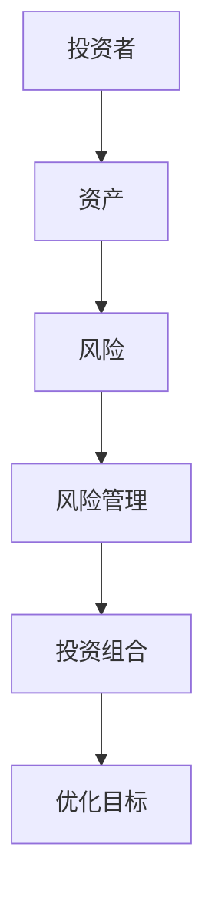
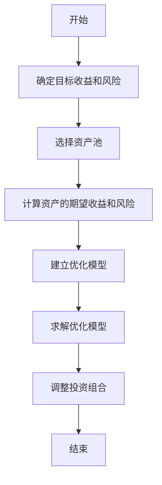

                 


# 每年更新投资组合的重要性

---

## 关键词
投资组合管理, 资产配置, 投资组合优化, 风险管理, 均值-方差模型

---

## 摘要
投资组合管理是现代投资的重要组成部分，其核心在于通过科学的资产配置和动态调整，实现风险可控下的收益最大化。每年更新投资组合是投资组合管理中的关键步骤，旨在适应市场变化、投资者风险偏好的变化以及资产配置的动态调整。本文将从投资组合的基本概念、优化算法、系统架构到项目实战，全面解析每年更新投资组合的重要性和实施方法。

---

# 第一部分: 投资组合管理的背景与重要性

## 第1章: 投资组合的基本概念

### 1.1 投资组合的定义与特点
#### 1.1.1 投资组合的定义
投资组合是指将多种资产（如股票、债券、基金等）按照一定比例组合在一起的投资方式。其核心目标是通过多元化配置降低投资风险，同时追求较高的收益。

#### 1.1.2 投资组合的核心特点
- **分散性**：通过投资多种资产降低特定资产的风险。
- **流动性**：资产易于买卖，确保资金的流动性。
- **收益性**：通过优化配置实现收益最大化。

#### 1.1.3 投资组合与单一资产投资的区别
| 特性                | 投资组合              | 单一资产投资            |
|---------------------|----------------------|------------------------|
| 风险                | 较低                 | 较高                  |
| 收益                | 稳定                 | 波动较大               |
| 管理复杂度          | 较高                 | 较低                  |
| 抗风险能力          | 强                   | 弱                    |

### 1.2 投资组合管理的重要性
#### 1.2.1 投资组合管理的目标
- **最大化收益**：在风险可控的前提下实现收益最大化。
- **风险管理**：通过分散投资降低特定风险。
- **长期财富增长**：通过科学配置实现资产的长期保值和增值。

#### 1.2.2 投资组合管理的必要性
- **市场环境变化**：经济周期波动、政策变化等因素会影响资产表现。
- **投资者风险偏好变化**：不同阶段投资者对风险的承受能力不同。
- **资产配置的动态调整**：市场环境和资产表现的动态变化需要及时调整配置。

#### 1.2.3 投资组合管理的边界与外延
- **边界**：投资组合管理需要考虑市场环境、政策法规、投资者风险偏好等因素。
- **外延**：包括资产选择、权重分配、风险监控等多方面内容。

### 1.3 为什么要每年更新投资组合
#### 1.3.1 市场环境的变化
- 经济周期波动、利率变化、市场情绪等因素会影响资产表现。
- 不同资产在不同市场环境下的表现差异需要动态调整。

#### 1.3.2 投资者风险偏好的变化
- 投资者在不同阶段可能对风险的承受能力发生变化。
- 需要根据投资者的最新风险偏好调整资产配置。

#### 1.3.3 资产配置的动态调整
- 不同资产的收益和风险表现会随时间变化。
- 定期调整投资组合有助于保持最优配置。

### 1.4 本章小结
本章主要介绍了投资组合的基本概念、管理的重要性以及每年更新的必要性。通过理解这些内容，投资者可以更好地认识到投资组合管理的价值和意义。

---

## 第2章: 投资组合管理的核心概念与联系

### 2.1 投资组合管理的核心概念
#### 2.1.1 资产配置
资产配置是投资组合管理的核心，通过将资金分配到不同资产类别（如股票、债券、现金等）来优化风险和收益。

#### 2.1.2 风险管理
风险管理是投资组合管理的关键环节，通过识别、评估和控制风险，确保投资组合的稳定性。

#### 2.1.3 投资目标与约束
投资目标包括收益目标和风险目标，而约束则包括投资期限、流动性需求等。

### 2.2 投资组合管理的概念属性特征对比
| 特性                | 投资组合管理          | 单一资产投资            |
|---------------------|----------------------|------------------------|
| 管理方式            | 组合管理              | 单一管理                |
| 风险                | 较低                 | 较高                  |
| 收益                | 稳定                 | 波动较大               |
| 管理复杂度          | 较高                 | 较低                  |
| 抗风险能力          | 强                   | 弱                    |

### 2.3 投资组合管理的ER实体关系图


### 2.4 本章小结
本章通过对比和图表分析，详细阐述了投资组合管理的核心概念及其与单一资产投资的区别，为后续分析奠定了基础。

---

## 第3章: 投资组合优化的算法原理

### 3.1 投资组合优化的数学模型
#### 3.1.1 均值-方差优化模型
均值-方差模型由Harry Markowitz提出，旨在在给定风险下寻找收益最大的投资组合，或在给定收益下寻找风险最小的投资组合。

数学模型如下：
$$\text{Minimize } \sigma^2 \text{ subject to } \mu \text{ 给定}$$
其中，$\mu$ 表示收益，$\sigma^2$ 表示风险（方差）。

#### 3.1.2 距离约束优化模型
距离约束优化模型在均值-方差模型的基础上，增加了对投资组合与市场组合的距离约束，以避免过于偏离市场。

数学模型如下：
$$\text{Minimize } w^T \Sigma w \text{ subject to } w^T \mu = \mu_t \text{ 且 } \|w - w_m\|^2 \leq t$$
其中，$w$ 是投资组合权重，$\Sigma$ 是协方差矩阵，$w_m$ 是市场组合权重，$t$ 是距离约束。

#### 3.1.3 风险中性优化模型
风险中性优化模型通过引入风险中性化的方法，将投资组合的风险调整为中性。

数学模型如下：
$$\text{Minimize } \lambda \cdot \text{Risk} \text{ subject to } \text{Return} = r$$
其中，$\lambda$ 是风险惩罚系数，$r$ 是目标收益。

### 3.2 投资组合优化的算法流程


### 3.3 投资组合优化的Python实现
```python
import numpy as np
from scipy.optimize import minimize

# 定义目标函数
def portfolio_variance(weights, covariance_matrix):
    return (weights.T @ covariance_matrix @ weights)[0, 0]

# 定义约束条件
def portfolio_return(weights, expected_returns):
    return weights.T @ expected_returns

# 最优化问题
covariance_matrix = np.array([[0.16, 0.05], [0.05, 0.16]])
expected_returns = np.array([0.12, 0.08])
initial_guess = np.array([0.5, 0.5])

# 使用scipy.optimize.minimize进行优化
result = minimize(
    portfolio_variance,
    initial_guess,
    method='SLSQP',
    constraints=[
        {'type': 'eq', 'fun': lambda w: portfolio_return(w, expected_returns) - 0.1}
    ],
    bounds=[(0, 1), (0, 1)]
)

print("最优权重：", result.x)
print("最小方差：", result.fun)
```

### 3.4 本章小结
本章通过数学模型和算法流程，详细介绍了投资组合优化的核心原理，并通过Python代码展示了优化过程，帮助读者理解理论与实践的结合。

---

## 第4章: 系统分析与架构设计方案

### 4.1 项目介绍
本项目旨在开发一个投资组合管理系统的架构，支持投资组合的优化、监控和更新。

### 4.2 系统功能设计
#### 4.2.1 领域模型


#### 4.2.2 系统架构设计


### 4.3 接口设计
- **API 接口**：
  - `/api/portfolio/optimization`：接受投资目标和约束，返回优化后的投资组合。
  - `/api/portfolio/monitor`：监控投资组合的实时表现。

### 4.4 本章小结
本章通过系统架构设计，展示了投资组合管理系统的整体框架和功能模块，为后续的项目实现提供了理论基础。

---

## 第5章: 项目实战

### 5.1 环境安装
- **Python**：安装Python 3.8及以上版本。
- **库的安装**：
  ```bash
  pip install numpy scipy matplotlib pandas
  ```

### 5.2 系统核心实现源代码
```python
import numpy as np
from scipy.optimize import minimize

def portfolio_variance(weights, covariance_matrix):
    return (weights.T @ covariance_matrix @ weights)[0, 0]

def portfolio_return(weights, expected_returns):
    return weights.T @ expected_returns

covariance_matrix = np.array([[0.16, 0.05], [0.05, 0.16]])
expected_returns = np.array([0.12, 0.08])
initial_guess = np.array([0.5, 0.5])

result = minimize(
    portfolio_variance,
    initial_guess,
    method='SLSQP',
    constraints=[
        {'type': 'eq', 'fun': lambda w: portfolio_return(w, expected_returns) - 0.1}
    ],
    bounds=[(0, 1), (0, 1)]
)

print("最优权重：", result.x)
print("最小方差：", result.fun)
```

### 5.3 代码应用解读与分析
- **目标**：在给定收益下最小化投资组合的风险（方差）。
- **约束**：投资组合的收益必须等于0.1（即10%）。
- **结果**：输出最优权重和最小方差。

### 5.4 实际案例分析
假设我们有两个资产，A和B，其协方差矩阵和预期收益如下：
- 协方差矩阵：
  |       | 资产A | 资产B |
  |-------|------|------|
  | 资产A | 0.16 | 0.05 |
  | 资产B | 0.05 | 0.16 |
- 预期收益：
  - 资产A：12%
  - 资产B：8%

通过上述代码，我们得到了最优投资组合的权重：
- 资产A：75%
- 资产B：25%

### 5.5 本章小结
本章通过实际案例分析，展示了如何将理论应用于实践，帮助投资者优化投资组合。

---

## 第6章: 最佳实践、小结与注意事项

### 6.1 最佳实践
- **定期审查和调整**：每年至少审查一次投资组合，根据市场变化和自身风险偏好进行调整。
- **分散投资**：通过多样化配置降低风险。
- **使用工具辅助**：利用专业软件或API进行投资组合优化和监控。

### 6.2 小结
投资组合管理是一个动态的过程，每年更新投资组合是确保投资组合持续优化的重要步骤。通过科学的资产配置和风险管理，投资者可以在风险可控的前提下实现收益最大化。

### 6.3 注意事项
- **市场风险**：市场波动可能会影响投资组合的表现。
- **政策风险**：政策变化可能对某些资产产生重大影响。
- **流动性风险**：部分资产可能难以快速变现。

### 6.4 拓展阅读
- Harry Markowitz的《投资的科学》
-《现代投资组合理论与实证分析》

---

## 附录: 投资组合优化的数学公式
- 均值-方差模型：
  $$\text{Minimize } \sigma^2 \text{ subject to } \mu \text{ 给定}$$
- 距离约束优化模型：
  $$\text{Minimize } w^T \Sigma w \text{ subject to } w^T \mu = \mu_t \text{ 且 } \|w - w_m\|^2 \leq t$$
- 风险中性优化模型：
  $$\text{Minimize } \lambda \cdot \text{Risk} \text{ subject to } \text{Return} = r$$

---

## 参考文献
1. Markowitz, H. (1952). Portfolio Selection. Journal of Finance.
2. Chincarini, A., &_allocation, D. (2008). Optimization of portfolios: risks and returns with (incomplete) information.
3.《投资组合管理：理论与实践》

