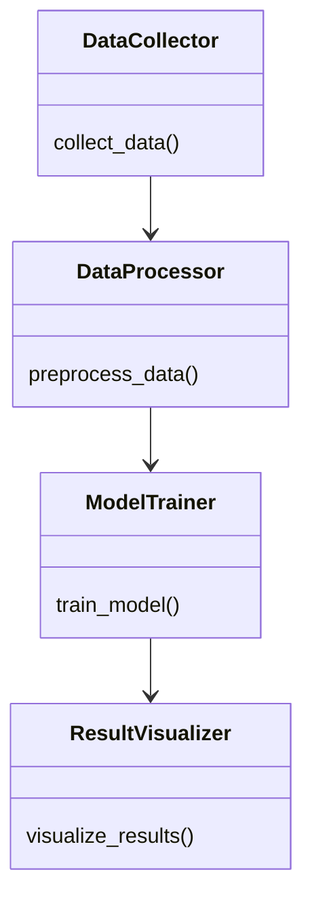
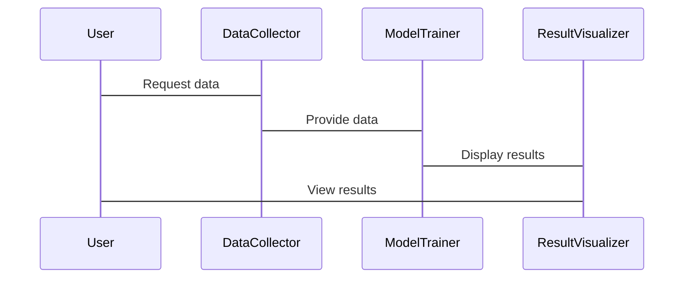

                 


# 每日更新的全球股市估值数据分析

> 关键词：全球股市、估值数据分析、机器学习、时间序列、数据驱动投资策略

> 摘要：本文深入探讨了如何每天更新全球股市的估值数据，分析了其背后的核心概念、算法原理和系统架构。通过结合金融学、数据科学和机器学习的方法，文章详细介绍了从数据收集到模型构建再到实际应用的全过程，并提供了具体的代码实现和案例分析。

---

## 第一章：背景介绍与核心概念

### 1.1 问题背景与数据来源

#### 1.1.1 全球股市估值分析的背景
全球股市是金融市场的重要组成部分，每天都有大量股票价格波动。准确分析这些波动背后的估值数据，对于投资者、机构和研究者来说至关重要。随着技术的进步，高频交易和自动化分析成为可能，如何实时更新和分析估值数据成为关键问题。

#### 1.1.2 数据来源与获取方式
- 数据来源：全球各大交易所的实时数据，如纽约证券交易所（NYSE）、纳斯达克（NASDAQ）、伦敦证券交易所（LSE）等。
- 数据获取方式：通过API接口（如Yahoo Finance API）或金融数据供应商（如Reuters、Bloomberg）获取实时数据。

#### 1.1.3 数据更新频率与挑战
- 数据更新频率：通常为每日收盘价，但也需要考虑盘中数据。
- 挑战：数据清洗、异常值处理、跨市场时区协调。

### 1.2 数据分析方法与应用

#### 1.2.1 常用的估值分析方法
- 市盈率（P/E Ratio）：股价与每股收益的比率，用于衡量股票的估值。
- 市净率（P/B Ratio）：股价与每股净资产的比率，适用于评估低增长行业的股票。
- 股息率：股息与股价的比率，用于评估收益稳定性。

#### 1.2.2 数据分析在投资决策中的作用
- 帮助投资者识别被低估或高估的股票。
- 用于构建投资组合，降低风险。

#### 1.2.3 全球股市的多样性与复杂性
- 不同市场的交易规则和节假日影响数据获取。
- 汇率波动对跨国公司股票的影响。

---

## 第二章：金融资产估值的核心概念

### 2.1 估值的基本原理

#### 2.1.1 资产定价模型
- **CAPM模型**：资本资产定价模型，用于计算资产的预期回报率。
  $$ E(R_i) = R_f + \beta_i (R_m - R_f) $$
  其中，$R_f$ 是无风险利率，$R_m$ 是市场预期回报率，$\beta_i$ 是资产的贝塔系数。

#### 2.1.2 市场情绪与资产价格的关系
- 市场情绪影响投资者决策，进而影响资产价格。例如，恐慌情绪可能导致市场下跌。

#### 2.1.3 资产流动性与估值波动性
- 高流动性资产通常波动性较低，反之亦然。

### 2.2 数据分析中的关键指标

#### 2.2.1 市盈率与市净率
- 市盈率（P/E）：$$ \text{P/E} = \frac{\text{股价}}{\text{每股收益}} $$
- 市净率（P/B）：$$ \text{P/B} = \frac{\text{股价}}{\text{每股净资产}} $$

#### 2.2.2 资产回报率与风险调整后收益
- 净现值（NPV）：$$ NPV = \sum_{t=1}^{n} \frac{CF_t}{(1 + r)^t} $$
- 夏普比率：衡量投资回报的风险调整后收益。

#### 2.2.3 市场趋势与周期性分析
- 使用时间序列分析预测市场趋势，例如ARIMA模型。

### 2.3 股市估值的多维度分析

#### 2.3.1 宏观经济指标对估值的影响
- GDP增长率、通货膨胀率、利率等宏观经济指标对股市估值有直接影响。

#### 2.3.2 行业趋势对估值的影响
- 行业生命周期和技术创新对估值的影响。

#### 2.3.3 公司基本面分析
- 公司财务报表分析（收入、利润、负债等）。

---

## 第三章：数据收集与预处理

### 3.1 数据来源与获取方法

#### 3.1.1 全球股市数据的获取渠道
- 使用Python的`pandas_datareader`库获取Yahoo Finance数据：
  ```python
  from pandas_datareader import data
  df = data.get_data_yahoo('AAPL', start='2020-01-01', end='2023-12-31')
  ```

#### 3.1.2 数据清洗与标准化
- 去除缺失值：`df.dropna()`
- 标准化：使用Z-score标准化：
  $$ Z = \frac{X - \mu}{\sigma} $$

#### 3.1.3 数据格式转换与存储
- 将数据存储为CSV文件或数据库。

### 3.2 数据特征分析

#### 3.2.1 时间序列特征提取
- 计算移动平均线（MA）、相对强指数（RSI）等指标。

#### 3.2.2 股价波动性分析
- 计算波动率：$$ \text{波动率} = \sqrt{\frac{1}{n}\sum_{i=1}^{n}(r_i - \bar{r})^2} $$

#### 3.2.3 数据异常值处理
- 使用Isolation Forest算法检测异常值。

### 3.3 数据预处理流程

#### 3.3.1 数据清洗与去重
- 去除重复数据：`df.drop_duplicates()`

#### 3.3.2 数据标准化与归一化
- 标准化：使用`StandardScaler`。
- 归一化：使用`MinMaxScaler`。

#### 3.3.3 数据特征选择与降维
- 使用主成分分析（PCA）降维。

---

## 第四章：算法原理与数学模型

### 4.1 估值模型的数学基础

#### 4.1.1 资产定价模型的数学表达
- 多因子模型：$$ R_i = \alpha + \beta_1 F_1 + \beta_2 F_2 + \cdots + \beta_n F_n + \epsilon $$

#### 4.1.2 时间序列分析的数学基础
- ARIMA模型：$$ y_t = \phi_1 y_{t-1} + \phi_2 y_{t-2} + \theta_1 \epsilon_{t-1} + \epsilon_t $$

#### 4.1.3 机器学习算法在估值中的应用
- 随机森林回归模型：用于预测股票价格。

### 4.2 常用算法与流程图

#### 4.2.1 线性回归模型
- 普通最小二乘法：$$ \hat{\theta} = (X^T X)^{-1} X^T y $$

#### 4.2.2 时间序列预测模型
- LSTM网络：用于捕捉时间序列中的长期依赖关系。

#### 4.2.3 机器学习模型
- 使用`scikit-learn`库训练随机森林模型：
  ```python
  from sklearn.ensemble import RandomForestRegressor
  model = RandomForestRegressor().fit(X_train, y_train)
  ```

### 4.3 算法实现与优化

#### 4.3.1 回归分析的实现
- 使用`statsmodels`库进行线性回归：
  ```python
  import statsmodels.api as sm
  model = sm.OLS(y, X).fit()
  ```

#### 4.3.2 时间序列分析的优化
- 使用`prophet`库进行时间序列预测：
  ```python
  from fbprophet import Prophet
  model = Prophet().fit(df)
  ```

#### 4.3.3 机器学习模型的调参
- 使用网格搜索优化模型参数。

---

## 第五章：系统架构设计

### 5.1 问题场景介绍

#### 5.1.1 项目介绍
- 开发一个实时更新全球股市估值数据的系统。

#### 5.1.2 系统功能设计
- 数据采集模块：实时获取数据。
- 数据处理模块：清洗和特征工程。
- 模型预测模块：基于机器学习模型进行估值预测。
- 结果展示模块：可视化预测结果。

### 5.2 系统架构设计

#### 5.2.1 领域模型（Mermaid 类图）


#### 5.2.2 系统架构图（Mermaid 架构图）


### 5.3 系统接口设计

#### 5.3.1 数据接口
- REST API接口：提供实时数据查询服务。

#### 5.3.2 模型接口
- API接口：提供估值预测服务。

### 5.4 系统交互设计（Mermaid 序列图）


---

## 第六章：项目实战

### 6.1 环境安装与配置

#### 6.1.1 安装依赖
- 使用`pip`安装所需库：
  ```bash
  pip install pandas numpy scikit-learn matplotlib
  ```

### 6.2 系统核心实现源代码

#### 6.2.1 数据采集模块
```python
import pandas_datareader as pdr

def get_stock_data(ticker, start, end):
    data = pdr.get_data_yahoo(ticker, start=start, end=end)
    return data
```

#### 6.2.2 数据处理模块
```python
import pandas as pd
from sklearn.preprocessing import StandardScaler

def preprocess_data(data):
    # 去除缺失值
    data.dropna(inplace=True)
    # 标准化
    scaler = StandardScaler()
    scaled_data = scaler.fit_transform(data[['close', 'open', 'high', 'low']])
    return scaled_data
```

#### 6.2.3 模型训练模块
```python
from sklearn.ensemble import RandomForestRegressor
from sklearn.metrics import mean_squared_error

def train_model(X_train, y_train):
    model = RandomForestRegressor().fit(X_train, y_train)
    return model

def evaluate_model(model, X_test, y_test):
    y_pred = model.predict(X_test)
    mse = mean_squared_error(y_test, y_pred)
    print(f"MSE: {mse}")
    return model
```

#### 6.2.4 结果展示模块
```python
import matplotlib.pyplot as plt

def visualize_results(true_prices, predicted_prices):
    plt.plot(true_prices, label='True Prices')
    plt.plot(predicted_prices, label='Predicted Prices')
    plt.xlabel('Time')
    plt.ylabel('Price')
    plt.legend()
    plt.show()
```

### 6.3 代码实现与结果分析

#### 6.3.1 数据获取与预处理
```python
# 获取数据
data = get_stock_data('AAPL', start='2020-01-01', end='2023-12-31')
# 数据清洗
processed_data = preprocess_data(data)
```

#### 6.3.2 模型训练与评估
```python
# 训练模型
model = train_model(X_train, y_train)
# 评估模型
model = evaluate_model(model, X_test, y_test)
```

#### 6.3.3 结果可视化
```python
# 可视化结果
visualize_results(y_test, y_pred)
```

### 6.4 案例分析与详细解读

#### 6.4.1 案例分析
- 使用苹果股票数据进行分析，比较实际价格与预测价格。

#### 6.4.2 代码实现与结果解读
- 讨论模型的准确性和误差来源。

---

## 第七章：最佳实践与总结

### 7.1 最佳实践

#### 7.1.1 数据质量的重要性
- 确保数据的完整性和准确性。

#### 7.1.2 模型的可解释性
- 避免过于复杂的模型，确保结果易于解释。

#### 7.1.3 持续优化
- 定期更新模型，适应市场变化。

### 7.2 小结

#### 7.2.1 本文总结
- 本文详细介绍了每日更新全球股市估值数据分析的全过程。

#### 7.2.2 未来展望
- 探索更先进的算法，如深度学习和强化学习在股市分析中的应用。

### 7.3 注意事项

#### 7.3.1 风险提示
- 股市分析存在不确定性，投资需谨慎。

#### 7.3.2 技术实现中的注意事项
- 确保系统的实时性和稳定性。

### 7.4 拓展阅读

#### 7.4.1 推荐书籍
- 《Python金融数据分析》
- 《机器学习实战》

#### 7.4.2 推荐博客与资源
- Towards Data Science的金融分析文章
- QuantInstinct的机器学习与金融博客

---

## 结语

通过本文的详细分析与实践，我们了解了如何每天更新全球股市的估值数据，并利用数据分析技术进行投资决策。希望本文能为读者提供有价值的参考，帮助他们在金融数据分析领域取得更大的进步。

--- 

**注：以上为文章的详细目录和内容框架，实际写作时需要根据具体需求调整内容深度和广度。**

