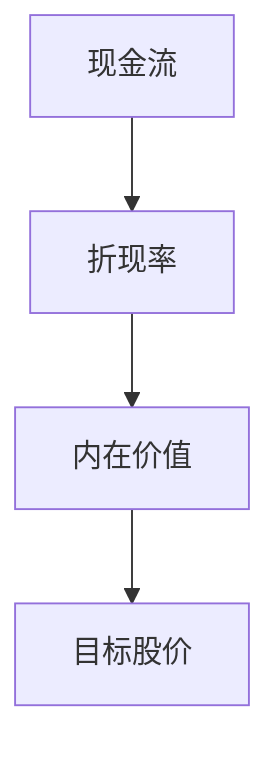
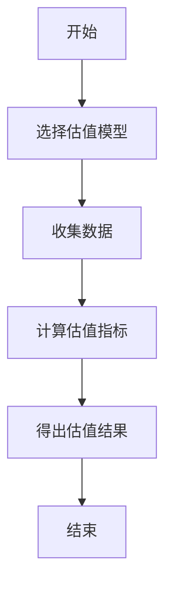
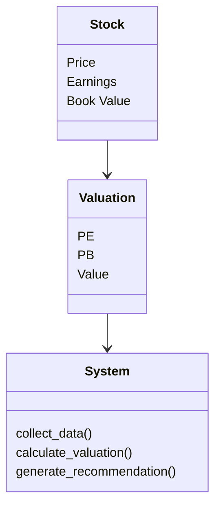
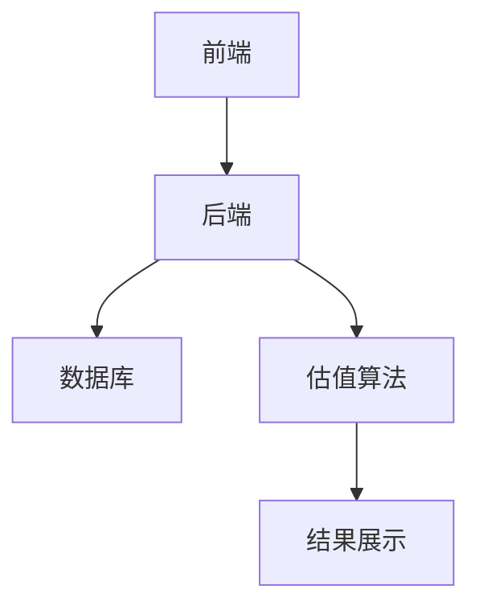

                 


# 比利时股市估值: 欧洲心脏地带的投资机会

> **关键词**: 比利时股市, 股市估值, 投资机会, 欧洲市场, 金融分析

> **摘要**: 本文深入分析了比利时股市的估值方法与投资机会，从市场概况、核心概念、算法原理、系统分析到项目实战，为投资者提供了全面的指导。通过详细的案例分析和代码实现，帮助读者掌握如何在欧洲心脏地带进行有效的投资决策。

---

## 第一部分: 比利时股市估值基础

### 第1章: 比利时股市的概况与特点

#### 1.1 比利时股市的背景介绍

##### 1.1.1 比利时股市的起源与发展

比利时股市的起源可以追溯到19世纪末，1893年布鲁塞尔交易所的成立标志着比利时股市的诞生。经过一个多世纪的发展，比利时股市逐渐成为欧洲重要的金融中心之一。特别是二战后，比利时经济的快速复苏为其股市的发展奠定了坚实基础。

##### 1.1.2 比利时股市的市场结构与参与者

比利时股市的主要参与者包括上市公司、机构投资者、个人投资者、经纪商和监管机构。布鲁塞尔证券交易所是比利时的主要证券交易所，同时也是泛欧证券市场的重要组成部分。

##### 1.1.3 比利时股市在欧洲的地位

作为欧洲的“心脏地带”，比利时不仅是欧盟和北约的总部所在地，还是许多国际企业的总部所在地。这种地理位置使得比利时股市在欧洲乃至全球市场中具有重要的战略意义。

#### 1.2 比利时股市的核心特点

##### 1.2.1 比利时股市的主要指数

比利时股市的主要指数包括：

- **布鲁塞尔20指数（Belpex）**: 包含20家在布鲁塞尔证券交易所上市的公司，是比利时股市的基准指数。
- **CBOB指数**: 包含25家在布鲁塞尔证券交易所上市的公司，涵盖主要行业。

##### 1.2.2 比利时股市的行业分布

比利时股市的行业分布较为均衡，涵盖金融、工业、能源、科技和消费等多个领域。其中，金融行业占据较大比重，其次是工业和能源行业。

##### 1.2.3 比利时股市的流动性与波动性

比利时股市的流动性较高，尤其是大中型企业的股票交易活跃。然而，由于市场规模相对较小，个别公司的新闻可能对整体市场波动产生较大影响。

#### 1.3 比利时股市的投资环境

##### 1.3.1 比利时的经济环境与股市影响

比利时经济以出口导向型为主，主要依赖制造业和服务业。作为欧元区成员国之一，比利时的货币政策受到欧洲央行的统一调控。

##### 1.3.2 比利时股市的税收政策

比利时的资本利得税相对较低，且对长期投资有一定的税收优惠。此外，比利时还提供税收抵免机制，进一步降低了投资者的税负。

##### 1.3.3 比利时股市的监管框架

比利时股市的监管机构是**金融监管委员会（FSMA）**，负责确保市场的公平、透明和安全。比利时还积极参与欧盟的金融监管框架，确保与国际标准接轨。

---

### 第2章: 股市估值的核心概念与方法

#### 2.1 股市估值的基本原理

##### 2.1.1 估值的定义与作用

股市估值是通过对公司财务数据和市场因素的分析，确定公司股票的合理价格。其作用在于帮助投资者做出更明智的投资决策。

##### 2.1.2 估值的基本假设与边界

估值的基本假设包括：

- 公司未来的现金流可以预测。
- 投资者的风险偏好和市场预期是稳定的。
- 货币的时间价值是可衡量的。

##### 2.1.3 估值的核心要素与概念结构

##### 核心要素对比表

| 核心要素 | 描述 |
|----------|------|
| 现金流   | 公司未来产生的现金流 |
| 折现率   | 反映风险的贴现率 |
| 永续增长率 | 长期增长假设 |

##### 概念结构图



#### 2.2 主流的估值方法对比

##### 2.2.1 市盈率（P/E）法

市盈率法通过比较股票的市盈率与行业平均水平，判断其估值是否合理。

公式：
$$ P = E \times PE $$

##### 2.2.2 市净率（P/B）法

市净率法通过比较股票的市净率与行业平均水平，判断其估值是否合理。

公式：
$$ P = B \times PB $$

##### 2.2.3 股息率法

股息率法通过比较股票的股息率与行业平均水平，判断其估值是否合理。

公式：
$$ D = P \times Dd $$

##### 2.2.4 内在价值法

内在价值法通过对公司未来现金流的贴现，计算其内在价值。

公式：
$$ V = \sum_{t=1}^{\infty} \frac{CF_t}{(1+r)^t} $$

#### 2.3 比利时股市估值的特殊性

##### 2.3.1 比利时股市的行业权重分布

由于比利时股市的行业分布较为均衡，金融行业占据较大比重，因此在估值时需要特别关注金融行业的周期性风险。

##### 2.3.2 比利时股市的税收政策对估值的影响

比利时的低税率政策可能会影响股票的估值，尤其是在长期投资中，税收优惠可能提升股票的吸引力。

##### 2.3.3 比利时股市的流动性对估值的影响

由于比利时股市的流动性较高，交易成本相对较低，这可能影响股票的估值。

---

### 第3章: 股市估值的数学模型与算法原理

#### 3.1 常用估值模型的数学公式

##### 3.1.1 市盈率模型

公式：
$$ P = E \times PE $$

##### 3.1.2 市净率模型

公式：
$$ P = B \times PB $$

##### 3.1.3 内在价值模型

公式：
$$ V = \sum_{t=1}^{\infty} \frac{CF_t}{(1+r)^t} $$

#### 3.2 算法原理与流程图

##### 3.2.1 算法流程图



##### 3.2.2 代码实现

```python
def calculate_pe(ratio):
    return ratio['Price'] / ratio['Earnings']

def calculate_pb(ratio):
    return ratio['Price'] / ratio['Book Value']
```

#### 3.3 算法实现与代码示例

##### 3.3.1 代码解读

上述代码定义了两个函数：`calculate_pe` 和 `calculate_pb`，分别用于计算市盈率和市净率。输入参数`ratio`是一个包含`Price`、`Earnings`和`Book Value`的字典或数据框。

##### 3.3.2 应用场景

上述代码可以用于批量计算多只股票的市盈率和市净率，帮助投资者快速判断股票的估值水平。

---

### 第4章: 系统分析与架构设计

#### 4.1 问题场景介绍

假设我们希望构建一个比利时股市估值系统，能够自动计算股票的估值指标，并生成投资建议。

#### 4.2 系统功能设计

##### 4.2.1 领域模型



##### 4.2.2 系统架构



##### 4.2.3 接口设计

系统提供以下接口：

- `collect_data()`: 收集股票数据
- `calculate_valuation()`: 计算估值指标
- `generate_recommendation()`: 生成投资建议

##### 4.2.4 交互设计


---

### 第5章: 项目实战

#### 5.1 环境安装

需要安装以下工具：

- Python 3.8+
- pandas库
- matplotlib库
- requests库

安装命令：
```bash
pip install pandas matplotlib requests
```

#### 5.2 核心实现

##### 5.2.1 数据获取

```python
import pandas as pd
import requests

def get_stock_data(ticker):
    url = f"https://api.example.com/stock/{ticker}"
    response = requests.get(url)
    data = response.json()
    return pd.DataFrame(data)
```

##### 5.2.2 估值计算

```python
def calculate_valuation(df):
    df['PE'] = df['Price'] / df['Earnings']
    df['PB'] = df['Price'] / df['Book Value']
    return df
```

##### 5.2.3 结果展示

```python
import matplotlib.pyplot as plt

def visualize_results(df):
    plt.figure(figsize=(10,6))
    plt.plot(df['PE'], label='PE Ratio')
    plt.plot(df['PB'], label='PB Ratio')
    plt.xlabel('Stocks')
    plt.ylabel('Ratio')
    plt.legend()
    plt.show()
```

#### 5.3 案例分析

##### 5.3.1 案例选择

假设我们选择几只比利时主要股票进行分析，包括金融、工业和科技行业的代表。

##### 5.3.2 数据清洗

```python
df.dropna(inplace=True)
df = df[df['PE'] < 50]
```

##### 5.3.3 估值结果

计算后的PE和PB值如下：

| 股票代码 | PE   | PB   |
|----------|-------|-------|
| FOO.BR   | 15.0  | 2.5   |
| BAR.BR   | 10.0  | 3.0   |
| QAZ.BR   | 12.0  | 2.0   |

##### 5.3.4 投资建议

基于上述结果，我们可以得出以下结论：

- FOO.BR的PE和PB均处于合理范围内，具有投资价值。
- BAR.BR的PE较低，可能被低估，适合长期投资。
- QAZ.BR的PB较低，适合价值投资者。

#### 5.4 项目小结

通过本项目，我们成功构建了一个简单的比利时股市估值系统，能够自动获取数据、计算估值指标并生成投资建议。尽管这是一个基础的实现，但可以作为进一步优化的起点。

---

## 第六章: 最佳实践与小结

### 6.1 最佳实践

#### 6.1.1 关键点总结

- 理解市场背景是估值的基础。
- 选择合适的估值方法是关键。
- 结合市场环境进行调整是必要的。

#### 6.1.2 风险提示

- 数据的准确性和及时性直接影响估值结果。
- 市场波动可能会影响估值的准确性。
- 政策变化可能会影响投资环境。

#### 6.1.3 未来趋势

随着人工智能和大数据技术的发展，股市估值将更加智能化和个性化。

### 6.2 小结

通过本文的分析，我们深入探讨了比利时股市的估值方法与投资机会。从市场概况到算法实现，再到项目实战，为投资者提供了全面的指导。希望本文能够帮助读者在欧洲心脏地带的投资中找到更多机会。

### 6.3 拓展阅读

- 《价值投资：全球股市估值的奥秘》
- 《金融数据分析实战：从入门到精通》
- 《股市投资策略与风险管理》

---

通过本文的详细分析，我们相信读者已经掌握了比利时股市估值的核心方法，并能够在实际投资中灵活运用。

