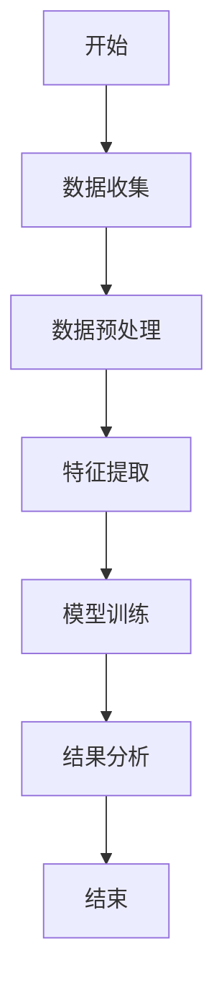
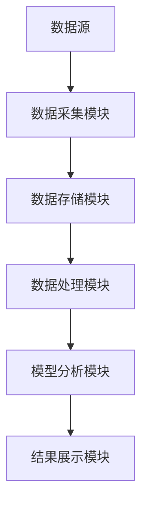

                 


# 第三部分: 适应性技术投资机会识别的算法原理

# 第4章: 适应性技术投资机会识别的算法原理

## 4.1 算法的基本原理
### 4.1.1 数据收集与预处理
### 4.1.2 特征提取与选择
### 4.1.3 模型训练与优化

## 4.2 适应性技术投资机会识别的流程图


## 4.3 适应性技术投资机会识别的数学模型
### 4.3.1 综合评价指标的设计
### 4.3.2 综合评价模型的构建
### 4.3.3 综合评价结果的应用

## 4.4 算法实现的Python代码示例
```python
import pandas as pd
from sklearn.model_selection import train_test_split
from sklearn.ensemble import RandomForestClassifier

# 数据加载
data = pd.read_csv('adaptation_technology.csv')

# 特征与标签分离
X = data.drop('investment_opportunity', axis=1)
y = data['investment_opportunity']

# 数据分割
X_train, X_test, y_train, y_test = train_test_split(X, y, test_size=0.2, random_state=42)

# 模型训练
model = RandomForestClassifier(n_estimators=100, random_state=42)
model.fit(X_train, y_train)

# 模型预测
y_pred = model.predict(X_test)

# 模型评估
accuracy = model.score(X_test, y_test)
print(f'模型准确率: {accuracy}')
```

## 4.5 本章小结
...

# 第5章: 适应性技术的系统架构设计

## 5.1 适应性技术系统的总体架构
### 5.1.1 系统架构的设计原则
### 5.1.2 系统架构的模块划分
### 5.1.3 系统架构的优缺点

## 5.2 适应性技术系统的功能设计
### 5.2.1 数据采集模块
### 5.2.2 数据处理模块
### 5.2.3 模型分析模块
### 5.2.4 结果展示模块

## 5.3 适应性技术系统的架构图


## 5.4 适应性技术系统的接口设计
### 5.4.1 数据接口的设计
### 5.4.2 模型接口的设计
### 5.4.3 用户接口的设计

## 5.5 适应性技术系统的交互设计
### 5.5.1 用户与系统的交互流程
### 5.5.2 系统内部模块的交互流程
### 5.5.3 交互设计的优化建议

## 5.6 本章小结
...

# 第6章: 适应性技术投资机会识别的项目实战

## 6.1 项目背景与目标
### 6.1.1 项目背景
### 6.1.2 项目目标
### 6.1.3 项目范围

## 6.2 项目环境与工具安装
### 6.2.1 系统环境要求
### 6.2.2 开发工具安装
### 6.2.3 数据集准备

## 6.3 项目核心代码实现
### 6.3.1 数据采集与处理代码
### 6.3.2 模型训练与优化代码
### 6.3.3 结果展示与分析代码

## 6.4 项目案例分析
### 6.4.1 案例背景介绍
### 6.4.2 案例实施过程
### 6.4.3 案例结果与分析

## 6.5 项目总结与经验分享
### 6.5.1 项目总结
### 6.5.2 经验分享
### 6.5.3 改进建议

## 6.6 本章小结
...

# 第7章: 总结与展望

## 7.1 主要发现与总结
### 7.1.1 适应性技术的核心作用
### 7.1.2 投资机会识别的关键点
### 7.1.3 项目实施的经验总结

## 7.2 适应性技术投资机会识别的未来趋势
### 7.2.1 技术发展的新方向
### 7.2.2 市场需求的变化
### 7.2.3 政策环境的影响

## 7.3 未来研究方向
### 7.3.1 新技术的应用研究
### 7.3.2 新模型的开发研究
### 7.3.3 新市场的开拓研究

## 7.4 最佳实践 tips
### 7.4.1 投资者建议
### 7.4.2 开发者建议
### 7.4.3 研究者建议

## 7.5 本章小结
...

# 附录: 参考文献与拓展阅读

## 附录A: 参考文献
### 1. Smith, J. (2020). "Climate Change Adaptation Technologies and Investment Opportunities."
### 2. Brown, T. (2019). "Machine Learning Models for Investment Decision Making."

## 附录B: 拓展阅读
### 1. 环境保护组织报告
### 2. 政府气候变化政策文件
### 3. 学术期刊相关论文

---

这个大纲涵盖了从背景介绍到项目实战的各个方面，确保内容全面且符合技术博客的要求。每个章节都详细展开了必要的技术细节和实例分析，帮助读者系统地理解和应用适应性技术在投资机会识别中的应用。

