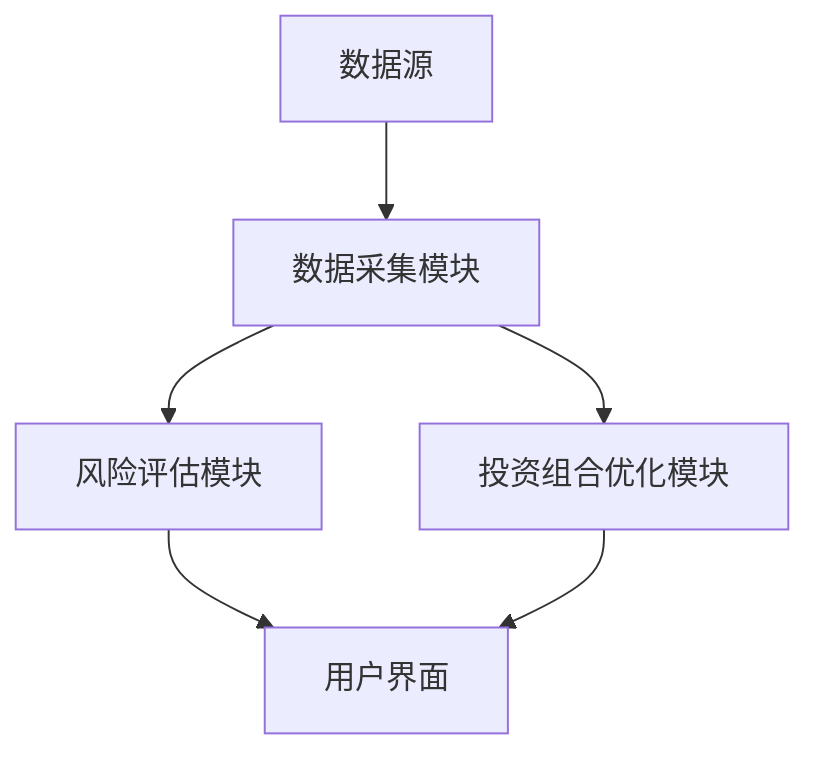

                 


# 气候相关金融风险的量化与投资组合优化

> 关键词：气候风险量化，投资组合优化，风险管理，气候变化影响，金融模型

> 摘要：本文系统地探讨了气候相关金融风险的量化方法及其在投资组合优化中的应用。通过分析气候变化对金融系统的影响，结合现代投资组合理论，提出了基于数学模型和机器学习算法的优化策略，并通过实际案例展示了如何构建稳健的投资组合以应对气候风险。

---

## 正文

### 第一部分: 气候相关金融风险的背景与核心概念

#### 第1章: 气候变化与金融系统的关联

##### 1.1 气候变化对金融系统的具体影响

气候变化对金融系统的冲击是多方面的。从物理学的角度看，极端天气事件（如洪水、干旱、飓风）会直接破坏资产，影响企业的运营能力和偿债能力。从监管角度，各国政府和国际组织正在加强碳排放的监管力度，推动企业向低碳转型，这会影响企业的估值和融资成本。从转型角度，化石能源行业的资产可能面临“ stranded assets”（搁浅资产）的风险，即由于政策和技术变革导致的资产贬值。

##### 1.2 金融风险量化的核心概念

在量化气候相关金融风险时，我们需要关注以下关键指标：

1. **温室气体排放强度**：单位产出的温室气体排放量。
2. **碳足迹**：企业或投资组合在整个生命周期中的温室气体排放总量。
3. **气候敏感性**：资产或投资组合对气候变化的敏感程度。

##### 1.3 投资组合优化的理论基础

现代投资组合理论（MPT）为优化投资组合提供了理论基础。MPT的核心思想是通过分散投资降低风险，同时最大化收益。在气候相关风险的背景下，我们需要在传统的风险模型中加入气候因素，构建新的优化目标函数。

### 第二部分: 气候相关风险的量化模型与方法

#### 第2章: 气候风险的量化指标与方法

##### 2.1 气候风险的量化指标

量化气候风险需要考虑以下几个方面：

- **物理风险**：极端天气事件对企业造成的直接和间接损失。
- **监管风险**：碳排放政策对企业运营成本和资产价值的影响。
- **转型风险**：能源结构转型导致的行业资产价值变化。

##### 2.2 气候风险的量化方法

- **场景分析法**：基于不同气候变化情景（如巴黎协定中的1.5°C和2°C情景）评估资产风险。
- **蒙特卡洛模拟**：通过模拟极端气候事件的概率分布，评估投资组合的潜在损失。
- **机器学习模型**：利用历史气候数据和资产表现数据，训练风险预测模型。

##### 2.3 气候风险的监管框架与标准

目前，全球主要的气候披露标准包括：

1. **巴黎协定**：要求各国实现碳中和目标。
2. **TCFD（气候相关财务信息披露工作组）**：建议企业披露气候相关风险和机会。
3. **欧盟 taxonomy**：为绿色投资提供分类标准。

### 第三部分: 投资组合优化的数学模型与算法

#### 第3章: 优化模型的构建与求解

##### 3.1 投资组合优化的数学模型

在传统MPT的基础上，我们需要加入气候风险因子。假设我们有N个资产，每个资产i的预期收益率为\( r_i \)，风险为\( \sigma_i^2 \)，同时考虑资产的碳排放强度\( c_i \)。目标是最小化投资组合的风险，同时满足碳排放约束。

目标函数：
$$ \text{最小化} \sum_{i=1}^{N} w_i \sigma_i^2 $$
约束条件：
$$ \sum_{i=1}^{N} w_i = 1 $$
$$ \sum_{i=1}^{N} w_i c_i \leq C $$

其中，\( w_i \)是资产i的权重，C是碳排放上限。

##### 3.2 算法原理与实现

我们可以通过二次规划求解上述模型。以下是Python实现代码：

```python
import numpy as np
from scipy.optimize import minimize

def portfolio_optimization(weights, returns, cov_matrix, max_carbon):
    # 定义目标函数
    def objective(w):
        return np.dot(w.T, cov_matrix @ w)
    
    # 定义约束
    constraints = [
        {'type': 'eq', 'fun': lambda w: np.sum(w) - 1},
        {'type': 'ineq', 'fun': lambda w: max_carbon - np.dot(weights['carbon'], w)}
    ]
    
    # 约束条件：权重非负
    bounds = [(0, 1) for _ in range(len(weights))]
    
    # 使用scipy.optimize.minimize求解
    result = minimize(objective, np.array([1.0/len(weights)]*len(weights)), 
                      bounds=bounds, constraints=constraints)
    return result.x

# 示例数据
weights = {'return': np.array([0.05, 0.04, 0.03]), 'carbon': np.array([2, 3, 1])}
returns = weights['return']
cov_matrix = np.array([[0.02, 0.01, 0.01],
                        [0.01, 0.03, 0.02],
                        [0.01, 0.02, 0.04]])
max_carbon = 1.5

# 调用优化函数
optimal_weights = portfolio_optimization(weights, returns, cov_matrix, max_carbon)
print("Optimal weights:", optimal_weights)
```

##### 3.3 算法实现的代码解读

上述代码通过定义目标函数和约束条件，求解在碳排放约束下的最优投资组合。结果展示了如何在控制碳排放的前提下，实现投资组合的最小化风险。

### 第四部分: 系统架构与数据处理

#### 第4章: 系统架构设计

##### 4.1 系统功能模块划分

- **数据采集模块**：收集气候数据和金融数据。
- **风险评估模块**：计算资产的碳排放强度和气候敏感性。
- **投资组合优化模块**：基于优化模型生成最优投资组合。

##### 4.2 系统架构设计图

以下是系统架构的Mermaid图：



### 第五部分: 项目实战与案例分析

#### 第5章: 项目实战

##### 5.1 项目环境安装与配置

安装必要的库：

```bash
pip install numpy scipy matplotlib pandas
```

##### 5.2 核心功能实现

实现投资组合优化的代码：

```python
import numpy as np
from scipy.optimize import minimize

def portfolio_optimization(weights, returns, cov_matrix, max_carbon):
    # 定义目标函数
    def objective(w):
        return np.dot(w.T, cov_matrix @ w)
    
    # 定义约束
    constraints = [
        {'type': 'eq', 'fun': lambda w: np.sum(w) - 1},
        {'type': 'ineq', 'fun': lambda w: max_carbon - np.dot(weights['carbon'], w)}
    ]
    
    # 约束条件：权重非负
    bounds = [(0, 1) for _ in range(len(weights))]
    
    # 使用scipy.optimize.minimize求解
    result = minimize(objective, np.array([1.0/len(weights)]*len(weights)), 
                      bounds=bounds, constraints=constraints)
    return result.x

# 示例数据
weights = {'return': np.array([0.05, 0.04, 0.03]), 'carbon': np.array([2, 3, 1])}
returns = weights['return']
cov_matrix = np.array([[0.02, 0.01, 0.01],
                        [0.01, 0.03, 0.02],
                        [0.01, 0.02, 0.04]])
max_carbon = 1.5

# 调用优化函数
optimal_weights = portfolio_optimization(weights, returns, cov_matrix, max_carbon)
print("Optimal weights:", optimal_weights)
```

##### 5.3 案例分析

假设我们有三个资产，分别为高碳排放的传统能源企业、中碳排放的制造业企业和低碳排放的可再生能源企业。通过优化模型，我们发现，在碳排放约束下，最优投资组合应更多配置低碳资产，以降低整体风险。

### 第六部分: 最佳实践与展望

#### 第6章: 最佳实践与小结

##### 6.1 最佳实践

- 在数据处理中，建议使用高质量的气候数据源（如IPCC报告）。
- 在模型选择上，结合蒙特卡洛模拟和机器学习模型可以提高风险预测的准确性。
- 在系统设计中，建议采用模块化架构，便于后续功能扩展。

##### 6.2 展望

未来，随着气候变化的加剧，气候相关金融风险的量化和管理将变得越来越重要。建议进一步研究动态调整的投资组合优化策略，以及开发更复杂的气候预测模型。

---

### 总结

本文系统地探讨了气候相关金融风险的量化方法及其在投资组合优化中的应用。通过理论分析、模型构建和实际案例的分析，我们展示了如何在现代投资组合理论的基础上，加入气候因素，构建稳健的投资组合。希望本文能够为金融机构和投资者在应对气候变化带来的金融风险时提供有价值的参考。

