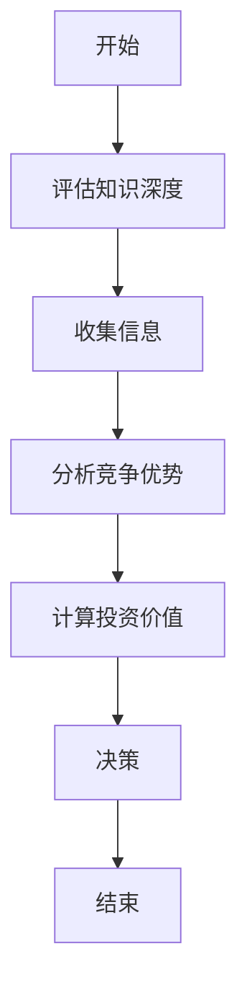
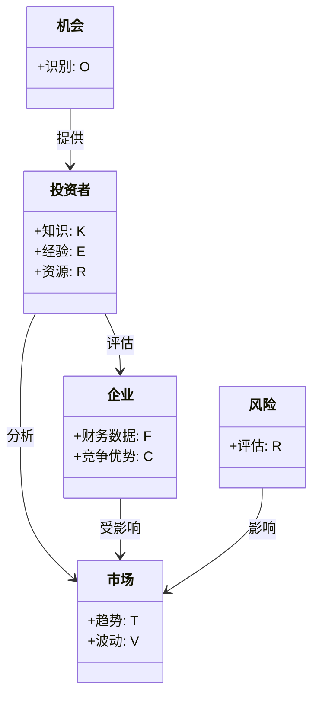
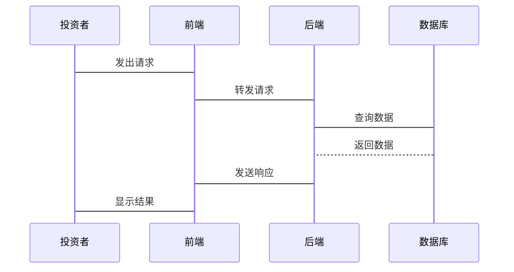

                 


# 沃伦·巴菲特的Circle of Competence理论

## 关键词
- 价值投资
- 能力圈
- 投资决策
- 竞争优势
- 巴菲特投资策略

## 摘要
沃伦·巴菲特的Circle of Competence（能力圈）理论是价值投资的重要组成部分，强调投资者应专注于自己熟悉且具有竞争优势的领域。本文系统地分析了该理论的核心概念、数学模型、系统架构以及实际应用，帮助投资者更好地理解和应用这一理论。

---

## 第一部分: Circle of Competence理论的背景与核心思想

### 第1章: 巴菲特投资理念的背景与核心思想

#### 1.1 巴菲特的生平与投资哲学
- **成长经历**：巴菲特出生于1934年，早年展现出对投资的兴趣，15岁时购买第一只股票。
- **投资哲学**：倡导价值投资，强调安全边际和长期持有优质资产。
- **核心思想**：市场波动是投资机会，而非风险。

#### 1.2 Circle of Competence理论的提出背景
- **传统投资理论的局限**：市场有效性和短期波动难以预测。
- **巴菲特的贡献**：提出能力圈概念，强调专注和优势领域。
- **理论背景**：20世纪70年代，巴菲特在哥伦比亚大学师从格雷厄姆，发展出能力圈理论。

#### 1.3 理论的核心概念与边界
- **能力圈定义**：投资者的知识、经验和资源决定的可理解领域。
- **边界与外延**：能力圈的边界模糊，需谨慎扩展。
- **投资决策的关系**：仅在能力圈内投资，降低风险。

---

### 第2章: Circle of Competence理论的核心要素

#### 2.1 能力圈的构成要素
- **知识与经验**：深度研究和长期实践。
- **资源与信息**：可靠的财务数据和行业分析。
- **心理与行为特征**：耐心、纪律和情绪稳定性。

#### 2.2 能力圈的特征对比
| 特征 | 能力圈内 | 能力圈外 |
|------|----------|----------|
| 知识深度 | 丰富 | 匮乏 |
| 竞争优势 | 存在 | 不存在 |
| 投资信心 | 高 | 低 |

#### 2.3 能力圈的实体关系图
```mermaid
erDiagram
    actor 投资者
    actor 市场
    actor 企业
    actor 风险
    actor 机会
    actor 信息源
    investor --> 信息源: 获取信息
    investor --> 企业: 分析企业
    investor --> 市场: 分析市场
    investor --> 风险: 评估风险
    investor --> 机会: 识别机会
    企业 --> 市场: 受市场影响
    企业 --> 信息源: 提供信息
    风险 --> 市场: 影响市场
    风险 --> 企业: 影响企业
```

---

### 第3章: Circle of Competence理论的数学模型与算法原理

#### 3.1 理论的数学模型
- **能力圈评估模型**：
  $$ E = \sum_{i=1}^{n} (K_i \cdot I_i) $$
  其中，\( K_i \) 为知识深度，\( I_i \) 为信息质量。
  
- **投资决策优化模型**：
  $$ D = \arg\max_{j=1}^{m} \sum_{i=1}^{n} (K_i \cdot Q_j) $$
  其中，\( Q_j \) 为企业竞争优势。

#### 3.2 算法原理


---

### 第4章: 系统分析与架构设计方案

#### 4.1 问题场景介绍
- **投资决策的复杂性**：市场波动、信息不对称。
- **能力圈理论的系统性**：通过系统架构实现理论的结构化。

#### 4.2 项目介绍
- **目标**：构建基于能力圈理论的投资决策系统。
- **范围**：分析企业财务数据、市场趋势和竞争优势。

#### 4.3 系统功能设计


#### 4.4 系统架构设计


#### 4.5 系统接口设计
- **输入接口**：投资者输入需求。
- **输出接口**：系统输出分析结果。
- **数据接口**：获取市场和企业数据。

#### 4.6 系统交互设计


---

### 第5章: 项目实战

#### 5.1 环境安装
- **工具**：Python、Pandas、Matplotlib。
- **数据源**：Yahoo Finance API。

#### 5.2 核心实现代码
```python
import pandas as pd
import requests

def get_stock_data(ticker):
    url = f"https://query1.finance.yahoo.com/v8/finance/chart/{ticker}"
    response = requests.get(url)
    data = response.json()
    df = pd.DataFrame(data['chart']['result'][0]['prices'])
    df['Date'] = pd.to_datetime(df[0])
    df.set_index('Date', inplace=True)
    df = df[['open', 'high', 'low', 'close', 'volume']]
    return df

# 示例：获取苹果股票数据
apple_data = get_stock_data('AAPL')
print(apple_data.head())
```

#### 5.3 案例分析
- **目标企业**：假设分析苹果公司（AAPL）。
- **竞争优势**：品牌、技术、生态。
- **投资决策**：基于能力圈，决定投资与否。

#### 5.4 项目总结
- **优势**：系统化分析，降低决策风险。
- **挑战**：数据获取和模型准确性。

---

### 第6章: 最佳实践与小结

#### 6.1 最佳实践
- **专注能力圈**：只投资熟悉领域。
- **持续学习**：更新知识和信息。
- **风险管理**：评估潜在风险，制定退出策略。

#### 6.2 小结
Circle of Competence理论强调专注和优势，帮助投资者在复杂市场中做出明智决策。

#### 6.3 注意事项
- 避免过度自信，定期评估能力圈。
- 结合市场变化，灵活调整策略。

#### 6.4 拓展阅读
- 巴菲特股东大会演讲。
- 格雷厄姆的价值投资理论。

---

通过以上分析，沃伦·巴菲特的Circle of Competence理论为投资者提供了一种系统化的投资方法，强调专注和优势。结合技术分析和实际案例，投资者可以更好地应用这一理论，做出更明智的投资决策。

