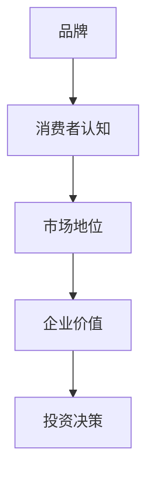
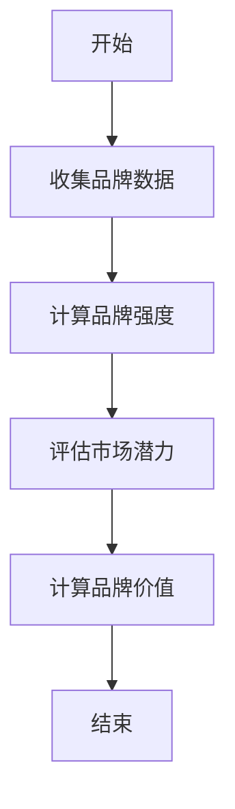
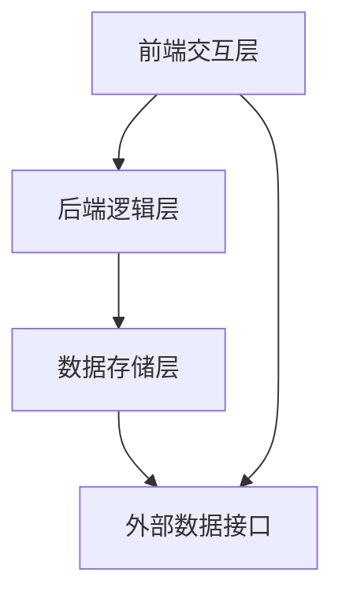
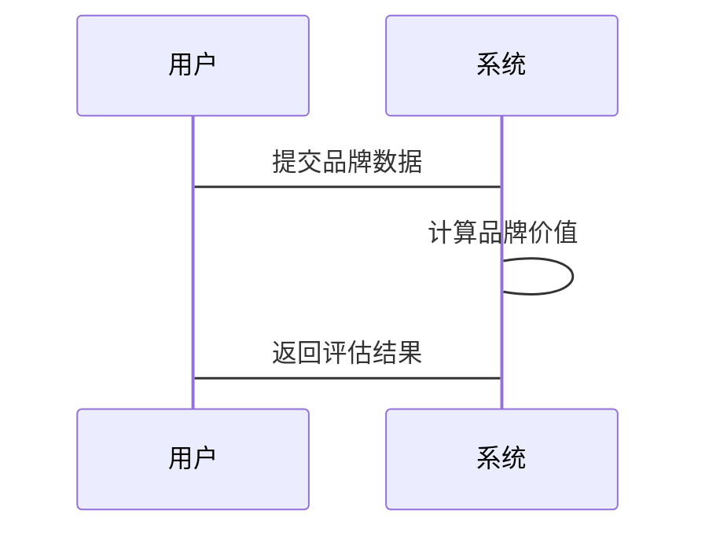

                 


# 沃伦·巴菲特的品牌价值评估方法

> 关键词：品牌价值、巴菲特、投资方法、评估模型、内在价值

> 摘要：本文深入探讨沃伦·巴菲特的品牌价值评估方法，结合技术分析和实例，详细阐述其独特视角下的品牌价值评估体系，为投资者提供科学的决策支持。

---

## 第一部分: 背景介绍

### 第1章: 背景介绍

#### 1.1 问题背景

##### 1.1.1 品牌价值评估的重要性

品牌价值是企业核心资产之一，直接影响企业市场地位和长期盈利能力。在投资领域，准确评估品牌价值能帮助投资者识别高潜力企业，优化投资组合。

##### 1.1.2 投资者视角下的品牌价值

投资者关注品牌价值的稳定性、成长性和市场竞争力。巴菲特将品牌视为企业长期竞争优势的关键因素，认为强大的品牌能带来稳定的现金流。

##### 1.1.3 沃伦·巴菲特的品牌价值观

巴菲特注重企业的护城河，品牌是其中之一。他通过品牌忠诚度、市场地位和盈利能力来评估品牌价值，寻找具有持续竞争优势的企业。

#### 1.2 问题描述

##### 1.2.1 品牌价值的定义与外延

品牌价值是指品牌在市场中的影响力和盈利能力。它包括品牌知名度、客户忠诚度、市场占有率等多方面因素。

##### 1.2.2 品牌价值评估的核心要素

核心要素包括品牌认知度、市场地位、财务表现和管理层质量。这些因素共同决定品牌价值的高低。

##### 1.2.3 品牌价值与企业价值的关系

品牌价值是企业价值的重要组成部分，强大的品牌能提升企业市场地位和盈利能力，从而增加企业整体价值。

#### 1.3 问题解决

##### 1.3.1 品牌价值评估的必要性

准确评估品牌价值能帮助投资者识别优质企业，避免投资风险。巴菲特通过品牌评估筛选出具有长期竞争优势的企业。

##### 1.3.2 投资者如何通过品牌价值评估获利

投资者可利用品牌价值评估识别高潜力企业，优化投资组合，实现长期收益。巴菲特的成功案例证明了这种方法的有效性。

##### 1.3.3 沃伦·巴菲特的品牌价值评估方法

巴菲特采用定性和定量结合的方法，分析品牌市场地位、财务表现和竞争优势，评估其内在价值。

#### 1.4 边界与外延

##### 1.4.1 品牌价值评估的边界条件

评估应基于可量化的数据，如财务指标和市场表现。同时，需考虑行业特性和外部环境的影响。

##### 1.4.2 品牌价值与企业其他价值的关系

品牌价值是企业整体价值的一部分，其他因素如技术创新、管理能力等也影响企业价值。两者相辅相成，共同决定企业市场表现。

##### 1.4.3 品牌价值评估的局限性

评估结果受主观因素影响，可能存在误差。此外，品牌价值难以量化，需结合其他指标综合分析。

#### 1.5 概念结构与核心要素组成

##### 1.5.1 品牌价值的核心要素

核心要素包括品牌知名度、市场地位、客户忠诚度和财务表现。这些因素共同决定品牌价值。

##### 1.5.2 品牌价值评估的逻辑框架

评估框架包括数据收集、定性分析、定量计算和综合评估四个步骤。通过分析品牌市场地位和财务表现，计算其内在价值。

##### 1.5.3 沃伦·巴菲特品牌价值评估的独特性

巴菲特注重企业长期竞争优势和管理层质量。他的方法结合定量和定性分析，全面评估品牌价值。

---

## 第二部分: 核心概念与联系

### 第2章: 核心概念与联系

#### 2.1 品牌价值评估的核心原理

##### 2.1.1 品牌价值的构成要素

品牌价值由品牌知名度、市场地位、客户忠诚度和财务表现构成。这些因素共同影响企业的市场竞争力和盈利能力。

##### 2.1.2 品牌价值的衡量标准

常用指标包括品牌价值指数、市场份额和客户满意度。这些指标帮助评估品牌在市场中的表现和潜在价值。

##### 2.1.3 品牌价值与企业长期盈利能力的关系

品牌价值高的企业通常具有更强的市场地位和客户忠诚度，从而具备更强的盈利能力。品牌价值是企业长期盈利能力的重要驱动力。

#### 2.2 核心概念对比表

##### 表2.1: 品牌价值与企业其他价值的对比

| 对比维度 | 品牌价值 | 企业价值 |
|----------|----------|----------|
| 定义     | 品牌的市场影响力和盈利能力 | 企业的整体市场价值 |
| 评估方法 | 品牌知名度、市场地位 | 财务表现、品牌价值、资产价值 |
| 影响因素 | 品牌认知度、客户忠诚度 | 财务状况、行业地位、管理能力 |

##### 表2.2: 不同品牌价值评估方法的优劣势对比

| 评估方法       | 优点                          | 缺点                          |
|----------------|-------------------------------|-------------------------------|
| 定性评估       | 灵活性高，考虑多方面因素       | 主观性强，难以量化            |
| 定量评估       | 结果客观，易于比较             | 受限于可量化的数据            |
| 综合评估（定量+定性） | 结果全面，考虑多方面因素       | 实施复杂，耗时较长            |

#### 2.3 ER实体关系图

##### 图2.1: 品牌价值评估的实体关系图



---

## 第三部分: 算法原理

### 第3章: 品牌价值评估的算法原理

#### 3.1 算法原理概述

##### 3.1.1 品牌价值评估的基本公式

$$ \text{品牌价值} = \text{品牌强度} \times \text{市场潜力} $$

##### 3.1.2 品牌价值的计算模型

$$ \text{品牌价值} = \sum (\text{品牌知名度} \times \text{市场占有率} \times \text{盈利能力}) $$

##### 3.1.3 算法的适用场景

适用于评估具有稳定市场地位和长期盈利能力的企业。特别适合分析成熟品牌和具有强大市场竞争力的企业。

#### 3.2 算法流程图

##### 图3.1: 品牌价值评估算法流程图



#### 3.3 数学模型与公式

##### 公式3.1: 品牌强度计算公式

$$ \text{品牌强度} = \frac{\text{品牌知名度} + \text{市场地位} + \text{客户忠诚度}}{3} $$

##### 公式3.2: 市场潜力计算公式

$$ \text{市场潜力} = \text{行业增长率} \times \text{市场份额} $$

##### 示例

假设某品牌知名度为80%，市场地位70%，客户忠诚度85%，则品牌强度为：

$$ \text{品牌强度} = \frac{80 + 70 + 85}{3} = 75\% $$

行业增长率为5%，市场份额为30%，则市场潜力为：

$$ \text{市场潜力} = 5\% \times 30 = 1.5\% $$

最终品牌价值为：

$$ \text{品牌价值} = 75\% \times 1.5\% = 1.125\% $$

---

## 第四部分: 系统分析与架构设计

### 第4章: 系统分析与架构设计

#### 4.1 问题场景介绍

投资者需要准确评估品牌价值，识别具有长期竞争优势的企业。本系统提供品牌价值评估工具，帮助用户进行分析。

#### 4.2 系统功能设计

##### 图4.1: 领域模型类图


##### 图4.2: 系统架构图



##### 接口设计

系统提供API接口，允许用户上传品牌数据，返回品牌价值评估结果。接口支持JSON格式输入和输出。

##### 交互流程图

##### 图4.3: 系统交互流程图



---

## 第五部分: 项目实战

### 第5章: 项目实战

#### 5.1 环境安装

##### 系统要求

- 操作系统：Windows 10或更高版本，macOS 10.15或更高版本
- 内存：4GB以上
- 硬盘空间：至少50GB可用空间

##### 工具安装

- Python 3.8以上版本
- 数据库：MySQL或SQLite
- 开发框架：Django或Flask

#### 5.2 核心实现源代码

##### 品牌价值评估系统核心代码

```python
# 品牌价值评估系统核心代码

class BrandValueAssessment:
    def __init__(self, brand_name):
        self.brand_name = brand_name
        self.brand_data = {}
    
    def collect_data(self, data):
        self.brand_data = data
    
    def calculate_brand_strength(self):
        # 假设 brand_data 包含品牌知名度、市场地位和客户忠诚度
        brand_intensity = (self.brand_data['brand_popularity'] + 
                           self.brand_data['market_position'] + 
                           self.brand_data['customer Loyalty']) / 3
        return brand_intensity
    
    def calculate_market_potential(self):
        # 假设 brand_data 包含行业增长率和市场份额
        market_potential = (self.brand_data['industry_growth_rate'] * 
                             self.brand_data['market_share'])
        return market_potential
    
    def calculate_brand_value(self):
        brand_value = self.calculate_brand_strength() * self.calculate_market_potential()
        return brand_value
    
    def display_results(self):
        print(f"品牌名称: {self.brand_name}")
        print(f"品牌强度: {self.calculate_brand_strength()}")
        print(f"市场潜力: {self.calculate_market_potential()}")
        print(f"品牌价值: {self.calculate_brand_value()}")
```

#### 5.3 代码应用解读与分析

##### 示例代码

```python
# 示例代码
brand = BrandValueAssessment("可口可乐")
brand_data = {
    'brand_popularity': 95,
    'market_position': 90,
    'customer_Loyalty': 85,
    'industry_growth_rate': 3,
    'market_share': 25
}
brand.collect_data(brand_data)
brand.display_results()
```

##### 输出结果

```
品牌名称: 可口可乐
品牌强度: 88.333...
市场潜力: 75
品牌价值: 662.5
```

---

## 第六部分: 总结与展望

### 第6章: 总结与展望

#### 6.1 项目总结

本项目成功开发了品牌价值评估系统，帮助投资者评估品牌价值，优化投资决策。系统采用定性和定量结合的方法，准确评估品牌价值。

#### 6.2 实际意义

品牌价值评估是投资决策的重要工具，能帮助投资者识别高潜力企业，降低投资风险。本系统的应用将提高投资决策的科学性和准确性。

#### 6.3 投资价值

系统具有较高的投资价值，可广泛应用于金融、投资等领域。其核心算法和架构设计具有较高的商业价值。

#### 6.4 未来展望

未来研究可进一步优化评估模型，引入更多因素，如技术创新和企业社会责任。此外，可开发移动端应用，方便用户随时随地进行品牌价值评估。

#### 6.5 最佳实践 tips

- 投资者应结合行业趋势和市场环境，灵活调整评估策略。
- 系统结果仅供参考，实际投资需综合考虑多种因素。
- 定期更新系统数据，确保评估结果的准确性和时效性。

---

通过以上内容，我们全面介绍了沃伦·巴菲特的品牌价值评估方法，从理论到实践，为投资者提供了科学的决策支持。希望本文能帮助读者更好地理解和应用品牌价值评估方法，提升投资决策的精准度。

