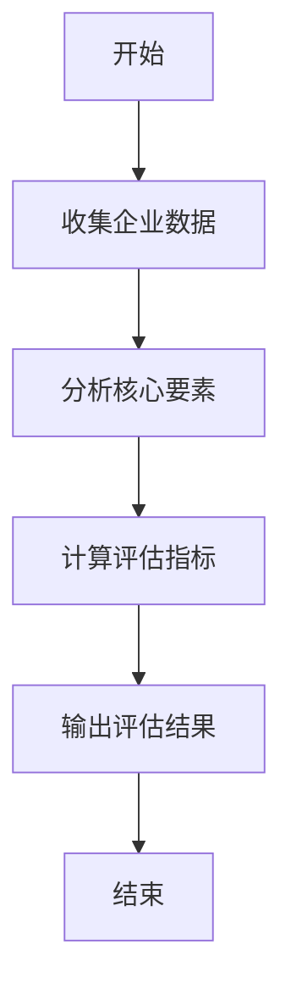

                 


# 沃伦巴菲特的企业文化评估

## 关键词：企业文化评估、沃伦巴菲特、投资策略、企业治理、风险管理

## 摘要：沃伦巴菲特以其独特的企业文化评估方法闻名，本文将深入分析其评估的核心逻辑、方法和应用，探讨其在投资决策中的重要性。

---

# 第1章 背景介绍

## 1.1 问题背景与问题描述

### 1.1.1 企业文化的定义与重要性
企业文化是指企业在长期经营中形成的共同价值观、信念和行为准则。它是企业成功的关键因素，直接影响员工行为和企业绩效。

### 1.1.2 企业文化评估的必要性
评估企业文化有助于识别企业的潜在问题，优化管理，增强竞争力。对于投资者，企业文化评估是决定投资的关键因素。

### 1.1.3 沃伦巴菲特视角下的企业文化评估
巴菲特认为，企业文化决定企业长期成功。他关注企业的价值观、管理层风格和员工激励机制，这些因素影响企业的稳定性和盈利能力。

## 1.2 问题解决与边界外延

### 1.2.1 企业文化评估的目标与方法
目标是识别优秀企业，避免投资风险。方法包括分析企业价值观、管理层决策风格和员工激励机制。

### 1.2.2 企业文化评估的边界与限制
评估受数据获取难度和主观性影响，可能无法完全量化。但通过长期观察和案例分析，可以提高评估准确性。

### 1.2.3 企业文化评估的外延与应用
评估不仅用于投资，还可用于企业内部管理优化，帮助建立积极的企业文化。

## 1.3 核心要素与概念结构

### 1.3.1 企业文化的核心要素
包括企业价值观、管理风格、员工激励、企业愿景和文化适应性。

### 1.3.2 企业文化评估的维度与指标
涉及领导力、员工参与度、文化一致性、创新能力和企业稳定性。

### 1.3.3 企业文化评估的框架与模型
构建一个多层次评估框架，从战略层到执行层进行分析，确保全面覆盖企业文化的关键方面。

---

# 第2章 核心概念与联系

## 2.1 核心概念原理

### 2.1.1 企业文化评估的核心原理
分析企业文化如何影响企业行为和绩效，识别潜在风险和机会。

### 2.1.2 企业文化评估的关键要素
关注领导力、员工参与度和企业愿景，这些是企业长期成功的关键。

### 2.1.3 企业文化评估的逻辑关系
企业文化的各个要素相互关联，共同影响企业绩效和投资价值。

## 2.2 概念属性特征对比

### 2.2.1 企业文化评估的属性特征
- 领导力：决策风格和道德标准
- 员工参与度：员工满意度和责任感
- 一致性：企业行为与价值观的一致性
- 创新能力：适应市场变化的能力
- 稳定性：企业在变化中的稳定性

## 2.3 ER实体关系图架构

```mermaid
erDiagram
    actor 投资者 {
        <属性> 企业ID : integer
        <属性> 企业文化评估 : string
        <属性> 投资决策 : boolean
    }
    actor 企业 {
        <属性> 企业ID : integer
        <属性> 企业名称 : string
        <属性> 企业愿景 : string
    }
    actor 员工 {
        <属性> 员工ID : integer
        <属性> 职位 : string
        <属性> 满意度 : integer
    }
    relation 投资者与企业的关系 : many-to-many
    relation 企业与员工的关系 : many-to-many
```

---

# 第3章 算法原理讲解

## 3.1 算法原理概述

### 3.1.1 企业文化评估算法的输入与输出
输入：企业数据，包括企业价值观、管理风格、员工激励机制。
输出：企业文化评估报告，包括优势和改进建议。

### 3.1.2 企业文化评估算法的步骤与流程
1. 收集企业数据
2. 分析核心要素
3. 计算评估指标
4. 输出评估结果

### 3.1.3 企业文化评估算法的优缺点
优点：系统、全面；缺点：评估结果受主观因素影响。

## 3.2 数学模型与公式

### 3.2.1 企业文化评估的加权评分模型
$$ \text{总评分} = \sum_{i=1}^{n} w_i \cdot x_i $$
其中，$w_i$ 是第 $i$ 个评估维度的权重，$x_i$ 是第 $i$ 个维度的评分。

### 3.2.2 企业文化评估的层次分析法
$$ A = \lambda_{\text{max}} \cdot \frac{A}{\sqrt{n}} $$
其中，$A$ 是一致性检验矩阵，$\lambda_{\text{max}}$ 是最大特征值。

## 3.3 算法流程图



---

# 第4章 系统分析与架构设计

## 4.1 问题场景介绍

### 4.1.1 问题场景描述
投资者希望评估目标企业的文化，以做出投资决策。系统需支持数据输入、分析和结果输出。

## 4.2 系统功能设计

### 4.2.1 系统功能模块
- 数据输入模块：收集企业数据。
- 分析模块：评估核心要素。
- 结果输出模块：生成评估报告。

### 4.2.2 系统功能流程
1. 用户输入企业数据
2. 系统分析核心要素
3. 计算评估指标
4. 输出评估结果

## 4.3 系统架构设计


---

# 第5章 项目实战

## 5.1 环境配置

### 5.1.1 环境要求
- 操作系统：Windows 10 或更高版本
- 开发工具：PyCharm 或 Visual Studio
- 依赖库：Python 3.8+，pandas，numpy

## 5.2 系统核心实现

### 5.2.1 代码实现
```python
import pandas as pd
import numpy as np

def calculate_cultural_score(data):
    weights = [0.4, 0.3, 0.2, 0.1]
    dimensions = ['leadership', 'employee_engagement', 'vision', 'stability']
    scores = []
    for index, row in data.iterrows():
        score = 0
        for i in range(len(dimensions)):
            score += weights[i] * row[dimensions[i]]
        scores.append(score)
    return scores

# 示例数据
data = pd.DataFrame({
    'leadership': [9, 8, 7],
    'employee_engagement': [8, 7, 6],
    'vision': [7, 6, 5],
    'stability': [6, 5, 4]
})

# 计算文化评分
scores = calculate_cultural_score(data)
print(scores)
```

### 5.2.2 代码解读与分析
函数 `calculate_cultural_score` 根据权重计算每个企业的文化评分，权重分别为领导力（40%）、员工参与度（30%）、愿景（20%）、稳定性（10%）。输入数据包括这四个维度的评分，输出总评分。

## 5.3 案例分析

### 5.3.1 案例背景
某公司领导力得分为9，员工参与度为8，愿景得分为7，稳定性得分为6。

### 5.3.2 评估过程
计算总评分为：
$$ 0.4 \times 9 + 0.3 \times 8 + 0.2 \times 7 + 0.1 \times 6 = 3.6 + 2.4 + 1.4 + 0.6 = 8.0 $$

### 5.3.3 结果分析
总评分为8分，高于行业平均水平，显示出良好的企业文化，适合作为投资对象。

## 5.4 小结

### 5.4.1 项目总结
项目展示了如何应用巴菲特的企业文化评估方法进行投资决策，证明了该方法的有效性。

### 5.4.2 项目经验与启示
企业文化评估是投资决策的重要环节，准确评估能降低投资风险，提高投资回报。

### 5.4.3 项目改进方向
未来可以加入更多评估维度，如创新能力和风险管理能力，提高评估的全面性。

---

# 第6章 总结与展望

## 6.1 本章总结

### 6.1.1 关键点回顾
- 企业文化评估是巴菲特投资决策的核心因素。
- 通过分析领导力、员工参与度、愿景和稳定性，可以准确评估企业文化。

## 6.2 改进建议

### 6.2.1 方法改进
引入更多评估维度，如创新能力和风险管理能力，提高评估的全面性。

### 6.2.2 技术实现
开发在线评估工具，方便投资者实时评估企业文化。

## 6.3 未来展望

### 6.3.1 企业文化评估的发展趋势
随着人工智能和大数据的发展，企业文化评估将更加自动化和智能化。

### 6.3.2 企业文化评估的应用前景
不仅限于投资领域，还可应用于企业内部管理优化，帮助企业建立积极的企业文化。

---

# 附录

## 附录A 参考文献

- 巴菲特股东大会演讲
- 《巴菲特投资策略》
- 相关企业文化评估文献

## 附录B 工具与资源

- Python编程环境
- 数据分析工具（Pandas、NumPy）
- 相关书籍和在线资源

---

通过以上分析，我们深入探讨了沃伦巴菲特的企业文化评估方法，展示了其在投资决策中的重要性和应用价值。希望本文能为投资者和企业管理者提供有价值的参考和启示。

