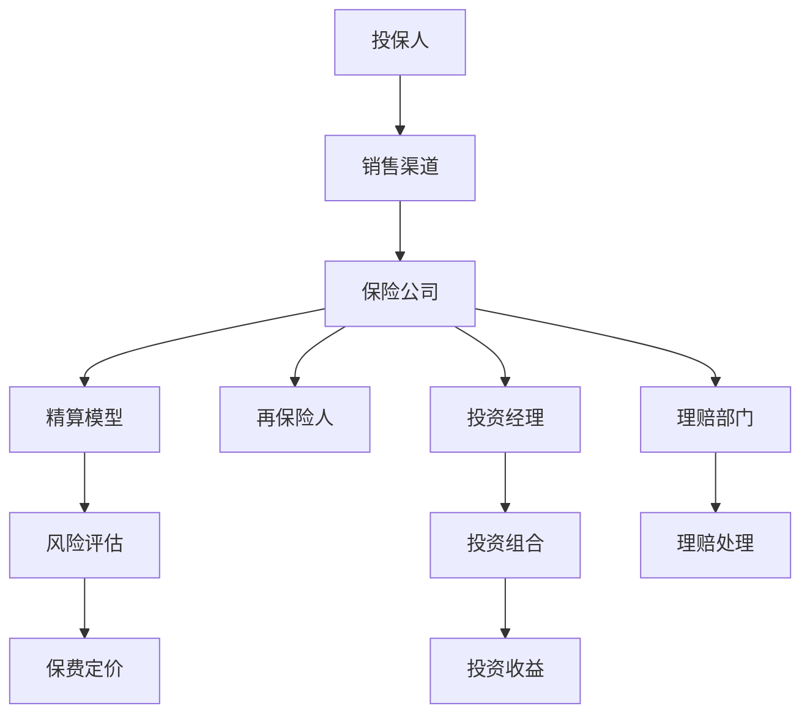

                 


# 《沃伦巴菲特的保险业价值链分析》

---

## 关键词：
- 沃伦巴菲特
- 保险业
- 投资策略
- 价值链分析
- 财务分析
- 竞争优势

---

## 摘要：
本书系统地分析了沃伦巴菲特在保险业的投资策略和价值链管理的深刻见解。通过巴菲特独特的投资哲学和分析框架，详细探讨了保险业的财务健康评估、竞争优势分析以及风险管理策略。本书结合理论与实践，通过案例分析、系统架构设计和项目实战，深入剖析了巴菲特在保险业价值链中的成功秘诀，为投资者和从业者提供了宝贵的参考和启示。

---

# 第一部分: 保险业价值链分析的背景与基础

# 第1章: 保险业的价值链概述

## 1.1 保险业的基本概念
### 1.1.1 保险的定义与基本原理
- 保险的定义：一种风险管理工具，通过分担风险来保障经济安全。
- 保险的基本原理：风险分散、概率论与大数法则。
- 保险的主要类型：人寿保险、财产保险、责任保险等。

### 1.1.2 保险业的主要参与者
- 保险公司：承保人、再保险人。
- 投保人：个人和企业。
- 保险中介：代理人、经纪人。
- 监管机构：政府监管机构。

### 1.1.3 保险业的商业模式
- 收入来源：保费收入、投资收益。
- 成本结构：赔付支出、运营成本。
- 利润来源：保费收入与赔付支出的差额、投资收益。

## 1.2 沃伦巴菲特的投资哲学
### 1.2.1 巴菲特的投资理念概述
- 价值投资：寻找具有持续竞争优势的企业。
- 长期持有：投资优质企业，长期持有。
- 安全边际：买入价格低于内在价值，确保安全边际。

### 1.2.2 巴菲特对保险业的特殊关注
- 保险业的特殊性：承保风险，依赖精算模型。
- 保险业的稳定性：现金流稳定，具备防御性。
- 保险业的杠杆效应：资本效率高，收益放大。

### 1.2.3 巴菲特投资成功的关键因素
- 企业护城河：竞争优势不可复制。
- 财务健康：低负债率、高ROE。
- 管理团队：诚实、可靠、能力强。

## 1.3 保险业价值链的基本框架
### 1.3.1 保险价值链的构成要素
- 产品设计：风险评估、保费定价。
- 销售渠道：直接销售、代理人、经纪人。
- 承保过程：风险评估、合同签订。
- 理赔服务： claims processing、客户服务。
- 投资管理：运用保费进行投资，获取收益。

### 1.3.2 价值链的上下游关系
- 上游： reinsurers、保险中介、精算师。
- 下游：投保人、受益人、再保险人。

### 1.3.3 价值链的优化与提升
- 产品创新：开发新的保险产品，满足市场需求。
- 成本控制：优化运营流程，降低承销和理赔成本。
- 投资效率：提高资产配置效率，获取更高收益。

## 1.4 本章小结
本章介绍了保险业的基本概念、巴菲特的投资哲学及其对保险业的特殊关注，构建了保险业价值链的基本框架。

---

# 第二部分: 巴菲特保险投资策略的核心概念

# 第2章: 巴菲特保险投资的核心理念

## 2.1 保险企业的财务健康评估
### 2.1.1 资产负债表分析
- 资产：现金及等价物、投资资产、应收保费。
- 负债：未付理赔、保费预收、再保险负债。
- 所有者权益：股本、留存收益。

### 2.1.2 利润表与现金流分析
- 收入：保费收入、投资收益。
- 成本：赔付支出、运营成本。
- 利润：净利润、每股收益（EPS）。

### 2.1.3 财务比率分析
- 偿付能力比率：如偿付能力充足率。
- 盈利能力比率：如ROE（净资产收益率）、ROA（资产收益率）。
- 成长能力比率：如保费增长率、净利润增长率。

## 2.2 保险企业的竞争优势分析
### 2.2.1 核心竞争力的定义
- 核心竞争力：公司特有的竞争优势，难以被竞争对手复制。
- 保险企业的核心竞争力：品牌、网络、精算能力、成本优势。

### 2.2.2 巴菲特眼中的竞争优势
- 市场领导地位：市场份额大，具有定价权。
- 经济护城河：专利、规模经济、网络效应。
- 管理团队：能力强、诚实可靠，能够持续创造价值。

### 2.2.3 保险企业的护城河
- 品牌优势：客户信任度高，具有客户忠诚度。
- 规模经济：随着保费规模扩大，边际成本递减。
- 专属技术：独特的精算模型、风险评估方法。

## 2.3 保险企业的风险管理
### 2.3.1 风险管理的基本原则
- 风险识别：识别潜在风险，如市场风险、信用风险。
- 风险评估：量化风险程度，评估影响。
- 风险控制：制定风险管理策略，降低风险敞口。

### 2.3.2 巴菲特的风险控制策略
- 保守的承保策略：避免高风险业务。
- 安全的再保险安排：分散风险，避免过度集中。
- 强大的资本缓冲：保持充足的偿付能力，应对突发风险。

### 2.3.3 保险企业的偿付能力评估
- 偿付能力充足率：（母公司资本+附属公司资本）/风险资本。
- 最低资本要求：根据监管规定，确保公司能够履行赔付义务。
- 压力测试：模拟极端市场条件，评估公司应对风险的能力。

## 2.4 本章小结
本章深入分析了保险企业的财务健康评估、竞争优势分析和风险管理策略，揭示了巴菲特投资保险企业的核心理念。

---

# 第三部分: 保险业价值链的系统分析与架构设计

# 第3章: 保险业价值链的系统分析

## 3.1 保险业价值链的构成模块
### 3.1.1 产品设计与开发
- 风险评估：精算师评估风险，确定保费。
- 产品定价：根据风险评估，制定合理保费。
- 产品创新：开发新的保险产品，满足市场需求。

### 3.1.2 销售与分销
- 直销模式：公司直接销售，成本低，控制力强。
- 代理模式：通过代理人销售，覆盖面广，但成本高。
- 综合模式：结合直销和代理，优化销售渠道。

### 3.1.3 承保与理赔
- 承保流程：风险评估、合同签订、保费收取。
- 理赔流程：报案、审核、赔付。
- 理赔效率：优化理赔流程，提高客户满意度。

### 3.1.4 投资与资产配置
- 投资策略：固定收益投资、股票投资、房地产投资。
- 资产流动性：确保资产流动性，应对赔付需求。
- 投资回报：通过高效投资，提高公司收益。

## 3.2 保险业价值链的优化策略
### 3.2.1 价值链的效率提升
- 信息技术应用：利用大数据、人工智能优化风险评估和定价。
- 自动化流程：自动化理赔处理，提高效率。
- 渠道整合：线上线下结合，提升销售效率。

### 3.2.2 价值链的成本控制
- 精简组织结构：减少冗余部门，降低运营成本。
- 优化承保策略：避免高风险业务，降低赔付支出。
- 效率提升：通过技术创新，提高运营效率。

### 3.2.3 价值链的创新与转型
- 数字化转型：发展在线销售渠道，优化客户体验。
- 产品创新：开发创新型保险产品，满足新兴需求。
- 模式创新：探索 insuretech 模式，利用技术提升竞争力。

## 3.3 保险业价值链的系统架构
### 3.3.1 价值链的系统架构图



---

## 3.4 本章小结
本章通过系统分析保险业价值链的构成模块和优化策略，提出了一个完整的系统架构，为后续的项目实战奠定了基础。

---

# 第四部分: 项目实战与案例分析

# 第4章: 保险业价值链分析的项目实战

## 4.1 项目背景介绍
### 4.1.1 项目目标
- 分析一家保险公司价值链的效率与成本。
- 评估其竞争优势和财务健康状况。
- 提出优化建议，提升整体绩效。

### 4.1.2 项目范围
- 数据收集：过去5年的财务数据、业务数据。
- 分析模块：财务分析、竞争优势分析、风险管理评估。
- 优化建议：价值链优化策略、成本控制措施。

## 4.2 项目核心实现
### 4.2.1 环境安装
- 数据分析工具：Python、Pandas、NumPy。
- 可视化工具：Matplotlib、Seaborn。
- 数据存储：MySQL数据库。
- 开发框架：Django或Flask。

### 4.2.2 核心代码实现
#### （a）数据导入与清洗

```python
import pandas as pd
import numpy as np

# 读取数据
df = pd.read_csv('insurance_data.csv')

# 查看数据前几行
print(df.head())

# 数据清洗：处理缺失值、异常值
df.dropna(inplace=True)
df.replace([np.inf, -np.inf], np.nan, inplace=True)
df.drop_duplicates(inplace=True)
```

#### （b）财务分析模块

```python
import pandas as pd
import matplotlib.pyplot as plt

# 净利润计算
df['net_profit'] = df['revenue'] - df['cost']

# 净资产收益率（ROE）计算
df['roe'] = (df['net_profit'] / df['equity']) * 100

# 绘制ROE趋势图
plt.figure(figsize=(10,6))
plt.plot(df['year'], df['roe'], label='ROE (%)')
plt.xlabel('Year')
plt.ylabel('ROE (%)')
plt.title('ROE Trend Analysis')
plt.legend()
plt.show()
```

#### （c）竞争优势分析模块

```python
import pandas as pd
import networkx as nx

# 建立竞争优势网络图
G = nx.Graph()
G.add_nodes_from(['Brand', 'Cost', 'Distribution', 'Service'])
G.add_edges_from([('Brand', 'Cost'), ('Cost', 'Distribution'), ('Distribution', 'Service')])

# 可视化网络图
nx.draw(G, with_labels=True, node_size=1500, edge_color='red')
plt.show()
```

#### （d）风险管理评估模块

```python
import pandas as pd
from sklearn.metrics import pairwise_distances

# 风险评估矩阵
df_risk = pd.DataFrame({
    'Parameter': ['Market Risk', 'Credit Risk', 'Operational Risk'],
    'Score': [85, 60, 70]
})

# 可视化风险矩阵
plt.figure(figsize=(8,6))
plt.bar(df_risk['Parameter'], df_risk['Score'], color='blue')
plt.xticks(rotation=45)
plt.xlabel('Risk Parameter')
plt.ylabel('Risk Score')
plt.title('Risk Assessment Matrix')
plt.show()
```

## 4.3 项目小结
通过本项目，我们实现了保险业价值链的系统分析，从数据收集到财务分析、竞争优势分析和风险管理评估，最终提出了优化建议，为保险公司提升价值链效率提供了实践参考。

---

# 第五部分: 总结与展望

# 第5章: 总结与展望

## 5.1 本章总结
### 5.1.1 核心概念回顾
- 保险业价值链的基本框架。
- 巴菲特保险投资的核心理念。
- 保险业价值链的系统分析。

### 5.1.2 项目成果展示
- 成功构建了保险业价值链的系统架构。
- 实现了财务分析、竞争优势分析和风险管理评估的代码模块。
- 提出了优化建议，为保险公司提升绩效提供了实践指导。

## 5.2 未来展望
### 5.2.1 技术发展
- AI与大数据在保险业的进一步应用。
- 自动化理赔处理的优化。
- 数字化营销的创新。

### 5.2.2 投资策略
- 持续关注保险企业的财务健康。
- 优化竞争优势分析模型。
- 提升风险管理能力。

### 5.2.3 行业趋势
- 保险业的数字化转型。
- 新型保险产品的开发。
- ESG投资理念的融入。

## 5.3 最佳实践 Tips
- 在进行保险投资时，注重企业的财务健康和竞争优势。
- 选择具有强大管理团队和良好声誉的保险公司。
- 保持对保险市场的持续关注，及时调整投资策略。

## 5.4 本章小结
本书通过系统的分析和实践，揭示了巴菲特在保险业价值链中的成功秘诀，并为未来的投资和管理提供了宝贵的启示。

---

# 结语
保险业是一个复杂的行业，但通过系统的价值链分析和巴菲特的智慧，我们可以找到投资和管理的最优解。希望本书能够为读者在保险业的分析与决策中提供有价值的参考和指导。

