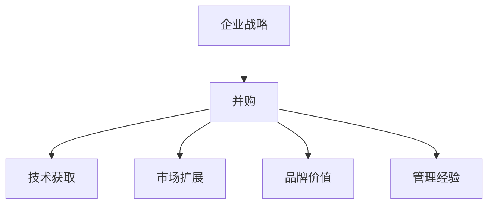
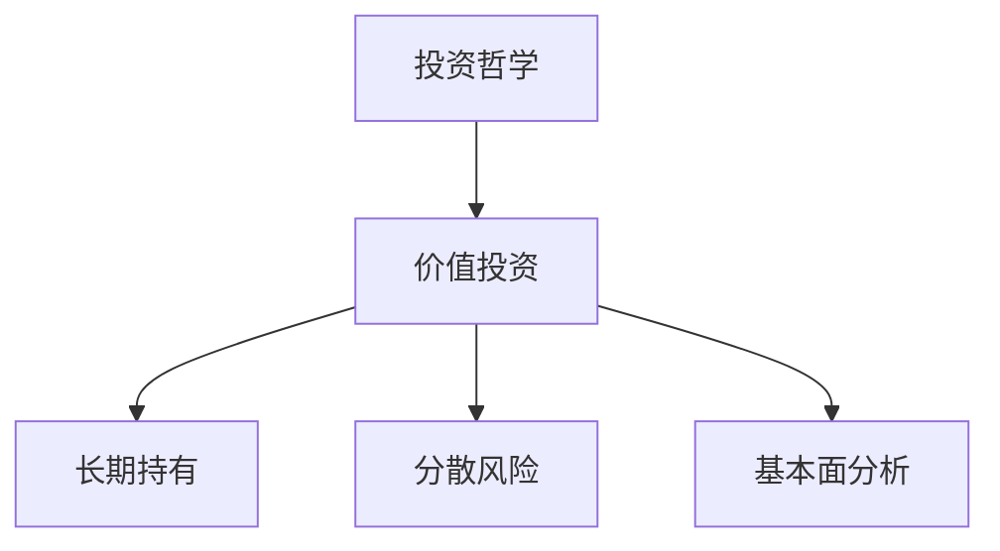
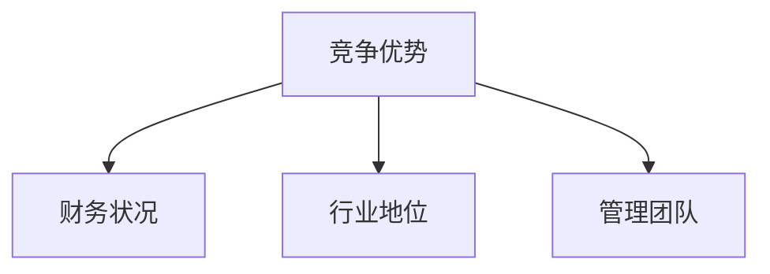
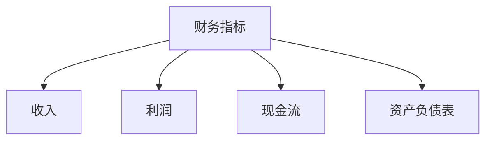
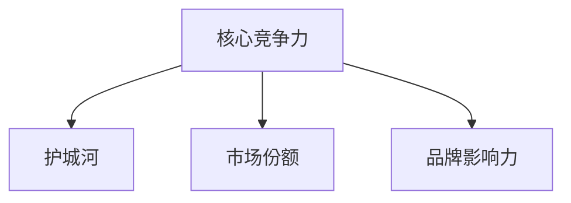

                 

# 沃伦巴菲特的并购策略分析

## 关键词：沃伦巴菲特，并购策略，价值投资，竞争优势，内在价值

## 摘要：沃伦巴菲特作为全球最具影响力的投资家之一，其并购策略以价值投资为核心，注重企业的内在价值和竞争优势。本文通过分析巴菲特并购策略的核心理念、分析框架以及经典案例，揭示其策略的内在逻辑和实际应用，并为现代投资者提供启示和指导。

---

# 第一部分：沃伦巴菲特并购策略的背景与核心理念

## 第1章：沃伦巴菲特并购策略的背景与核心理念

### 1.1 投资并购的背景与重要性

#### 1.1.1 并购在企业战略中的地位

企业并购是企业成长和扩张的重要手段，通过并购可以快速获取技术、市场、品牌和管理经验等核心资源。并购不仅是企业战略的重要组成部分，也是实现股东价值最大化的重要途径。

**图表：企业并购的战略地位（Mermaid图）**

#### 1.1.2 巴菲特投资哲学的核心理念

巴菲特的投资哲学以价值投资为核心，强调以合理的价格投资于具有持续竞争优势的企业。他的投资理念强调长期持有、分散风险和注重企业基本面。

**图表：巴菲特投资理念的核心要素（Mermaid图）**

#### 1.1.3 并购策略在巴菲特投资组合中的作用

并购策略是巴菲特投资组合的重要组成部分，他通过并购获取具有持续竞争优势的企业，并通过长期持有实现价值增长。

---

### 1.2 巴菲特并购策略的核心原则

#### 1.2.1 价值投资的定义与内涵

价值投资是一种以低于内在价值的价格投资优质企业的方法。巴菲特认为，投资的最终目标是找到具有持续竞争优势且估值合理的公司。

**数学公式：内在价值的计算公式**

$$内在价值 = \frac{未来现金流}{折现率}$$

#### 1.2.2 巴菲特定律与投资决策框架

巴菲特的“特许经营权”概念强调投资于具有强大竞争优势的企业。他通过分析企业的财务状况、行业地位和管理团队来评估其竞争优势。

**图表：巴菲特竞争优势分析框架（Mermaid图）**

#### 1.2.3 投资中的安全边际概念

安全边际是指投资价格低于内在价值的部分，以降低投资风险。巴菲特认为，安全边际是投资成功的关键因素之一。

**数学公式：安全边际的计算公式**

$$安全边际 = 内在价值 - 投资价格$$

---

### 1.3 巴菲特并购策略的关键要素

#### 1.3.1 企业竞争优势的识别

巴菲特通过分析企业的护城河、市场份额和品牌影响力等指标来识别其竞争优势。

**图表：企业竞争优势的层次模型（Mermaid图）**

#### 1.3.2 内在价值的评估方法

内在价值是企业未来现金流的折现值，巴菲特通过分析企业的财务报表和行业前景来评估其内在价值。

**数学公式：内在价值的评估模型**

$$内在价值 = \sum_{t=1}^{n} \frac{CF_t}{(1 + r)^t}$$

其中，\(CF_t\) 是第t年的现金流，\(r\) 是折现率。

#### 1.3.3 长期投资与股东价值创造

巴菲特强调长期投资，通过持有优质企业实现股东价值的长期增长。

---

### 1.4 巴菲特并购策略的哲学与实践

#### 1.4.1 巴菲特的投资理念与人生哲学

巴菲特的投资理念体现了他的价值观，即投资于优质企业，追求长期价值增长。

#### 1.4.2 巴菲特并购策略的长期有效性

巴菲特的并购策略在长期实践中表现出色，其投资组合的回报率远超市场平均水平。

#### 1.4.3 巴菲特策略对现代投资者的启示

巴菲特的并购策略为现代投资者提供了重要的启示，包括注重基本面分析、追求安全边际和长期投资。

---

## 第2章：巴菲特并购策略的分析框架

### 2.1 企业内在价值评估

#### 2.1.1 内在价值的定义与计算公式

内在价值是企业未来现金流的折现值，巴菲特通过分析企业的财务报表和行业前景来评估其内在价值。

**数学公式：内在价值的计算公式**

$$内在价值 = \frac{未来现金流}{折现率}$$

#### 2.1.2 财务指标在内在价值评估中的应用

巴菲特通过分析企业的收入、利润、现金流和资产负债表等财务指标来评估其内在价值。

**图表：财务指标在内在价值评估中的应用（Mermaid图）**

---

### 2.2 企业竞争优势分析

#### 2.2.1 核心竞争力的定义与识别

核心竞争力是企业在市场上竞争优势的来源，巴菲特通过分析企业的护城河、市场份额和品牌影响力等指标来识别其竞争优势。

**图表：核心竞争力的识别框架（Mermaid图）**

---

### 2.3 安全边际与风险控制

#### 2.3.1 安全边际的定义与作用

安全边际是投资价格低于内在价值的部分，以降低投资风险。巴菲特认为，安全边际是投资成功的关键因素之一。

**数学公式：安全边际的计算公式**

$$安全边际 = 内在价值 - 投资价格$$

---

### 2.4 并购决策中的心理因素

#### 2.4.1 巴菲特对市场情绪的分析

巴菲特强调理性投资，避免被市场情绪左右。

#### 2.4.2 投资者心理偏差对并购决策的影响

投资者的心理偏差，如过度自信和从众心理，可能影响并购决策。

#### 2.4.3 巴菲特对市场波动的应对策略

巴菲特通过长期投资和分散投资来应对市场波动。

---

## 第3章：巴菲特并购策略的经典案例分析

### 3.1 可口可乐公司的并购案例

#### 3.1.1 可口可乐公司的竞争优势分析

可口可乐公司具有强大的品牌影响力和全球市场网络。

#### 3.1.2 巴菲特对可口可乐的投资决策过程

巴菲特通过分析可口可乐公司的财务报表和竞争优势，决定投资于该公司。

#### 3.1.3 案例对并购策略的启示

可口可乐公司的案例表明，投资于具有强大竞争优势的企业是成功的。

---

### 3.2 吉列公司并购案例

#### 3.2.1 吉列公司的竞争优势与内在价值

吉列公司具有强大的技术创新能力和市场地位。

#### 3.2.2 巴菲特对吉列公司的长期投资逻辑

巴菲特通过分析吉列公司的财务报表和竞争优势，决定长期持有该公司。

#### 3.2.3 案例对并购策略的启示

吉列公司的案例表明，长期投资于具有持续竞争优势的企业是成功的。

---

### 3.3 其他经典并购案例分析

#### 3.3.1 巴菲特对美国运通的投资分析

美国运通公司具有强大的网络效应和品牌影响力。

#### 3.3.2 巴菲特对富国银行的投资逻辑

富国银行具有强大的客户基础和金融服务能力。

---

## 第4章：巴菲特并购策略的总结与启示

### 4.1 巴菲特并购策略的成功要素

巴菲特并购策略的成功要素包括价值投资、长期持有和注重竞争优势。

---

### 4.2 案例分析对现代并购的启示

现代投资者应注重企业的内在价值和竞争优势，避免短期投机。

---

### 4.3 案例分析的局限性与未来展望

巴菲特的并购策略虽然成功，但在实际操作中可能面临市场变化和企业转型等挑战。

---

## 第5章：结论与展望

### 5.1 结论

巴菲特的并购策略以价值投资为核心，注重企业的内在价值和竞争优势，为投资者提供了重要的启示。

---

### 5.2 展望

未来，投资者应结合市场变化和企业转型，灵活应用巴菲特的并购策略。

---

## 附录

### 附录A：进一步阅读的资料

- 巴菲特的股东大会演讲
- 《巴菲特的智慧》
- 《投资的智慧》

### 附录B：工具与资源

- 财务分析工具
- 折现率计算工具
- 竞争优势分析工具

---

# 结语

沃伦巴菲特的并购策略以价值投资为核心，注重企业的内在价值和竞争优势。本文通过分析巴菲特并购策略的核心理念、分析框架以及经典案例，揭示其策略的内在逻辑和实际应用，并为现代投资者提供启示和指导。

