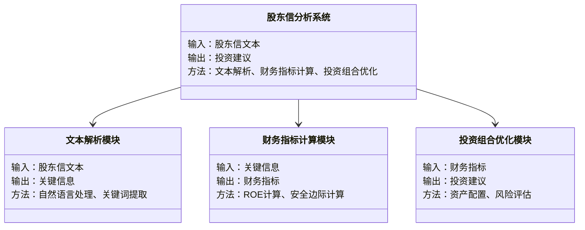
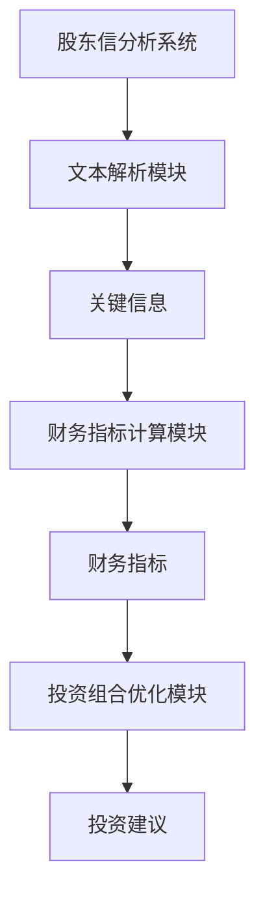
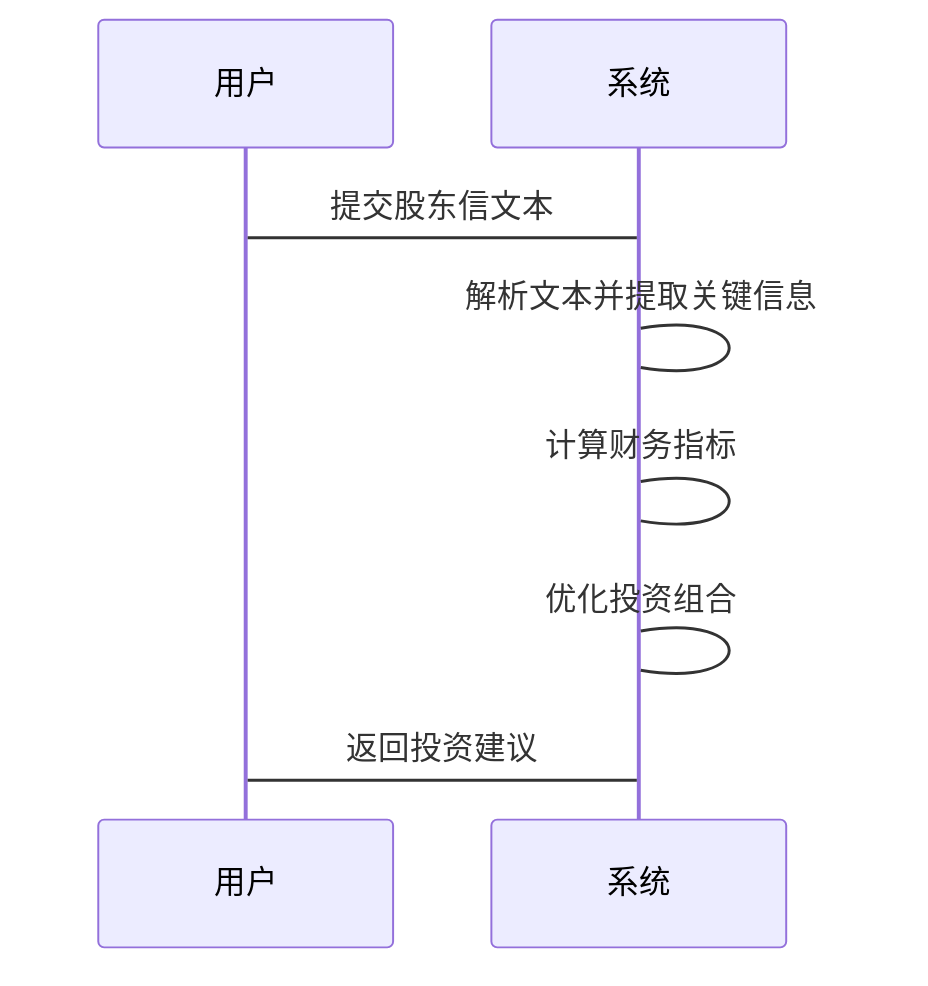

                 


# 沃伦巴菲特的股东信解读

> 关键词：巴菲特，股东信，价值投资，安全边际，财务分析，投资策略

> 摘要：本文将详细解读沃伦巴菲特的股东信，分析其核心投资理念、数学模型、系统架构及实战案例。通过技术化的分析方法，帮助读者深入理解巴菲特的投资哲学，并将其应用于实际投资中。

---

# 第1章: 沃伦巴菲特与股东信的背景介绍

## 1.1 沃伦巴菲特的生平与投资理念

### 1.1.1 巴菲特的早期经历
沃伦·巴菲特（Warren Buffett），1934年8月31日出生于美国内布拉斯州的奥马哈市。他从小就展现出对数字和投资的浓厚兴趣。12岁时，他开始研究股票市场，并在15岁时完成了人生中的第一笔股票交易。巴菲特的早期经历奠定了他未来成为投资大师的基础。

### 1.1.2 巴菲特的投资哲学
巴菲特的投资哲学以价值投资为核心。他主张以低于内在价值的价格买入优秀的公司，并长期持有。他认为市场的短期波动是噪音，而长期的价值才是关键。

### 1.1.3 巴菲特的价值投资理念
价值投资的核心在于寻找市场上的“烟屁股”——那些被市场忽视或低估的优秀企业。巴菲特强调，投资的目标是寻找那些具有持续竞争优势、良好管理层和稳定财务状况的企业。

## 1.2 股东信的历史与发展

### 1.2.1 股东信的起源
巴菲特每年都会发布致股东的信，这封信被称为“巴菲特的年度报告”。它不仅是对股东的交代，更是巴菲特投资理念的集中体现。

### 1.2.2 股东信的发展历程
自1950年代开始，巴菲特的股东信逐渐成为投资界的重要参考。随着时间的推移，这些信件不仅记录了巴菲特的投资决策，还揭示了他的思考过程和对市场的看法。

### 1.2.3 股东信的现状与影响
如今，巴菲特的股东信已成为全球投资者学习的宝贵资源。投资者通过分析这些信件，可以深入理解巴菲特的投资策略和管理哲学。

## 1.3 股东信的解读价值

### 1.3.1 股东信的独特视角
巴菲特的股东信提供了独特的视角，帮助投资者理解市场的本质和投资的真谛。这些信件不仅是投资指南，更是智慧的结晶。

### 1.3.2 股东信的实用价值
通过解读股东信，投资者可以学习到如何分析企业的财务状况、评估管理层的能力，并制定长期的投资策略。

### 1.3.3 股东信的长期意义
巴菲特的股东信不仅具有实用价值，还具有长期的教育意义。它们为投资者提供了宝贵的经验和教训，帮助他们在复杂的市场中做出明智的决策。

## 1.4 股东信解读的方法论

### 1.4.1 解读的基本原则
解读股东信需要遵循基本原则，包括全面性、系统性、实践性和批判性。这些原则帮助读者深入理解巴菲特的投资理念。

### 1.4.2 解读的步骤与流程
解读的步骤包括：阅读原文、分析关键点、联系实际、验证假设和总结提升。通过这些步骤，读者可以系统地分析股东信的内容。

### 1.4.3 解读的工具与资源
解读股东信需要借助工具和资源，包括财务分析工具、投资模型和相关书籍。这些工具和资源帮助读者更好地理解和应用巴菲特的投资理念。

## 1.5 本章小结
本章介绍了沃伦巴菲特的生平和投资理念，探讨了股东信的历史与发展，分析了股东信的解读价值和方法论。通过这些内容，读者可以初步理解巴菲特的投资哲学，并为后续的深入分析奠定基础。

---

# 第2章: 巴菲特投资理念的核心概念

## 2.1 价值投资的定义与特征

### 2.1.1 价值投资的定义
价值投资是一种以低于内在价值的价格买入优质股票的投资策略。巴菲特认为，市场波动为投资者提供了以合理价格买入优秀企业的机会。

### 2.1.2 价值投资的核心特征
价值投资的核心特征包括：寻找低估的股票、长期持有、关注企业的基本面和注重安全边际。

### 2.1.3 价值投资与其他投资理念的对比
与成长投资相比，价值投资更注重企业的当前价值，而成长投资更关注企业的未来增长潜力。与指数投资相比，价值投资更注重个股选择和风险控制。

## 2.2 安全边际的概念与作用

### 2.2.1 安全边际的定义
安全边际是指股票的市场价格与内在价值之间的差额。它反映了投资者在买入股票时的安全空间。

### 2.2.2 安全边际的计算公式
$$ \text{安全边际} = \text{内在价值} - \text{市场价格} $$

### 2.2.3 安全边际在投资中的作用
安全边际的作用包括：降低投资风险、提供缓冲空间和提高投资的稳定性。

## 2.3 股东信中的关键指标

### 2.3.1 净值收益率（ROE）
$$ \text{ROE} = \frac{\text{净利润}}{\text{股东权益}} $$
ROE是衡量企业盈利能力的重要指标，也是巴菲特选股的重要标准。

### 2.3.2 股东权益收益率（ROE）
$$ \text{ROE} = \frac{\text{净利润}}{\text{股东权益}} $$
ROE越高，说明企业的盈利能力越强。

### 2.3.3 资产负债率
$$ \text{资产负债率} = \frac{\text{总负债}}{\text{总资产}} $$
低负债率的企业具有更强的财务稳定性。

## 2.4 股东信中的公司治理与管理

### 2.4.1 公司治理的重要性
良好的公司治理是企业长期稳定发展的基础。巴菲特非常重视企业管理层的诚信和能力。

### 2.4.2 管理层的诚信与能力
管理层的诚信和能力直接影响企业的价值。巴菲特倾向于投资由优秀管理层领导的企业。

### 2.4.3 股东权益的保护
巴菲特主张保护股东权益，反对管理层滥用职权。他通过股东信向管理层传达了明确的期望。

## 2.5 本章小结
本章详细阐述了巴菲特投资理念的核心概念，包括价值投资、安全边际、关键财务指标和公司治理。这些概念为读者理解巴菲特的投资策略提供了理论基础。

---

# 第3章: 巴菲特投资理念的数学模型与公式

## 3.1 价值投资的数学模型

### 3.1.1 内在价值的计算公式
$$ \text{内在价值} = \frac{\text{未来现金流}}{\text{折现率}} $$
内在价值是企业未来现金流的现值，反映了企业的真正价值。

### 3.1.2 安全边际的计算公式
$$ \text{安全边际} = \text{内在价值} - \text{市场价格} $$
安全边际是投资者在买入股票时的缓冲空间，反映了市场的低估程度。

## 3.2 股东信中的财务指标分析

### 3.2.1 净值收益率（ROE）
$$ \text{ROE} = \frac{\text{净利润}}{\text{股东权益}} $$
ROE是衡量企业盈利能力的重要指标，也是巴菲特选股的重要标准。

### 3.2.2 股东权益收益率（ROE）
$$ \text{ROE} = \frac{\text{净利润}}{\text{股东权益}} $$
ROE越高，说明企业的盈利能力越强。

### 3.2.3 资产负债率
$$ \text{资产负债率} = \frac{\text{总负债}}{\text{总资产}} $$
低负债率的企业具有更强的财务稳定性。

## 3.3 投资组合优化的数学模型

### 3.3.1 投资组合优化的定义
投资组合优化是指通过合理配置资产，以实现最大收益和最低风险的目标。

### 3.3.2 投资组合优化的公式
$$ \text{投资组合收益} = \sum_{i=1}^{n} w_i r_i $$
其中，\( w_i \) 是第 \( i \) 项资产的权重，\( r_i \) 是第 \( i \) 项资产的收益率。

### 3.3.3 投资组合优化的步骤
1. 确定投资目标和风险偏好。
2. 收集相关资产的历史数据。
3. 计算各资产的收益率和风险。
4. 构建投资组合并优化。
5. 监测和调整投资组合。

## 3.4 本章小结
本章通过数学模型和公式，详细阐述了巴菲特投资理念的量化方法。这些模型和公式为读者提供了分析和评估企业价值的重要工具。

---

# 第4章: 巴菲特投资理念的系统架构设计方案

## 4.1 系统分析与架构设计

### 4.1.1 问题场景介绍
投资者需要通过分析股东信，提取关键信息并构建投资模型，以实现投资决策的优化。

### 4.1.2 系统功能设计

#### 领域模型类图


### 4.1.3 系统架构设计图


### 4.1.4 系统接口设计
系统接口包括：文本输入接口、数据处理接口和结果输出接口。这些接口通过API实现数据的交互。

### 4.1.5 系统交互设计

#### 序列图


## 4.2 本章小结
本章通过系统架构设计方案，展示了如何通过技术手段实现巴菲特投资理念的量化分析。这些设计为读者提供了构建投资分析系统的重要参考。

---

# 第5章: 巴菲特投资理念的项目实战

## 5.1 环境安装与配置

### 5.1.1 安装Python环境
使用Anaconda安装Python 3.8及以上版本。

### 5.1.2 安装必要的库
安装自然语言处理库（如NLTK）和数据处理库（如Pandas）。

## 5.2 核心系统实现

### 5.2.1 文本解析模块
```python
import nltk
from nltk.tokenize import sent_tokenize

def parse_text(text):
    sentences = sent_tokenize(text)
    return sentences
```

### 5.2.2 财务指标计算模块
```python
def calculate_roe(net_income, equity):
    return net_income / equity

def calculate_margin_of_safety(intrinsic_value, market_price):
    return intrinsic_value - market_price
```

### 5.2.3 投资组合优化模块
```python
import numpy as np
from scipy.optimize import minimize

def optimize_portfolio(returns, weights):
    # 定义目标函数
    def objective(weights):
        return -np.sum(weights * returns)
    # 定义约束条件
    constraints = [
        {'type': 'eq', 'fun': lambda w: np.sum(w) - 1},
        {'type': 'upper', 'fun': lambda w: w - 0}
    ]
    # 最优化
    result = minimize(objective, weights, constraints=constraints)
    return result.x
```

## 5.3 实战案例分析

### 5.3.1 案例背景
以巴菲特2020年的股东信为例，分析其投资策略和财务数据。

### 5.3.2 数据提取与处理
从股东信中提取关键信息，如ROE、资产负债率等。

### 5.3.3 投资组合优化
使用优化算法计算最优投资组合，并生成投资建议。

## 5.4 本章小结
本章通过项目实战，展示了如何将巴菲特的投资理念应用于实际投资中。通过技术手段，读者可以更好地理解和应用这些理念。

---

# 第6章: 巴菲特投资理念的最佳实践

## 6.1 小结

### 6.1.1 核心观点总结
巴菲特的投资理念以价值投资为核心，强调安全边际和长期持有的重要性。

### 6.1.2 方法论总结
通过系统化的分析和量化的方法，投资者可以更好地理解和应用巴菲特的投资理念。

## 6.2 投资注意事项

### 6.2.1 风险管理
投资者应注重风险管理，合理配置资产，避免过度集中。

### 6.2.2 持续学习
市场环境不断变化，投资者需要持续学习和更新知识。

### 6.2.3 独立思考
投资者应保持独立思考，避免盲目跟风。

## 6.3 拓展阅读

### 6.3.1 推荐书籍
- 《巴菲特的智慧》
- 《价值投资入门》
- 《投资的智慧》

### 6.3.2 推荐博客与网站
- 巴菲特股东会官方博客
- 投资者网
- 价值投资论坛

## 6.4 本章小结
本章总结了巴菲特投资理念的最佳实践，为读者提供了实用的建议和拓展阅读的方向。

---

# 结语

通过本文的详细解读，读者可以深入理解沃伦巴菲特的投资理念，并将其应用于实际投资中。无论是从理论分析还是技术实现的角度，巴菲特的投资理念都为我们提供了宝贵的指导。希望本文能帮助读者在投资道路上走得更远。

---

# 致谢

感谢读者的耐心阅读，感谢技术专家的智慧支持，感谢所有为本文提供灵感和帮助的人。

