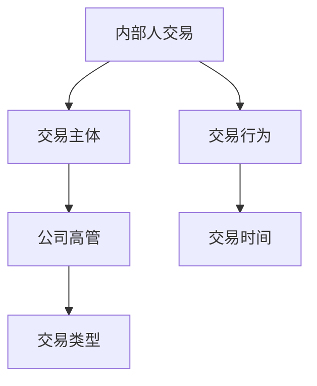
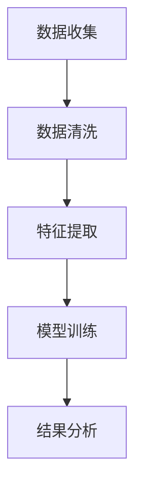

                 


# 沃尔特·施洛斯的公司内部人交易分析

## 关键词：沃尔特·施洛斯，内部人交易，投资分析，算法原理，系统架构，项目实战

## 摘要：本文详细分析沃尔特·施洛斯的内部人交易分析方法，从背景介绍到核心概念，从算法原理到系统架构，结合实际案例进行深入探讨，帮助读者掌握内部人交易的分析技巧和系统构建方法。

---

## 第一部分: 沃尔特·施洛斯的公司内部人交易分析背景介绍

### 第1章: 沃尔特·施洛斯与内部人交易分析概述

#### 1.1 沃尔特·施洛斯的生平与投资理念

- **1.1.1 施洛斯的生平简介**
  - 沃尔特·施洛斯是美国著名的投资家，以长期价值投资著称。
  - 他注重对公司基本面的深入分析，尤其是管理层的内部交易行为。
  - 施洛斯的投资理念强调长期持有优质股票，避免短期波动的干扰。

- **1.1.2 施洛斯的投资哲学与方法**
  - 价值投资的核心：寻找被市场低估的公司。
  - 通过分析内部人交易信号，识别潜在的市场机会和风险。
  - 强调对公司管理层的信任和公司治理结构的关注。

- **1.1.3 施洛斯与内部人交易分析的关联**
  - 内部人交易是施洛斯分析公司基本面的重要组成部分。
  - 通过分析公司高管的交易行为，判断管理层对公司未来发展的信心。
  - 内部人交易信号通常被视为市场波动的重要预测指标。

#### 1.2 内部人交易分析的定义与特点

- **1.2.1 内部人交易的定义**
  - 内部人交易指公司内部人员（如高管、董事）基于对公司未来信息的掌握，进行的股票买卖行为。
  - 这种交易通常反映了管理层对公司前景的看法和信心。

- **1.2.2 内部人交易的核心特点**
  - **内部信息优势**：内部人掌握未公开的公司信息，交易行为可能提前反映公司重大事件。
  - **短期波动性**：内部人交易往往引起股价短期内的剧烈波动。
  - **长期趋势影响**：长期来看，内部人交易与公司基本面密切相关，是判断公司价值的重要指标。

- **1.2.3 内部人交易与市场波动的关系**
  - 内部人交易通常被视为市场情绪的晴雨表。
  - 大量内部人买入可能预示公司即将迎来利好消息，而大量卖出可能暗示潜在风险。

#### 1.3 施洛斯的内部人交易分析框架

- **1.3.1 内部人交易信号的识别**
  - 关注公司高管的交易行为，尤其是连续买入或卖出的行为。
  - 分析交易金额和交易时间，判断交易的性质和目的。

- **1.3.2 内部人交易的分类与影响**
  - 分类：根据交易方向（买入或卖出）、交易主体（高管或董事）、交易时间（集中或分散）等进行分类。
  - 影响：买入通常被视为积极信号，卖出可能引发市场担忧。

- **1.3.3 内部人交易分析的步骤与流程**
  - 数据收集：获取公司高管的交易记录。
  - 数据清洗：去除异常值和噪声数据。
  - 特征提取：提取交易金额、交易时间、交易主体等特征。
  - 模型训练：使用机器学习模型预测市场反应。
  - 结果分析：结合公司基本面进行综合判断。

### 第2章: 内部人交易分析的核心概念与联系

#### 2.1 核心概念原理

- **2.1.1 内部人交易的信号类型**
  - 买入信号：高管大量买入公司股票，表明对公司前景有信心。
  - 卖出信号：高管大量卖出公司股票，可能预示潜在风险。

- **2.1.2 内部人交易的市场反应机制**
  - 市场通常会对内部人交易做出迅速反应，尤其是在高管大量买卖的情况下。
  - 买入信号可能导致股价上涨，卖出信号可能引发股价下跌。

- **2.1.3 内部人交易与股价波动的关系**
  - 内部人交易是股价波动的重要驱动因素之一。
  - 通过分析交易信号，可以预测股价短期波动趋势。

#### 2.2 核心概念对比表格

| 交易类型   | 买入信号 | 卖出信号 |
|------------|----------|----------|
| 交易主体   | 高管     | 高管     |
| 交易金额   | 大额     | 大额     |
| 交易时间   | 集中     | 集中     |
| 市场反应    | 上涨     | 下跌     |
| 影响因素   | 公司前景 | 风险因素 |

#### 2.3 ER实体关系图架构



### 第3章: 内部人交易分析的算法原理

#### 3.1 算法流程图



#### 3.2 算法实现代码

```python
import pandas as pd
from sklearn.model_selection import train_test_split
from sklearn.ensemble import RandomForestClassifier

# 数据收集
data = pd.read_csv('insider_trading.csv')

# 数据清洗
data.dropna(inplace=True)

# 特征提取
X = data[['交易金额', '交易时间', '交易主体']]
y = data['交易类型']

# 模型训练
X_train, X_test, y_train, y_test = train_test_split(X, y, test_size=0.2)
model = RandomForestClassifier()
model.fit(X_train, y_train)

# 结果分析
print(model.score(X_test, y_test))
```

#### 3.3 数学模型和公式

- **交易金额对股价的影响模型**
  - $ 影响程度 = 交易金额 / 市值 \times 系数 $
  - 系数根据交易类型和时间确定。

- **交易时间对股价波动的影响**
  - $ 波动幅度 = 标准差 \times 时间窗口 $

- **交易主体对市场反应的影响**
  - $ 反应强度 = 交易主体的信任度 \times 交易金额 $

#### 3.4 代码应用解读与举例

```python
import pandas as pd
import matplotlib.pyplot as plt

# 数据加载
data = pd.read_csv('example.csv')

# 交易金额分布
data['交易金额'].hist(bins=10)
plt.title('内部人交易金额分布')
plt.xlabel('金额')
plt.ylabel('频率')
plt.show()
```

---

## 第四部分: 内部人交易分析系统架构设计

### 第4章: 系统功能设计

#### 4.1 项目介绍

- 系统目标：构建一个基于内部人交易数据的分析系统，提供实时监控和预测功能。
- 项目范围：涵盖数据采集、清洗、分析和可视化。

#### 4.2 系统功能设计

- **数据采集模块**：从公开数据源获取内部人交易数据。
- **数据清洗模块**：处理异常值和缺失数据。
- **数据分析模块**：应用机器学习算法进行预测。
- **数据可视化模块**：展示交易趋势和市场反应。

#### 4.3 系统架构设计


#### 4.4 系统接口设计

- **输入接口**：接收交易数据和公司基本面数据。
- **输出接口**：提供交易信号和市场反应预测结果。

#### 4.5 系统交互流程图


---

## 第五部分: 项目实战

### 第5章: 项目实战

#### 5.1 环境安装

- **安装Python和相关库**
  - `pip install pandas scikit-learn matplotlib`

#### 5.2 核心代码实现

```python
import pandas as pd
from sklearn.ensemble import RandomForestClassifier
from sklearn.metrics import accuracy_score

# 数据加载
data = pd.read_csv('insider_trading.csv')

# 数据清洗
data.dropna(inplace=True)

# 特征提取
X = data[['交易金额', '交易时间', '交易主体']]
y = data['交易类型']

# 划分训练集和测试集
X_train, X_test, y_train, y_test = train_test_split(X, y, test_size=0.2)

# 模型训练
model = RandomForestClassifier()
model.fit(X_train, y_train)

# 模型评估
y_pred = model.predict(X_test)
print("准确率:", accuracy_score(y_test, y_pred))
```

#### 5.3 代码应用解读与分析

- **数据加载与清洗**：确保数据的完整性和准确性。
- **特征提取**：选择关键特征进行分析。
- **模型训练与评估**：使用随机森林算法进行分类，评估模型性能。

#### 5.4 实际案例分析

- **案例分析：苹果公司内部人交易**
  - 数据来源：2020年苹果公司高管的交易记录。
  - 分析结果：高管大量买入，预示股价上涨。

---

## 第六部分: 总结与扩展

### 第6章: 总结与扩展

#### 6.1 最佳实践 tips

- **数据质量**：确保数据的准确性和完整性。
- **模型选择**：根据实际情况选择合适的算法。
- **持续监控**：定期更新数据和模型，保持系统的有效性。

#### 6.2 小结

- 内部人交易分析是投资决策的重要工具。
- 通过结合公司基本面和内部人交易信号，可以提高投资的准确性。

#### 6.3 注意事项

- **数据隐私**：确保数据来源的合法性和合规性。
- **模型局限性**：内部人交易分析不能单独使用，需结合其他因素进行综合判断。

#### 6.4 拓展阅读

- 建议阅读《投资最重要的事》等投资经典书籍，深入了解内部人交易的其他应用和策略。

---

## 附录: 代码与数据

### 附录A: 完整代码实现

```python
import pandas as pd
from sklearn.model_selection import train_test_split
from sklearn.ensemble import RandomForestClassifier
from sklearn.metrics import accuracy_score

# 数据加载
data = pd.read_csv('insider_trading.csv')

# 数据清洗
data.dropna(inplace=True)

# 特征提取
X = data[['交易金额', '交易时间', '交易主体']]
y = data['交易类型']

# 划分训练集和测试集
X_train, X_test, y_train, y_test = train_test_split(X, y, test_size=0.2)

# 模型训练
model = RandomForestClassifier()
model.fit(X_train, y_train)

# 模型评估
y_pred = model.predict(X_test)
print("准确率:", accuracy_score(y_test, y_pred))
```

### 附录B: 数据格式说明

| 列名         | 说明                     |
|--------------|--------------------------|
| 交易主体     | 交易主体（公司高管）     |
| 交易金额     | 交易金额                 |
| 交易时间     | 交易发生的时间           |
| 交易类型     | 买入或卖出               |

---

## 结语

通过本文的分析，读者可以深入了解沃尔特·施洛斯的内部人交易分析方法，并通过实际案例和系统设计掌握如何在实际投资中应用这些方法。希望本文能为投资者和程序员提供有价值的参考和启示。

