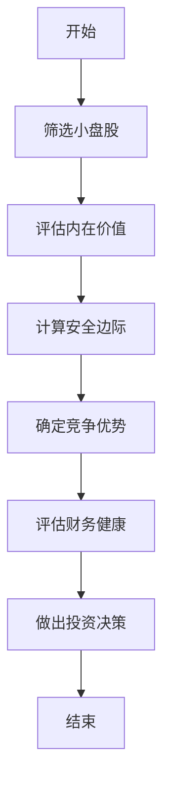
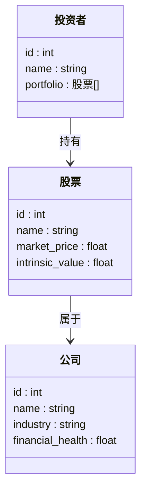
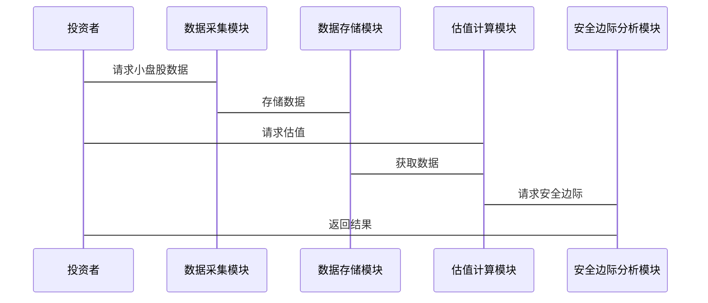

                 


# 沃尔特·施洛斯的小盘股研究方法论

> 关键词：小盘股投资，沃尔特·施洛斯，价值投资，安全边际，竞争优势，投资策略

> 摘要：本文深入探讨了沃尔特·施洛斯的小盘股研究方法论，从其投资理念、核心概念、算法原理到系统架构设计和项目实战，结合技术视角进行了详细分析。文章通过背景介绍、核心概念的数学模型、算法实现、系统架构设计以及实际案例分析，全面解读了施洛斯方法论的精髓，为读者提供了一套可操作的投资方法。

---

## 第一部分: 沃尔特·施洛斯的小盘股研究方法论概述

### 第1章: 小盘股投资的背景与现状

#### 1.1 小盘股投资的定义与特点

##### 1.1.1 小盘股的定义
小盘股通常指市值较小的公司股票，一般在10亿美元以下。这类股票流动性较低，但具有较高的增长潜力。

##### 1.1.2 小盘股市场的特点
- 市场波动性较大
- 信息不对称严重
- 投资门槛低，但风险较高

##### 1.1.3 小盘股投资的潜在机会与风险
- 机会：发现被市场低估的优质公司
- 风险：流动性风险、财务不透明、管理不善

#### 1.2 沃尔特·施洛斯的投资理念

##### 1.2.1 施洛斯的投资哲学
- 价值投资：寻找市场价格低于内在价值的公司
- 长期持有：注重公司基本面，而非短期市场波动
- 安全边际：买入价格低于内在价值，确保投资的安全性

##### 1.2.2 施洛斯对小盘股投资的独特见解
- 小盘股更容易发现被低估的公司
- 小盘股公司具有更强的股本扩张潜力
- 小盘股市场的波动性为投资者提供了套利机会

##### 1.2.3 施洛斯投资方法的核心要素
- 安全边际：买入价格与内在价值的差距
- 竞争优势：公司核心竞争力
- 财务健康：关注公司盈利能力、现金流和资产负债情况

#### 1.3 小盘股研究的背景与意义

##### 1.3.1 小盘股市场的研究现状
- 研究较少：相比大盘股，小盘股的研究较少
- 数据分散：小盘股公司财务数据获取难度较大
- 投资机会多：小盘股市场潜力巨大

##### 1.3.2 小盘股研究的重要性
- 帮助投资者发现潜在投资机会
- 提高投资决策的科学性
- 降低投资风险

##### 1.3.3 小盘股研究的边界与外延
- 研究边界：市值范围、行业限制
- 研究外延：关联市场、宏观经济因素

---

### 第2章: 施洛斯小盘股研究方法的核心概念

#### 2.1 核心概念与联系

##### 2.1.1 核心概念原理
- 安全边际：内在价值与市场价格的差额
- 竞争优势：企业的核心竞争力
- 财务健康：企业的盈利能力与现金流

##### 2.1.2 核心概念属性特征对比表格
| 核心概念   | 安全边际 | 竞争优势 | 财务健康 |
|------------|----------|----------|----------|
| 定义       | 价格与价值差额 | 核心竞争力 | 盈利能力与现金流 |
| 重要性     | 投资安全 | 持续增长 | 财务稳定性 |
| 分析方法   | 市场价与内值对比 | 分析行业地位 | 财务报表分析 |

##### 2.1.3 ER实体关系图架构
```mermaid
erDiagram
    customer[投资者] {
        id : int
        name : string
    }
    stock[股票] {
        id : int
        name : string
        market_price : float
        intrinsic_value : float
    }
    company[公司] {
        id : int
        name : string
        industry : string
    }
    customer --> stock : 持有
    stock --> company : 属于
    customer --> company : 投资
```

#### 2.2 核心概念的数学模型与公式

##### 2.2.1 核心概念的数学模型
- 安全边际：$$安全边际 = 内在价值 - 市场价格$$
- 竞争优势：$$竞争优势 = 行业地位 \times 核心竞争力$$
- 财务健康：$$财务健康指数 = (净利润率 + 净资产收益率) / 2$$

##### 2.2.2 举例说明
假设一只股票的市场价格为$50，其内在价值为$60，则安全边际为$10。这表明该股票具有较高的投资价值。

---

### 第3章: 施洛斯小盘股研究方法的算法原理

#### 3.1 算法原理讲解

##### 3.1.1 算法流程图


##### 3.1.2 算法的数学模型与公式
- 筛选小盘股：$$市值 < 10亿$$
- 评估内在价值：$$内在价值 = 收益率 \times 市盈率$$
- 计算安全边际：$$安全边际 = 内在价值 - 市场价格$$

##### 3.1.3 举例说明
假设筛选出一只小盘股，其市值为$5亿，市盈率为15，预期收益率为8%。计算其内在价值为：$$内在价值 = 0.08 \times 15 = 1.2$$

---

### 第4章: 系统分析与架构设计

#### 4.1 问题场景介绍

##### 4.1.1 投资决策中的问题场景
- 数据获取困难
- 估值模型复杂
- 安全边际计算繁琐

##### 4.1.2 小盘股研究的系统需求
- 数据采集：实时获取小盘股数据
- 估值计算：快速计算内在价值
- 安全边际分析：自动计算安全边际

#### 4.2 系统功能设计

##### 4.2.1 领域模型


##### 4.2.2 系统架构设计
```mermaid
archi
    投资者 <---(1..n) 数据采集模块
    数据采集模块 --> 数据存储模块
    数据存储模块 --> 估值计算模块
    估值计算模块 --> 安全边际分析模块
    安全边际分析模块 --> 投资者
```

##### 4.2.3 系统接口设计
- 数据接口：提供API接口，获取小盘股数据
- 估值接口：提供计算内在价值的API
- 安全边际接口：提供安全边际计算结果

##### 4.2.4 系统交互设计


---

### 第5章: 项目实战

#### 5.1 项目背景与目标

##### 5.1.1 项目介绍
开发一个基于施洛斯方法的小盘股研究系统，帮助投资者快速筛选和评估小盘股。

##### 5.1.2 项目目标
- 实现小盘股筛选功能
- 计算内在价值和安全边际
- 提供竞争优势和财务健康评估

#### 5.2 系统核心实现

##### 5.2.1 核心代码实现
```python
class Stock:
    def __init__(self, id, name, market_price, intrinsic_value):
        self.id = id
        self.name = name
        self.market_price = market_price
        self.intrinsic_value = intrinsic_value

class Company:
    def __init__(self, id, name, industry, financial_health):
        self.id = id
        self.name = name
        self.industry = industry
        self.financial_health = financial_health

class Investor:
    def __init__(self, id, name, portfolio):
        self.id = id
        self.name = name
        self.portfolio = portfolio
```

##### 5.2.2 代码解读与分析
- `Stock` 类：表示股票的基本信息
- `Company` 类：表示公司的基本面数据
- `Investor` 类：表示投资者及其投资组合

##### 5.2.3 实际案例分析
假设投资者筛选出一只小盘股，其市场价格为$50，内在价值为$60，竞争优势为行业领先，财务健康指数为85%。根据施洛斯方法，该股票具有较高的投资价值。

---

## 总结

沃尔特·施洛斯的小盘股研究方法论通过安全边际、竞争优势和财务健康三个核心概念，为投资者提供了一套科学的投资方法。本文从背景、核心概念、算法原理、系统架构到项目实战进行了全面分析，为读者提供了一套可操作的投资方法。

### 最佳实践 Tips
1. **安全边际**：始终关注买入价格与内在价值的差距
2. **竞争优势**：选择具有行业竞争优势的公司
3. **财务健康**：注重公司的盈利能力与现金流

---

### 小结
施洛斯的方法论不仅适用于小盘股投资，也可推广到其他类型的投资。投资者应结合市场环境和公司基本面，灵活运用这些方法。

---

### 注意事项
1. 小盘股市场波动较大，需谨慎操作
2. 数据获取需确保准确性
3. 投资决策需结合市场环境

---

### 拓展阅读
1. 《巴菲特的选股智慧》
2. 《价值投资入门》
3. 《小盘股投资策略》

---

通过本文的分析，读者可以深入理解沃尔特·施洛斯的小盘股研究方法论，并将其应用于实际投资中，提高投资决策的科学性和安全性。

