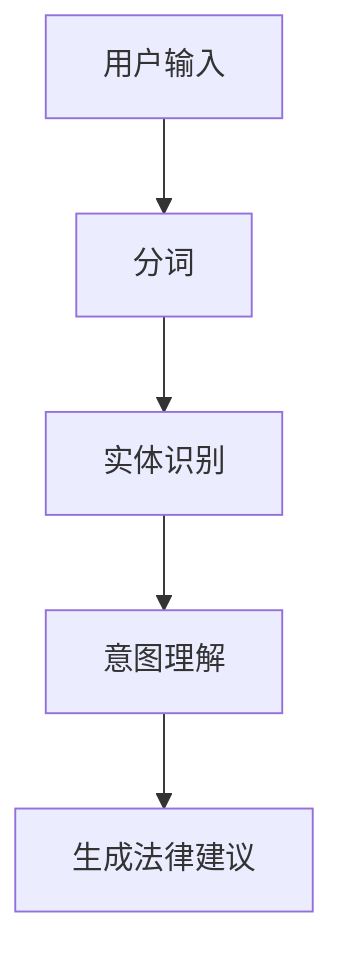
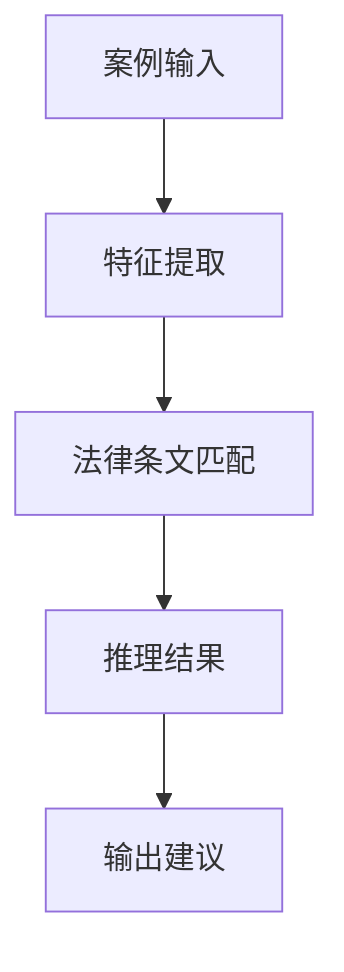
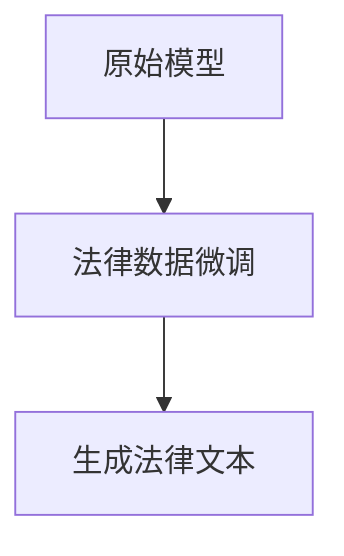
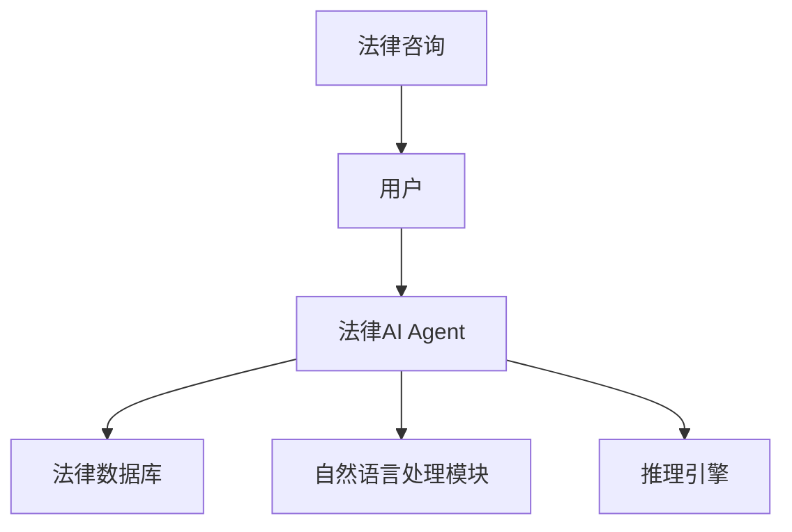
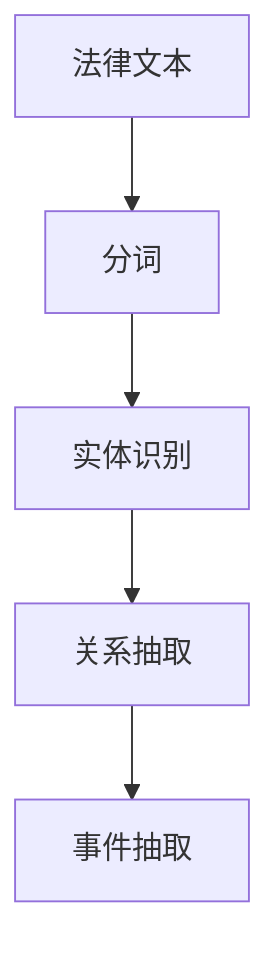
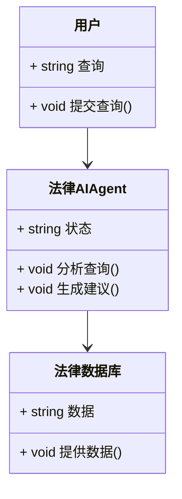
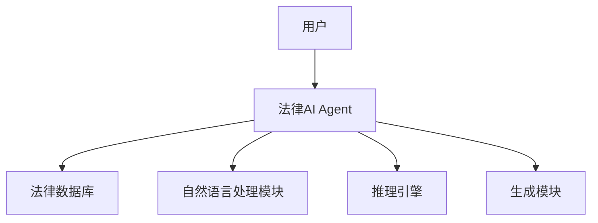
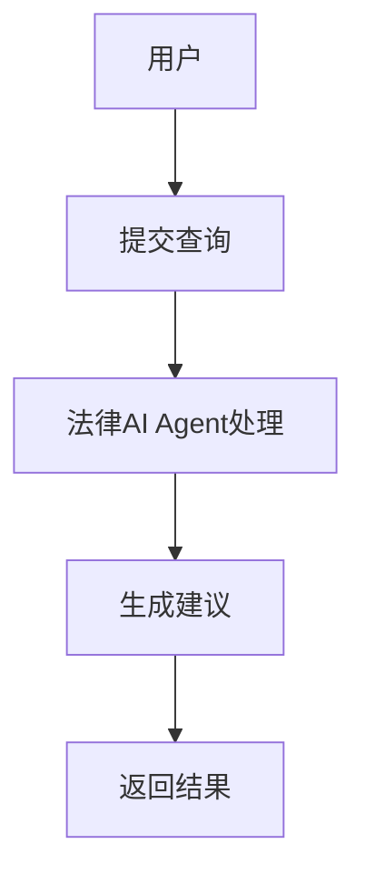

                 


# 法律AI Agent：法律咨询与案例分析助手

## 关键词：法律AI Agent, 法律咨询, 案例分析, 人工智能, 自然语言处理

## 摘要：法律AI Agent是一种结合了人工智能和法律专业知识的工具，旨在通过自然语言处理和机器学习技术，为用户提供高效的法律咨询和案例分析服务。本文将详细探讨法律AI Agent的核心概念、算法原理、系统设计以及实际应用，帮助读者全面了解这一前沿技术。

---

# 第一部分: 法律AI Agent的背景与核心概念

## 第2章: 法律AI Agent的核心概念与联系

### 2.1 核心概念原理

#### 2.1.1 自然语言处理（NLP）在法律AI Agent中的应用
自然语言处理（NLP）是法律AI Agent的核心技术之一。通过NLP，AI可以理解并解析用户的法律咨询问题，提取关键词和关键信息，从而生成准确的法律建议。例如，当用户输入“我需要起草一份商业合同”时，NLP模块会识别出用户的需求，并将其转化为系统可以处理的结构化数据。

**NLP流程图：**


#### 2.1.2 机器学习与法律推理
机器学习在法律AI Agent中的应用主要体现在法律推理和案例分析方面。通过训练大量的法律案例和判例数据，AI可以学习到法律条文之间的关系，从而帮助用户进行法律推理和预测。

**法律推理流程图：**


#### 2.1.3 大模型在法律AI Agent中的作用
大模型（如GPT系列）在法律AI Agent中的作用主要体现在生成高质量的法律文本，如合同、法律意见书等。通过微调大模型，可以使其适应法律领域的特定需求，生成更专业和准确的文本。

**大模型微调流程图：**


### 2.2 核心概念属性对比表格

| **属性**        | **传统法律咨询工具** | **法律AI Agent**           |
|------------------|----------------------|-----------------------------|
| **处理速度**      | 较慢                 | 极快                         |
| **准确性**        | 高度依赖律师经验     | 基于大量数据和模型训练      |
| **可扩展性**      | 有限                 | 极高                         |
| **成本**          | 较高                 | 较低（自动化减少人工成本）   |
| **响应方式**      | 人工                 | 自动化                       |

### 2.3 ER实体关系图架构



---

## 第3章: 法律AI Agent的核心算法原理

### 3.1 文本处理与信息抽取

#### 3.1.1 分词与实体识别
分词和实体识别是法律AI Agent处理法律文本的第一步。例如，将“商业合同纠纷”分词为“商业合同”和“纠纷”，并识别出实体“合同”和“纠纷”。

**示例代码：**
```python
import spacy

nlp = spacy.load("en_core_web_sm")
doc = nlp("商业合同纠纷")
for token in doc:
    print(token.text)
```

#### 3.1.2 信息抽取流程
信息抽取流程包括实体识别、关系抽取和事件抽取。例如，在法律文本中识别出“甲方”和“乙方”，并抽取出他们的合同关系。

**信息抽取流程图：**


#### 3.1.3 示例代码
```python
import spacy

nlp = spacy.load("en_core_web_sm")
doc = nlp("甲方和乙方签订了一份合同。")
for ent in doc.ents:
    print(f"实体：{ent.text}, 类型：{ent.label_}")
```

### 3.2 信息抽取与生成模型

#### 3.2.1 生成模型
生成模型（如GPT）用于生成法律文本，如合同、法律意见书等。以下是生成模型的简单实现：

**示例代码：**
```python
import torch
import torch.nn as nn

class SimpleGenerator(nn.Module):
    def __init__(self, input_size, hidden_size, output_size):
        super(SimpleGenerator, self).__init__()
        self.hidden_size = hidden_size
        self.embedding = nn.Embedding(input_size, hidden_size)
        self.rnn = nn.GRU(hidden_size, hidden_size)
        self.fc = nn.Linear(hidden_size, output_size)

    def forward(self, input, hidden):
        embedded = self.embedding(input)
        output, hidden = self.rnn(embedded, hidden)
        output = self.fc(output.view(-1, self.hidden_size))
        return output, hidden

model = SimpleGenerator(100, 50, 10)
```

### 3.3 生成模型的数学公式

**生成模型的损失函数：**
$$ \mathcal{L} = -\sum_{t=1}^{T} \log p(y_t | y_{<t}) $$

**生成模型的优化过程：**
$$ \theta \leftarrow \theta - \eta \frac{\partial \mathcal{L}}{\partial \theta} $$

---

## 第4章: 法律AI Agent的系统设计

### 4.1 系统功能设计

**领域模型类图：**


### 4.2 系统架构设计

**系统架构图：**


### 4.3 系统接口设计

**API接口：**
```json
{
    "input": "法律问题",
    "output": {
        "建议": "法律建议",
        "相关案例": ["案例1", "案例2"]
    }
}
```

### 4.4 系统交互流程

**交互流程图：**


---

## 第5章: 法律AI Agent的项目实战

### 5.1 环境配置

**安装依赖：**
```bash
pip install spacy transformers torch
python -m spacy download en_core_web_sm
```

### 5.2 核心实现

**法律咨询模块：**
```python
import spacy
from transformers import AutoModelForSeq2Seq, AutoTokenizer

nlp = spacy.load("en_core_web_sm")
tokenizer = AutoTokenizer.from_pretrained("facebook/bart-base")
model = AutoModelForSeq2Seq.from_pretrained("facebook/bart-base")

def legal_consultation(question):
    doc = nlp(question)
    for ent in doc.ents:
        print(f"实体：{ent.text}, 类型：{ent.label_}")
    inputs = tokenizer(question, return_tensors="pt")
    outputs = model.generate(inputs.input_ids)
    return tokenizer.decode(outputs[0], skip_special_tokens=True)

print(legal_consultation("我需要起草一份商业合同。"))
```

### 5.3 实际案例分析

**案例分析：**
用户输入“在劳动合同中，如何处理违约金条款？”，AI Agent会首先进行分词和实体识别，然后提取关键词“劳动合同”和“违约金条款”，并匹配相关法律条文，生成建议。

**生成结果：**
```
建议：根据劳动法规定，违约金条款应符合以下条件：
1. 违约金的数额不得超过实际损失。
2. 违约金条款应明确具体。
3. 双方应在合同中明确约定违约金的计算方式和支付方式。
```

---

## 第6章: 法律AI Agent的最佳实践与未来展望

### 6.1 最佳实践

**提示：**
- 数据质量：确保训练数据的多样性和代表性。
- 模型微调：针对特定法律领域进行模型微调，以提高准确性。
- 用户反馈：收集用户反馈，不断优化模型。

### 6.2 小结

法律AI Agent通过结合NLP、机器学习和大模型技术，为法律咨询和案例分析提供了高效、智能的解决方案。随着技术的不断发展，法律AI Agent将在未来发挥更大的作用。

### 6.3 注意事项

- 数据隐私：确保用户数据的安全和隐私。
- 法律合规：遵守相关法律法规，确保AI建议的合法性。
- 伦理问题：避免AI生成不公正或不道德的建议。

### 6.4 拓展阅读

- [《Deep Learning for NLP》](#)
- [《Machine Learning in Legal Domain》](#)

---

# 结语

法律AI Agent作为人工智能与法律结合的产物，正在改变传统法律咨询的方式。通过本文的详细讲解，读者可以深入了解其核心概念、算法原理和实际应用，为未来的法律AI Agent研究和开发提供参考。

