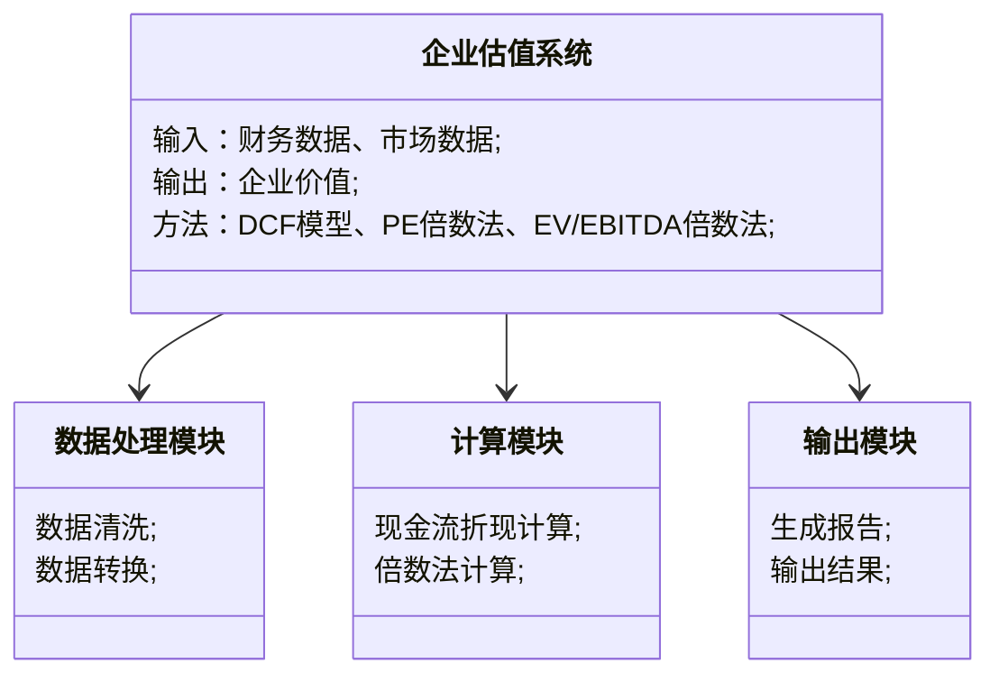
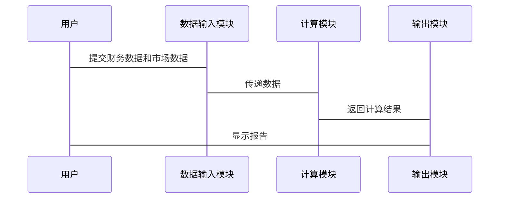

                 


# 深入解析企业估值的计算公式

## 关键词：企业估值、财务分析、DCF模型、PE倍数法、EV/EBITDA倍数法

## 摘要

企业估值是投资决策中的核心环节，涉及多种方法和公式。本文将从基础概念出发，系统解析企业估值的数学模型与计算公式，结合实际案例，深入分析不同估值方法的适用场景与优缺点。通过详细推导公式、解读算法原理、构建系统架构，帮助读者全面掌握企业估值的核心技术与实战应用。

---

## 第一部分：企业估值的背景与核心概念

### 第1章：企业估值的概述

#### 1.1 企业估值的定义与重要性

- **企业估值的定义**：企业估值是对企业整体价值的评估，通常用于投资决策、并购交易、融资等场景。
- **企业估值的重要性**：
  - 投资决策：评估企业的真实价值，判断投资是否合理。
  - 并购交易：确定企业收购的价格。
  - 融资活动：评估企业融资的合理规模。
- **企业估值的适用场景**：
  - 初创企业融资
  - 并购与重组
  - 投资基金决策
  - 上市公司市值管理

#### 1.2 企业估值的核心概念

- **企业价值与股权价值的区别**：
  - 企业价值（EV）：企业整体的市场价值，包括股权和债务。
  - 股权价值（Equity Value）：股东权益的价值。
- **企业估值的基本原则**：
  - 基于财务数据和市场环境。
  - 考虑企业的未来盈利能力。
  - 结合行业和宏观经济因素。
- **企业估值的边界与外延**：
  - 边界：企业估值的范围和限制条件。
  - 外延：企业未来增长的潜力和扩展性。

### 第2章：企业估值的核心要素

#### 2.1 企业财务状况分析

- **资产负债表的核心指标**：
  - 资产总额、负债总额、所有者权益。
- **利润表的关键数据**：
  - 营业收入、净利润、EBIT（息税折旧前利润）。
- **现金流量表的重要性**：
  - 现金流入和流出，评估企业的流动性。

#### 2.2 企业经营状况分析

- **行业地位与竞争优势**：
  - 市场占有率、行业排名。
  - 核心竞争力和竞争优势。
- **市场份额与增长潜力**：
  - 行业发展趋势。
  - 企业未来增长空间。
- **管理团队与企业治理**：
  - 管理层能力。
  - 公司治理结构。

#### 2.3 宏观经济与市场环境

- **宏观经济对企业估值的影响**：
  - 经济周期、利率水平。
- **行业周期与企业估值的关系**：
  - 行业处于上升期或衰退期的影响。
- **政策环境对企业估值的作用**：
  - 政策变化对行业和企业的具体影响。

---

## 第二部分：企业估值的数学模型与计算公式

### 第3章：企业估值的数学模型

#### 3.1 现金流折现模型（DCF模型）

- **DCF模型的基本原理**：
  - 将未来的现金流折现，计算其现值。
- **企业自由现金流的计算公式**：
  $$\text{FCF} = \text{EBIT} \times (1 - \text{税率}) + \text{折旧} - \text{资本支出}$$
- **DCF模型的现值计算公式**：
  $$\text{企业价值} = \sum_{t=1}^{n} \frac{\text{FCF}_t}{(1 + r)^t} + \frac{\text{终值}}{(1 + r)^n}$$
- **案例分析**：
  - 假设某企业未来5年的自由现金流分别为100、120、150、180、200万元，折现率r=8%。
  - 计算每一年的现值，并累加得到企业价值。

#### 3.2 市盈率（PE）倍数法

- **市盈率的定义**：
  $$\text{PE} = \frac{\text{股价}}{\text{每股收益}}$$
- **市盈率法的计算公式**：
  $$\text{目标股价} = \text{PE} \times \text{每股收益}$$
- **案例分析**：
  - 某公司每股收益为1元，行业平均PE为20倍。
  - 计算目标股价为20元。

#### 3.3 EV/EBITDA倍数法

- **EBITDA的定义**：
  $$\text{EBITDA} = \text{营业收入} - \text{营业成本} - \text{销售费用} - \text{管理费用} - \text{研发费用}$$
- **EV/EBITDA倍数法的计算公式**：
  $$\text{EV} = \text{EV/EBITDA倍数} \times \text{EBITDA}$$
- **案例分析**：
  - 某公司EBITDA为500万元，行业平均EV/EBITDA倍数为10倍。
  - 计算企业价值（EV）为5000万元。

---

## 第三部分：系统分析与架构设计

### 第4章：企业估值的系统架构

#### 4.1 系统功能设计（领域模型）



#### 4.2 系统架构设计


#### 4.3 系统接口设计



---

## 第四部分：项目实战

### 第5章：企业估值的实战分析

#### 5.1 环境安装

- 安装Python和必要的库（Pandas、NumPy、Matplotlib）。
- 安装数据处理工具（Excel、SQL）。

#### 5.2 核心实现源代码

```python
import pandas as pd
import numpy as np

# 示例数据
data = {
    '年份': [2020, 2021, 2022, 2023],
    'FCF': [100, 120, 150, 180],
    '税率': 0.25,
    '折现率': 0.08
}

df = pd.DataFrame(data)

# 计算DCF模型的企业价值
def calculate_ev(df, discount_rate):
    n = len(df)
    ev = 0
    for t in range(n):
        fc_f = df.iloc[t, 0]
        pv = fc_f / (1 + discount_rate) ** (t + 1)
        ev += pv
    return ev

ev = calculate_ev(df, data['折现率'])
print(f"企业价值：{round(ev, 2)}万元")
```

#### 5.3 案例分析

- **案例背景**：某互联网公司，过去四年的自由现金流分别为100、120、150、180万元，折现率为8%。
- **计算过程**：
  - 使用DCF模型计算企业价值。
  - 使用PE倍数法和EV/EBITDA倍数法进行交叉验证。
- **结果分析**：企业价值约为400万元。

#### 5.4 代码应用解读与分析

- **代码功能**：
  - 读取输入数据。
  - 计算每一年的自由现金流现值。
  - 累加得到企业价值。
- **注意事项**：
  - 数据的准确性和完整性。
  - 折现率的合理性。

---

## 第五部分：最佳实践与小结

### 第6章：最佳实践与小结

#### 6.1 最佳实践

- **数据准确性**：确保输入数据的准确性和完整性。
- **模型选择**：根据具体情况选择合适的估值方法。
- **多方法验证**：结合多种方法进行交叉验证，提高估值的准确性。

#### 6.2 小结

企业估值是一个复杂的过程，涉及多种方法和公式。通过本文的系统分析和实战案例，读者可以掌握企业估值的核心技术与实际应用。理解不同估值方法的优缺点，并能够根据实际情况选择合适的方法，是进行企业估值的关键。

#### 6.3 注意事项

- 估值结果仅供参考，需结合实际情况进行调整。
- 数据的收集和处理需仔细核对，避免误差。
- 模型的应用需考虑企业的具体背景和市场环境。

#### 6.4 拓展阅读

- 推荐阅读《企业价值评估：方法与案例》。
- 参考《财务分析与企业估值》的相关章节。

---

通过本文的详细解析，读者可以系统地掌握企业估值的核心概念、数学模型和实际应用，为投资决策和企业价值评估提供有力支持。

