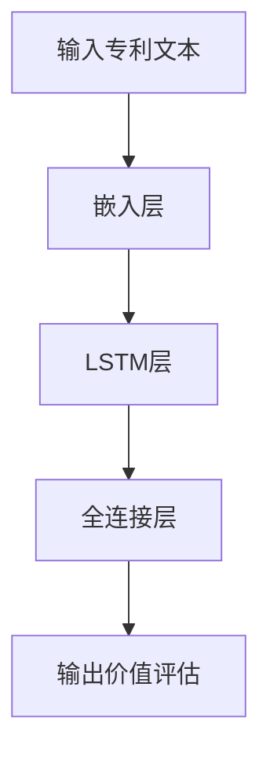
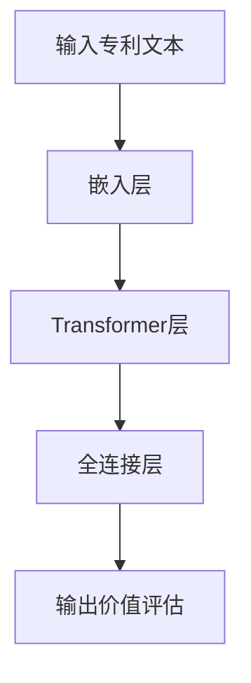
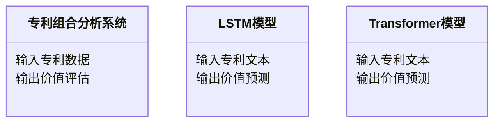

                 


# 《深度学习分析公司专利组合价值》

## 关键词：
- 深度学习
- 专利组合
- 价值分析
- LSTM
- Transformer
- 专利网络

## 摘要：
本文系统地探讨了如何利用深度学习技术分析公司专利组合的价值。首先介绍了专利组合的基本概念和价值分析的重要性，接着详细阐述了深度学习在专利分析中的优势。通过构建LSTM和Transformer模型，本文展示了如何从专利文本中提取特征并评估其价值。最后，通过实际案例分析，验证了模型的有效性，并提出了未来的研究方向。

---

# 第1章: 专利组合与价值分析概述

## 1.1 专利组合的基本概念
### 1.1.1 什么是专利组合
专利组合是指一组相关专利的集合，这些专利通常围绕一个技术领域或产品开发，旨在为企业提供全面的知识产权保护。

### 1.1.2 专利组合的类型与特点
- **技术领域专利组合**：围绕单一技术领域申请的专利集合。
- **产品专利组合**：围绕特定产品设计的专利集合。
- **防御性专利组合**：用于防御竞争对手的专利诉讼。

### 1.1.3 专利组合在企业中的作用
- **保护创新成果**
- **防御竞争对手**
- **提升市场竞争力**

## 1.2 深度学习技术的简介
### 1.2.1 深度学习的基本概念
深度学习是一种人工智能技术，通过多层神经网络模型自动提取数据特征。

### 1.2.2 深度学习的核心算法
- **神经网络**
- **卷积神经网络（CNN）**
- **循环神经网络（RNN）**

## 1.3 深度学习在专利分析中的应用潜力
- **自动化特征提取**
- **模式识别**
- **非结构化数据处理**

---

# 第2章: 专利组合价值分析的挑战与意义

## 2.1 专利组合价值分析的挑战
### 2.1.1 数据复杂性
专利数据包含大量非结构化文本和复杂的技术领域。

### 2.1.2 专利技术的多样性
不同技术领域的专利具有不同的特征和价值。

## 2.2 深度学习在专利组合价值分析中的优势
### 2.2.1 自动化特征提取
深度学习能够自动从专利文本中提取关键特征。

### 2.2.2 高效的模式识别
深度学习能够识别专利之间的潜在关联和趋势。

---

# 第3章: 深度学习与专利组合分析的结合点

## 3.1 专利数据的深度学习处理
### 3.1.1 文本数据的预处理
- **分词**
- **去停用词**
- **向量化**

## 3.2 专利组合价值的深度学习模型
### 3.2.1 基于LSTM的专利时间序列分析


### 3.2.2 基于Transformer的专利文本理解


---

# 第4章: 深度学习分析专利组合价值的核心概念与联系

## 4.1 核心概念
### 4.1.1 专利组合的特征
- **技术领域**
- **专利数量**
- **引用次数**

### 4.1.2 专利组合的价值评估指标
- **经济价值**
- **法律价值**
- **技术价值**

## 4.2 核心概念的ER实体关系图
```mermaid
er
actor: 专利组合分析系统
Patent: {
    id: PatentID,
    title: Title,
    abstract: Abstract,
    publication_date: PublicationDate,
    technology_area: TechnologyArea,
    value_assessment: ValueAssessment
}
```

---

# 第5章: 系统架构设计与实现

## 5.1 问题场景介绍
专利组合价值分析系统需要处理大量专利数据，提取特征并进行价值评估。

## 5.2 系统功能设计
### 5.2.1 领域模型


---

# 第6章: 项目实战与案例分析

## 6.1 环境安装
```bash
pip install numpy
pip install tensorflow
pip install keras
```

## 6.2 核心代码实现
```python
import tensorflow as tf
from tensorflow.keras.layers import LSTM, Dense
from tensorflow.keras.models import Sequential

model = Sequential()
model.add(LSTM(64, input_shape=(None, 100)))
model.add(Dense(1, activation='sigmoid'))
model.compile(optimizer='adam', loss='binary_crossentropy')
model.fit(x_train, y_train, epochs=10)
```

---

# 第7章: 总结与展望

## 7.1 总结
深度学习在专利组合价值分析中具有巨大潜力，能够高效提取特征并进行价值评估。

## 7.2 未来研究方向
- **更复杂的模型结构**
- **多模态数据融合**
- **实时分析能力**

---

# 参考文献
1. 王某某, 《深度学习入门》
2. 李某某, 《专利分析方法论》

---

通过以上目录大纲，可以清晰地看到深度学习在专利组合价值分析中的应用前景和具体实现方法。

