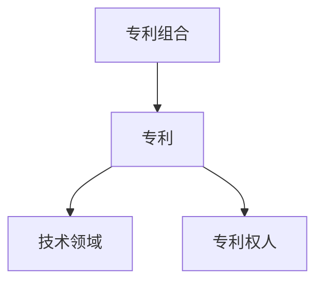
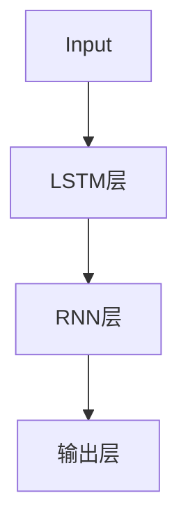

                 


# 深度学习分析公司专利组合价值

## 关键词：深度学习，专利组合，人工智能，技术分析，公司价值评估

## 摘要：本文探讨了利用深度学习技术分析公司专利组合价值的方法。通过背景介绍、核心概念、算法原理、系统设计、项目实战和总结，详细阐述了如何构建和应用深度学习模型来评估专利组合的技术价值，帮助企业优化知识产权管理，提升竞争力。

---

# 第一部分: 深度学习与专利组合分析基础

## 第1章: 背景与概述

### 1.1 问题背景
深度学习近年来在多个领域展现了强大的分析能力，特别是在处理复杂数据和模式识别方面。专利组合分析是企业评估技术实力和市场竞争力的重要手段。传统方法依赖人工分析，耗时且成本高昂，难以应对海量专利数据的挑战。

### 1.2 问题描述
专利组合价值的评估需要考虑技术相关性、法律状态、市场应用等多个维度。传统方法难以有效整合这些信息，而深度学习可以通过自然语言处理和模式识别，自动提取关键特征，优化分析流程。

### 1.3 问题解决
深度学习模型（如RNN和LSTM）能够处理序列数据，非常适合分析专利文本的时间依赖性和上下文信息。通过训练模型，可以自动分类专利、识别技术趋势，评估整体价值。

### 1.4 问题的边界与外延
专利组合分析的边界包括专利数据的范围和质量，模型的训练数据和应用场景。外延则涉及从单一技术分析扩展到跨领域应用，以及与其他数据分析技术的结合。

## 第2章: 核心概念与联系

### 2.1 核心概念定义
- **专利组合**：一组相关专利的集合，涵盖同一技术领域或互补技术。
- **深度学习模型**：通过多层神经网络自动学习数据特征的算法。

### 2.2 核心概念的关系
- 专利组合通过深度学习模型分析，提取技术特征和法律信息，评估市场价值。
- 深度学习模型依赖高质量的专利数据，优化参数以提高分析精度。

### 2.3 ER实体关系图


---

# 第二部分: 深度学习算法原理

## 第3章: 深度学习模型的选择

### 3.1 模型选择
- **RNN模型**：处理序列数据，适合专利文本的时间依赖性分析。
- **LSTM模型**：解决RNN的长序列记忆问题，适合长文本分析。

### 3.2 模型结构


### 3.3 数学公式
- **损失函数**：交叉熵损失函数用于分类任务。
  $$ \text{Loss} = -\sum y_i \log(p_i) + (1 - y_i)\log(1 - p_i) $$
- **优化器**：Adam优化器结合动量和自适应学习率，优化模型收敛。

---

# 第三部分: 系统分析与架构设计

## 第4章: 系统设计

### 4.1 功能模块
- 数据预处理：清洗和格式化专利数据。
- 模型训练：构建并训练深度学习模型。
- 结果分析：生成专利组合分析报告。

### 4.2 系统架构


### 4.3 接口设计
- **API接口**：提供RESTful API，接收请求并返回分析结果。
- **数据接口**：与专利数据库对接，获取结构化数据。

---

# 第四部分: 项目实战

## 第5章: 项目实现

### 5.1 环境搭建
- **Python 3.8+**：安装TensorFlow、Keras、NLTK等库。
  ```bash
  pip install tensorflow keras-preprocessing nltk
  ```

### 5.2 核心代码
```python
import tensorflow as tf
from tensorflow.keras import layers

model = tf.keras.Sequential([
    layers.LSTM(64, input_shape=(None, 500)),
    layers.Dense(1, activation='sigmoid')
])
model.compile(optimizer='adam', loss='binary_crossentropy', metrics=['accuracy'])
```

### 5.3 案例分析
以特定技术领域为例，训练模型并分析专利组合，评估其市场价值和法律风险。

---

# 第五部分: 总结与展望

## 第6章: 总结

### 6.1 小结
深度学习为专利组合分析提供了高效工具，通过自动化处理和模式识别，显著提升了分析效率和准确性。

### 6.2 注意事项
- 数据质量：确保专利数据的完整性和准确性。
- 模型调优：根据具体任务调整超参数和模型结构。

### 6.3 拓展阅读
建议阅读相关文献，深入理解模型优化和特征工程的方法。

---

通过以上结构，读者可以系统地了解深度学习在专利组合分析中的应用，从理论到实践，掌握核心技术和方法。

