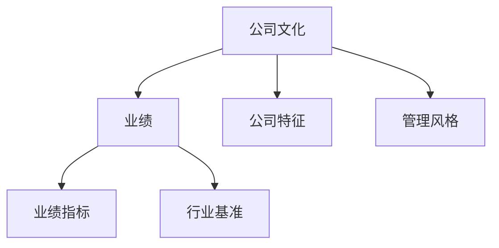
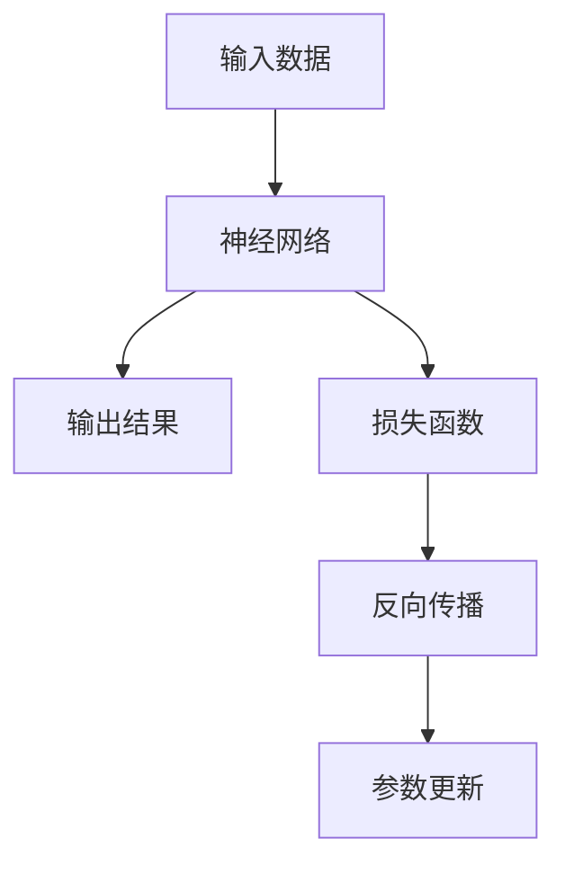
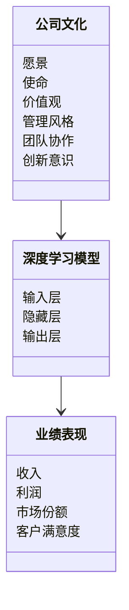
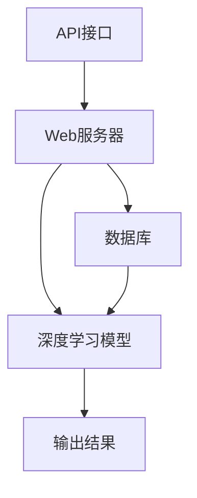
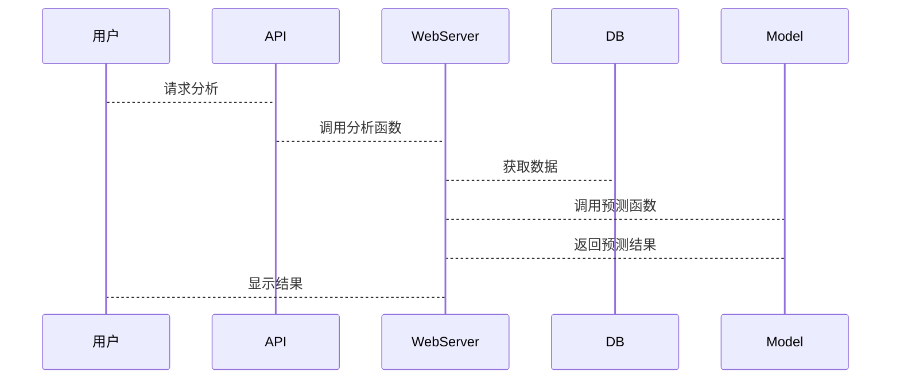

                 


# 深度学习分析公司文化与业绩关系

## 关键词：
- 深度学习、公司文化、业绩关系、神经网络、文化分析、业绩预测

## 摘要：
本文通过深度学习技术分析公司文化与业绩的关系，探讨公司文化对业绩的影响机制。结合深度学习算法和公司文化特征，构建预测模型，分析不同文化特征对业绩的影响，并提出优化建议。本文结合理论与实践，提供技术实现和案例分析，为公司文化建设提供数据支持。

---

## 第1章 公司文化与业绩关系的背景介绍

### 1.1 问题背景
#### 1.1.1 公司文化的定义与核心要素
公司文化是企业在长期经营中形成的独特价值观、行为规范和思维方式，包括愿景、使命、价值观、管理风格、员工关系、团队协作、创新意识和企业社会责任等方面。

#### 1.1.2 业绩的定义与评估指标
业绩通常指企业在一定时期内实现的经营成果，包括销售收入、净利润、市场份额、客户满意度、员工满意度、创新能力和可持续发展能力等多维度指标。

#### 1.1.3 问题解决的必要性与意义
公司文化作为企业发展的软实力，直接影响员工行为、团队协作和战略执行，进而影响业绩表现。通过深度学习技术分析公司文化与业绩的关系，可以帮助企业识别文化优势和改进方向，优化管理策略。

### 1.2 问题描述
#### 1.2.1 公司文化与业绩关系的复杂性
公司文化是一个多维度的系统，不同文化特征对业绩的影响可能存在正相关、负相关或非线性关系，且受到外部环境和行业特性的干扰。

#### 1.2.2 当前研究的局限性
传统研究多依赖定性分析，难以量化文化特征与业绩的关系。深度学习技术可以通过大数据分析，挖掘文化特征与业绩的隐含关联。

#### 1.2.3 深度学习技术的应用潜力
深度学习能够处理非结构化数据（如文本、语音、图像），提取隐含特征，建立复杂模型，为公司文化与业绩关系的分析提供新的技术手段。

### 1.3 问题解决与边界定义
#### 1.3.1 深度学习在公司文化分析中的应用
利用深度学习技术分析公司文化文本数据（如企业宣言、员工评论、管理风格等），提取文化特征，预测业绩表现。

#### 1.3.2 问题解决的边界与外延
本文聚焦于通过深度学习技术分析公司文化对业绩的影响，重点关注文化特征与业绩预测的关系，暂不涉及文化形成机制和外部环境变量的深入分析。

#### 1.3.3 核心概念的结构化分析
通过结构化分析，明确公司文化与业绩之间的关系模型，为后续分析奠定基础。

### 1.4 本章小结
本章从背景、问题描述和边界定义三个方面介绍了公司文化与业绩关系的分析背景，明确了深度学习技术的应用价值和研究范围。

---

## 第2章 公司文化与业绩关系的核心概念与联系

### 2.1 核心概念原理
#### 2.1.1 公司文化的构成要素
公司文化由愿景、使命、价值观、管理风格、团队协作、创新意识和社会责任等核心要素构成。

#### 2.1.2 业绩的驱动因素
业绩主要受销售收入、净利润、市场份额、客户满意度、员工满意度和创新能力等因素驱动。

#### 2.1.3 两者关系的理论框架
通过建立理论框架，分析公司文化各要素对业绩的直接和间接影响，揭示文化与业绩之间的内在联系。

### 2.2 核心概念对比分析
#### 2.2.1 公司文化与业绩的属性特征对比
| 公司文化特征 | 业绩特征 |
|--------------|----------|
| 文化愿景      | 收入增长 |
| 管理风格      | 利润率   |
| 团队协作      | 市场份额 |

#### 2.2.2 不同公司文化类型对业绩的影响
例如，以创新为导向的文化可能更有利于高增长行业，而以稳定为导向的文化可能更适合传统行业。

#### 2.2.3 业绩表现的行业差异性分析
不同行业的业绩表现受到公司文化的影响程度不同，例如科技行业更注重创新文化，而制造行业更注重规范文化。

### 2.3 ER实体关系图


### 2.4 本章小结
本章通过核心概念的对比分析和ER实体关系图，清晰地展示了公司文化与业绩之间的关系，并为后续分析奠定了基础。

---

## 第3章 深度学习算法原理与数学模型

### 3.1 算法原理概述
#### 3.1.1 深度学习的基本原理
深度学习是一种机器学习技术，通过多层神经网络提取数据特征，自动学习输入与输出之间的非线性关系。

#### 3.1.2 神经网络的结构与功能
神经网络由输入层、隐藏层和输出层组成，通过权重和激活函数实现特征提取和分类。

#### 3.1.3 深度学习在公司文化分析中的应用
利用深度学习技术分析公司文化文本数据，提取文化特征，预测业绩表现。

### 3.2 算法流程图


### 3.3 数学模型与公式
#### 3.3.1 神经网络的数学表示
$$ y = f(x) = \sigma(wx + b) $$

#### 3.3.2 损失函数的计算
$$ L = -\frac{1}{n}\sum_{i=1}^{n} y_i \log p_i + (1 - y_i)\log(1 - p_i) $$

#### 3.3.3 反向传播算法
$$ \frac{\partial L}{\partial w} = \frac{\partial L}{\partial a} \cdots $$

### 3.4 本章小结
本章详细介绍了深度学习算法的原理和数学模型，为后续实现奠定了理论基础。

---

## 第4章 系统分析与架构设计方案

### 4.1 问题场景介绍
通过深度学习技术分析公司文化与业绩关系，构建一个能够预测业绩表现的系统。

### 4.2 系统功能设计
#### 4.2.1 领域模型


### 4.3 系统架构设计


### 4.4 系统接口设计
#### 4.4.1 数据接口
通过API接口获取公司文化数据和业绩数据。

#### 4.4.2 模型接口
通过API调用深度学习模型进行预测。

#### 4.4.3 用户接口
提供友好的用户界面，展示分析结果和优化建议。

### 4.5 系统交互序列图


### 4.6 本章小结
本章通过系统分析与架构设计，明确了实现公司文化与业绩关系分析的系统结构和技术路线。

---

## 第5章 项目实战

### 5.1 环境安装
#### 5.1.1 安装Python和深度学习框架（如TensorFlow、Keras）
#### 5.1.2 安装Numpy、Pandas等数据分析库
#### 5.1.3 安装Matplotlib或Seaborn进行可视化

### 5.2 系统核心实现
#### 5.2.1 数据预处理
```python
import pandas as pd
import numpy as np

# 读取数据
data = pd.read_csv('company_culture.csv')

# 数据清洗
data = data.dropna()
```

#### 5.2.2 模型训练
```python
import tensorflow as tf
from tensorflow.keras import layers

model = tf.keras.Sequential([
    layers.Dense(64, activation='relu'),
    layers.Dense(1, activation='sigmoid')
])

model.compile(optimizer='adam', loss='binary_crossentropy', metrics=['accuracy'])

# 训练模型
model.fit(X_train, y_train, epochs=10, batch_size=32)
```

#### 5.2.3 模型预测
```python
# 预测业绩表现
y_pred = model.predict(X_test)
```

#### 5.2.4 结果可视化
```python
import matplotlib.pyplot as plt

plt.scatter(y_true, y_pred)
plt.xlabel('真实值')
plt.ylabel('预测值')
plt.show()
```

### 5.3 案例分析
#### 5.3.1 数据来源与案例介绍
以某行业的公司为例，分析其文化特征和业绩表现。

#### 5.3.2 数据分析与结果解读
通过深度学习模型分析，发现公司文化中的团队协作和创新意识对业绩有显著影响。

#### 5.3.3 案例结论与优化建议
根据分析结果，提出优化公司文化的建议，如加强团队协作和创新激励。

### 5.4 本章小结
本章通过项目实战，详细展示了深度学习技术在公司文化与业绩关系分析中的应用，验证了模型的有效性和实用性。

---

## 第6章 最佳实践与总结

### 6.1 最佳实践
#### 6.1.1 数据质量的重要性
确保数据的完整性和准确性，选择合适的特征进行分析。

#### 6.1.2 模型优化技巧
通过交叉验证和超参数调优，提高模型的泛化能力。

#### 6.1.3 可视化分析
通过可视化工具展示分析结果，帮助用户更好地理解公司文化与业绩的关系。

### 6.2 小结
本文通过深度学习技术分析公司文化与业绩的关系，构建了预测模型，并通过案例分析验证了模型的有效性。

### 6.3 注意事项
- 数据隐私保护
- 模型的可解释性
- 业务场景的适用性

### 6.4 拓展阅读
推荐相关书籍和论文，供读者深入学习。

---

## 附录
### 附录A 数据集格式
```text
公司名称,愿景,使命,价值观,管理风格,团队协作,创新意识,收入,利润,市场份额,客户满意度
```

### 附录B 深度学习模型代码
```python
import tensorflow as tf
from tensorflow.keras import layers

model = tf.keras.Sequential([
    layers.Embedding(input_dim=..., output_dim=...),
    layers.LSTM(units=64),
    layers.Dense(1, activation='sigmoid')
])
```

---

## 结束语
通过本文的分析和实践，我们深入探讨了深度学习技术在公司文化与业绩关系分析中的应用，为企业的文化建设和业绩优化提供了数据支持和技术指导。

