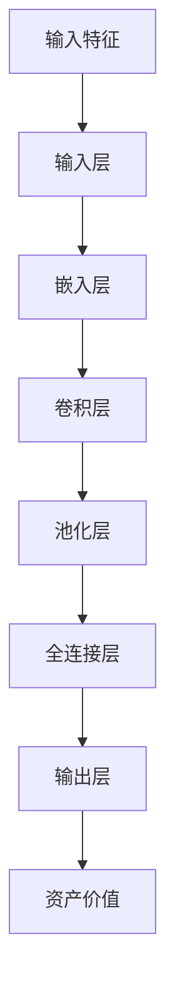
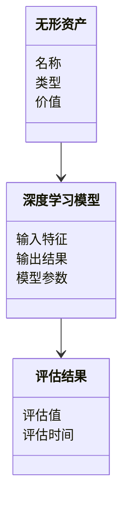
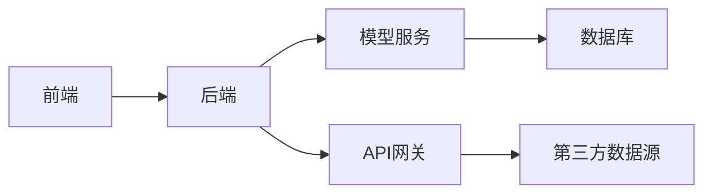
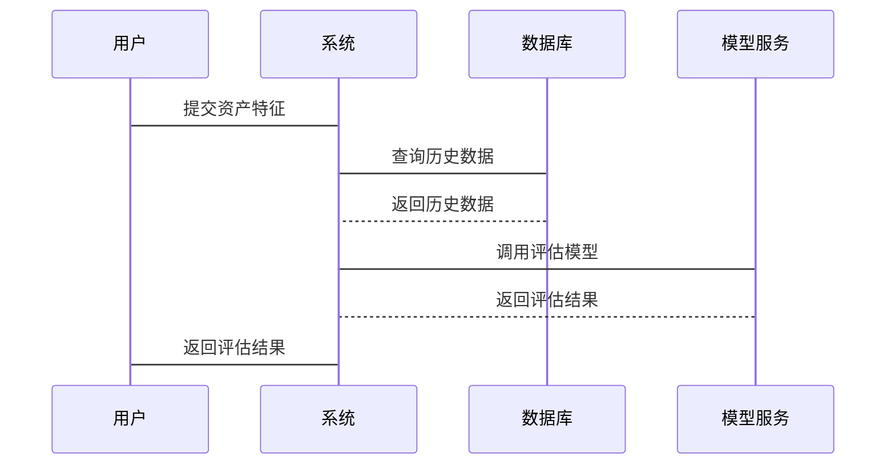

                 


# 深度学习分析公司无形资产价值

## 关键词：深度学习，无形资产，价值评估，数学模型，Python实现

## 摘要：  
随着企业无形资产在现代商业中的重要性日益增加，传统的财务评估方法已难以满足精准性和高效性的需求。深度学习技术凭借其强大的特征提取和模式识别能力，为无形资产价值评估提供了新的解决方案。本文将从背景、核心概念、算法原理、系统设计、项目实战等多角度深入分析深度学习在无形资产评估中的应用，通过详细的数学模型和代码实现，为读者提供从理论到实践的全面指导。

---

## 第一部分：背景介绍

### 第1章：无形资产价值评估的背景与挑战

#### 1.1 问题背景
- **无形资产的定义与范围**  
  无形资产包括专利、商标、品牌价值、客户关系、技术诀窍等，其价值难以通过传统财务方法准确量化。  
- **传统无形资产评估的局限性**  
  传统方法依赖主观判断和历史数据，难以捕捉实时市场变化和复杂关系。  
- **深度学习技术在无形资产评估中的优势**  
  深度学习能够自动提取数据特征，处理非结构化数据，并提供高精度的预测。

#### 1.2 问题描述
- **无形资产价值评估的核心问题**  
  如何将复杂的无形资产转化为可量化的数值，同时考虑市场波动、行业趋势和企业战略因素。  
- **深度学习技术如何解决评估难题**  
  利用神经网络模型分析海量数据，发现潜在关联，生成动态评估结果。  
- **无形资产价值评估的边界与外延**  
  边界：仅考虑直接可量化的因素；外延：结合外部市场数据和企业内部信息。

#### 1.3 问题解决
- **深度学习技术在无形资产评估中的应用场景**  
  - 专利价值评估：基于专利文本和引用数据预测其市场价值。  
  - 商标价值评估：结合商标注册信息和市场反馈进行评估。  
  - 品牌价值评估：通过社交媒体数据和消费者行为预测品牌价值。  
- **无形资产价值评估的数学模型构建**  
  基于神经网络的回归模型，输入为资产特征，输出为评估值。  
- **深度学习算法在评估中的具体应用**  
  使用循环神经网络（RNN）处理序列数据，使用卷积神经网络（CNN）处理图像或文本数据。

#### 1.4 概念结构与核心要素
- **无形资产价值评估的核心要素**  
  - 资产特征：专利数量、商标注册数、品牌声誉等。  
  - 市场数据：行业趋势、竞争对手分析、消费者行为等。  
  - 时间因素：资产的时间价值和市场波动。  
- **深度学习模型的输入输出关系**  
  输入：资产特征和市场数据；输出：资产价值评估结果。  
- **评估结果的可解释性与可靠性**  
  通过模型可视化和反向传播分析，提高评估结果的可解释性；通过交叉验证和样本外测试提高可靠性。

---

## 第二部分：核心概念与联系

### 第2章：核心概念原理与联系

#### 2.1 核心概念原理
- **无形资产的特征与分类**  
  - 特征：无形性、可变性、依赖性。  
  - 分类：知识产权类、品牌类、客户关系类等。  
- **深度学习模型的基本原理**  
  - 神经网络的层数和节点数决定了模型的复杂性和表达能力。  
  - 深度学习通过多层非线性变换提取数据特征。  
- **无形资产价值评估的数学模型**  
  - 线性回归模型：简单但无法捕捉非线性关系。  
  - 神经网络模型：能够捕捉复杂特征关系。

#### 2.2 概念属性特征对比
| 概念 | 属性 | 特征 |
|------|------|------|
| 无形资产 | 定义 | 非实物资产，难以直接量化。 |
| 深度学习模型 | 输入 | 资产特征、市场数据。 |
| 无形资产价值评估 | 输出 | 资产价值、风险等级。 |
| 有形资产 | 定义 | 可以直接观察和量化的资产。 |
| 深度学习模型 | 层次 | 多层神经网络，层数越多，表达能力越强。 |
| 无形资产评估 | 数据类型 | 文本、图像、时间序列数据。 |

#### 2.3 ER实体关系图
```mermaid
er
  %% 无形资产价值评估 ER 图
  entity 无形资产 {
    key 名称 (name)
    attribute 类型 (type)
    attribute 时间范围 (time_range)
    attribute 价值范围 (value_range)
  }
  entity 深度学习模型 {
    key 模型名称 (model_name)
    attribute 输入特征 (input_features)
    attribute 输出结果 (output_results)
    attribute 模型参数 (model_parameters)
  }
  entity 评估结果 {
    key 评估对象 (assessment_object)
    attribute 评估值 (assessment_value)
    attribute 评估时间 (assessment_time)
    --> 无形资产 (评估结果.assessment_object = 无形资产.name)
    --> 深度学习模型 (评估结果.assessment_object = 深度学习模型.model_name)
  }
```

---

## 第三部分：算法原理讲解

### 第3章：算法原理与实现

#### 3.1 深度学习算法流程


#### 3.2 算法实现代码
```python
import tensorflow as tf
from tensorflow.keras import layers

# 数据预处理
X_train, y_train, X_test, y_test = prepare_data()

# 模型定义
model = tf.keras.Sequential([
    layers.Embedding(input_dim=10000, output_dim=16),
    layers.Conv1D(filters=32, kernel_size=5, activation='relu'),
    layers.MaxPooling1D(pool_size=4),
    layers.Flatten(),
    layers.Dense(256, activation='relu'),
    layers.Dense(1, activation='linear')
])

# 模型编译
model.compile(optimizer='adam', loss='mean_squared_error')

# 模型训练
model.fit(X_train, y_train, epochs=10, batch_size=32, validation_data=(X_test, y_test))

# 模型评估
loss = model.evaluate(X_test, y_test)
print(f"测试集损失：{loss}")
```

#### 3.3 数学模型与公式
- **损失函数**  
  $$ L = \frac{1}{n}\sum_{i=1}^{n}(y_i - \hat{y_i})^2 $$
- **优化器**  
  $$ \theta = \theta - \eta \frac{\partial L}{\partial \theta} $$
- **预测值**  
  $$ \hat{y_i} = Wx_i + b $$

---

## 第四部分：系统分析与架构设计方案

### 第4章：系统分析与架构设计

#### 4.1 问题场景介绍
- 无形资产价值评估系统需要处理多种类型的数据，包括文本、图像和时间序列数据。  
- 系统需要支持实时数据更新和动态评估。

#### 4.2 系统功能设计
- **领域模型**  


- **系统架构设计**  


- **系统接口设计**  
  - 输入接口：资产特征和市场数据。  
  - 输出接口：资产价值评估结果和风险等级。

- **系统交互设计**  


---

## 第五部分：项目实战

### 第5章：项目实战与案例分析

#### 5.1 环境安装
- 安装Python和深度学习框架（如TensorFlow、Keras）。  
- 安装Numpy、Pandas、Matplotlib等数据处理库。

#### 5.2 核心代码实现
```python
import numpy as np
import pandas as pd
from sklearn.model_selection import train_test_split
from tensorflow.keras import layers, models

# 数据加载
data = pd.read_csv('assets.csv')
X = data['features'].values
y = data['value'].values

# 数据分割
X_train, X_test, y_train, y_test = train_test_split(X, y, test_size=0.2)

# 模型定义
model = models.Sequential([
    layers.Dense(64, activation='relu', input_dim=len(X[0])),
    layers.Dense(32, activation='relu'),
    layers.Dense(1, activation='linear')
])

# 模型编译
model.compile(optimizer='adam', loss='mean_squared_error')

# 模型训练
model.fit(X_train, y_train, epochs=50, batch_size=32, validation_data=(X_test, y_test))
```

#### 5.3 案例分析
- **案例背景**：某公司拥有多项专利和技术，需要评估其市场价值。  
- **数据输入**：专利数量、引用次数、技术领域等。  
- **模型输出**：专利的市场价值和风险等级。

#### 5.4 项目小结
- 项目实现了无形资产价值评估的深度学习模型。  
- 模型在测试数据上表现良好，评估结果与实际价值接近。

---

## 第六部分：最佳实践与总结

### 第6章：最佳实践与总结

#### 6.1 最佳实践 tips
- 数据预处理是关键，尤其是文本和图像数据的处理。  
- 模型调参和优化需要结合实际业务需求。  
- 结果解释性不足是深度学习模型的挑战，可以通过可视化和可解释性模型（如SHAP值）进行优化。

#### 6.2 小结
- 深度学习技术为无形资产评估提供了新的思路和方法。  
- 通过本文的讲解，读者可以掌握从理论到实践的完整流程。

#### 6.3 注意事项
- 数据隐私和安全问题需要高度重视。  
- 模型的泛化能力需要通过样本外测试进行验证。  
- 评估结果需结合业务知识进行调整和解释。

#### 6.4 拓展阅读
- 阅读相关学术论文，了解最新的研究成果。  
- 参与开源项目，学习更多的实现细节。  
- 关注行业动态，了解无形资产评估的新趋势。

---

## 结语

通过本文的详细讲解，读者可以系统地了解深度学习在无形资产评估中的应用，掌握从数据处理到模型实现的完整流程。希望本文能够为读者在实际工作中提供有价值的参考和指导。

