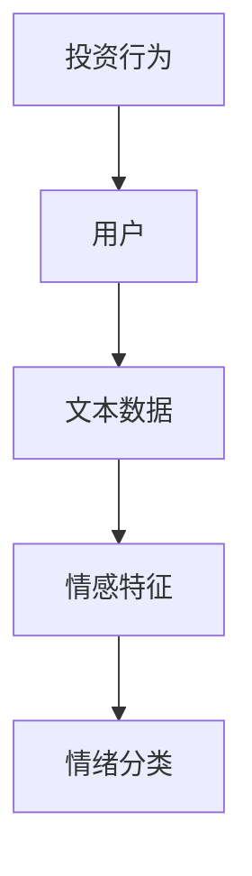
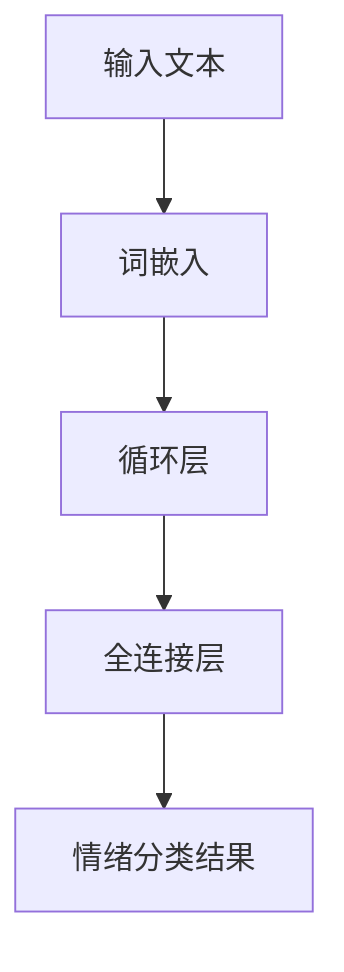

                 


# 深度学习分析社交媒体投资情绪

> 关键词：深度学习，社交媒体，投资情绪，自然语言处理，情感分析，TensorFlow

> 摘要：本文探讨了利用深度学习技术分析社交媒体上的投资情绪，从数据采集、预处理到模型构建，再到结果分析，系统性地阐述了如何通过深度学习提取和分析投资情绪，为投资者提供决策支持。

---

## 第一部分：背景与基础

### 第1章：社交媒体与投资情绪分析的背景

#### 1.1 社会媒体在投资中的作用

- **1.1.1 社会媒体数据的特点**
  - 社会媒体数据具有实时性、海量性、多样性、噪声多等特点。
  - 文本数据中包含大量情感信息，但存在歧义、拼写错误和 slang 问题。

- **1.1.2 投资情绪分析的定义与目标**
  - 投资情绪分析：从社交媒体文本中提取投资者的情绪倾向，判断市场情绪。
  - 目标：帮助投资者和机构预测市场走势，做出投资决策。

- **1.1.3 投资情绪分析的背景与意义**
  - 金融市场中，投资者情绪是影响价格波动的重要因素。
  - 通过分析社交媒体数据，可以捕捉市场情绪变化，提供投资参考。

#### 1.2 情绪分析的挑战与解决方案

- **1.2.1 数据噪声与复杂性**
  - 社交媒体数据中存在大量无关信息、情感矛盾和数据冗余。
  - 解决方案：数据清洗、特征提取和情感强度计算。

- **1.2.2 情绪分类的多维度特征**
  - 文本数据具有多模态特征，包括语言、语境和情感色彩。
  - 解决方案：结合文本、用户行为和社交网络特征。

- **1.2.3 深度学习的优势与适用性**
  - 深度学习能够自动提取非线性特征，适合处理复杂情感信息。
  - 在处理社交媒体数据时，深度学习模型表现出色。

#### 1.3 深度学习技术基础

- **1.3.1 深度学习的定义与核心概念**
  - 深度学习：一种基于人工神经网络的机器学习方法。
  - 核心概念：多层次特征提取、端到端学习、非线性表达。

- **1.3.2 深度学习在自然语言处理中的应用**
  - 基于 RNN 和 Transformer 的文本处理模型。
  - 情感分析中的词嵌入和注意力机制。

- **1.3.3 情绪分析的深度学习方法概述**
  - 使用 LSTM 或 Transformer 模型进行文本分类。
  - 结合情感词典和深度学习模型提升准确率。

---

## 第二部分：核心概念与联系

### 第2章：投资情绪分析的核心概念

#### 2.1 投资情绪分析的数据结构

- **2.1.1 文本数据的结构化处理**
  - 文本数据的清洗与分词。
  - 结构化数据：时间戳、用户信息、文本内容。

- **2.1.2 时间序列数据的整合**
  - 时间序列数据的重要性。
  - 时间特征的提取与应用。

- **2.1.3 用户行为数据的关联**
  - 用户行为数据的特征提取。
  - 行为特征与情感的关联性分析。

#### 2.2 情绪特征提取方法

- **2.2.1 词袋模型与词嵌入**
  - 词袋模型的基本原理。
  - 词嵌入（如 Word2Vec）的实现与应用。

- **2.2.2 语法与语义特征**
  - 语法特征的提取与分析。
  - 语义理解的挑战与解决方案。

- **2.2.3 上下文与情感强度**
  - 上下文特征的提取方法。
  - 情感强度计算的模型设计。

#### 2.3 情绪分类方法对比

- **2.3.1 基于规则的传统方法**
  - 规则的制定与实施。
  - 优点与局限性。

- **2.3.2 传统机器学习方法**
  - 常用算法（如 SVM、随机森林）的性能对比。
  - 特征工程的重要性。

- **2.3.3 深度学习方法的优劣分析**
  - 深度学习模型的高准确率与高计算成本。
  - 模型的可解释性问题。

#### 2.4 投资情绪分析的ER实体关系图



---

## 第三部分：算法原理与实现

### 第3章：深度学习模型原理

#### 3.1 模型流程图



#### 3.2 情感分析模型的数学公式

- **词嵌入表示**：将单词映射为向量。
  $$ W_{embedding} \in \mathbb{R}^{d \times V} $$
  其中，$d$ 是嵌入维度，$V$ 是词表大小。

- **LSTM 单元**：处理序列数据。
  $$ f(t) = \tanh(W_f \cdot [h_{t-1}, x_t] + b_f) $$
  $$ i(t) = \sigma(W_i \cdot [h_{t-1}, x_t] + b_i) $$
  $$ o(t) = \sigma(W_o \cdot [h_{t-1}, x_t] + b_o) $$
  $$ c(t) = f(t) \cdot c(t-1) + i(t) \cdot x_t $$
  $$ h(t) = o(t) \cdot c(t) $$

- **输出层**：分类器。
  $$ y = \text{softmax}(W_{output} \cdot h + b_{output}) $$

#### 3.3 模型实现代码

```python
import tensorflow as tf
from tensorflow.keras import layers

model = tf.keras.Sequential()
model.add(layers.Embedding(input_dim=vocabulary_size, output_dim=embedding_dim))
model.add(layers.LSTM(units=lstm_units, return_sequences=False))
model.add(layers.Dense(units=num_classes, activation='softmax'))

model.compile(optimizer='adam', loss='sparse_categorical_crossentropy', metrics=['accuracy'])
```

---

## 第四部分：系统分析与架构设计

### 第4章：系统架构设计方案

#### 4.1 系统功能设计

- 数据采集模块：从社交媒体获取文本数据。
- 数据预处理模块：清洗、分词、标注。
- 模型训练模块：构建、训练深度学习模型。
- 结果展示模块：可视化情绪分布与预测结果。

#### 4.2 系统架构图


---

## 第五部分：项目实战

### 第5章：项目实战

#### 5.1 环境配置

```bash
pip install tensorflow numpy pandas scikit-learn
```

#### 5.2 核心代码实现

```python
import pandas as pd
from sklearn.model_selection import train_test_split
from tensorflow.keras.preprocessing.text import Tokenizer
from tensorflow.keras.preprocessing.sequence import pad_sequences

# 数据加载与预处理
data = pd.read_csv('social_media_data.csv')
text = data['text'].values
labels = data['label'].values

# 分词与填充
tokenizer = Tokenizer(num_words=10000)
tokenizer.fit_on_texts(text)
sequences = tokenizer.texts_to_sequences(text)
padded_sequences = pad_sequences(sequences, maxlen=500)

# 划分训练集与测试集
X_train, X_test, y_train, y_test = train_test_split(padded_sequences, labels, test_size=0.2)

# 模型构建与训练
model = tf.keras.Sequential([
    layers.Embedding(10000, 16, input_length=500),
    layers.LSTM(64, return_sequences=False),
    layers.Dense(1, activation='sigmoid')
])

model.compile(loss='binary_crossentropy', optimizer='adam', metrics=['accuracy'])
model.fit(X_train, y_train, epochs=10, validation_data=(X_test, y_test))
```

---

## 第六部分：总结与展望

### 第6章：总结与展望

#### 6.1 项目小结

- 本文系统性地探讨了利用深度学习分析社交媒体投资情绪的方法。
- 通过数据预处理、模型构建与训练，展示了如何提取和分析投资情绪。

#### 6.2 最佳实践 tips

- 数据清洗和特征工程是关键。
- 模型调参和优化能显著提升性能。
- 结合实际业务需求选择合适的模型。

#### 6.3 未来展望

- 结合图像识别和语音识别，进行多模态分析。
- 引入强化学习，优化投资策略。
- 提升模型的实时性和可解释性。

---

**注：** 本文详细阐述了从数据处理到模型实现的完整流程，代码和图表部分可根据实际需求进行调整。

