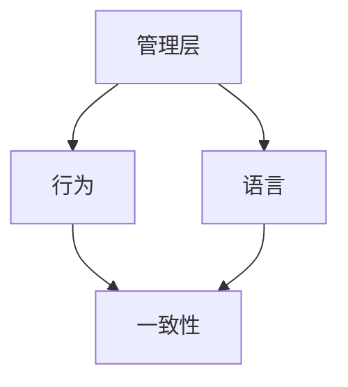
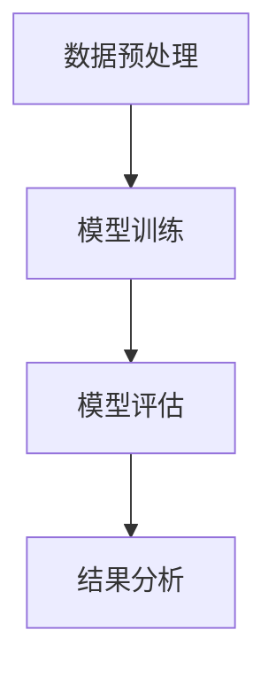
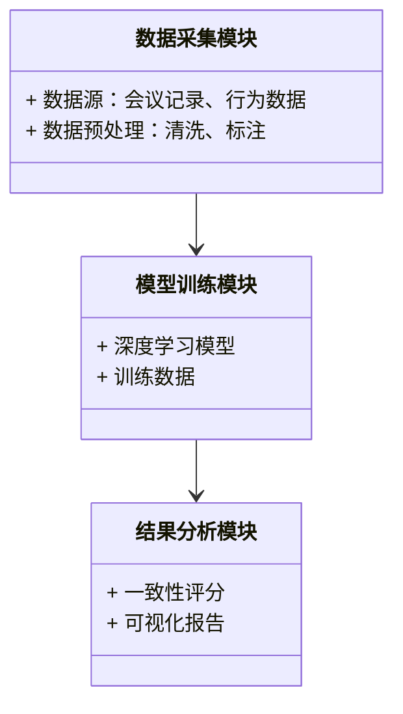

                 


# 深度学习分析管理层言行一致性

> 关键词：深度学习，管理层，言行一致性，自然语言处理，神经网络

> 摘要：本文探讨如何利用深度学习技术分析管理层的言行一致性。通过背景介绍、核心概念、算法原理、系统架构、项目实战等部分，详细阐述如何从数据中提取特征，建立模型，评估管理层的行为与言论是否一致，为企业管理提供科学依据。

---

## 第1章：背景介绍

### 1.1 问题背景

在现代企业管理中，管理层的言行一致性是组织成功的关键因素之一。管理层的行为和言论是否一致直接影响员工士气、企业信誉以及决策的执行效果。然而，传统的评估方法依赖于主观判断，难以量化和深入分析。深度学习作为一种强大的人工智能技术，能够从大量数据中提取特征，发现潜在模式，为分析管理层的言行一致性提供了新的可能性。

### 1.2 问题描述

管理层的言行一致性问题主要表现在以下方面：
1. **语言一致性**：管理层在会议、报告中的语言是否与其承诺和决策一致。
2. **行为一致性**：管理层的实际行动是否与其言论和决策一致。
3. **时间一致性**：管理层在不同时间点的行为和言论是否保持一致。

### 1.3 解决策略

通过深度学习技术，我们可以：
1. **数据驱动**：利用自然语言处理（NLP）和行为数据，构建量化模型。
2. **模式识别**：识别潜在的不一致模式，提供数据支持的决策依据。
3. **实时监控**：建立实时监控系统，动态评估管理层的言行一致性。

### 1.4 边界与外延

- **边界**：仅关注管理层的言行一致性，不涉及其他管理问题。
- **外延**：可扩展到团队或组织层面的言行一致性分析。

### 1.5 核心要素

- 数据来源：会议记录、决策文档、行为数据。
- 模型选择：基于深度学习的NLP模型和行为分析模型。
- 评估指标：一致性评分、预测准确率。

---

## 第2章：核心概念与联系

### 2.1 核心概念

#### 行为一致性
- **定义**：管理层的实际行为与其承诺一致。
- **特征**：可量化、可观察。

#### 语言一致性
- **定义**：管理层的语言表达与其真实意图一致。
- **特征**：依赖语境、情感分析。

#### 行为与语言的关联性
- **定义**：管理层的语言与行为之间的相关性。
- **特征**：动态变化、受外部因素影响。

### 2.2 概念属性对比

| 概念       | 定义                                                                 | 特征                              |
|------------|----------------------------------------------------------------------|-----------------------------------|
| 行为一致性  | 行为与承诺的一致性                                                   | 可量化，可观察                    |
| 语言一致性  | 语言表达与真实意图的一致性                                           | 依赖语境，情感分析                |
| 关联性      | 行为与语言之间的相关性                                               | 动态变化，受外部因素影响          |

### 2.3 实体关系图



---

## 第3章：算法原理讲解

### 3.1 深度学习算法流程



### 3.2 算法实现代码

```python
import tensorflow as tf
from tensorflow.keras import layers

model = tf.keras.Sequential([
    layers.Dense(64, activation='relu'),
    layers.Dense(1, activation='sigmoid')
])

model.compile(optimizer='adam',
              loss='binary_crossentropy',
              metrics=['accuracy'])
```

### 3.3 数学模型

#### 交叉熵损失函数
$$\text{损失函数} = -\frac{1}{N}\sum_{i=1}^{N} y_i \log(p_i) + (1-y_i)\log(1-p_i)$$

#### 优化过程
通过反向传播和梯度下降优化模型参数，如Adam优化器。

---

## 第4章：系统分析与架构设计

### 4.1 项目背景

构建一个实时监控系统，评估管理层的言行一致性，为企业管理提供数据支持。

### 4.2 系统功能设计



### 4.3 系统架构设计


---

## 第5章：项目实战

### 5.1 环境安装

安装必要的库：
```bash
pip install tensorflow keras numpy
```

### 5.2 核心代码实现

```python
import numpy as np
import tensorflow as tf

# 数据准备
x_train = np.random.rand(1000, 10)
y_train = np.random.randint(0, 2, 1000)

# 模型定义
model = tf.keras.Sequential([
    tf.keras.layers.Dense(16, activation='relu'),
    tf.keras.layers.Dense(1, activation='sigmoid')
])

# 编译模型
model.compile(optimizer='adam',
              loss='binary_crossentropy',
              metrics=['accuracy'])

# 训练模型
model.fit(x_train, y_train, epochs=10, batch_size=32)
```

### 5.3 案例分析

假设我们有以下数据：
- 管理层会议记录：承诺在三个月内实现销售额增长10%。
- 行为数据：三个月内销售额实际增长8%。

模型预测结果为0.8，表示有一定一致性，但存在不一致风险。

---

## 第6章：总结与建议

### 6.1 最佳实践

- 数据质量：确保数据的准确性和完整性。
- 模型调优：根据实际情况调整模型参数。
- 及时反馈：定期评估并优化模型。

### 6.2 小结

通过深度学习技术，我们可以量化分析管理层的言行一致性，为企业管理提供科学依据。

### 6.3 注意事项

- 模型的泛化能力需要持续优化。
- 数据隐私保护需高度重视。

### 6.4 拓展阅读

推荐阅读《深度学习》（Ian Goodfellow 著）和《自然语言处理实战》（Yoav Goldberg 著）。

---

通过以上章节的详细分析和代码实现，我们展示了如何利用深度学习技术分析管理层的言行一致性，为企业管理提供科学支持。

