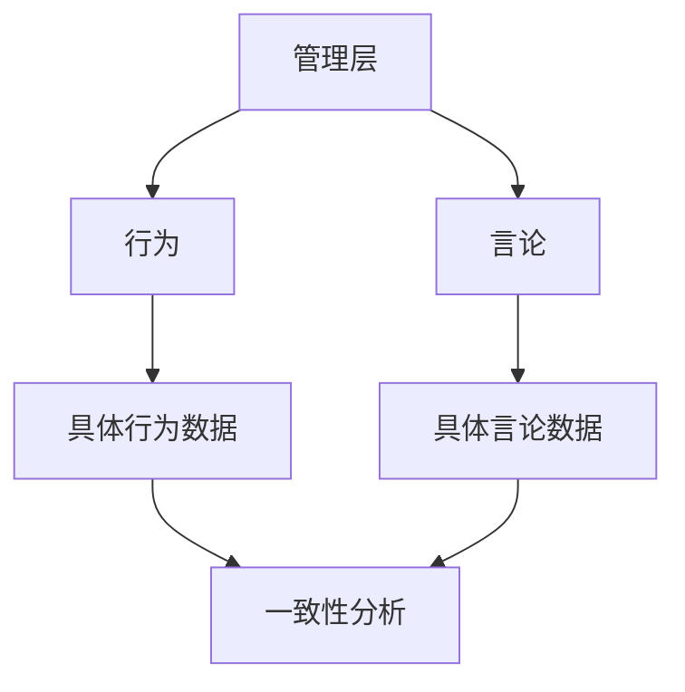
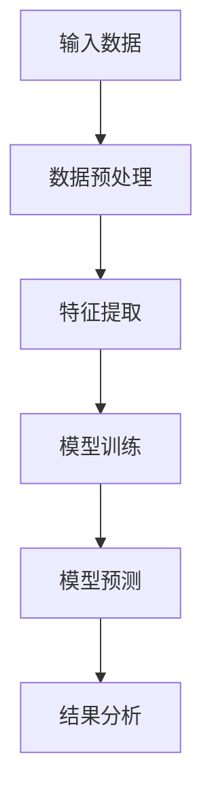
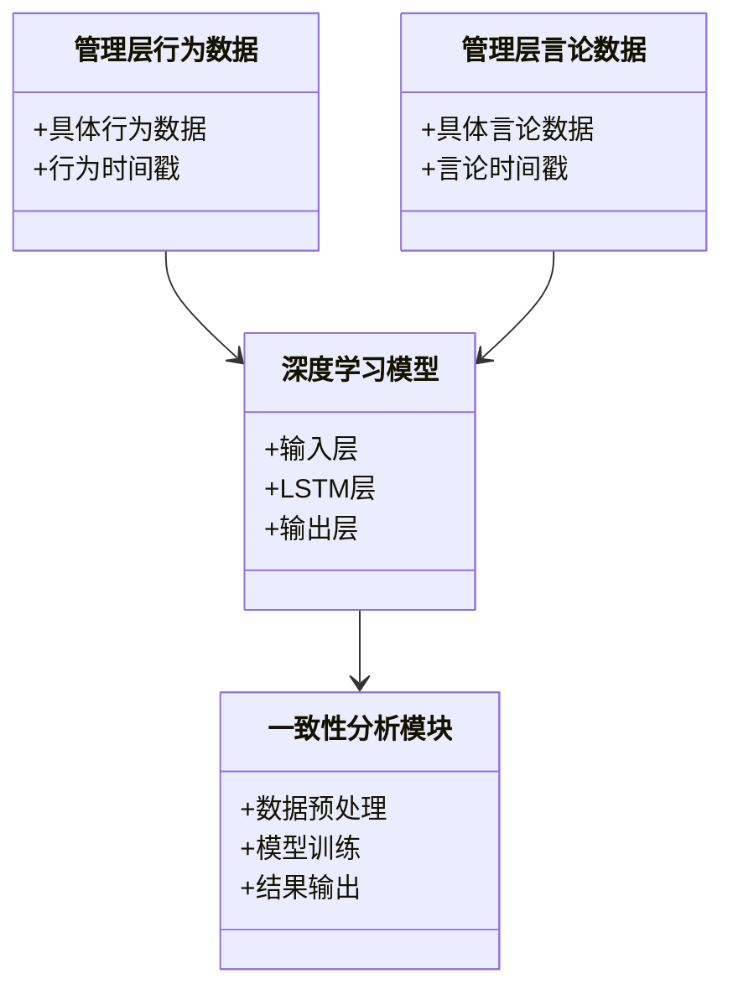
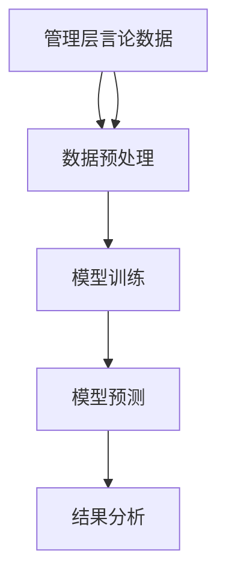
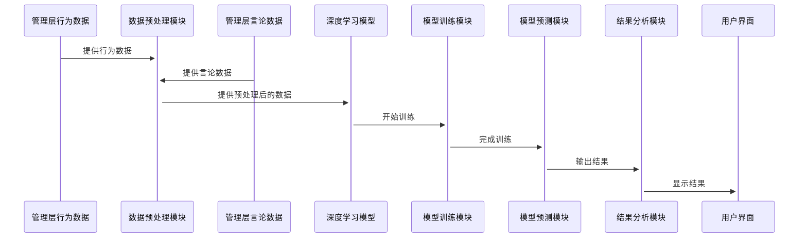

                 


# 深度学习分析管理层言行一致性

> **关键词**：深度学习，自然语言处理，行为分析，管理决策，一致性分析，文本挖掘

> **摘要**：本文深入探讨了如何利用深度学习技术分析管理层的言行一致性。通过结合自然语言处理和行为分析，构建了一个基于深度学习的模型，旨在识别管理层在言论和行为上的潜在不一致。文章从背景介绍、核心概念、算法原理、系统架构、项目实战到最佳实践，全面剖析了该问题的解决方案，并通过具体案例展示了如何利用深度学习技术进行分析和预测。

---

## 第1章：背景介绍

### 1.1 问题背景

#### 1.1.1 管理层言行一致性的定义
管理层言行一致性是指企业在公开声明、战略规划和实际操作中的行为是否保持一致。例如，企业在财报中承诺提高员工福利，但实际却未采取任何实质性行动，这种行为就属于言行不一致。

#### 1.1.2 深度学习在管理分析中的应用
深度学习作为一种强大的机器学习技术，能够处理非结构化数据（如文本、语音）并提取隐含特征。在管理分析中，深度学习可以用于预测管理层的行为模式，分析其言论与实际操作的一致性。

#### 1.1.3 管理层言行一致性的重要性
企业高管的言行一致性直接影响企业的信誉和长期发展。例如，如果高管在公开场合承诺环保，但实际却未采取环保措施，可能会导致品牌形象受损。

### 1.2 问题描述

#### 1.2.1 管理层言行不一致的表现形式
- 言行不一致：公开声明与实际行为不符。
- 短期行为 vs 长期战略：管理层为短期利益忽视长期目标。

#### 1.2.2 深度学习在行为分析中的优势
- 处理非结构化数据能力强。
- 可以从海量数据中发现潜在规律。
- 能够实时分析和预测。

#### 1.2.3 管理层言行一致性分析的目标
- 提供量化评估工具。
- 帮助企业识别潜在风险。
- 为投资者提供决策支持。

### 1.3 问题解决

#### 1.3.1 深度学习技术的核心优势
- 高效处理大规模数据。
- 自动提取特征。
- 实时分析能力。

#### 1.3.2 管理层言行一致性分析的解决方案
- 数据收集：收集企业公开声明和实际行为数据。
- 数据预处理：清洗和标注数据。
- 模型训练：基于深度学习构建预测模型。
- 结果分析：输出评估结果。

#### 1.3.3 深度学习在管理分析中的具体应用
- 分析公司公告：识别管理层的承诺与实际操作的差异。
- 监测企业行为：预测企业可能的短期或长期行为。
- 提供决策支持：帮助投资者和企业制定战略。

### 1.4 边界与外延

#### 1.4.1 管理层言行一致性分析的边界
- 数据范围：仅限于公开可获取的数据。
- 分析范围：仅限于管理层的言行一致性，不涉及其他方面。

#### 1.4.2 深度学习在管理分析中的外延
- 扩展到其他领域：如消费者行为分析、市场趋势预测。
- 结合其他技术：如区块链技术用于数据溯源。

#### 1.4.3 相关领域与未来发展方向
- 结合NLP技术：进一步提升文本分析的准确性。
- 结合时间序列分析：预测未来行为趋势。

### 1.5 概念结构与核心要素

#### 1.5.1 管理层言行一致性的概念模型
管理层的言行一致性可以分解为以下几个步骤：
1. 数据收集：获取管理层的公开声明和实际行为数据。
2. 数据预处理：清洗数据并提取关键特征。
3. 模型训练：构建深度学习模型进行预测。
4. 结果分析：输出评估结果并进行可视化。

#### 1.5.2 深度学习技术的核心要素
- 神经网络结构：如LSTM、CNN。
- 激活函数：如ReLU、sigmoid。
- 优化算法：如Adam、SGD。

#### 1.5.3 两者的结合与相互作用
- 深度学习模型通过处理海量数据，提取管理层的言行特征。
- 管理层的言行一致性分析为深度学习模型提供新的应用场景。

---

## 第2章：核心概念与联系

### 2.1 核心概念原理

#### 2.1.1 深度学习的基本原理
深度学习通过多层神经网络结构，逐步提取数据的高层次特征。例如，LSTM网络可以处理时间序列数据，适合分析管理层的长期承诺和短期行为。

#### 2.1.2 管理层言行一致性的分析原理
通过分析文本数据和行为数据，构建一个预测模型，判断管理层的承诺是否与其实际行为一致。

#### 2.1.3 两者的结合与应用
深度学习模型可以同时处理文本数据和行为数据，分析管理层的言行一致性。

### 2.2 概念属性特征对比

| 概念       | 深度学习技术 | 管理层言行一致性分析 |
|------------|--------------|---------------------|
| 数据类型   | 文本、数值   | 文本、行为数据       |
| 分析目标   | 提取特征     | 判断一致性           |
| 技术难点   | 处理非结构化数据 | 数据标注和特征提取   |

### 2.3 ER实体关系图架构



---

## 第3章：算法原理讲解

### 3.1 算法原理

#### 3.1.1 深度学习算法的选择
选择LSTM网络来处理时间序列数据，因为管理层的承诺和行为通常具有时间跨度。

#### 3.1.2 算法的核心思想
通过LSTM网络捕捉文本数据中的长期依赖关系，分析管理层的承诺是否与其后续行为一致。

#### 3.1.3 算法的数学模型

LSTM的门控机制可以表示为：

$$
f_t = \sigma(W_f \cdot [h_{t-1}, x_t] + b_f)
$$

$$
i_t = \sigma(W_i \cdot [h_{t-1}, x_t] + b_i)
$$

$$
o_t = \sigma(W_o \cdot [h_{t-1}, x_t] + b_o)
$$

$$
h_t = f_t \cdot c_{t-1} + i_t \cdot tanh(W_c \cdot [h_{t-1}, x_t] + b_c)
$$

$$
c_t = h_t
$$

其中，$f_t$、$i_t$、$o_t$分别是遗忘门、输入门和输出门，$c_t$是细胞状态。

### 3.2 算法流程图



### 3.3 代码实现

```python
import numpy as np
import tensorflow as tf

class LSTMModel:
    def __init__(self, input_dim, hidden_dim, output_dim):
        self.input_dim = input_dim
        self.hidden_dim = hidden_dim
        self.output_dim = output_dim
        
        self.W_f = tf.Variable(tf.random.truncated_normal([2*hidden_dim, hidden_dim], stddev=0.01))
        self.b_f = tf.Variable(tf.zeros([hidden_dim]))
        
        self.W_i = tf.Variable(tf.random.truncated_normal([2*hidden_dim, hidden_dim], stddev=0.01))
        self.b_i = tf.Variable(tf.zeros([hidden_dim]))
        
        self.W_o = tf.Variable(tf.random.truncated_normal([2*hidden_dim, hidden_dim], stddev=0.01))
        self.b_o = tf.Variable(tf.zeros([hidden_dim]))
        
        self.W_c = tf.Variable(tf.random.truncated_normal([2*hidden_dim, hidden_dim], stddev=0.01))
        self.b_c = tf.Variable(tf.zeros([hidden_dim]))
        
    def call(self, inputs, initial_state=None):
        if initial_state is None:
            initial_state = [tf.zeros([inputs.shape[0], self.hidden_dim]), tf.zeros([inputs.shape[0], self.hidden_dim])]
        
        outputs = []
        h, c = initial_state
        
        for x in inputs:
            f = tf.sigmoid(tf.matmul(tf.concat([h, x], axis=1), self.W_f) + self.b_f)
            i = tf.sigmoid(tf.matmul(tf.concat([h, x], axis=1), self.W_i) + self.b_i)
            o = tf.sigmoid(tf.matmul(tf.concat([h, x], axis=1), self.W_o) + self.b_o)
            c_new = tf.tanh(tf.matmul(tf.concat([h, x], axis=1), self.W_c) + self.b_c)
            
            c = f * c + i * c_new
            h = o * tf.tanh(c)
            
            outputs.append(h)
        
        return tf.stack(outputs, axis=1)
```

---

## 第4章：系统分析与架构设计

### 4.1 系统功能设计

#### 4.1.1 领域模型



#### 4.1.2 系统架构设计



### 4.2 系统接口设计

#### 4.2.1 接口描述
- 输入接口：接收管理层的行为数据和言论数据。
- 输出接口：输出一致性分析结果。

#### 4.2.2 交互流程图



---

## 第5章：项目实战

### 5.1 环境安装

#### 5.1.1 安装Python
```bash
python --version
```

#### 5.1.2 安装TensorFlow
```bash
pip install tensorflow
```

#### 5.1.3 安装其他依赖
```bash
pip install numpy matplotlib
```

### 5.2 系统核心实现

#### 5.2.1 数据预处理
```python
import pandas as pd
import numpy as np

def preprocess_data(data):
    # 数据清洗
    data = data.dropna()
    # 特征提取
    features = data[['承诺内容', '实际行为']]
    return features
```

#### 5.2.2 模型训练
```python
import tensorflow as tf
from tensorflow import keras

def train_model(X_train, y_train):
    model = keras.Sequential([
        keras.layers.Dense(64, activation='relu'),
        keras.layers.Dense(1, activation='sigmoid')
    ])
    model.compile(optimizer='adam', loss='binary_crossentropy', metrics=['accuracy'])
    model.fit(X_train, y_train, epochs=10, batch_size=32)
    return model
```

#### 5.2.3 模型预测
```python
def predict_consistency(model, X_test):
    predictions = model.predict(X_test)
    return predictions.round()
```

### 5.3 应用案例

#### 5.3.1 案例背景
某企业公开承诺减少碳排放，但后续并未采取实质性措施。

#### 5.3.2 数据收集与预处理
收集企业的公开声明和环保相关的行为数据。

#### 5.3.3 模型训练与预测
使用训练好的模型对数据进行预测，结果显示该企业的承诺与实际行为不一致。

#### 5.3.4 结果分析
预测结果为0（不一致），表明企业言行存在不一致。

### 5.4 项目总结

#### 5.4.1 项目小结
- 成功构建了基于深度学习的模型，能够有效分析管理层的言行一致性。
- 通过案例验证了模型的有效性。

---

## 第6章：最佳实践与注意事项

### 6.1 最佳实践

#### 6.1.1 数据预处理
- 确保数据的完整性和准确性。
- 处理文本数据时，考虑停用词和词干提取。

#### 6.1.2 模型调优
- 调整模型超参数，如学习率、批量大小。
- 使用交叉验证评估模型性能。

#### 6.1.3 结果解读
- 对模型输出的结果进行详细解读，结合具体业务场景进行分析。

### 6.2 注意事项

#### 6.2.1 数据隐私
- 注意保护企业数据的隐私和安全。
- 遵守相关法律法规。

#### 6.2.2 模型局限性
- 深度学习模型对数据量要求较高，小样本数据可能导致过拟合。
- 模型无法解释具体原因，仅能预测结果。

#### 6.2.3 业务理解
- 深入理解业务场景，避免模型误用。

### 6.3 小结
- 深度学习技术为分析管理层的言行一致性提供了新的思路。
- 通过结合NLP和行为分析，可以更准确地识别潜在风险。
- 未来可以进一步探索多模态数据的分析，如结合音频和视频数据。

### 6.4 扩展阅读
- 《深度学习》—— Ian Goodfellow
- 《自然语言处理实战》—— 李俊平

---

## 总结

本文系统地介绍了如何利用深度学习技术分析管理层的言行一致性。从背景介绍到算法原理，再到项目实战，详细展示了该问题的解决方案。通过实际案例分析，验证了模型的有效性，并提供了最佳实践和注意事项。未来，随着技术的进步，深度学习在管理分析中的应用将更加广泛和深入。

