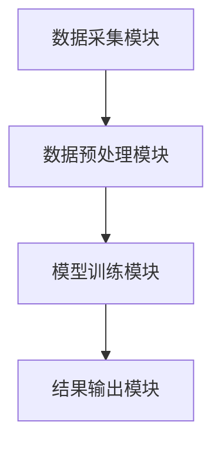
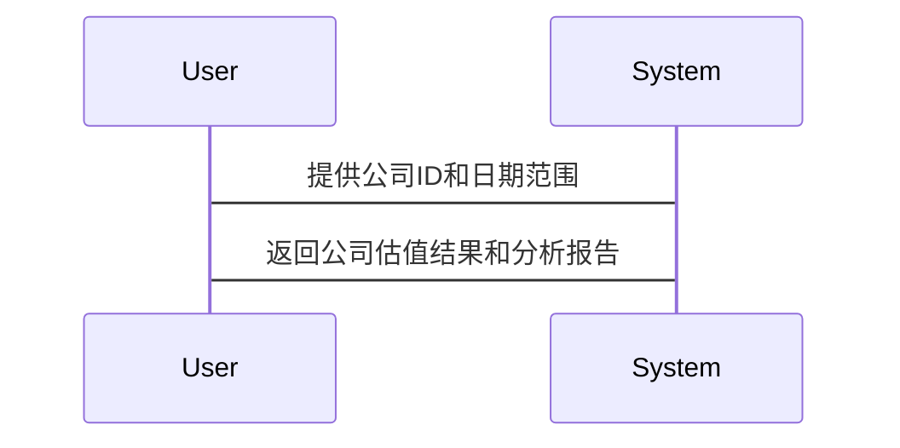

                 


# 深度学习在公司估值中的应用

> 关键词：深度学习，公司估值，神经网络，股票分析，金融模型，机器学习

> 摘要：随着人工智能技术的快速发展，深度学习在金融领域的应用越来越广泛。本文将探讨深度学习如何应用于公司估值，分析其核心算法、系统架构设计以及实际应用案例，帮助读者理解如何利用深度学习技术提升公司估值的准确性和效率。

---

# 第一部分: 深度学习在公司估值中的背景与基础

## 第1章: 公司估值的传统方法与挑战

### 1.1 公司估值的基本概念

#### 1.1.1 公司估值的定义
公司估值是指通过对公司的财务数据、市场表现、行业地位等多方面因素的分析，估算其市场价值的过程。传统上，公司估值主要依赖于财务指标分析、行业对标、DCF模型等方法。

#### 1.1.2 传统公司估值方法的优缺点
- **优点**：
  - 理论基础清晰，易于理解和解释。
  - 数据需求相对简单，易于获取。
- **缺点**：
  - 主观性较强，依赖分析师的经验和判断。
  - 无法有效处理非结构化数据（如文本、图像等）。
  - 难以捕捉市场情绪和复杂市场动态。

#### 1.1.3 深度学习在公司估值中的潜力
深度学习作为一种强大的机器学习技术，能够从海量数据中提取特征，并自动建立复杂的数学模型，为公司估值提供了新的可能性。通过分析新闻、社交媒体、财务报表等多源数据，深度学习可以更全面地捕捉公司价值的变化。

---

## 第2章: 深度学习的基本概念

### 2.1 神经网络基础

#### 2.1.1 神经网络的定义
神经网络是一种受生物神经系统的启发构建的人工神经网络模型，由输入层、隐藏层和输出层组成，通过权重和激活函数实现数据的非线性变换。

#### 2.1.2 神经网络的结构
- **输入层**：接收原始数据。
- **隐藏层**：通过非线性变换提取特征。
- **输出层**：生成最终的预测结果。

#### 2.1.3 神经网络的训练过程
- **前向传播**：输入数据通过网络计算输出结果。
- **反向传播**：计算预测值与实际值的误差，并通过梯度下降优化网络权重。

### 2.2 非监督学习与半监督学习

#### 2.2.1 非监督学习的定义
非监督学习是指在无标签数据的情况下，通过聚类等方法发现数据中的潜在结构。

#### 2.2.2 半监督学习的定义
半监督学习是指在部分有标签数据的情况下，利用无标签数据提升模型性能。

### 2.3 深度学习算法的数学基础

#### 2.3.1 线性代数基础
- 向量、矩阵运算。
- 点积、叉积、矩阵乘法等基本运算。

#### 2.3.2 微积分基础
- 导数、积分、梯度下降等优化方法。

#### 2.3.3 概率论基础
- 概率分布、条件概率、贝叶斯定理等。

### 2.4 深度学习算法的实现细节

#### 2.4.1 神经网络的激活函数
- **Sigmoid函数**：将输入压缩到(0,1)区间。
- **ReLU函数**：非线性激活函数，计算速度快。

#### 2.4.2 神经网络的损失函数
- **均方误差（MSE）**：衡量预测值与实际值的差异。
- **交叉熵损失**：常用于分类任务。

#### 2.4.3 神经网络的优化器
- **随机梯度下降（SGD）**：基本优化算法。
- **Adam优化器**：结合动量和自适应学习率的优化算法。

---

## 第3章: 深度学习在金融领域的应用现状

### 3.1 深度学习在金融中的应用
- **股票价格预测**：利用LSTM模型捕捉时间序列数据中的模式。
- **风险评估**：通过神经网络模型评估信用风险。

### 3.2 深度学习在公司估值中的优势
- **数据处理能力**：能够处理结构化和非结构化数据。
- **特征提取能力**：自动提取复杂的特征组合。

### 3.3 深度学习在公司估值中的挑战
- **数据质量问题**：非结构化数据的清洗和预处理难度大。
- **模型解释性**：深度学习模型的黑箱特性降低了可解释性。

---

# 第二部分: 深度学习的核心算法

## 第4章: 深度学习的核心算法

### 4.1 神经网络基础

#### 4.1.1 神经网络的结构
- **输入层**：接收原始数据。
- **隐藏层**：通过非线性变换提取特征。
- **输出层**：生成最终的预测结果。

### 4.2 长短期记忆网络（LSTM）

#### 4.2.1 LSTM的结构
- **记忆单元（Cell）**：保存长期信息。
- **输入门（Input Gate）**：控制信息的输入。
- **遗忘门（Forget Gate）**：决定记忆单元中的信息是否被保留。

#### 4.2.2 LSTM在时间序列预测中的应用
- **股票价格预测**：利用LSTM模型捕捉时间序列数据中的模式。

### 4.3 卷积神经网络（CNN）

#### 4.3.1 CNN的结构
- **卷积层**：提取局部特征。
- **池化层**：降低模型复杂度，提高泛化能力。

#### 4.3.2 CNN在图像识别中的应用
- **公司标志识别**：通过CNN模型识别公司标志。

### 4.4 图神经网络（GNN）

#### 4.4.1 GNN的结构
- **节点表示**：将公司及其关联的市场数据表示为图结构。
- **边关系**：描述公司之间的关联性。

#### 4.4.2 GNN在社交网络分析中的应用
- **社交网络影响力分析**：通过GNN模型分析社交媒体对公司估值的影响。

---

## 第5章: 深度学习算法的数学基础

### 5.1 线性代数基础

#### 5.1.1 向量和矩阵运算
- **向量的点积**：衡量两个向量的相似性。
- **矩阵乘法**：用于神经网络中的权重更新。

### 5.2 微积分基础

#### 5.2.1 导数和梯度
- **导数**：衡量函数在某一点的变化率。
- **梯度**：指示函数在某一点的上升方向。

### 5.3 概率论基础

#### 5.3.1 概率分布
- **正态分布**：常用于描述连续型数据。
- **贝叶斯定理**：用于条件概率的计算。

---

## 第6章: 深度学习算法的实现细节

### 6.1 神经网络的激活函数

#### 6.1.1 Sigmoid函数
- **公式**：$$\sigma(x) = \frac{1}{1 + e^{-x}}$$
- **特点**：将输入压缩到(0,1)区间。

#### 6.1.2 ReLU函数
- **公式**：$$ReLU(x) = \max(0, x)$$
- **特点**：计算速度快，避免梯度消失问题。

### 6.2 神经网络的损失函数

#### 6.2.1 均方误差（MSE）
- **公式**：$$MSE = \frac{1}{n}\sum_{i=1}^{n}(y_i - \hat{y}_i)^2$$
- **特点**：衡量预测值与实际值的差异。

#### 6.2.2 交叉熵损失
- **公式**：$$H(y, \hat{y}) = -\sum_{i=1}^{n} y_i \log \hat{y}_i + (1 - y_i) \log (1 - \hat{y}_i)$$
- **特点**：常用于分类任务。

### 6.3 神经网络的优化器

#### 6.3.1 随机梯度下降（SGD）
- **公式**：$$\theta = \theta - \eta \frac{\partial L}{\partial \theta}$$
- **特点**：简单但收敛速度慢。

#### 6.3.2 Adam优化器
- **公式**：结合动量和自适应学习率的优化算法。

---

# 第三部分: 深度学习在公司估值中的系统分析与架构设计

## 第7章: 公司估值系统的架构设计

### 7.1 系统概述

#### 7.1.1 系统目标
- **目标**：通过深度学习技术提升公司估值的准确性和效率。

#### 7.1.2 系统范围
- **范围**：涵盖数据采集、特征提取、模型训练、结果输出等环节。

#### 7.1.3 系统功能模块
- **数据采集模块**：从数据库、API等来源获取公司财务数据、市场数据、新闻数据等。
- **数据预处理模块**：清洗、转换和特征工程。
- **模型训练模块**：利用深度学习算法训练公司估值模型。
- **结果输出模块**：生成公司估值结果并提供可视化界面。

### 7.2 系统功能设计

#### 7.2.1 数据采集模块
- **数据来源**：公司财务报表、行业数据、社交媒体数据等。
- **数据格式**：结构化数据（如财务报表）和非结构化数据（如新闻文本）。

#### 7.2.2 数据预处理模块
- **数据清洗**：处理缺失值、异常值等。
- **特征提取**：将文本数据转换为数值特征（如TF-IDF、Word2Vec）。
- **数据增强**：通过数据增强技术提升模型的泛化能力。

#### 7.2.3 模型训练模块
- **模型选择**：根据任务需求选择合适深度学习模型（如LSTM、CNN、GNN等）。
- **模型训练**：利用训练数据训练模型，并通过验证数据调整超参数。
- **模型评估**：通过测试数据评估模型性能（如MAE、RMSE、R²等指标）。

#### 7.2.4 结果输出模块
- **结果可视化**：将公司估值结果以图表形式展示。
- **报告生成**：生成包含估值结果和分析的报告。

---

## 第8章: 深度学习在公司估值中的系统架构设计

### 8.1 系统架构设计

#### 8.1.1 系统架构图


#### 8.1.2 数据流设计
- **数据输入**：公司财务数据、市场数据、新闻数据等。
- **数据处理**：数据清洗、特征提取、数据增强。
- **模型训练**：选择合适深度学习模型，训练并优化模型。
- **结果输出**：生成公司估值结果并提供可视化界面。

---

## 第9章: 深度学习在公司估值中的系统接口设计

### 9.1 系统接口设计

#### 9.1.1 API接口设计
- **输入接口**：接收公司ID、日期范围等参数。
- **输出接口**：返回公司估值结果和相关分析报告。

#### 9.1.2 接口文档
- **请求方式**：POST。
- **请求头**：Content-Type: application/json。
- **请求体**：
  ```json
  {
      "company_id": "AAPL",
      "start_date": "2023-01-01",
      "end_date": "2023-12-31"
  }
  ```
- **响应体**：
  ```json
  {
      "valuation": "$100 billion",
      "analysis": "Positive outlook based on recent earnings reports."
  }
  ```

---

## 第10章: 深度学习在公司估值中的系统交互设计

### 10.1 系统交互设计

#### 10.1.1 用户交互流程
1. **用户输入**：输入公司ID和日期范围。
2. **系统处理**：数据采集、预处理、模型训练。
3. **结果输出**：显示公司估值结果和分析报告。

#### 10.1.2 交互流程图


---

# 第四部分: 深度学习在公司估值中的项目实战

## 第11章: 项目实战

### 11.1 项目背景

#### 11.1.1 项目目标
- **目标**：利用深度学习技术，构建一个公司估值模型，能够根据公司财务数据和市场数据预测公司估值。

#### 11.1.2 项目范围
- **范围**：数据范围：2010-2023年的公司财务数据和市场数据。
- **数据来源**：公司财务报表、行业数据、社交媒体数据等。

### 11.2 项目环境

#### 11.2.1 环境配置
- **操作系统**：Linux/Windows/MacOS。
- **编程语言**：Python 3.8+。
- **深度学习框架**：TensorFlow/PyTorch。
- **其他依赖**：Pandas、NumPy、Matplotlib、Scikit-learn等。

### 11.3 项目核心实现

#### 11.3.1 数据采集
- **数据清洗**：处理缺失值、异常值等。
- **特征提取**：将文本数据转换为数值特征（如TF-IDF、Word2Vec）。
- **数据增强**：通过数据增强技术提升模型的泛化能力。

#### 11.3.2 模型训练
- **模型选择**：根据任务需求选择合适深度学习模型（如LSTM、CNN、GNN等）。
- **模型训练**：利用训练数据训练模型，并通过验证数据调整超参数。
- **模型评估**：通过测试数据评估模型性能（如MAE、RMSE、R²等指标）。

#### 11.3.3 模型部署
- **模型保存**：将训练好的模型保存为可部署的形式（如TensorFlow SavedModel、PyTorch .pt文件）。
- **模型部署**：将模型部署到服务器或云平台上，提供API接口供其他系统调用。

### 11.4 项目结果分析

#### 11.4.1 实验结果
- **实验对比**：对比传统估值方法和深度学习模型的估值结果。
- **实验分析**：分析深度学习模型在公司估值中的优势和不足。

---

## 第12章: 深度学习在公司估值中的高级主题

### 12.1 深度学习模型的优化与调优

#### 12.1.1 模型优化
- **超参数调优**：通过网格搜索或随机搜索优化模型超参数。
- **模型压缩**：通过剪枝、知识蒸馏等技术减少模型大小。

#### 12.1.2 模型部署与上线
- **模型部署**：将训练好的模型部署到生产环境，提供API接口。
- **模型监控**：实时监控模型性能，及时发现并解决问题。

### 12.2 深度学习在公司估值中的实际应用

#### 12.2.1 实际案例分析
- **案例一**：利用LSTM模型预测公司未来估值。
- **案例二**：利用GNN模型分析公司之间的关联性对估值的影响。

### 12.3 深度学习在公司估值中的未来发展方向

#### 12.3.1 多模态数据融合
- **多模态数据**：结合文本、图像、语音等多种数据类型，提升模型的表达能力。

#### 12.3.2 自监督学习
- **自监督学习**：利用未标记数据进行自监督学习，减少对标签数据的依赖。

---

## 第13章: 总结与展望

### 13.1 总结

#### 13.1.1 核心内容回顾
- **深度学习在公司估值中的应用**：通过深度学习技术，可以更准确地预测公司估值，捕捉市场动态。
- **系统设计与实现**：构建了一个完整的公司估值系统，涵盖了数据采集、特征提取、模型训练和结果输出等环节。
- **项目实战经验**：通过实际案例，验证了深度学习在公司估值中的有效性。

#### 13.1.2 本文的主要贡献
- **理论贡献**：系统地分析了深度学习在公司估值中的应用，提出了多种深度学习模型及其在估值中的应用。
- **实践贡献**：构建了一个完整的公司估值系统，并提供了详细的实现代码和案例分析。

### 13.2 展望

#### 13.2.1 未来研究方向
- **多模态数据融合**：结合文本、图像等多种数据类型，提升模型的表达能力。
- **自监督学习**：探索自监督学习在公司估值中的应用，减少对标签数据的依赖。
- **强化学习**：利用强化学习技术，优化公司估值策略。

#### 13.2.2 深度学习在公司估值中的未来发展趋势
- **实时估值**：随着深度学习技术的不断发展，未来可以实现对公司估值的实时预测。
- **个性化估值**：基于用户的个性化需求，提供定制化的公司估值服务。
- **全球市场应用**：深度学习技术可以应用于全球市场，帮助投资者更好地进行跨国投资。

---

## 第14章: 最佳实践与注意事项

### 14.1 最佳实践

#### 14.1.1 数据处理
- **数据清洗**：仔细处理缺失值、异常值等。
- **特征工程**：提取有意义的特征，避免特征冗余。
- **数据增强**：通过数据增强技术提升模型的泛化能力。

#### 14.1.2 模型选择
- **任务匹配**：根据具体任务选择合适的深度学习模型。
- **模型调优**：通过超参数调优和模型压缩优化模型性能。

### 14.2 注意事项

#### 14.2.1 数据质量问题
- **数据清洗**：确保数据的准确性和完整性。
- **数据标注**：对于非结构化数据，需要进行准确的标注。

#### 14.2.2 模型解释性
- **模型可解释性**：尽管深度学习模型在公司估值中表现优异，但其黑箱特性可能影响实际应用中的可解释性。
- **模型解释方法**：通过可视化技术（如注意力机制）提升模型的可解释性。

---

## 第15章: 深度学习在公司估值中的资源与扩展阅读

### 15.1 深度学习在公司估值中的相关书籍

#### 15.1.1 经典书籍
- **《Deep Learning》——Ian Goodfellow**
- **《Machine Learning for Asset Managers》——Marc Potters

#### 15.1.2 最新论文
- **"Deep Learning for Stock Market Prediction"** —— arXiv论文。
- **"Graph Neural Networks for Financial Time Series"** —— IEEE论文。

### 15.2 深度学习在公司估值中的在线资源

#### 15.2.1 在线课程
- **"Deep Learning Specialization"** —— Coursera。
- **"Financial Modeling with Python"** —— Udemy。

#### 15.2.2 开源库与工具
- **TensorFlow** —— Google。
- **PyTorch** —— Facebook。
- **Keras** —— Deep Learning Framework。

---

## 第16章: 深度学习在公司估值中的总结与小结

### 16.1 本文总结
通过本文的详细讲解，读者可以系统地了解深度学习在公司估值中的应用，掌握深度学习的核心算法和系统设计方法，并通过实际案例掌握深度学习模型的实现和优化技巧。

### 16.2 未来展望
随着深度学习技术的不断发展，其在公司估值中的应用将更加广泛和深入，未来将有更多的创新和突破，为金融行业带来更大的价值。

### 16.3 致谢
感谢读者的耐心阅读，感谢深度学习领域的各位专家和研究者，感谢开源社区的支持和贡献。

---

# 结语
深度学习作为一种强大的工具，正在改变金融行业的传统做法。通过本文的系统讲解，希望读者能够更好地理解深度学习在公司估值中的应用，并在实际工作中灵活运用这些技术，推动金融行业的创新和发展。

