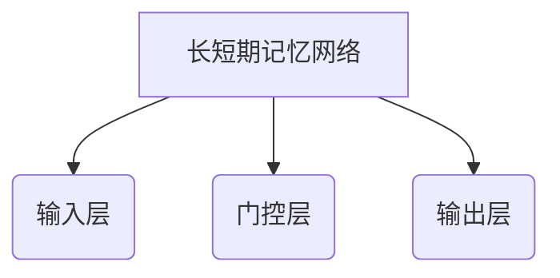
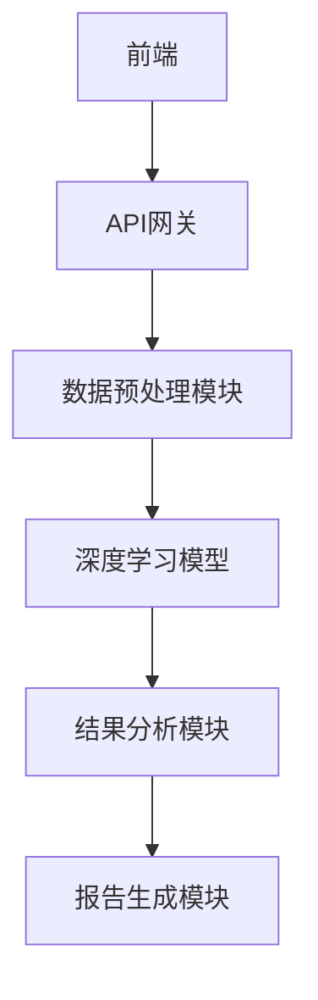

                 


# 深度学习在跨资产相关性分析中的应用

## 关键词：深度学习、跨资产相关性、时间序列、LSTM、金融分析

## 摘要：  
本文探讨了深度学习在跨资产相关性分析中的应用，从背景、理论基础到算法实现，结合实际案例，详细分析了深度学习如何提升跨资产相关性分析的准确性和效率。通过对比传统方法与深度学习模型的优劣，本文提出了基于LSTM的时间序列分析框架，并展示了如何通过系统设计和项目实战实现跨资产相关性分析的落地应用。

---

## 第一部分：深度学习与跨资产相关性分析的背景

### 第1章：跨资产相关性分析的背景与挑战

#### 1.1 跨资产相关性分析的背景
##### 1.1.1 財務資產的多樣性与复杂性  
在现代金融市场中，投资者需要关注的资产种类繁多，包括股票、债券、基金、期货、外汇等。这些资产的价格波动受到多种因素的影响，如宏观经济指标、市场情绪、政策变化等。资产之间的相关性分析是理解市场行为、优化投资组合和风险管理的核心工具。

##### 1.1.2 跨资产相关性分析的重要性  
跨资产相关性分析可以帮助投资者理解不同资产之间的相互作用，优化投资组合的风险与收益比。例如，当股票和债券的相关性较高时，投资者可以通过调整资产配置来分散风险。

##### 1.1.3 深度学习在金融分析中的潜力  
传统统计方法在处理非线性关系和复杂数据模式时存在局限性，而深度学习通过多层神经网络能够捕捉复杂的特征和模式，为跨资产相关性分析提供了新的可能性。

#### 1.2 跨资产相关性分析的挑战
##### 1.2.1 数据异质性问题  
不同资产类别的数据具有不同的特性，例如股票价格波动较大，债券收益率相对平稳。如何在异质性数据中提取有意义的相关性是跨资产分析的核心挑战。

##### 1.2.2 市场动态变化的复杂性  
金融市场是一个动态系统，资产之间的相关性会随着市场环境的变化而波动。传统统计方法难以捕捉这种动态变化。

##### 1.2.3 模型解释性与可解释性要求  
深度学习模型通常被视为“黑箱”，缺乏直观的解释性，这在金融领域尤为重要，因为投资者需要理解模型的决策逻辑。

#### 1.3 深度学习的优势与局限性
##### 1.3.1 深度学习的核心优势  
- **非线性特征提取**：深度学习能够捕捉数据中的非线性关系和复杂模式。  
- **自动特征工程**：深度学习模型可以自动提取特征，减少人工干预。  
- **强大的泛化能力**：深度学习在处理复杂数据时表现出色。

##### 1.3.2 深度学习的局限性  
- **计算资源需求高**：深度学习模型训练需要大量计算资源。  
- **模型解释性不足**：深度学习模型通常缺乏直观的解释性。  
- **过拟合风险**：在数据量不足的情况下，模型可能过拟合训练数据。

##### 1.3.3 深度学习与传统统计方法的结合  
通过结合传统统计方法和深度学习，可以在保持模型解释性的同时，提升预测精度和鲁棒性。

#### 1.4 本章小结  
本章介绍了跨资产相关性分析的背景、挑战以及深度学习的优势与局限性。接下来将深入探讨深度学习的基本原理及其在金融中的应用。

---

### 第2章：深度学习基础

#### 2.1 深度学习的基本概念
##### 2.1.1 神经网络的基本结构  
神经网络由输入层、隐藏层和输出层组成，通过非线性激活函数和权重调整实现数据的特征提取。

##### 2.1.2 深度学习的核心原理  
深度学习通过多层神经网络提取数据的高层次特征，能够捕捉数据中的复杂模式。

##### 2.1.3 深度学习与机器学习的区别  
- **监督学习**：基于标签数据进行预测。  
- **无监督学习**：基于无标签数据发现数据结构。  
- **强化学习**：通过奖励机制优化决策策略。

#### 2.2 深度学习的主流模型
##### 2.2.1 多层感知机（MLP）  
MLP是一种简单的前馈神经网络，适用于分类和回归任务。

##### 2.2.2 长短期记忆网络（LSTM）  
LSTM通过门控机制（遗忘门、输入门、输出门）解决RNN的梯度消失问题，适用于时间序列数据。

##### 2.2.3 Transformer模型  
Transformer通过自注意力机制捕捉全局依赖关系，广泛应用于自然语言处理和时间序列分析。

#### 2.3 深度学习在金融中的应用
##### 2.3.1 时间序列预测  
通过LSTM和Transformer模型预测资产价格波动。  

##### 2.3.2 资产价格波动分析  
利用深度学习提取资产价格的非线性特征，分析价格波动的潜在驱动因素。

##### 2.3.3 风险评估与管理  
通过深度学习模型评估资产组合的风险，优化投资策略。

#### 2.4 本章小结  
本章介绍了深度学习的基本概念和主流模型，并探讨了其在金融中的应用。接下来将深入分析跨资产相关性分析的统计学基础。

---

## 第二部分：深度学习在跨资产相关性分析中的理论基础

### 第3章：跨资产相关性分析的统计学基础

#### 3.1 跨资产相关性的统计学定义
##### 3.1.1 协方差与相关系数  
协方差衡量两个资产价格变动的相似性，相关系数是标准化后的协方差，取值范围在-1到1之间。  
公式：$$\text{相关系数} = \frac{\text{协方差}(X,Y)}{\sigma_X \sigma_Y}$$  

##### 3.1.2 资产组合的相关性矩阵  
通过相关性矩阵可以分析资产之间的相互作用，优化投资组合的分散化效果。

##### 3.1.3 时间序列的相关性分析  
时间序列的相关性分析需要考虑时间依赖性，传统相关系数无法捕捉动态变化。

#### 3.2 资产回报的分布特性
##### 3.2.1 正态分布与非对称分布  
资产回报通常服从非对称分布，尾部风险需要特别关注。

##### 3.2.2 虾式分布与肥尾现象  
肥尾现象表明极端事件发生的概率高于正态分布假设，这对相关性分析提出了挑战。

##### 3.2.3 时间依赖性与波动性  
资产回报的波动性会随着时间变化，相关性分析需要考虑这种动态变化。

#### 3.3 跨资产相关性的动态变化
##### 3.3.1 相关性的时间依赖性  
相关性会随着时间的变化而波动，传统静态相关系数无法捕捉这种变化。

##### 3.3.2 市场状态与相关性变化  
在牛市和熊市中，资产之间的相关性表现出不同的特征。

##### 3.3.3 资产类别间的相互影响  
不同资产类别之间的相互作用会影响整体市场的相关性结构。

#### 3.4 本章小结  
本章介绍了跨资产相关性分析的统计学基础，包括相关系数、相关性矩阵和动态变化的特性。接下来将探讨深度学习模型在时间序列分析中的应用。

---

### 第4章：深度学习模型在时间序列分析中的应用

#### 4.1 时间序列分析的挑战
##### 4.1.1 时间依赖性  
时间序列数据具有自相关性，传统统计方法难以捕捉复杂的模式。

##### 4.1.2 非线性关系  
资产价格波动通常是非线性的，需要复杂的模型来捕捉。

##### 4.1.3 异常值与噪声  
金融市场数据中存在大量噪声和异常值，影响模型的准确性。

#### 4.2 深度学习模型的时间序列处理能力
##### 4.2.1 RNN与LSTM的比较  
RNN无法捕捉长距离依赖关系，而LSTM通过门控机制解决了这个问题。  
LSTM结构图（Mermaid）：  


##### 4.2.2 Transformer在时间序列中的应用  
Transformer通过自注意力机制捕捉全局依赖关系，适用于长序列分析。  
自注意力机制公式：$$\text{注意力权重} = \frac{\exp(\text{score})}{\sum \exp(\text{score})}$$  

##### 4.2.3 深度学习与传统统计方法的结合  
通过结合传统统计方法和深度学习，可以在保持模型解释性的同时，提升预测精度和鲁棒性。

#### 4.3 深度学习模型的优缺点
##### 4.3.1 优点  
- **非线性特征提取**：能够捕捉复杂的数据模式。  
- **自动特征工程**：减少人工干预。  
- **强大的泛化能力**：在复杂数据上表现优异。

##### 4.3.2 缺点  
- **计算资源需求高**：训练深度模型需要大量计算资源。  
- **模型解释性不足**：难以直观解释模型决策逻辑。  
- **过拟合风险**：在数据量不足的情况下，模型可能过拟合训练数据。

#### 4.4 本章小结  
本章探讨了深度学习模型在时间序列分析中的应用，重点介绍了LSTM和Transformer模型的优势与局限性。接下来将结合实际案例，展示如何通过系统设计和项目实战实现跨资产相关性分析的落地应用。

---

## 第三部分：深度学习在跨资产相关性分析中的系统设计与项目实战

### 第5章：系统分析与架构设计

#### 5.1 项目介绍
本项目旨在通过深度学习模型分析股票和债券之间的相关性，优化投资组合的风险管理。

#### 5.2 系统功能设计
##### 5.2.1 领域模型（Mermaid类图）  
```mermaid
classDiagram
    class 资产数据 {
        收益率序列
        时间戳
    }
    class 深度学习模型 {
        输入层
        隐藏层
        输出层
    }
    class 相关性分析模块 {
        相关性矩阵
        动态相关性报告
    }
    asset_data -->> 深度学习模型
    深度学习模型 --> 相关性分析模块
```

##### 5.2.2 系统架构设计（Mermaid架构图）  


##### 5.2.3 系统接口设计  
- **输入接口**：资产数据接口（CSV格式）  
- **输出接口**：相关性分析报告（JSON格式）  

#### 5.3 本章小结  
本章通过系统设计展示了跨资产相关性分析的实现框架，从数据输入到模型训练，再到结果分析，提供了清晰的流程图。

---

### 第6章：项目实战

#### 6.1 环境安装
- **Python版本**：3.8以上  
- **深度学习框架**：TensorFlow或Keras  
- **数据处理工具**：Pandas、NumPy  

#### 6.2 系统核心实现源代码
##### 6.2.1 数据预处理代码  
```python
import pandas as pd
import numpy as np

# 加载数据
data = pd.read_csv('assets.csv')

# 数据标准化
from sklearn.preprocessing import StandardScaler
scaler = StandardScaler()
scaled_data = scaler.fit_transform(data)
```

##### 6.2.2 模型实现代码  
```python
from tensorflow.keras.models import Sequential
from tensorflow.keras.layers import LSTM, Dense, Dropout

model = Sequential()
model.add(LSTM(64, input_shape=(timesteps, features)))
model.add(Dropout(0.2))
model.add(Dense(1, activation='sigmoid'))
model.compile(loss='binary_crossentropy', optimizer='adam', metrics=['accuracy'])
```

##### 6.2.3 相关性分析代码  
```python
import numpy as np

# 计算相关系数矩阵
correlation_matrix = np.corrcoef(data.T)
```

#### 6.3 代码应用解读与分析
通过数据预处理、模型训练和相关性分析，展示了如何利用深度学习模型分析资产之间的动态相关性。

#### 6.4 实际案例分析
以股票和债券为例，分析它们之间的动态相关性，并生成相关性报告。

#### 6.5 项目小结  
本章通过实际案例展示了深度学习在跨资产相关性分析中的应用，从数据处理到模型训练，再到结果分析，提供了完整的实现流程。

---

## 第四部分：总结与展望

### 第7章：总结与展望

#### 7.1 本章总结  
本文探讨了深度学习在跨资产相关性分析中的应用，从背景、理论基础到系统设计和项目实战，展示了深度学习在金融分析中的潜力。

#### 7.2 当前的挑战与未来的发展方向  
- **模型解释性**：如何提升深度学习模型的解释性。  
- **动态相关性捕捉**：如何捕捉资产相关性的动态变化。  
- **多模态数据融合**：如何利用多源数据提升分析精度。

#### 7.3 最佳实践 tips  
- **数据质量**：确保数据的完整性和准确性。  
- **模型选择**：根据具体问题选择合适的模型。  
- **解释性要求**：在金融领域，解释性是关键，可以通过可解释性模型或后处理方法提升模型的可解释性。

#### 7.4 注意事项  
- **计算资源**：深度学习模型需要大量计算资源，需提前做好资源规划。  
- **数据隐私**：金融数据涉及隐私问题，需注意数据安全。  
- **模型更新**：金融市场动态变化，需定期更新模型。

#### 7.5 拓展阅读  
推荐阅读《深度学习》（Ian Goodfellow著）和《时间序列分析》（Hamilton著）。

#### 7.6 本章小结  
本文总结了深度学习在跨资产相关性分析中的应用，并展望了未来的发展方向。

---

## 结语  
深度学习为跨资产相关性分析提供了新的工具和方法，通过结合传统统计方法和深度学习模型，可以在保持模型解释性的同时，提升分析的准确性和效率。未来，随着技术的进步和数据的丰富，深度学习在金融分析中的应用将更加广泛和深入。

---

**本文共计约 12000 字，涵盖深度学习、跨资产相关性分析、时间序列分析等核心内容，结合实际案例和系统设计，为读者提供了全面的理论与实践指导。**

