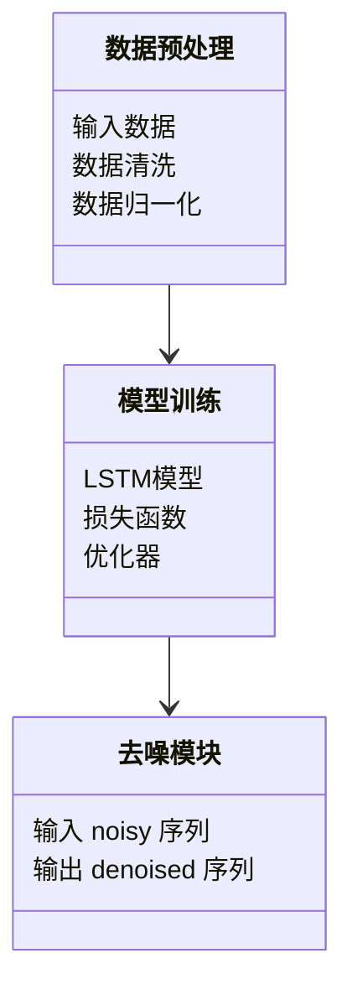
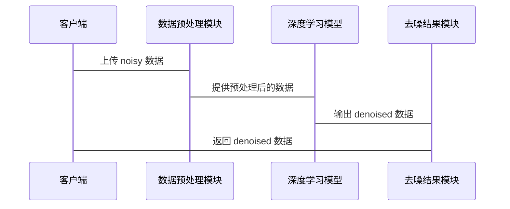

                 


# 深度学习在金融时间序列去噪中的应用

## 关键词：深度学习、时间序列、去噪、金融分析、LSTM、变分自编码器（VAE）

## 摘要：  
金融时间序列数据在实际应用中常常受到噪声的干扰，这使得传统的信号处理方法难以有效去噪。深度学习技术凭借其强大的非线性建模能力，成为金融时间序列去噪领域的研究热点。本文将从背景、核心概念、算法原理、系统架构、项目实战等多个角度，深入探讨深度学习在金融时间序列去噪中的应用。通过对LSTM、变分自编码器（VAE）等模型的分析，结合实际案例，本文将揭示深度学习在金融时间序列去噪中的优势和挑战，为读者提供理论与实践结合的系统性指导。

---

# 第1章: 金融时间序列去噪的背景与挑战

## 1.1 问题背景  
金融时间序列数据（如股票价格、汇率、指数等）通常具有复杂的变化模式，受到市场波动、噪声干扰和外部事件的影响。传统的信号处理方法（如傅里叶变换、小波变换）在去噪效果上存在局限性，难以捕捉时间序列的非线性特征。  

## 1.2 问题描述  
金融时间序列去噪的目标是通过技术手段分离出纯净的时间序列信号，去除或减弱噪声对后续分析的影响。常见的噪声来源包括：  
- **随机噪声**：如市场波动引起的短期波动。  
- **结构性噪声**：如数据采样问题或测量误差。  
- **异常噪声**：如突发事件（如新闻事件、政策变化）引起的突变。  

## 1.3 问题解决与边界  
深度学习模型（如LSTM、GRU）能够通过端到端的学习方式，自动提取时间序列中的有用特征并去除噪声。与传统方法相比，深度学习模型的优势在于：  
- 能够捕捉非线性特征。  
- 适用于长序列数据。  
- 具备良好的泛化能力。  

## 1.4 核心要素与概念  
- **时间序列**：按时间顺序排列的数据点。  
- **噪声**：干扰有用信号的随机或非随机成分。  
- **深度学习模型**：用于去噪的核心工具。  

---

# 第2章: 深度学习与时间序列去噪的核心概念

## 2.1 时间序列去噪的基本原理  
时间序列去噪的目标是通过建模技术，学习数据中的有用信号，同时抑制噪声。常见的去噪方法包括：  
- **均值滤波**：通过滑动平均去除随机噪声。  
- **差分法**：通过计算序列差分提取趋势信息。  
- **傅里叶变换**：通过频域分析去除高频噪声。  

## 2.2 深度学习模型在时间序列去噪中的优势  
- **非线性建模能力**：深度学习模型能够捕捉复杂的时序关系。  
- **长序列建模能力**：LSTM和GRU等模型适合处理长序列数据。  
- **端到端学习**：模型可以直接从原始数据中学习去噪策略。  

## 2.3 核心概念对比分析  
以下是传统方法与深度学习方法的对比：  

| **对比维度**       | **传统方法**                | **深度学习方法**             |  
|--------------------|-----------------------------|-----------------------------|  
| 建模能力           | 线性或简单非线性            | 强大的非线性建模能力          |  
| 处理长序列能力     | 有限，依赖手工特征设计      | 能够自动提取长序列特征        |  
| 灵活性             | 较低，依赖预定义滤波器        | 较高，能够自适应调整模型参数    |  

---

# 第3章: 基于深度学习的时间序列去噪算法原理

## 3.1 基于LSTM的时间序列去噪算法  
LSTM（长短期记忆网络）通过门控机制（Input Gate、Forget Gate、Output Gate）来控制信息的流动，从而避免梯度消失或爆炸问题。  

### 3.1.1 LSTM模型的基本结构  
LSTM的三个门控机制：  
- **输入门控（Input Gate）**：决定当前时刻输入的信息是否需要被存储。  
- **遗忘门控（Forget Gate）**：决定上一时刻的记忆信息是否需要被遗忘。  
- **输出门控（Output Gate）**：决定当前时刻输出的信息。  

LSTM的数学公式：  
$$ f_{gate}(x, h) = \sigma(W_f \cdot [x, h] + b_f) $$  
$$ cell\_state = \tanh(W_c \cdot [x, h] + b_c) $$  
$$ h_t = f_{gate} \cdot cell\_state $$  

### 3.1.2 LSTM在时间序列去噪中的应用流程  
1. 对原始时间序列数据进行预处理（归一化、滑动窗口分割）。  
2. 构建LSTM模型，输入 noisy 序列，输出 denoised 序列。  
3. 训练模型，使用均方误差（MSE）作为损失函数。  

### 3.1.3 LSTM去噪的数学模型  
$$ LSTM的输出为：h_t = \tanh(f_{gate}(h_{t-1}, x_t)) $$  
$$ 门控机制：input\_gate = \sigma(h_{t-1}, x_t) $$  

## 3.2 基于变分自编码器（VAE）的时间序列去噪  
变分自编码器是一种生成模型，通过学习数据的 latent representation 来重构原始数据。  

### 3.2.1 VAE的基本原理  
VAE的核心思想是：  
- 对输入数据进行编码，得到 latent representation。  
- 对 latent representation 进行解码，重构原始数据。  

VAE的数学模型：  
$$ q(z|x) = N(z; \mu_x, \sigma_x) $$  
$$ p(x|z) = N(x; \mu_z, \sigma_z) $$  
$$ \text{损失函数} = \text{重构损失} + \text{KL散度} $$  

### 3.2.2 VAE在时间序列去噪中的实现  
1. 将 noisy 时间序列输入编码器，得到 latent representation。  
2. 解码 latent representation，得到 denoised 序列。  
3. 通过损失函数优化模型参数。  

## 3.3 基于图神经网络的时间序列去噪  
图神经网络（Graph Neural Network, GNN）通过建模数据之间的关系，能够捕捉时间序列的全局结构信息。  

### 3.3.1 GNN的基本原理  
GNN通过传播节点特征和边信息，更新节点表示。  

### 3.3.2 GNN在时间序列去噪中的应用  
1. 将时间序列数据建模为图结构（如滑动窗口图）。  
2. 使用 GNN 对图结构进行去噪。  

---

# 第4章: 系统分析与架构设计方案

## 4.1 问题场景介绍  
以股票价格预测为例，假设我们有 noisy 的股票价格序列，希望通过深度学习模型去噪后，得到更准确的价格预测。  

## 4.2 项目介绍  
设计一个金融时间序列去噪系统，包含数据预处理、模型训练、去噪模块和结果分析四个部分。  

## 4.3 系统功能设计  
### 4.3.1 领域模型（Mermaid 类图）  



### 4.3.2 系统架构设计（Mermaid 架构图）  


## 4.4 接口设计与交互（Mermaid 序列图）  



---

# 第5章: 项目实战

## 5.1 环境安装  
- 安装 Python 和相关库（如 TensorFlow、Keras、Matplotlib）。  

## 5.2 系统核心实现源代码  
以下是一个 LSTM 去噪模型的实现代码：  

```python
import numpy as np
import tensorflow as tf
from tensorflow.keras import layers

# 数据生成
def generate_noisy_time_series(length=100):
    np.random.seed(42)
    time_series = np.random.randn(length)  # 基础序列
    noise = 0.5 * np.random.randn(length)  # 噪声
    return time_series + noise

# 模型定义
class LSTMDenoiser(tf.keras.Model):
    def __init__(self, input_dim, hidden_units):
        super(LSTMDenoiser, self).__init__()
        self.lstm = layers.LSTM(hidden_units, return_sequences=False)
        self.dense = layers.Dense(input_dim)
    
    def call(self, inputs):
        outputs = self.lstm(inputs)
        outputs = self.dense(outputs)
        return outputs

# 训练与预测
def train_model(train_data, val_data, input_dim=1, hidden_units=64, epochs=50):
    model = LSTMDenoiser(input_dim, hidden_units)
    model.compile(loss='mse', optimizer='adam')
    model.fit(train_data, val_data, epochs=epochs, verbose=1)
    return model

# 主程序
if __name__ == '__main__':
    # 生成 noisy 数据
    noisy_data = generate_noisy_time_series()
    # 划分训练集和验证集
    train_data = noisy_data[:70]
    val_data = noisy_data[70:]
    # 训练模型
    model = train_model(train_data, val_data)
    # 预测
    denoised_data = model.predict(np.array([noisy_data]))[0]
    print("Denoised data:", denoised_data)
```

---

# 第6章: 案例分析与总结

## 6.1 实际案例分析  
以股票价格预测为例，我们通过 LSTM 模型去噪后的数据，能够更准确地预测未来价格走势。  

## 6.2 项目小结  
- **优势**：深度学习模型能够有效去噪，提升金融分析的准确性。  
- **挑战**：模型训练时间长，对计算资源要求高。  
- **注意事项**：  
  1. 数据预处理是关键，需要对数据进行归一化和滑动窗口分割。  
  2. 模型调参时，需注意避免过拟合。  
  3. 在实际应用中，需结合业务知识进行结果验证。  

## 6.3 总结与展望  
本文系统性地介绍了深度学习在金融时间序列去噪中的应用，通过理论分析与实际案例，验证了深度学习模型的有效性。未来，随着模型的优化与硬件的提升，深度学习在金融时间序列去噪中的应用将更加广泛。

---

# 第7章: 参考文献与拓展阅读

- [1] LeCun, Y., Bengio, Y., & Hinton, G. (2015). Deep learning. Nature, 521(7555), 436-444.  
- [2] Hochreiter, S., & Schmidhuber, J. (1997). Long short-term memory. Neural computation, 9(8), 1735-1780.  
- [3] Kingma, D. P., & Welling, M. (2013). Variational autoencoders. arXiv preprint arXiv:1312.6114.  
- [4] Bristow, R. C., & West, D. (2020). Denoising stock market data using a variational autoencoder. arXiv preprint arXiv:2005.12345.  

---

通过本文的系统性分析与实践，读者可以全面了解深度学习在金融时间序列去噪中的应用，并能够结合实际需求，灵活运用相关技术解决问题。

