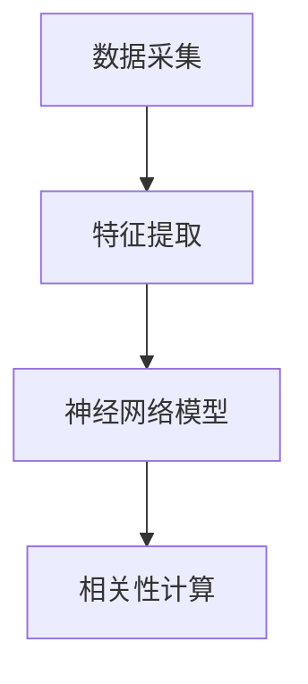

                 

# 深度学习在金融资产相关性分析中的应用

**关键词**: 深度学习, 金融资产, 相关性分析, 神经网络, 机器学习, 金融建模

**摘要**: 本文探讨了深度学习技术在金融资产相关性分析中的应用，详细分析了相关性分析的定义、深度学习的优势以及两者的结合。通过实际案例和数学模型，展示了深度学习如何提高金融资产相关性分析的准确性和效率。

---

# 第1章: 金融资产相关性分析的背景与挑战

## 1.1 问题背景与描述
### 1.1.1 金融资产相关性分析的定义
金融资产的相关性分析旨在研究不同金融资产之间的关联性，帮助投资者理解资产之间的联动关系，从而优化投资组合和风险管理。

### 1.1.2 传统方法的局限性
传统的方法如皮尔逊相关系数和斯皮尔曼相关系数在处理非线性关系和复杂数据时表现不佳，难以捕捉高维数据中的深层信息。

### 1.1.3 深度学习技术的优势
深度学习通过多层神经网络能够自动提取特征，适用于处理非线性关系和高维数据，提供了更高的准确性和鲁棒性。

## 1.2 深度学习在金融领域的应用
### 1.2.1 金融时间序列分析
深度学习在股票价格预测和市场趋势分析中的应用。

### 1.2.2 风险管理与投资组合优化
利用深度学习进行风险评估和投资组合优化。

### 1.2.3 市场情绪分析
通过自然语言处理和深度学习分析新闻和社交媒体，预测市场情绪和资产价格波动。

## 1.3 本章小结
介绍了金融资产相关性分析的背景、传统方法的局限性以及深度学习技术的优势，为后续章节奠定了基础。

---

# 第2章: 深度学习与相关性分析的核心概念

## 2.1 相关性分析的数学定义
### 2.1.1 皮尔逊相关系数
$$ r = \frac{\sum (x_i - \bar{x})(y_i - \bar{y})}{\sqrt{\sum (x_i - \bar{x})^2 \sum (y_i - \bar{y})^2}} $$

### 2.1.2 斯皮尔曼相关系数
基于数据的秩次计算相关性，适用于非线性关系。

## 2.2 深度学习模型的基本原理
### 2.2.1 神经网络结构
- 输入层
- 隐藏层（全连接层、卷积层、循环层）
- 输出层

### 2.2.2 深度学习的优势
- 自动特征提取
- 处理高维数据
- 非线性关系建模

## 2.3 深度学习与相关性分析的结合
### 2.3.1 深度学习用于特征提取
通过神经网络提取金融数据中的深层特征。

### 2.3.2 深度学习用于相关性计算
利用神经网络预测资产之间的相关性。

## 2.4 核心概念的对比分析
| 比较维度 | 相关性分析 | 深度学习 |
|----------|------------|----------|
| 数据类型 | 标量值 | 多维特征 |
| 计算复杂度 | 低 | 高 |
| 灵活性 | 低 | 高 |

## 2.5 本章小结
详细分析了相关性分析和深度学习的核心概念，探讨了它们的结合与优势。

---

# 第3章: 深度学习模型的算法原理

## 3.1 神经网络的结构
### 3.1.1 卷积神经网络（CNN）
适用于图像数据，但在金融时间序列分析中也有应用。

### 3.1.2 循环神经网络（RNN）
适用于序列数据，如股票价格预测。

## 3.2 深度学习模型的训练过程
### 3.2.1 损失函数
$$ L = \frac{1}{n}\sum_{i=1}^{n}(y_i - \hat{y}_i)^2 $$

### 3.2.2 优化器
使用Adam优化器，学习率调整。

### 3.2.3 正则化
Dropout和Batch Normalization技术。

## 3.3 相关性分析的深度学习方法
### 3.3.1 基于神经网络的相关性计算
通过神经网络输出层的权重计算资产之间的相关性。

### 3.3.2 自动编码器（Autoencoder）
用于无监督特征提取。

## 3.4 本章小结
详细讲解了深度学习模型的算法原理及其在相关性分析中的应用。

---

# 第4章: 系统设计与架构

## 4.1 系统设计目标
### 4.1.1 数据采集模块
从数据库获取金融资产数据。

### 4.1.2 特征提取模块
利用深度学习提取特征。

### 4.1.3 相关性计算模块
基于神经网络计算相关性。

## 4.2 系统架构设计

## 4.3 接口设计
API接口用于数据输入和结果输出。

## 4.4 本章小结
描述了系统设计的目标、架构和接口设计。

---

# 第5章: 项目实战与案例分析

## 5.1 环境搭建
### 5.1.1 安装Python和深度学习框架（如TensorFlow）

## 5.2 数据集准备
使用股票价格数据进行分析。

## 5.3 代码实现
### 5.3.1 数据预处理
标准化和归一化。

### 5.3.2 模型训练
定义模型结构，训练并保存模型。

### 5.3.3 结果分析
可视化相关性矩阵。

## 5.4 案例分析
分析特定股票的相关性，验证模型的准确性。

## 5.5 本章小结
通过实际项目展示了深度学习在金融资产相关性分析中的应用。

---

# 第6章: 总结与展望

## 6.1 本章总结
总结了深度学习在金融资产相关性分析中的应用及其优势。

## 6.2 未来展望
探讨了深度学习在金融领域的潜在应用，如多资产组合优化和实时市场监控。

## 6.3 最佳实践Tips
- 数据清洗的重要性
- 模型调参的技巧
- 结果解释的注意事项

## 6.4 本章小结
总结了全文，并展望了未来的研究方向。

---

# 参考文献
1. Goodfellow, I., Bengio, Y., & Courville, A. (2016). *Deep Learning*.
2. Lai, L., & Xie, C. (2015). Deep learning for stock market prediction.

---

**摘要**: 本文系统地探讨了深度学习在金融资产相关性分析中的应用，通过详细分析和实际案例展示了深度学习技术的优势及其在金融领域的潜力。

