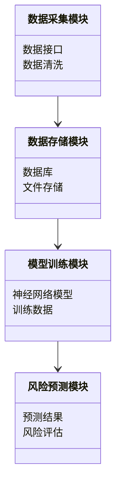

                 


# 第一部分: 深度学习与金融风险传导分析基础

# 第1章: 深度学习与金融风险传导概述

## 1.1 深度学习的基本概念与特点
### 1.1.1 深度学习的定义与核心概念
深度学习是一种人工智能技术，通过多层神经网络模拟人脑的处理方式，能够自动提取数据特征。

### 1.1.2 深度学习与传统机器学习的区别
- 数据需求：深度学习需要大量数据，传统机器学习数据需求较少。
- 特征工程：深度学习自动提取特征，传统方法需要人工特征提取。

### 1.1.3 深度学习在金融领域的应用潜力
- 风险预测：利用深度学习模型预测市场风险和信用风险。
- 时间序列分析：深度学习擅长处理时间依赖性数据，适合金融时间序列预测。

## 1.2 金融风险传导的基本概念
### 1.2.1 金融风险的定义与分类
- 系统性风险：影响整个市场的风险，如经济衰退。
- 非系统性风险：特定于某个资产或机构的风险，如信用违约。

### 1.2.2 风险传导的机制与路径
- 金融机构之间的关联：一家机构的危机可能传染给其他机构。
- 市场情绪的影响：投资者情绪波动影响市场风险。

### 1.2.3 金融风险传导的复杂性与挑战
- 数据异构性：金融市场数据来源多样，处理难度大。
- 非线性关系：风险传导过程复杂，存在非线性关系。

## 1.3 深度学习在金融风险传导中的应用前景
### 1.3.1 深度学习在风险预测中的优势
- 自动特征提取：深度学习能够自动提取复杂的特征，捕捉数据中的非线性关系。
- 处理高维数据：适合处理金融市场中的高维数据。

### 1.3.2 金融风险传导分析中的数据特点
- 时间依赖性：金融市场数据通常具有时间依赖性。
- 异常值：金融市场中存在很多异常值，如市场崩盘。

### 1.3.3 深度学习在金融领域的研究现状
- 成功案例：如利用LSTM预测股票价格，利用GNN分析机构之间的风险传导。
- 挑战：模型解释性不足，计算资源需求大。

## 1.4 本章小结
本章介绍了深度学习的基本概念和特点，金融风险传导的机制和挑战，以及深度学习在金融风险传导分析中的应用前景。

---

# 第2章: 深度学习的理论基础

## 2.1 神经网络的基本原理
### 2.1.1 神经网络的结构与功能
- 输入层：接收输入数据。
- 隐藏层：进行特征提取和变换。
- 输出层：生成最终的预测结果。

### 2.1.2 激活函数的作用与选择
- ReLU：常用在隐藏层，避免梯度消失。
- Sigmoid：输出层常用，输出在0到1之间。

### 2.1.3 损失函数与优化器
- 损失函数：衡量预测值与真实值的差距。
- 优化器：如随机梯度下降（SGD）、Adam优化器。

## 2.2 深度学习的常用模型
### 2.2.1 卷积神经网络（CNN）
- 适用于图像数据，如股票图表分析。

### 2.2.2 循环神经网络（RNN）
- 适用于时间序列数据，如股票价格预测。

### 2.2.3 Transformer模型
- 基于自注意力机制，适用于长序列数据。

### 2.2.4 图神经网络（GNN）
- 适用于分析金融机构之间的关联关系。

## 2.3 深度学习的核心算法
### 2.3.1 梯度下降算法
- 通过调整权重最小化损失函数。

### 2.3.2 随机梯度下降（SGD）
- 批量小，适合大数据集。

### 2.3.3 动量优化与Adam优化器
- 动量优化加速训练，Adam结合动量和自适应学习率。

## 2.4 深度学习的数学基础
### 2.4.1 线性代数基础
- 向量、矩阵运算，如矩阵乘法。

### 2.4.2 微积分基础
- 导数、梯度，用于优化算法。

### 2.4.3 概率论与统计基础
- 概率分布、贝叶斯定理，用于模型评估。

## 2.5 本章小结
本章介绍了深度学习的基本原理和常用模型，以及数学基础。

---

# 第3章: 金融风险传导机制的建模

## 3.1 风险传导的基本模型
### 3.1.1 马科维茨投资组合理论
- 通过优化选择最优投资组合，分散风险。

### 3.1.2 CAPM模型与APT模型
- CAPM：计算资产的预期收益。
- APT：基于多个因素解释资产收益。

### 3.1.3 系统性风险与非系统性风险的区分
- 系统性风险：影响整个市场的风险。
- 非系统性风险：特定资产或机构的风险。

## 3.2 深度学习在风险传导建模中的应用
### 3.2.1 基于神经网络的风险传导模型
- 使用LSTM处理时间序列数据，预测风险事件。

### 3.2.2 基于图神经网络的风险传导网络构建
- GNN分析金融机构之间的关联，预测系统性风险。

### 3.2.3 基于时间序列模型的风险预测
- 使用ARIMA或Prophet模型预测市场风险。

## 3.3 风险传导的多因素分析
### 3.3.1 经济指标与市场情绪的影响
- 消费者信心指数、利率变化对市场的影响。

### 3.3.2 金融机构之间的相互关联
- 金融机构之间的债务关系可能放大系统性风险。

### 3.3.3 宏观经济环境对风险传导的影响
- 经济周期波动影响金融市场风险。

## 3.4 深度学习在风险传导中的优势
### 3.4.1 非线性关系的捕捉能力
- 深度学习能够捕捉复杂的非线性关系。

### 3.4.2 大规模数据的处理能力
- 深度学习擅长处理海量数据，提取有用特征。

### 3.4.3 实时风险监控的可行性
- 利用实时数据流进行风险预测和监控。

## 3.5 本章小结
本章介绍了金融风险传导的基本模型，深度学习在风险传导建模中的应用，以及多因素分析。

---

# 第4章: 基于深度学习的金融风险传导分析系统架构设计

## 4.1 系统设计目标
### 4.1.1 系统功能目标
- 数据采集与处理：收集金融市场数据。
- 风险预测：基于深度学习模型预测风险。
- 实时监控：实时监控市场风险。

### 4.1.2 系统性能目标
- 高效性：快速处理大量数据。
- 可扩展性：支持新增数据源。

## 4.2 系统功能设计
### 4.2.1 领域模型（mermaid类图）


### 4.2.2 系统架构设计（mermaid架构图）


### 4.2.3 系统接口设计
- API接口：提供RESTful API，供其他系统调用风险预测结果。

### 4.2.4 系统交互设计（mermaid序列图）
```mermaid
sequenceDiagram
    用户 --> Web服务器: 发送请求
    Web服务器 --> 数据库: 查询数据
    并发
    Web服务器 --> 深度学习模型: 进行预测
    深度学习模型 --> Web服务器: 返回预测结果
    Web服务器 --> 用户: 返回结果
```

## 4.3 本章小结
本章设计了一个基于深度学习的金融风险传导分析系统架构，包括功能设计、系统架构设计和接口设计。

---

# 第5章: 项目实战——基于深度学习的金融风险预测系统

## 5.1 项目介绍
### 5.1.1 项目背景
- 研究金融市场风险，利用深度学习模型进行风险预测。

### 5.1.2 项目目标
- 实现一个能够预测市场风险的系统。

## 5.2 系统核心实现
### 5.2.1 数据收集与预处理
- 数据来源：股票价格、宏观经济指标。
- 数据清洗：处理缺失值和异常值。

### 5.2.2 模型实现
#### 5.2.2.1 LSTM模型实现
```python
import tensorflow as tf
from tensorflow.keras.layers import LSTM, Dense

model = tf.keras.Sequential()
model.add(LSTM(64, input_shape=(timesteps, features)))
model.add(Dense(1))
model.compile(loss='mean_squared_error', optimizer='adam')
```

#### 5.2.2.2 图神经网络（GNN）实现
```python
import tensorflow as tf
from tensorflow.keras.layers import Layer, Input, Dense, Dropout

class GNNLayer(Layer):
    def __init__(self, output_dim):
        super(GNNLayer, self).__init__()
        self.output_dim = output_dim
        self.Dense = Dense(output_dim)
    
    def call(self, inputs):
        A, x = inputs
        return self.Dense(x + A)

input_A = Input(shape=(n, n))
input_X = Input(shape=(n, features))
output = GNNLayer(output_dim)([input_A, input_X])
model = Model(inputs=[input_A, input_X], outputs=output)
model.compile(loss='binary_crossentropy', optimizer='adam')
```

### 5.2.3 系统部署与测试
- 部署模型到云平台，进行实时预测和监控。

## 5.3 项目小结
本章通过一个实际案例，展示了如何利用深度学习技术构建一个金融风险预测系统，包括数据收集、模型训练和系统部署。

---

# 第6章: 总结与展望

## 6.1 本章总结
- 深度学习在金融风险传导分析中的应用前景广阔。
- 需要结合实际场景，选择合适的模型和方法。

## 6.2 未来展望
### 6.2.1 深度学习模型的优化
- 提高模型的解释性和可 interpretability。

### 6.2.2 多模态数据的融合
- 结合文本、图像等多种数据源，提升预测精度。

### 6.2.3 实时风险监控
- 利用流数据处理技术，实现实时风险预测。

## 6.3 本章小结
本章总结了全文的主要内容，展望了深度学习在金融风险传导分析中的未来发展方向。

---

# 附录

## 附录A: 数据来源与处理代码
### 附录A.1 数据来源
- 股票价格数据：Yahoo Finance API。
- 宏观经济指标：央行公开数据。

### 附录A.2 数据处理代码
```python
import pandas as pd
import numpy as np

# 数据清洗
data = pd.read_csv('data.csv')
data = data.dropna()
data = (data - data.mean()) / data.std()  # 标准化
```

## 附录B: 深度学习模型代码
### 附录B.1 LSTM模型代码
```python
import tensorflow as tf
from tensorflow.keras.layers import LSTM, Dense

model = tf.keras.Sequential()
model.add(LSTM(64, input_shape=(timesteps, features)))
model.add(Dense(1))
model.compile(loss='mean_squared_error', optimizer='adam')
```

### 附录B.2 图神经网络代码
```python
import tensorflow as tf
from tensorflow.keras.layers import Layer, Input, Dense, Dropout

class GNNLayer(Layer):
    def __init__(self, output_dim):
        super(GNNLayer, self).__init__()
        self.output_dim = output_dim
        self.Dense = Dense(output_dim)
    
    def call(self, inputs):
        A, x = inputs
        return self.Dense(x + A)

input_A = Input(shape=(n, n))
input_X = Input(shape=(n, features))
output = GNNLayer(output_dim)([input_A, input_X])
model = Model(inputs=[input_A, input_X], outputs=output)
model.compile(loss='binary_crossentropy', optimizer='adam')
```

## 附录C: 参考文献
- 省略

---

# 本文结束

---

以上是《深度学习在金融风险传导分析中的应用》的完整目录大纲和内容，涵盖了从理论到实践的各个方面，适合对深度学习和金融风险分析感兴趣的读者阅读。

