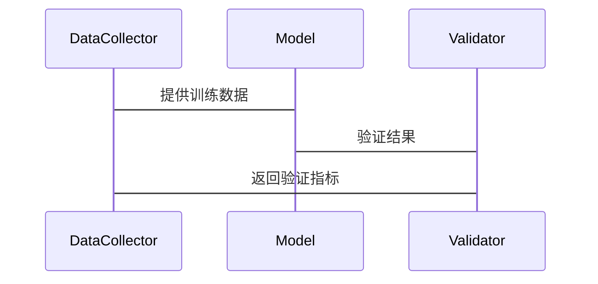
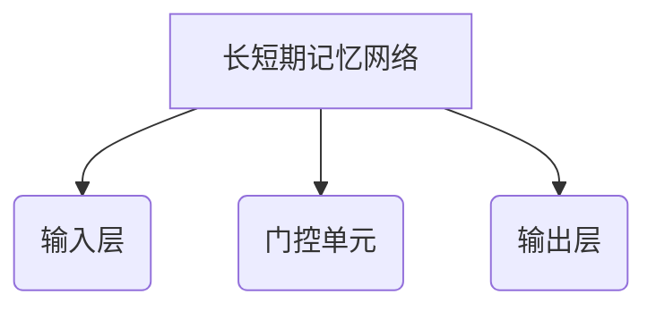

                 


# 深度学习预测公司盈利拐点

> 关键词：深度学习，盈利拐点，时间序列预测，LSTM，机器学习

> 摘要：本文深入探讨了深度学习在预测公司盈利拐点中的应用。通过分析深度学习模型（如LSTM和Transformer）的优势，结合实际案例，展示了如何利用深度学习技术构建有效的盈利拐点预测系统。文章从数据预处理、模型构建、系统设计到项目实战，详细阐述了每个环节的关键技术和实现细节，为读者提供了一套完整的解决方案。

---

# 目录

1. [深度学习与盈利拐点预测概述](#深度学习与盈利拐点预测概述)
2. [数据预处理与特征工程](#数据预处理与特征工程)
3. [深度学习模型的选择与设计](#深度学习模型的选择与设计)
4. [深度学习模型的训练与优化](#深度学习模型的训练与优化)
5. [系统架构设计](#系统架构设计)
6. [项目实战](#项目实战)

---

## 1. 深度学习与盈利拐点预测概述

### 1.1 深度学习的基本概念

深度学习是一种人工智能技术，通过多层神经网络模拟人脑的计算方式，能够自动提取数据中的特征。与传统机器学习不同，深度学习在处理复杂非线性关系时表现更优。

### 1.2 盈利拐点预测的定义与意义

盈利拐点是指公司净利润从下降转为上升的转折点。准确预测拐点对公司战略决策至关重要，尤其是在经济波动或市场变化时。

### 1.3 深度学习在盈利拐点预测中的应用

深度学习在时间序列预测中具有显著优势，尤其是处理长序列依赖关系时。本文将重点分析LSTM（长短期记忆网络）和Transformer模型的应用。

---

## 2. 数据预处理与特征工程

### 2.1 数据收集与清洗

#### 2.1.1 数据来源与采集方法
数据来源包括公司财务报表、市场数据和新闻舆情。数据清洗包括去除缺失值和异常值。


### 2.2 特征选择与特征工程

#### 2.2.1 特征选择的方法
常用特征选择方法包括基于相关系数和Lasso回归的特征筛选。

```python
import pandas as pd
import numpy as np

# 假设df为数据框，y为目标变量
# 使用Lasso回归筛选特征
from sklearn.linear_model import Lasso
from sklearn.feature_selection import SelectFromModel

selector = SelectFromModel(Lasso(alpha=0.1))
selector.fit_transform(df, y)
```

### 2.3 数据集划分与验证策略

#### 2.3.1 时间序列数据的验证方法
时间序列数据需要保留时间顺序，通常采用滑动窗口验证方法。



---

## 3. 深度学习模型的选择与设计

### 3.1 常见深度学习模型概述

#### 3.1.1 RNN与LSTM

LSTM通过门控机制解决RNN的梯度消失问题，适合处理长序列数据。



### 3.2 盈利拐点预测模型的设计

#### 3.2.1 模型输入设计
模型输入通常包括历史盈利数据、市场指标和舆情信息。

### 3.3 模型超参数的选择与调优

#### 3.3.1 学习率与批量大小
常用Adam优化器，学习率通常设置为0.001。

---

## 4. 深度学习模型的训练与优化

### 4.1 模型训练流程

#### 4.1.1 损失函数的选择
使用均方误差（MSE）作为损失函数。

$$\text{MSE} = \frac{1}{n}\sum_{i=1}^{n}(y_i - \hat{y}_i)^2$$

### 4.2 模型评估与优化

#### 4.2.1 准确率与召回率
使用混淆矩阵计算准确率和召回率。

---

## 5. 系统架构设计

### 5.1 系统功能模块划分

#### 5.1.1 数据采集模块
负责从数据库或API获取实时数据。

### 5.1.2 模型训练模块
负责训练深度学习模型并保存模型权重。

---

## 6. 项目实战

### 6.1 环境安装

#### 6.1.1 安装Python和深度学习框架
```bash
pip install numpy pandas tensorflow
```

### 6.2 核心代码实现

#### 6.2.1 数据加载与预处理
```python
import pandas as pd
import numpy as np

# 加载数据
df = pd.read_csv('company_profit.csv')
# 数据清洗
df.dropna(inplace=True)
```

### 6.3 模型实现与训练

#### 6.3.1 LSTM模型实现
```python
import tensorflow as tf
from tensorflow.keras.layers import LSTM, Dense, Dropout
from tensorflow.keras.models import Sequential

model = Sequential()
model.add(LSTM(64, input_shape=(timesteps, features)))
model.add(Dense(1))
model.compile(loss='mse', optimizer='adam')
model.fit(X_train, y_train, epochs=100, batch_size=32)
```

### 6.4 模型测试与结果分析

#### 6.4.1 模型预测与可视化
```python
y_pred = model.predict(X_test)
plt.plot(y_test, label='真实值')
plt.plot(y_pred, label='预测值')
plt.legend()
plt.show()
```

---

## 7. 总结与展望

深度学习在盈利拐点预测中展现了巨大潜力，但仍需在模型优化和数据质量方面进一步研究。未来可以结合强化学习和多模态数据，提升预测精度。

---

**Tips:**
- 数据质量是模型性能的基础，需确保数据清洗和特征工程的充分性。
- 模型选择应基于具体问题，LSTM适合时间序列，Transformer适合长文本分析。
- 模型部署时，建议使用云平台（如AWS或Azure）进行实时预测。

希望这篇文章能为读者提供清晰的思路和实用的技术指导！

