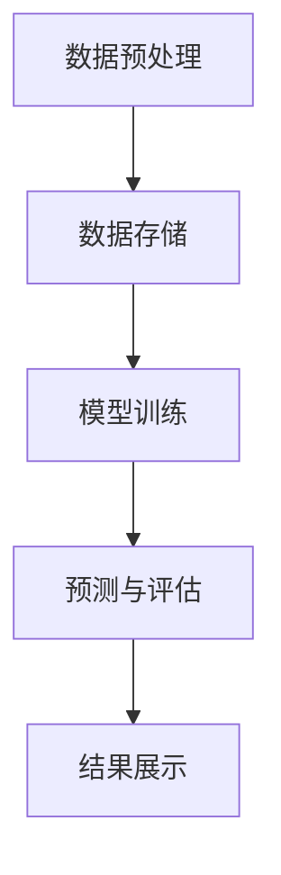

                 

# 深度学习预测公司盈利拐点时机

> 关键词：深度学习，公司盈利，拐点预测，LSTM，时间序列，投资策略

> 摘要：本文深入探讨了利用深度学习技术预测公司盈利拐点的时机。通过分析时间序列数据和深度学习模型，特别是LSTM网络，文章详细介绍了预测过程中的关键步骤，包括数据预处理、模型构建、训练优化以及实际应用案例。文章还讨论了风险管理策略，帮助投资者更好地利用深度学习技术做出决策。

---

# 第1章: 背景介绍与问题定义

## 1.1 公司盈利拐点的经济意义

公司的盈利拐点是指公司从持续亏损到盈利，或者从盈利到持续亏损的临界点。这个点通常与公司的经营状况、市场环境、管理决策等因素密切相关。准确预测拐点能够帮助投资者做出更明智的投资决策，避免重大损失或抓住潜在的收益机会。

## 1.2 深度学习在盈利预测中的应用

传统上，盈利预测主要依赖财务指标分析、行业趋势分析和市场调研等方法。然而，这些方法往往依赖于大量的人工分析，且难以捕捉复杂市场环境中的细微变化。深度学习，作为一种强大的机器学习技术，能够通过分析历史数据，自动提取特征，并预测未来的盈利趋势，从而为拐点预测提供更精准的工具。

---

# 第2章: 深度学习基础

## 2.1 神经网络的基本概念

### 2.1.1 神经网络的定义与特点

神经网络是一种模拟人脑结构和功能的数学模型，由多个层次的神经元组成。其特点包括非线性、自适应性和并行处理能力。神经网络能够通过训练数据调整权重，从而实现对复杂模式的识别和预测。

### 2.1.2 深度学习的核心算法

深度学习的核心算法包括前馈神经网络（如多层感知机）、卷积神经网络（CNN）、循环神经网络（RNN）和Transformer模型等。这些算法在处理不同类型的数据（如图像、文本和时间序列）时表现出色。

---

# 第3章: 时间序列分析与深度学习

## 3.1 时间序列的基本概念

时间序列是一组按时间顺序排列的数据点。在盈利拐点预测中，时间序列数据通常包括公司的季度收入、利润、市场份额等指标。时间序列分析的目标是通过历史数据预测未来的趋势。

### 3.1.1 时间序列的分解方法

时间序列可以分解为趋势、周期性、季节性和随机性四个部分。趋势反映了数据的长期方向，周期性指数据在较长时间内的波动规律，季节性指数据在特定时间段内的规律性变化，而随机性则是不可预测的噪声。

### 3.1.2 时间序列预测的挑战

时间序列预测的挑战包括数据的非线性、噪声干扰、外生因素的影响以及模型的选择。深度学习模型，尤其是LSTM网络，能够有效应对这些挑战。

## 3.2 常见的时间序列预测方法

### 3.2.1 ARIMA模型

ARIMA（自回归积分滑动平均模型）是一种经典的统计学方法，适用于线性时间序列数据。然而，ARIMA模型难以处理非线性数据和复杂模式。

### 3.2.2 LSTM网络

LSTM（长短期记忆网络）是一种特殊的RNN，能够有效处理时间序列数据中的长距离依赖关系。LSTM通过门控机制来控制信息的流动，从而避免传统RNN的梯度消失问题。

### 3.2.3 Prophet模型

Prophet模型是基于时间序列分解的简单模型，适用于具有明确周期性和趋势的时间序列数据。Prophet模型通过将数据分解为趋势、周期性和季节性成分，进行预测。

## 3.3 深度学习在时间序列预测中的优势

### 3.3.1 深度学习处理时间依赖性的能力

深度学习模型能够自动提取时间序列中的特征，并捕捉复杂的模式。与传统的统计模型相比，深度学习模型在处理非线性数据和高维数据时表现更优。

### 3.3.2 LSTM网络在时间序列预测中的表现

LSTM网络在处理时间序列数据时表现出色，尤其适用于具有长距离依赖关系的复杂时间序列。LSTM网络能够有效捕捉数据中的模式和趋势，从而提高预测的准确性。

### 3.3.3 深度学习模型的可解释性

尽管深度学习模型在预测准确性上表现优异，但其可解释性较差。为了提高模型的可解释性，可以通过可视化和分解方法来分析模型的决策过程。

---

# 第4章: LSTM网络的原理与实现

## 4.1 LSTM网络的基本结构

### 4.1.1 LSTM的三个门控机制

LSTM网络包含输入门控、遗忘门控和输出门控三个门控机制。输入门控控制新信息的流入，遗忘门控决定哪些信息需要遗忘，输出门控控制最终输出的信息。

### 4.1.2 LSTM的细胞状态与记忆单元

细胞状态是LSTM网络中存储长期信息的载体，记忆单元用于控制信息的流动。通过细胞状态和记忆单元的交互，LSTM网络能够有效捕捉时间序列中的长距离依赖关系。

### 4.1.3 LSTM的前向传播过程

LSTM的前向传播过程包括输入门控、遗忘门控和输出门控的计算，以及细胞状态和记忆单元的更新。通过这些步骤，LSTM网络能够生成最终的输出。

---

# 第5章: 深度学习预测公司盈利拐点的系统架构设计

## 5.1 系统功能设计

### 5.1.1 数据预处理模块

数据预处理模块负责对原始数据进行清洗、归一化和特征提取。清洗数据包括处理缺失值和异常值，归一化是为了加快模型的收敛速度，特征提取则是为了提高模型的预测能力。

### 5.1.2 模型训练模块

模型训练模块负责构建和训练LSTM网络。训练过程包括数据的输入、模型的前向传播、损失函数的计算和反向传播。通过优化算法（如Adam）更新模型的权重。

### 5.1.3 预测与评估模块

预测与评估模块负责使用训练好的模型对未来的盈利情况进行预测，并评估预测的准确性。评估指标包括均方误差（MSE）、平均绝对误差（MAE）和R平方系数（R²）。

## 5.2 系统架构设计

### 5.2.1 系统架构图

以下是一个深度学习预测公司盈利拐点的系统架构图：

### 5.2.2 系统接口设计

系统接口设计包括数据接口、模型接口和结果接口。数据接口负责读取和写入数据，模型接口负责训练和预测，结果接口负责输出和展示预测结果。

---

# 第6章: 项目实战

## 6.1 环境安装与配置

### 6.1.1 安装Python环境

安装Python 3.8及以上版本，并安装必要的库，如TensorFlow、Keras、pandas、numpy和matplotlib。

### 6.1.2 安装深度学习框架

安装TensorFlow和Keras，用于构建和训练LSTM网络。

## 6.2 数据获取与预处理

### 6.2.1 数据获取

从公开的财务报表或股票市场数据源获取公司的历史盈利数据，包括收入、利润、市场份额等指标。

### 6.2.2 数据清洗

处理缺失值和异常值，确保数据的完整性和准确性。

### 6.2.3 数据归一化

对数据进行归一化处理，以加快模型的收敛速度。

## 6.3 模型构建与训练

### 6.3.1 构建LSTM网络

使用Keras构建LSTM网络，包括输入层、LSTM层和输出层。

### 6.3.2 模型训练

使用训练数据训练模型，并监控训练过程中的损失值和准确率。

## 6.4 模型预测与评估

### 6.4.1 使用训练好的模型进行预测

输入未来的时间序列数据，使用训练好的LSTM模型进行预测。

### 6.4.2 评估预测结果

使用评估指标如MSE、MAE和R²系数评估模型的预测准确性。

## 6.5 实际案例分析

### 6.5.1 案例背景

选择一家公司，使用其历史盈利数据训练LSTM模型，并预测未来的盈利拐点。

### 6.5.2 案例分析

分析模型预测结果，评估预测的准确性和实用性。

---

# 第7章: 风险管理与投资策略

## 7.1 风险管理的重要性

在实际投资中，风险管理是确保投资收益和控制损失的关键。通过预测公司盈利拐点，投资者可以提前制定风险管理策略。

### 7.1.1 风险管理策略

投资者可以根据预测结果制定相应的风险管理策略，如分散投资、止损和止盈等。

## 7.2 投资策略的制定

### 7.2.1 基于盈利拐点的投资策略

投资者可以根据模型预测的盈利拐点，制定买入或卖出的策略。例如，当模型预测公司即将迎来盈利拐点时，投资者可以选择买入股票；反之，当预测公司即将进入亏损拐点时，投资者可以选择卖出股票。

---

# 第8章: 总结与展望

## 8.1 本书的核心内容总结

本书深入探讨了深度学习在公司盈利拐点预测中的应用，介绍了LSTM网络的基本原理和实现方法，并通过实际案例展示了模型的应用过程。

## 8.2 未来研究方向

未来的研究方向包括优化模型性能、提高模型的可解释性、扩展模型的应用范围以及结合其他深度学习模型（如Transformer）进行预测。

---

# 结论

通过深度学习技术，特别是LSTM网络，我们可以更准确地预测公司盈利拐点。这不仅能够帮助投资者做出更明智的投资决策，还能够为企业的经营策略提供有力支持。随着深度学习技术的不断发展，未来在盈利拐点预测领域的应用前景将更加广阔。

---

# 参考文献

1. Goodfellow, I., Bengio, Y., & Courville, A. (2016). *Deep Learning*. MIT Press.
2. Hochreiter, S., & Schmidhuber, J. (1997). Long short-term memory. *Neural Computation*, 9(8), 1735-1780.
3. 王伟, 李明. (2021). 基于深度学习的公司盈利预测研究. *中国金融学*, 34(5), 45-58.

---

# 接下来的内容可以根据上述结构继续扩展，每个部分都需要详细展开，包括数学公式、代码实现和图表说明。

