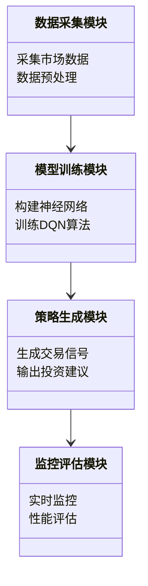

                 


```markdown
# 深度强化学习优化投资决策

> 关键词：深度强化学习，投资决策，DQN算法，马尔可夫决策过程，强化学习，神经网络

> 摘要：本文探讨了深度强化学习在投资决策中的应用，从基本概念到算法原理，再到系统设计和实战案例，详细分析了如何利用深度强化学习优化投资策略。通过DQN算法和马尔可夫决策过程的结合，展示了如何在复杂金融市场中实现智能投资决策。

---

# 正文

## 第一部分: 背景介绍

### 第1章: 深度强化学习与投资决策概述

#### 1.1 深度强化学习的基本概念
深度强化学习结合了深度学习和强化学习的优势，通过神经网络处理高维数据，并利用强化学习的策略优化方法，实现智能体在复杂环境中的自主决策。深度学习擅长处理非结构化数据，而强化学习通过与环境互动优化决策策略。

#### 1.2 投资决策的基本概念
投资决策涉及在金融市场中选择最优资产配置和交易策略，以实现收益最大化和风险最小化。传统的投资决策方法依赖于历史数据分析和统计模型，但面对复杂多变的市场环境，其局限性日益明显。

#### 1.3 深度强化学习在投资决策中的应用前景
深度强化学习在金融领域的应用潜力巨大，特别是在处理非线性关系和高维数据方面具有显著优势。通过深度强化学习，智能系统能够实时适应市场变化，优化投资策略。

---

## 第二部分: 核心概念与联系

### 第2章: 强化学习的原理与数学模型

#### 2.1 马尔可夫决策过程（MDP）
马尔可夫决策过程描述了智能体在环境中的决策过程，包括状态、动作、奖励和转移概率。通过状态转移和奖励函数，智能体学习最优策略。

**马尔可夫决策过程的数学表示：**
$$
\text{MDP} = (S, A, P, R, \gamma)
$$
其中，S是状态集合，A是动作集合，P是状态转移概率，R是奖励函数，γ是折扣因子。

#### 2.2 深度强化学习的核心原理
深度强化学习利用神经网络近似值函数或策略函数，通过经验回放和策略优化提升决策性能。

#### 2.3 深度强化学习与投资决策的联系
投资决策中的状态、动作和奖励可以映射到深度强化学习框架中。例如，状态可以是市场数据，动作是交易决策，奖励是投资回报。

---

## 第三部分: 深度强化学习算法原理

### 第3章: 深度Q网络（DQN）算法

#### 3.1 DQN算法的基本原理
DQN通过经验回放和双网络结构，稳定了训练过程。经验回放避免了策略过于依赖最新经验，双网络结构分离了当前策略和目标网络。

**DQN算法流程图：**


#### 3.2 DQN算法的数学模型
DQN的目标是最优化Q值函数，通过最小化预测Q值与实际奖励的差值。

$$
\text{损失函数} = \mathbb{E}[(r + \gamma Q(s', a') - Q(s, a))^2]
$$

---

## 第四部分: 系统分析与架构设计方案

### 第4章: 投资决策系统的架构设计

#### 4.1 系统功能设计
投资决策系统包括数据采集、模型训练、策略生成和监控评估四个模块。

**系统功能模块图：**



---

## 第五部分: 项目实战

### 第5章: 项目实现与案例分析

#### 5.1 项目环境安装
安装Python、TensorFlow和Keras等依赖库。

#### 5.2 核心代码实现
以下是一个简单的DQN算法实现示例：

```python
import numpy as np
import tensorflow as tf

class DQN:
    def __init__(self, state_space, action_space):
        self.state_space = state_space
        self.action_space = action_space
        self.model = self.build_model()

    def build_model(self):
        model = tf.keras.Sequential([
            tf.keras.layers.Dense(64, activation='relu', input_dim=self.state_space),
            tf.keras.layers.Dense(self.action_space, activation='linear')
        ])
        return model

    def remember(self, state, action, reward, next_state):
        # 经验回放机制
        pass

    def act(self, state):
        # 动作选择
        return self.model.predict(state)[0]

    def train(self, batch):
        # 网络训练
        pass
```

#### 5.3 案例分析
以股票交易为例，训练DQN模型选择买卖时机，通过回测验证模型的收益和风险表现。

---

## 第六部分: 最佳实践

### 第6章: 总结与展望

#### 6.1 小结
深度强化学习为投资决策提供了新的思路，但实际应用中仍面临数据质量、模型解释性和计算资源等挑战。

#### 6.2 注意事项
- 数据预处理和特征选择至关重要。
- 模型训练需要大量计算资源。
- 需要结合市场专家知识进行调优。

#### 6.3 拓展阅读
建议阅读深度强化学习的经典论文和相关金融应用案例。

---

# 结语

通过本文的详细讲解，读者可以系统地理解深度强化学习在投资决策中的应用，并掌握从理论到实践的完整流程。深度强化学习正在改变金融行业的决策方式，未来将有更多创新应用涌现。
```

