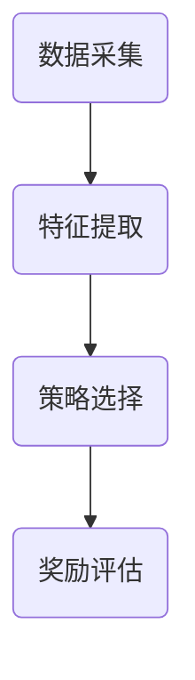
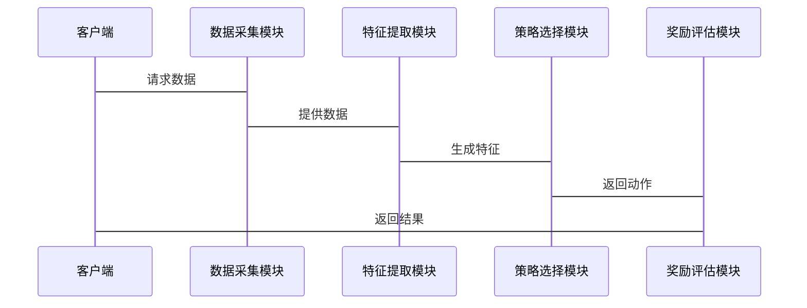

                 


# 深度强化学习在动态资产配置中的应用

> 关键词：深度强化学习，动态资产配置，金融投资，强化学习算法，神经网络

> 摘要：本文探讨了深度强化学习在动态资产配置中的应用，通过分析动态资产配置的背景、核心概念与算法原理，结合实际案例，展示深度强化学习在金融投资中的优势和挑战，提供系统架构设计和最佳实践的建议。

---

# 第1章: 动态资产配置与深度强化学习概述

## 1.1 动态资产配置的定义与特点

动态资产配置是指根据市场环境的变化，定期调整投资组合的配置比例，以优化风险和收益。其特点包括：

- **及时性**：根据市场变化快速调整。
- **适应性**：适用于多变的市场环境。
- **灵活性**：调整幅度较大，适应不同市场周期。

## 1.2 深度强化学习的基本概念

### 1.2.1 强化学习的定义

强化学习是一种通过智能体与环境互动，学习最优策略的方法。核心要素包括：

- **状态（State）**：当前环境的描述。
- **动作（Action）**：智能体的决策。
- **奖励（Reward）**：对决策的反馈。

### 1.2.2 深度学习与强化学习的区别

| 特性 | 深度学习 | 强化学习 |
|------|----------|----------|
| 数据 | 标签数据 | 奖励反馈 |
| 目标 | 分类/回归 | 最大化奖励 |

### 1.2.3 深度强化学习的核心思想

结合深度学习的特征提取能力与强化学习的策略优化能力，通过神经网络逼近策略函数。

## 1.3 深度强化学习在金融领域的应用前景

### 1.3.1 金融领域的复杂性与不确定性

金融市场受多种因素影响，具有高度不确定性。

### 1.3.2 深度强化学习在金融中的优势

- **非线性关系建模**：处理复杂市场关系。
- **实时决策能力**：适应市场变化。

### 1.3.3 动态资产配置中的挑战与机遇

- **挑战**：市场数据噪声多，策略漂移。
- **机遇**：利用深度强化学习优化配置。

---

# 第2章: 深度强化学习的核心概念

## 2.1 强化学习的基本原理

### 2.1.1 Q-learning算法的原理

通过Q值函数学习最优策略，公式为：

$$ Q(s, a) \leftarrow Q(s, a) + \alpha [r + \max Q(s', a') - Q(s, a)] $$

### 2.1.2 深度Q网络（DQN）的原理

利用神经网络近似Q值函数，结构包括经验回放和目标网络。

## 2.2 深度强化学习的核心算法

### 2.2.1 Actor-Critic算法的原理

结合Actor和Critic，通过策略梯度优化，公式为：

$$ \nabla \theta \leftarrow \nabla \log \pi_\theta(s) \cdot Q(s, a) $$

### 2.2.2 Policy Gradient方法的原理

直接优化策略，使用概率梯度下降。

### 2.2.3 A3C算法的原理

采用多线程异步更新，提升训练效率。

## 2.3 深度强化学习在动态资产配置中的应用

### 2.3.1 状态表示

将市场指标（如收益率、波动率）作为状态输入。

### 2.3.2 动作空间与奖励函数

- **动作空间**：资产配置比例。
- **奖励函数**：收益与风险的平衡，公式为：

$$ r = \text{收益} - \lambda \times \text{风险} $$

---

# 第3章: 深度强化学习算法的数学模型与公式

## 3.1 Q-learning算法的数学模型

- **Q值更新**：如前所述。
- **经验回放**：存储和重放经验以减少相关性。

## 3.2 DQN网络结构

- **输入层**：市场特征。
- **隐层**：神经网络处理。
- **输出层**：动作值。

## 3.3 Actor-Critic算法的数学模型

- **策略梯度**：优化策略参数。
- **价值函数**：评估状态价值。

---

# 第4章: 系统分析与架构设计方案

## 4.1 问题场景介绍

动态调整投资组合，应对市场波动。

## 4.2 系统功能设计

### 4.2.1 功能模块

- 数据采集：获取市场数据。
- 特征提取：生成输入特征。
- 策略选择：输出配置比例。

### 4.2.2 mermaid类图


## 4.3 系统架构设计

### 4.3.1 微服务架构

各功能模块独立，便于扩展和维护。

### 4.3.2 mermaid架构图



## 4.4 系统接口设计

### 4.4.1 API接口

- `/api/v1/data`：获取数据。
- `/api/v1/action`：返回动作。

## 4.5 系统交互流程图



---

# 第5章: 项目实战

## 5.1 环境安装

安装TensorFlow、Keras、numpy等库。

## 5.2 核心代码实现

### 5.2.1 数据预处理

```python
import numpy as np

def process_data(data):
    # 数据标准化
    return (data - np.mean(data)) / np.std(data)
```

### 5.2.2 神经网络模型

```python
import tensorflow as tf

model = tf.keras.Sequential([
    tf.keras.layers.Dense(64, activation='relu'),
    tf.keras.layers.Dense(10, activation='softmax')
])
```

## 5.3 案例分析

使用历史数据训练模型，测试其在不同市场环境下的表现。

## 5.4 结果分析

比较模型表现与传统方法的差异，总结优缺点。

---

# 第6章: 最佳实践

## 6.1 经验总结

- 模型调参的重要性。
- 数据质量的影响。

## 6.2 注意事项

- 模型过拟合风险。
- 市场环境变化的影响。

## 6.3 未来研究方向

- 更复杂的市场模型。
- 更高效的算法优化。

---

# 第7章: 附录

## 7.1 数据集

提供数据来源和预处理方法。

## 7.2 代码下载

链接到GitHub仓库。

## 7.3 参考文献

列出相关论文和书籍。

---

# 结语

通过系统化的分析和实践，深度强化学习在动态资产配置中展现出巨大潜力，但仍需进一步研究和优化。

---

希望这篇博客文章能为读者提供清晰的思路和详细的指导，帮助他们在动态资产配置领域应用深度强化学习。

