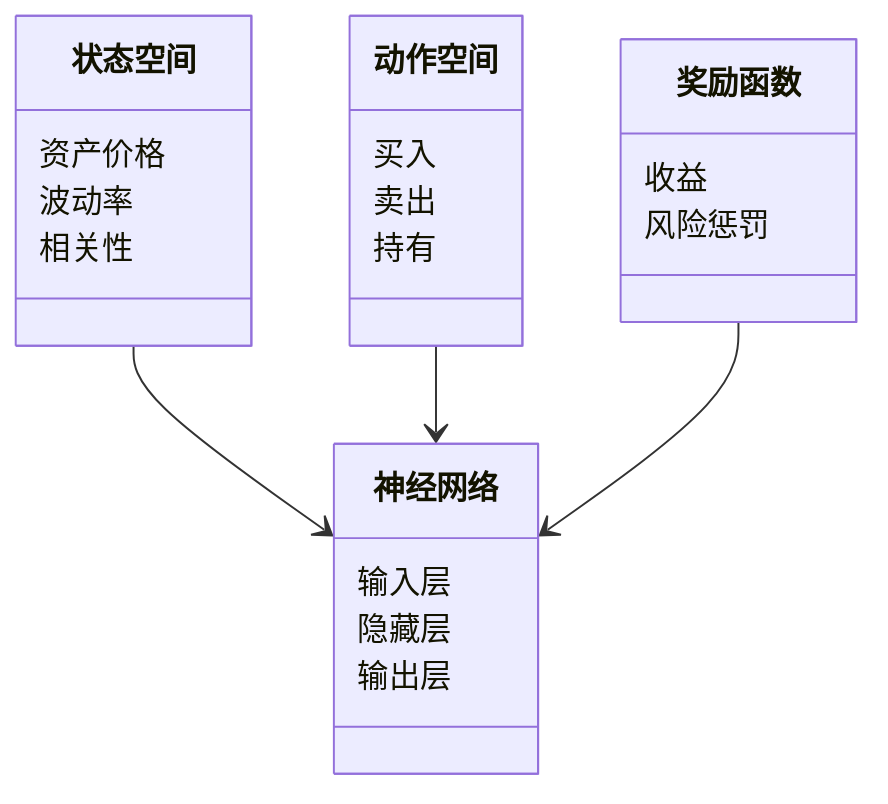
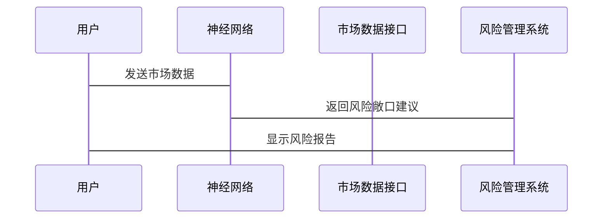

                 


# 深度强化学习在动态风险预算中的应用

> 关键词：深度强化学习，动态风险预算，投资组合优化，风险管理，人工智能

> 摘要：本文探讨了深度强化学习在动态风险预算中的应用，分析了深度强化学习的核心原理、动态风险预算的定义与特点，以及两者结合的实际应用案例。文章通过详细的算法流程图、数学模型和系统架构图，深入剖析了深度强化学习在动态风险预算中的优势与挑战，并通过实际案例展示了其在投资组合优化和风险管理中的应用效果。

---

# 第1章: 深度强化学习与动态风险预算概述

## 1.1 深度强化学习的基本概念

### 1.1.1 强化学习的定义与特点

- **定义**：强化学习是一种机器学习范式，通过智能体与环境的交互，学习如何通过执行动作来最大化累积奖励。
- **特点**：基于反馈机制，具有目标导向性和经验积累性。
- **与监督学习和无监督学习的区别**：强化学习通过环境反馈（奖励或惩罚）来调整策略，而监督学习依赖于标签数据，无监督学习则依赖于数据的内在结构。

### 1.1.2 深度强化学习的起源与发展

- **起源**：强化学习起源于20世纪50年代的马尔可夫决策过程（MDP）理论。
- **发展**：深度强化学习的兴起得益于深度学习在特征表示能力上的突破，如DQN算法的提出（2015年）。

### 1.1.3 深度强化学习的核心要素

- **状态（State）**：智能体所处的环境信息。
- **动作（Action）**：智能体在给定状态下采取的行为。
- **奖励（Reward）**：智能体行为的反馈，用于指导学习方向。
- **策略（Policy）**：决定动作选择的规则，可以是基于值函数的策略或直接参数化的策略。
- **值函数（Value Function）**：评估状态或动作-状态对的期望累积奖励。

## 1.2 动态风险预算的定义与特点

### 1.2.1 风险预算的基本概念

- **风险预算**：一种风险管理方法，通过设定和调整风险敞口的上限，来控制投资组合的风险暴露。
- **静态风险预算**：基于固定时间窗口或历史数据的风险敞口分配。
- **动态风险预算**：根据市场环境的变化实时调整风险敞口的分配。

### 1.2.2 动态风险预算的定义与特点

- **动态性**：根据市场波动实时调整风险敞口。
- **适应性**：能够根据市场环境的变化自适应地调整风险预算。
- **复杂性**：需要考虑多因素的动态交互，如市场波动率、资产相关性等。

### 1.2.3 动态风险预算与传统风险预算的区别

- **传统风险预算**：基于固定的历史数据或静态模型，调整周期较长。
- **动态风险预算**：实时跟踪市场变化，动态调整风险敞口。

## 1.3 深度强化学习在动态风险预算中的应用意义

### 1.3.1 动态风险预算的复杂性与挑战

- **市场波动**：金融市场的不确定性和波动性使得风险预算的动态调整具有挑战性。
- **多因素影响**：资产价格受多种因素影响，如宏观经济指标、市场情绪等。
- **非线性关系**：风险敞口与市场波动之间的关系往往是非线性的。

### 1.3.2 深度强化学习的优势与适用性

- **非线性建模能力**：深度神经网络能够捕捉复杂的非线性关系。
- **实时决策能力**：强化学习能够实时根据市场反馈调整策略。
- **自适应性**：通过与环境的交互，智能体能够自适应地调整风险敞口。

### 1.3.3 应用前景与研究现状

- **应用前景**：深度强化学习在动态风险预算中的应用潜力巨大，特别是在高频交易和实时风险控制领域。
- **研究现状**：目前已有部分研究将深度强化学习应用于动态风险预算，但仍有许多挑战需要克服，如模型的泛化能力、实时性等。

---

# 第2章: 深度强化学习的核心原理

## 2.1 强化学习的基本原理

### 2.1.1 状态、动作、奖励的定义

- **状态（State）**：智能体所处的环境信息，如金融市场中的资产价格、波动率等。
- **动作（Action）**：智能体在给定状态下采取的行为，如买入或卖出某资产。
- **奖励（Reward）**：智能体行为的反馈，如投资组合的收益或损失。

### 2.1.2 Q-learning算法的基本原理

- **Q-learning算法**：通过学习状态-动作对的值函数，找到最优策略。
- **值函数更新公式**：
  $$ Q(s, a) = Q(s, a) + \alpha [r + \gamma \max Q(s', a') - Q(s, a)] $$
  其中，$\alpha$ 是学习率，$\gamma$ 是折扣因子。

### 2.1.3 策略梯度方法的简介

- **策略梯度方法**：通过直接优化策略参数，最大化累积奖励。
- **策略函数**：$\pi(a|s)$，表示在状态$s$下选择动作$a$的概率。
- **目标函数**：$\max_{\theta} \mathbb{E}[R | \theta]}$

## 2.2 深度强化学习的算法框架

### 2.2.1 DQN算法的原理与流程

- **DQN算法**：通过深度神经网络近似值函数，实现离线学习。
- **算法流程图**：


### 2.2.2 策略网络与价值网络的对比

- **策略网络**：直接输出动作的概率分布。
- **价值网络**：输出状态-动作对的值函数。
- **对比表格**：

| 对比维度 | 策略网络 | 价值网络 |
|----------|----------|----------|
| 输出 | 动作概率分布 | 状态-动作值函数 |
| 优化目标 | 最大化累积奖励 | 最小化值函数预测误差 |
| 优势 | 直接指导动作选择 | 间接指导动作选择 |

### 2.2.3 最新算法进展与优化方法

- **算法进展**：如PPO、A2C、TRPO等，通过改进策略优化方法，提高算法稳定性。
- **优化方法**：使用经验回放、目标网络等技术，减少样本偏差，提高学习效率。

## 2.3 深度强化学习的数学模型

### 2.3.1 状态值函数的定义与公式

- **状态值函数**：$V(s) = \mathbb{E}[R | s]$，表示从状态$s$开始的期望累积奖励。
- **贝尔曼方程**：$V(s) = r + \gamma \max_a V(s')$

### 2.3.2 动作值函数的定义与公式

- **动作值函数**：$Q(s, a) = \mathbb{E}[R | s, a]$，表示在状态$s$下采取动作$a$的期望累积奖励。
- **贝尔曼方程**：$Q(s, a) = r + \gamma \max_{a'} Q(s', a')$

### 2.3.3 策略网络的数学表达

- **策略函数**：$\pi(a|s) = \text{softmax}(W s)$，其中$W$是网络参数。
- **目标函数**：$\mathcal{L} = -\sum_{t} \log \pi(a_t|s_t) Q(s_t, a_t)$

## 2.4 深度强化学习的神经网络结构

### 2.4.1 卷积神经网络在强化学习中的应用

- **CNN在图像处理中的应用**：用于处理高维状态空间，如金融市场中的多资产价格信息。
- **CNN结构**：通过卷积层提取局部特征，池化层降低维度。

### 2.4.2 循环神经网络在强化学习中的应用

- **RNN在序列数据中的应用**：用于处理时间序列数据，如历史价格数据。
- **LSTM结构**：通过门控机制捕捉长期依赖关系。

### 2.4.3 多层感知机在强化学习中的应用

- **MLP在低维状态中的应用**：适用于简单的状态空间，如单资产价格波动率。
- **MLP结构**：通过全连接层提取非线性特征。

---

# 第3章: 动态风险预算的核心原理

## 3.1 风险预算的基本原理

### 3.1.1 风险预算的定义与目标

- **风险预算**：一种风险管理方法，通过设定和调整风险敞口的上限，来控制投资组合的风险暴露。
- **目标**：在给定风险承受能力下，最大化投资组合的预期收益。

### 3.1.2 风险预算的计算方法

- **VaR（在险价值）**：衡量投资组合在一定置信水平下的潜在损失。
- **CVaR（条件在险价值）**：VaR的改进版本，衡量VaR以上的平均损失。

### 3.1.3 风险预算与投资组合优化的关系

- **投资组合优化**：通过调整资产配置，实现风险与收益的最优平衡。
- **风险预算的应用**：在投资组合优化中，设定每种资产的风险敞口上限。

## 3.2 动态风险预算的定义与特点

### 3.2.1 动态风险预算的动态调整机制

- **动态调整**：根据市场环境的变化，实时调整风险敞口的分配。
- **调整依据**：市场波动率、资产相关性、投资者风险偏好等。

### 3.2.2 动态风险预算与市场波动的关系

- **市场波动**：动态风险预算需要根据市场波动率实时调整风险敞口。
- **资产相关性**：市场波动率的增加可能导致资产相关性上升，进而影响风险敞口的分配。

### 3.2.3 动态风险预算的数学模型

- **风险预算模型**：$\sum_{i=1}^n w_i \sigma_i = C$，其中$w_i$是资产$i$的权重，$\sigma_i$是资产$i$的波动率，$C$是风险预算上限。
- **动态调整模型**：根据市场环境实时调整$C$的值。

## 3.3 动态风险预算的优化方法

### 3.3.1 基于均值-方差模型的优化方法

- **均值-方差模型**：通过优化投资组合的期望收益和方差，找到最优资产配置。
- **优化目标**：$\min_w w^T \Sigma w$，$\text{subject to } \mu^T w = \mu_{\text{target}}$

### 3.3.2 基于风险中性定价的优化方法

- **风险中性定价**：通过调整风险中性概率，优化投资组合的风险敞口。
- **优化目标**：$\min_w \text{Risk}(w)$，$\text{subject to } \mathbb{E}[R] = \text{target}$

### 3.3.3 基于动态规划的优化方法

- **动态规划**：通过分阶段决策，优化投资组合的风险敞口。
- **优化目标**：$\min_{w_t} \sum_{t=1}^T \text{Risk}(w_t)$，$\text{subject to } w_t \text{满足动态调整规则}$

---

# 第4章: 深度强化学习在动态风险预算中的应用

## 4.1 深度强化学习与动态风险预算的结合

### 4.1.1 深度强化学习在动态风险预算中的优势

- **非线性建模能力**：深度神经网络能够捕捉复杂的非线性关系。
- **实时决策能力**：强化学习能够实时根据市场反馈调整策略。
- **自适应性**：通过与环境的交互，智能体能够自适应地调整风险敞口。

### 4.1.2 动态风险预算对深度强化学习的需求

- **实时性**：需要实时调整风险敞口，对算法的计算效率有较高要求。
- **适应性**：需要根据市场环境的变化自适应地调整策略。
- **复杂性**：需要处理多因素的动态交互，对算法的复杂性有较高要求。

### 4.1.3 两者的结合方式与实现路径

- **结合方式**：通过构建金融市场环境，定义状态、动作和奖励，训练强化学习智能体来优化风险敞口。
- **实现路径**：
  1. 定义状态空间：如资产价格、波动率、相关性等。
  2. 定义动作空间：如买入或卖出某资产。
  3. 设定奖励函数：如投资组合的收益或损失。
  4. 训练智能体：通过强化学习算法优化风险敞口。

## 4.2 深度强化学习在动态风险预算中的具体应用

### 4.2.1 动态风险预算的实时调整与优化

- **实时调整**：根据市场波动实时调整风险敞口的分配。
- **优化方法**：通过深度强化学习优化风险预算模型，找到最优资产配置。

### 4.2.2 风险敏感型投资组合优化

- **风险敏感型优化**：在投资组合优化中，引入风险敏感函数，如VaR或CVaR。
- **优化目标**：$\min_w \text{VaR}(w) + \lambda \text{Return}(w)$，其中$\lambda$是风险厌恶系数。

### 4.2.3 风险预算的动态再平衡问题

- **动态再平衡**：根据市场环境的变化，实时调整资产配置。
- **再平衡策略**：基于强化学习智能体的决策，动态调整投资组合。

## 4.3 深度强化学习在动态风险预算中的算法实现

### 4.3.1 状态空间与动作空间的定义

- **状态空间**：金融市场中的资产价格、波动率、相关性等。
- **动作空间**：买入或卖出某资产，调整资产权重等。

### 4.3.2 奖励函数的设计与实现

- **奖励函数**：$r = \text{Return} - \lambda \text{Risk}$，其中$\lambda$是风险惩罚系数。
- **惩罚机制**：当投资组合的风险超过预算上限时，给予惩罚。

### 4.3.3 算法流程图


---

# 第5章: 系统分析与架构设计方案

## 5.1 问题场景介绍

### 5.1.1 问题背景

- **背景**：金融市场中的风险管理和投资组合优化是一个动态过程，需要实时调整。
- **问题**：如何利用深度强化学习技术，实现动态风险预算的优化。

### 5.1.2 系统目标

- **目标**：构建一个基于深度强化学习的动态风险预算系统，能够实时调整投资组合的风险敞口，实现风险与收益的最优平衡。

## 5.2 系统功能设计

### 5.2.1 领域模型



### 5.2.2 系统架构设计


### 5.2.3 系统接口设计

- **输入接口**：市场数据、用户指令。
- **输出接口**：投资组合建议、风险报告。

### 5.2.4 系统交互流程图



---

# 第6章: 项目实战

## 6.1 环境安装

### 6.1.1 安装Python环境

- **安装命令**：`python -m pip install --user pip`

### 6.1.2 安装深度强化学习库

- **库名称**：TensorFlow、Keras、OpenAI Gym
- **安装命令**：
  ```bash
  pip install tensorflow gym keras
  ```

## 6.2 系统核心实现源代码

### 6.2.1 强化学习智能体代码

```python
import numpy as np
import gym
from gym import spaces
from gym.utils import seeding
import tensorflow as tf
from tensorflow.keras import layers

# 定义强化学习智能体
class Agent:
    def __init__(self, state_space, action_space):
        self.state_space = state_space
        self.action_space = action_space
        self.model = self.build_model()
    
    def build_model(self):
        model = tf.keras.Sequential([
            layers.Dense(64, activation='relu', input_dim=self.state_space),
            layers.Dense(64, activation='relu'),
            layers.Dense(self.action_space, activation='linear')
        ])
        return model
    
    def act(self, state):
        state = tf.convert_to_tensor(state)
        with tf.GradientTape() as tape:
            logits = self.model(state)
            action = tf.argmax(logits, axis=1)
        return action.numpy()[0]
```

### 6.2.2 动态风险预算实现代码

```python
import numpy as np
import gym
from gym import spaces
from gym.utils import seeding
import tensorflow as tf
from tensorflow.keras import layers

# 定义动态风险预算环境
class RiskBudgetEnv(gym.Env):
    def __init__(self, assets=5, max_steps=100):
        super(RiskBudgetEnv, self).__init__()
        self.n_assets = assets
        self.max_steps = max_steps
        self.current_step = 0
        self.state = self._get_state()
        self.observation_space = spaces.Box(low=-1, high=1, shape=(self.n_assets,))  # 简化状态表示
        self.action_space = spaces.Discrete(3)  # 0: 买入，1: 卖出，2: 持有

    def _get_state(self):
        # 简化状态表示：假设资产价格标准化
        return np.random.randn(self.n_assets).astype(np.float32)

    def _take_action(self, action):
        # 简化动作执行：假设市场反应是随机的
        if action == 0:
            return 1.0  # 买入，获得正收益
        elif action == 1:
            return -1.0  # 卖出，获得负收益
        else:
            return 0.0  # 持有，无收益变化

    def step(self, action):
        self.current_step += 1
        reward = self._take_action(action)
        done = self.current_step >= self.max_steps
        info = {}
        return self.state, reward, done, info

    def reset(self):
        self.current_step = 0
        self.state = self._get_state()
        return self.state

# 初始化环境
env = RiskBudgetEnv()

# 初始化智能体
state_space = env.observation_space.shape[0]
action_space = env.action_space.n
agent = Agent(state_space, action_space)

# 训练智能体
for _ in range(100):
    state = env.reset()
    while not done:
        action = agent.act(state)
        next_state, reward, done, info = env.step(action)
        agent.model.fit(state, np.array([reward]), epochs=1, verbose=0)
        state = next_state
```

### 6.2.3 代码应用解读与分析

- **智能体代码**：定义了一个简单的深度神经网络，用于预测动作。
- **环境代码**：定义了一个动态风险预算环境，包含状态空间和动作空间。
- **训练过程**：通过强化学习算法，训练智能体在动态风险预算环境中做出最优决策。

## 6.3 实际案例分析和详细讲解剖析

### 6.3.1 实际案例分析

- **案例背景**：假设有一个包含5种资产的投资组合，市场波动率较高，需要动态调整风险敞口。
- **智能体决策**：智能体通过观察资产价格波动率，实时调整买入或卖出决策，以优化投资组合的风险收益比。

### 6.3.2 详细讲解剖析

- **状态空间**：资产价格标准化后的数值。
- **动作空间**：0代表买入，1代表卖出，2代表持有。
- **奖励函数**：投资组合的收益减去风险惩罚。

## 6.4 项目小结

- **项目目标**：实现一个基于深度强化学习的动态风险预算系统。
- **项目成果**：通过训练智能体，能够在动态市场环境中实时调整风险敞口，优化投资组合的收益与风险比。

---

# 第7章: 总结与展望

## 7.1 总结

- **深度强化学习的优势**：非线性建模能力、实时决策能力、自适应性。
- **动态风险预算的应用**：在金融市场的实时风险控制中具有巨大潜力。
- **结合意义**：通过深度强化学习优化动态风险预算，能够实现投资组合的风险收益比的最优平衡。

## 7.2 展望

- **未来研究方向**：
  - 提高算法的泛化能力，使其适用于不同市场环境。
  - 提升算法的实时性，适用于高频交易。
  - 结合其他风险管理技术，如情景分析、压力测试等。
- **发展趋势**：随着深度强化学习技术的不断进步，动态风险预算在金融风险管理中的应用将越来越广泛和深入。

---

# 参考文献

（此处列出相关文献和资料）

---

# 附录

（此处列出附录内容，如代码、数据等）

