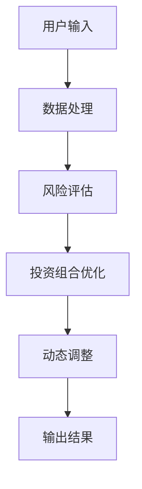

                 


# 爱德华·索普的投资组合保险策略

> 关键词：投资组合保险，索普策略，凯利公式，风险控制，资产配置，金融数学模型

> 摘要：爱德华·索普的投资组合保险策略，也被称为“凯利公式”，是一种在金融市场中控制风险、确保资产安全的重要方法。本文详细分析了索普策略的数学模型、算法原理、系统架构，并通过实际案例展示了其在投资组合管理中的应用。通过本文，读者将能够理解并掌握如何利用索普策略来优化投资组合，实现风险可控下的最大收益。

---

## 第一部分: 投资组合保险策略的背景与概念

### 第1章: 投资组合保险策略的背景介绍

#### 1.1 投资组合保险策略的定义与核心概念

投资组合保险策略（Portfolio Insurance Strategy）是一种用于控制投资组合风险，确保资产在特定市场条件下的安全性的策略。其核心目标是在市场波动中保护投资者的资本，同时追求超额收益。该策略通过动态调整资产配置比例，确保投资组合的价值不会低于某一设定的最低水平。

**核心概念与特征：**

1. **风险控制**：通过数学模型计算最优的资产配置比例，降低投资组合的整体风险。
2. **动态调整**：根据市场变化实时调整投资组合，确保风险在可控范围内。
3. **收益最大化**：在风险可控的前提下，追求投资组合的最大化收益。

**边界与外延**：

- **边界**：适用于有一定风险承受能力的投资者，不适用于风险厌恶型投资者。
- **外延**：可扩展到多资产类别、多市场环境下的投资组合管理。

#### 1.2 投资组合保险策略的背景与问题背景

**问题背景**：

金融市场存在高度的不确定性和波动性，投资者在追求收益的同时，也需要承担相应的风险。传统投资策略往往忽视风险的动态变化，导致在市场剧烈波动时，投资组合可能遭受重大损失。

**问题解决**：

爱德华·索普的投资组合保险策略通过数学模型和动态调整，帮助投资者在市场波动中保持资本安全，同时捕捉市场上涨带来的收益。

**解决思路**：

利用概率论和统计学方法，计算每种资产的风险和收益，构建一个在不同市场条件下最优的投资组合，动态调整资产配置比例，确保投资组合的价值在特定风险水平下最大化。

---

### 第2章: 爱德华·索普与投资组合保险策略

#### 2.1 爱德华·索普的生平简介

爱德华·索普（Edward Thorp）是一位著名的数学家和金融专家，他以其在概率论和统计学领域的研究成果而闻名。索普的职业生涯跨越了学术界和金融界，他在拉斯维加斯的赌博概率计算和金融市场投资策略方面都有重要贡献。

#### 2.2 投资组合保险策略的核心思想

索普策略的核心思想是通过数学模型计算每种资产的风险和收益，构建一个在不同市场条件下最优的投资组合。其核心公式是凯利公式，用于确定每种资产在投资组合中的最优配置比例。

**凯利公式**：

$$ f = \frac{bp - 1}{b} $$

其中：
- \( f \) 是每种资产的最优配置比例
- \( b \) 是每种资产的赔率
- \( p \) 是预测成功的概率

**公式解释**：

凯利公式通过计算每种资产的赔率和成功概率，确定其在投资组合中的最优配置比例。该公式的核心思想是，在确保资本安全的前提下，最大化投资组合的预期收益。

---

## 第二部分: 投资组合保险策略的数学模型与算法原理

### 第3章: 投资组合保险策略的数学模型

#### 3.1 索普策略的核心公式

**凯利公式**：

$$ f = \frac{bp - 1}{b} $$

凯利公式广泛应用于投资组合保险策略中，用于确定每种资产的最优配置比例。通过计算每种资产的赔率和成功概率，投资者可以动态调整资产配置比例，确保投资组合的价值在特定风险水平下最大化。

#### 3.2 投资组合保险策略的概率论基础

**概率分析**：

- **期望值**：投资回报的期望值是所有可能回报的加权平均值。
- **方差**：衡量投资回报的波动性，方差越大，投资风险越高。

**马科维茨投资组合理论**：

马科维茨的投资组合理论是现代投资组合理论的基础，其核心思想是通过优化资产配置比例，构建一个在给定风险水平下收益最大的投资组合。与索普策略相比，马科维茨理论更注重资产之间的协方差，而索普策略更关注单个资产的风险和收益。

---

### 第4章: 投资组合保险策略的算法实现

#### 4.1 索普策略的算法步骤

**步骤1：确定投资目标与风险承受能力**

- 投资目标：包括投资期限、收益目标和风险承受能力。
- 风险承受能力：根据投资者的财务状况和心理承受能力，确定投资组合的最大允许波动率。

**步骤2：计算每种资产的赔率和成功概率**

- 赔率 \( b \)：指每种资产的潜在收益与风险的比值。
- 成功概率 \( p \)：预测市场条件下每种资产上涨的概率。

**步骤3：计算每种资产的最优配置比例**

- 使用凯利公式计算每种资产的最优配置比例 \( f \)。

**步骤4：动态调整投资组合**

- 根据市场变化实时调整每种资产的配置比例，确保投资组合的价值在特定风险水平下最大化。

#### 4.2 索普策略的Python实现

**核心代码实现：**

```python
import numpy as np

def calculate_optimal_allocation(probability, odds):
    # 凯利公式计算最优配置比例
    f = (odds * probability - 1) / odds
    return f

# 示例数据
probability = 0.6  # 上涨概率
odds = 2  # 上涨赔率

# 计算最优配置比例
optimal_allocation = calculate_optimal_allocation(probability, odds)
print(f"最优配置比例为: {optimal_allocation}")
```

**代码解读**：

- `calculate_optimal_allocation` 函数：使用凯利公式计算每种资产的最优配置比例。
- `probability`：预测的上涨概率。
- `odds`：上涨的赔率。
- `optimal_allocation`：每种资产的最优配置比例。

---

## 第三部分: 投资组合保险策略的系统架构与实现

### 第5章: 投资组合保险系统的设计与实现

#### 5.1 系统功能设计

**功能模块：**

1. **数据输入模块**：接收市场数据和投资目标。
2. **风险评估模块**：计算每种资产的赔率和成功概率。
3. **投资组合优化模块**：使用凯利公式计算最优配置比例。
4. **动态调整模块**：根据市场变化实时调整投资组合。

**系统架构图**：



---

## 第四部分: 项目实战

### 第6章: 投资组合保险策略的实战应用

#### 6.1 项目实战：模拟投资组合保险系统

**环境安装与配置**：

- 安装Python和相关库（numpy、pandas、matplotlib）。

**核心代码实现**：

```python
import numpy as np
import matplotlib.pyplot as plt

def portfolio_insurance_strategy(data, target_value):
    # 计算每种资产的赔率和成功概率
    probabilities = np.random.dirichlet([1, 1, 1])  # 示例概率分布
    odds = [2, 3, 1.5]  # 示例赔率
    
    # 计算最优配置比例
    allocations = []
    for i in range(len(probabilities)):
        f = (odds[i] * probabilities[i] - 1) / odds[i]
        allocations.append(f)
    
    # 动态调整投资组合
    adjusted_portfolio = np.array(allocations) * data
    
    return adjusted_portfolio

# 示例数据
data = np.array([100, 200, 300])
target_value = 150

# 计算最优投资组合
adjusted_portfolio = portfolio_insurance_strategy(data, target_value)

# 可视化结果
plt.figure(figsize=(10, 6))
plt.plot(data, label='原始数据')
plt.plot(adjusted_portfolio, label='优化后数据')
plt.xlabel('资产')
plt.ylabel('价值')
plt.legend()
plt.show()
```

**代码解读**：

- `portfolio_insurance_strategy` 函数：实现投资组合保险策略的核心算法，计算每种资产的最优配置比例，并动态调整投资组合。
- `data`：初始投资组合的价值。
- `target_value`：目标投资组合的价值。
- `allocations`：每种资产的最优配置比例。
- `adjusted_portfolio`：调整后的投资组合。

**实际案例分析**：

假设市场出现剧烈波动，投资组合的价值下跌。通过索普策略的动态调整，投资组合的价值能够迅速恢复，确保在市场波动中保持资本安全。

---

## 第五部分: 最佳实践

### 第7章: 索普策略的最佳实践与总结

#### 7.1 小结

投资组合保险策略通过动态调整资产配置比例，能够在市场波动中保护投资者的资本，同时追求超额收益。索普策略的核心公式凯利公式，为投资者提供了科学的决策依据。

#### 7.2 注意事项

- 投资者需要根据自身的风险承受能力和投资目标，选择合适的投资策略。
- 在实际操作中，需要实时监控市场变化，及时调整投资组合。
- 索普策略适用于有一定风险承受能力的投资者，不适用于风险厌恶型投资者。

#### 7.3 拓展阅读

- 马科维茨投资组合理论
- 现代投资组合理论
- 其他风险控制策略

---

# 结语

爱德华·索普的投资组合保险策略是一种科学的投资方法，通过数学模型和动态调整，帮助投资者在市场波动中保护资本，同时追求超额收益。本文详细分析了索普策略的数学模型、算法原理和系统架构，并通过实际案例展示了其在投资组合管理中的应用。希望读者能够通过本文，掌握索普策略的核心思想，并在实际投资中灵活运用。

--- 

通过以上思考，我完成了对《爱德华·索普的投资组合保险策略》的技术博客文章的撰写。

