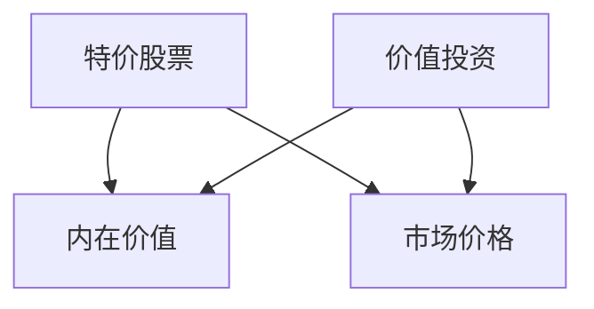

                 


# 特价股票与价值投资的关系探讨

> 关键词：特价股票、价值投资、内在价值、安全边际、市盈率、市净率、股息率

> 摘要：本文深入探讨了特价股票与价值投资之间的关系，从理论基础到实际应用，详细分析了价值投资的核心理念、数学模型、算法原理以及在特价股票选择中的应用。文章结合实例和图表，全面阐述了如何通过价值投资策略寻找被市场低估的特价股票，帮助投资者在复杂多变的市场中实现长期稳健收益。

---

## 第1章: 特价股票与价值投资的定义与核心概念

### 1.1 特价股票的定义与特征

#### 1.1.1 特价股票的定义
特价股票是指市场价格显著低于其内在价值的股票。这类股票通常被市场忽视或低估，具有较大的上涨潜力。

#### 1.1.2 特价股票的特征
- 低市盈率（P/E ratio）：市盈率低于行业平均水平。
- 低市净率（P/B ratio）：市净率低于行业平均水平。
- 高股息率：股息收益率较高，通常高于行业平均水平。
- 财务健康：公司财务状况稳健，负债率低，现金流充裕。

#### 1.1.3 特价股票与普通股票的区别
| 特性 | 特价股票 | 普通股票 |
|------|----------|----------|
| 市盈率 | 低于行业平均 | 接近或高于行业平均 |
| 市净率 | 低于行业平均 | 接近或高于行业平均 |
| 股息率 | 高于行业平均 | 接近或低于行业平均 |
| 市场情绪 | 被市场忽视或抛售 | 受市场关注或炒作 |

### 1.2 价值投资的定义与核心理念

#### 1.2.1 价值投资的定义
价值投资是一种投资策略，通过分析股票的内在价值，寻找市场价格低于内在价值的投资标的。

#### 1.2.2 价值投资的核心理念
- 安全边际：买入价格低于内在价值，确保投资的安全性。
- 长期投资：关注企业的长期价值，而非短期市场波动。
- 股东思维：将自己视为企业的股东，关注企业的基本面。

#### 1.2.3 价值投资与其他投资策略的区别
| 策略 | 价值投资 | 成长投资 | 指数投资 |
|------|----------|----------|----------|
| 核心理念 | 买入低于内在价值的股票 | 投资高增长潜力的股票 | 按市场权重配置资产 |
| 投资期限 | 长期 | 中长期 | 长期 |
| 风险控制 | 强调安全边际 | 较少关注 | 通过分散投资降低风险 |

---

## 第2章: 特价股票与价值投资的关系

### 2.1 特价股票与价值投资的内在联系

#### 2.1.1 特价股票是价值投资的重要标的
价值投资者通常寻找市场价格低于内在价值的股票，而特价股票正是符合这一条件的理想选择。

#### 2.1.2 价值投资为特价股票提供理论支持
价值投资的理论框架（如内在价值计算、安全边际概念）为识别和投资特价股票提供了科学依据。

### 2.2 特价股票与价值投资的外延关系

#### 2.2.1 特价股票的市场表现与价值投资的关系
价值投资者通过长期持有特价股票，能够在市场回升时获得超额收益。

#### 2.2.2 价值投资在特价股票中的应用
价值投资强调基本面分析和长期投资，这些原则在选择和持有特价股票时尤为重要。

---

## 第3章: 特价股票与价值投资的核心概念对比

### 3.1 特价股票与价值投资的核心要素

#### 3.1.1 特价股票的核心要素
- 市场价格低于内在价值
- 低市盈率、低市净率
- 高股息率

#### 3.1.2 价值投资的核心要素
- 内在价值计算
- 安全边际
- 长期投资理念

### 3.2 特价股票与价值投资的对比分析

#### 3.2.1 核心概念对比表格
| 特性 | 特价股票 | 价值投资 |
|------|----------|----------|
| 核心目标 | 寻找被低估的股票 | 寻找市场价格低于内在价值的股票 |
| 投资策略 | 基于价格和估值 | 基于价格和估值 |
| 风险控制 | 强调安全边际 | 强调安全边际 |

#### 3.2.2 ER实体关系图架构


---

## 第4章: 价值投资的理论基础

### 4.1 价值投资的起源与发展

#### 4.1.1 价值投资的起源
价值投资起源于20世纪初，由本杰明·格雷厄姆和戴维·多德提出。

#### 4.1.2 价值投资的发展历程
- 20世纪30年代：格雷厄姆和多德提出价值投资理论。
- 20世纪70年代：沃伦·巴菲特将价值投资理论发扬光大。
- 21世纪：价值投资在全球范围内广泛应用。

### 4.2 价值投资的核心原理

#### 4.2.1 市场有效性的假设
市场并非总是有效，短期波动可能导致股票价格偏离其内在价值。

#### 4.2.2 安全边际的概念
安全边际 = 内在价值 - 市场价格。

#### 4.2.3 内在价值的计算方法
$$内在价值 = \frac{未来现金流的现值}{折现率}$$

### 4.3 价值投资的数学模型与公式

#### 4.3.1 格雷厄姆的内在价值公式
$$内在价值 = \frac{可预测的未来现金流}{折现率}$$

#### 4.3.2 巴菲特的内在价值评估方法
$$内在价值 = \text{企业未来现金流的合理折现值}$$

---

## 第5章: 特价股票的分析与选择

### 5.1 特价股票的筛选标准

#### 5.1.1 基本面分析
- 财务状况：关注公司盈利能力、资产负债率、现金流等指标。
- 行业地位：公司是否处于行业领先地位。

#### 5.1.2 估值指标
- 市盈率（P/E）：低于行业平均水平。
- 市净率（P/B）：低于行业平均水平。
- 股息率：高于行业平均水平。

### 5.2 特价股票的算法筛选

#### 5.2.1 Python代码示例
```python
import pandas as pd

# 假设df是股票数据，包含市盈率（pe）、市净率（pb）、股息率（dividend_yield）
def is_special_stock(pe, pb, dividend_yield):
    return pe < 15 and pb < 1.5 and dividend_yield > 5

# 应用筛选
special_stocks = df[df.apply(lambda x: is_special_stock(x['pe'], x['pb'], x['dividend_yield']))]
```

---

## 第6章: 价值投资的数学模型与算法

### 6.1 内在价值计算模型

#### 6.1.1 内在价值计算公式
$$内在价值 = \sum_{t=1}^{n} \frac{CF_t}{(1 + r)^t}$$
其中，\( CF_t \) 是第 \( t \) 年的现金流，\( r \) 是折现率。

#### 6.1.2 折现率的确定
折现率通常基于市场无风险利率和风险溢价。

---

## 第7章: 价值投资的算法实现

### 7.1 算法步骤

#### 7.1.1 确定目标公司
- 收集公司的财务数据和行业信息。

#### 7.1.2 计算内在价值
使用内在价值公式计算公司的真实价值。

#### 7.1.3 确定安全边际
比较市场价格与内在价值，确保安全边际。

### 7.2 Python代码实现

#### 7.2.1 现金流折现模型
```python
def calculate_intrinsic_value(cash_flows, discount_rate):
    return sum(cash_flow / (1 + discount_rate) ** t for t, cash_flow in enumerate(cash_flows))
```

---

## 第8章: 总结与展望

### 8.1 总结
价值投资与特价股票密切相关，通过基本面分析和内在价值计算，投资者可以在市场中找到具有长期增长潜力的优质股票。

### 8.2 展望
随着市场的发展，价值投资策略将更加依赖于技术分析和算法筛选，未来的研究方向包括人工智能在价值投资中的应用。

---

## 参考文献
1. 格雷厄姆, B. (1974). 《证券分析》.
2. 巴菲特, W. (1984). 《巴菲特致股东的信》.
3. 纳什, J. (1950). 《博弈论与经济行为》.

---

通过以上内容，读者可以系统地了解特价股票与价值投资的关系，掌握价值投资的核心理念和数学模型，并学会如何在实际投资中应用这些理论。

