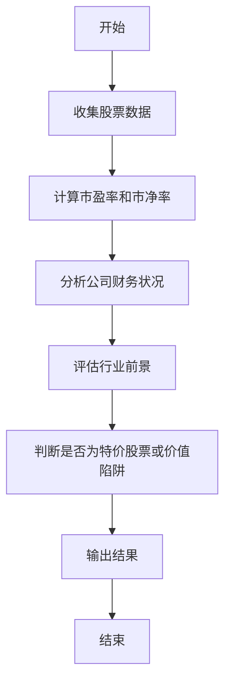
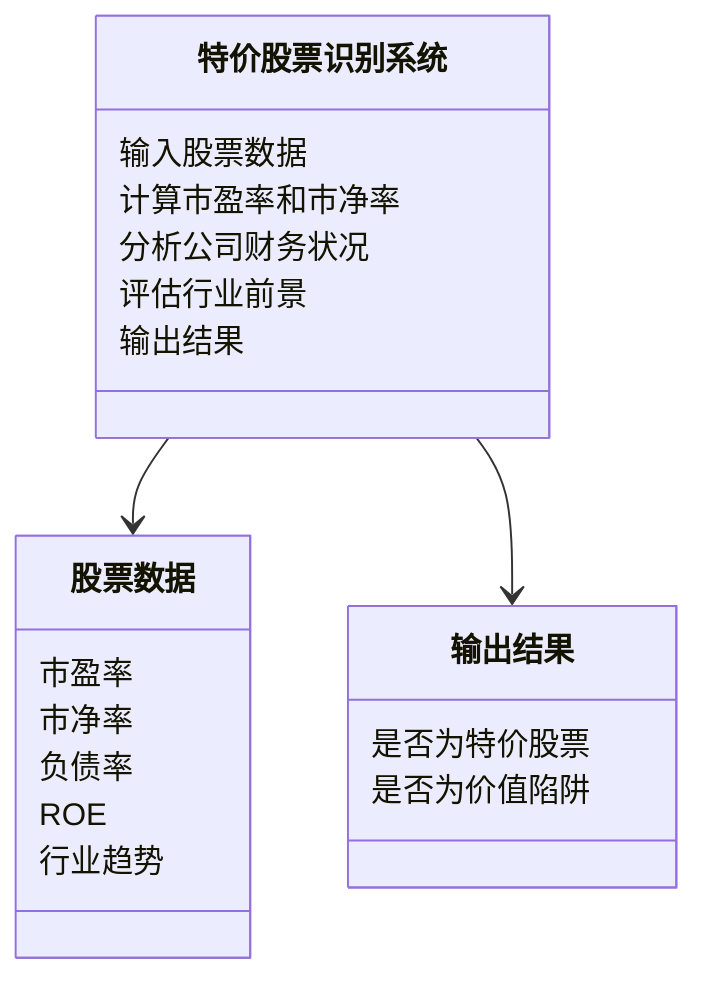

                 


# 特价股票与价值陷阱的区分方法

## 关键词：股票分析、投资策略、价值陷阱、特价股票、基本面分析

## 摘要：本文详细介绍了如何区分特价股票与价值陷阱，通过背景介绍、核心概念、算法原理、数学模型、系统架构、项目实战和最佳实践等多方面进行分析。文章旨在帮助投资者避免价值陷阱，识别真正的特价股票，从而做出更明智的投资决策。

---

## 第一部分：背景介绍

### 第1章：特价股票与价值陷阱的定义与背景

#### 1.1 问题背景

股票市场是投资者追求财富增长的重要途径，但其中充满了各种风险和挑战。投资者在寻找低价股票时，常常会遇到两类股票：特价股票和价值陷阱。区分这两者至关重要，因为错误的判断可能导致重大损失。

- **1.1.1 股票投资的基本概念**
  股票代表了对一家公司的所有权，投资者通过购买股票成为公司的股东，享有分红和资本增值的权利。股票价格受多种因素影响，包括公司业绩、行业趋势、宏观经济环境等。

- **1.1.2 什么是特价股票**
  特价股票指的是市场价格低于其内在价值的股票。这类股票通常被视为被市场低估，具有较大的增值潜力。投资者在发现这类股票时，可能会认为这是一个买入的好机会。

- **1.1.3 什么是价值陷阱**
  价值陷阱是指那些看似便宜，但实际上存在严重问题的股票。这些股票的低价格可能是由于公司基本面恶化、行业竞争加剧或其他负面因素导致的。买入价值陷阱可能会导致本金损失。

- **1.1.4 区分的重要性**
  正确区分特价股票和价值陷阱可以帮助投资者避免重大损失，抓住真正的投资机会。投资者需要通过深入分析公司的财务状况、行业地位和市场前景来做出判断。

#### 1.2 问题描述

投资者在寻找低价股票时，常常会被特价股票和价值陷阱混淆。这种混淆可能导致投资者做出错误的决策，从而影响投资收益。

- **1.2.1 投资者为何容易混淆特价股票与价值陷阱**
  一些投资者仅关注股票的市场价格，而忽视了公司的基本面。他们可能误以为低价股票就是特价股票，而没有考虑到公司是否存在潜在的问题。

- **1.2.2 价值陷阱的常见类型**
  价值陷阱可能包括财务状况不佳、行业竞争加剧、政策变化等。投资者需要识别这些潜在风险，避免被低价迷惑。

- **1.2.3 特价股票的潜在机会**
  特价股票通常意味着公司具有未被市场充分认识到的价值，投资者可以通过长期持有来获得资本增值。

#### 1.3 问题解决

通过基本面分析和深入研究，投资者可以有效区分特价股票和价值陷阱。

- **1.3.1 通过基本面分析区分两者**
  基本面分析包括对公司财务状况、行业地位、管理团队和市场前景的评估。投资者需要分析公司的收入、利润、负债和现金流等关键指标。

- **1.3.2 利用技术分析辅助判断**
  技术分析通过研究股票价格走势和成交量变化，帮助投资者识别股票的买卖信号。结合技术分析和基本面分析，投资者可以更准确地判断股票的价值。

- **1.3.3 组合策略的应用**
  投资者可以采用多元化的投资策略，分散投资风险。例如，投资多个行业的股票，避免过度集中于某一领域。

---

## 第二部分：核心概念与联系

### 第2章：特价股票与价值陷阱的核心概念

#### 2.1 核心概念原理

特价股票和价值陷阱在本质上存在显著差异。特价股票具有较高的内在价值，而价值陷阱则由于公司或行业的负面因素导致价格被低估。

- **2.1.1 特价股票的核心特征**
  特价股票通常具有较高的股息收益率、较低的市盈率和市净率，且公司财务状况健康，行业地位稳固。这些特征使得特价股票具有较高的投资价值。

- **2.1.2 价值陷阱的核心特征**
  价值陷阱的股票往往存在高负债、低利润 margins、盈利能力下降等问题。此外，行业竞争加剧、政策变化等外部因素也可能导致股票价格被低估。

- **2.1.3 两者之间的本质区别**
  特价股票是被市场低估的优质股票，而价值陷阱是由于公司或行业问题导致的虚假低价。区分两者的关键在于深入分析公司的基本面。

#### 2.2 概念属性对比表格

以下是特价股票与价值陷阱的属性对比表：

| 属性                | 特价股票                         | 价值陷阱                         |
|---------------------|----------------------------------|----------------------------------|
| 市盈率（P/E）       | 低于行业平均水平                | 低于行业平均水平，但公司盈利下降 |
| 市净率（P/B）       | 低于行业平均水平                | 低于行业平均水平，但资产质量下降 |
| 盈利能力             | 利润 margins 稳定或增长          | 利润 margins 下降或亏损          |
| 负债水平             | 负债合理，财务状况健康           | 负债过高，财务状况恶化           |
| 管理团队             | 管理团队稳定且有良好的往绩        | 管理团队存在问题或不佳的往绩       |
| 行业前景             | 行业前景良好，市场需求稳定       | 行业前景不佳，市场需求下降       |

#### 2.3 ER实体关系图

使用mermaid绘制特价股票与价值陷阱的实体关系图：

```mermaid
erDiagram
    class 特价股票 {
        市盈率低
        盈利能力稳定
        负债合理
        行业前景良好
    }
    class 价值陷阱 {
        市盈率低
        盈利能力下降
        负债过高
        行业前景不佳
    }
    特价股票 --|{区分特征} 价值陷阱
```

---

## 第三部分：算法原理讲解

### 第3章：区分特价股票与价值陷阱的算法原理

#### 3.1 算法流程

使用mermaid绘制区分特价股票与价值陷阱的算法流程图：



#### 3.2 算法实现

以下是使用Python实现的区分算法：

```python
import pandas as pd

def is_value_trap(stock_data):
    # 计算市盈率和市净率
    pe = stock_data['市盈率']
    pb = stock_data['市净率']
    roe = stock_data['ROE']
    debt_to_eq = stock_data['负债率']
    industry_trend = stock_data['行业趋势']

    # 判断是否为价值陷阱
    if pe < industry_pe_avg and pb < industry_pb_avg:
        if roe < 5 and debt_to_eq > 60 and industry_trend == '下降':
            return True
    return False

# 示例数据
stock_data = {
    '市盈率': 12,
    '市净率': 1.5,
    'ROE': 4,
    '负债率': 70,
    '行业趋势': '下降'
}

industry_pe_avg = 15
industry_pb_avg = 2

is_trap = is_value_trap(stock_data)
print(f"是否为价值陷阱：{is_trap}")
```

---

## 第四部分：数学模型与公式

### 第4章：数学模型与公式

#### 4.1 市盈率（P/E）计算公式

市盈率是股票价格与每股收益（EPS）的比率：

$$ P/E = \frac{股票价格}{每股收益} $$

#### 4.2 市净率（P/B）计算公式

市净率是股票价格与每股净资产（BPS）的比率：

$$ P/B = \frac{股票价格}{每股净资产} $$

#### 4.3 盈利能力分析

通过分析利润 margins 和 ROE（净资产收益率）来评估公司的盈利能力：

$$ ROE = \frac{净利润}{股东权益} $$

#### 4.4 负债率分析

负债率是公司负债总额与资产总额的比率：

$$ 负债率 = \frac{负债总额}{资产总额} $$

---

## 第五部分：系统分析与架构设计

### 第5章：系统分析与架构设计

#### 5.1 系统功能设计

使用mermaid绘制系统功能类图：



#### 5.2 系统架构设计

使用mermaid绘制系统架构图：

```mermaid
archiDiagram
    component 特价股票识别系统 {
        module 数据输入
        module 数据处理
        module 分析模块
        module 输出模块
    }
    component 数据输入 {
        接收股票数据
    }
    component 数据处理 {
        计算市盈率和市净率
    }
    component 分析模块 {
        分析财务状况和行业前景
    }
    component 输出模块 {
        输出结果
    }
```

---

## 第六部分：项目实战

### 第6章：项目实战

#### 6.1 环境安装

需要安装以下Python库：

```bash
pip install pandas numpy matplotlib
```

#### 6.2 系统核心实现源代码

以下是项目的核心代码：

```python
import pandas as pd
import numpy as np

def analyze_stock(stock_data):
    pe = stock_data['市盈率']
    pb = stock_data['市净率']
    roe = stock_data['ROE']
    debt_to_eq = stock_data['负债率']
    industry_trend = stock_data['行业趋势']

    # 判断是否为特价股票
    if pe < np.mean(pe_industry) and pb < np.mean(pb_industry):
        if roe > 10 and debt_to_eq < 50 and industry_trend == '上升':
            return '特价股票'
    return '价值陷阱'

# 示例数据
data = {
    '股票代码': ['A', 'B', 'C'],
    '市盈率': [10, 15, 20],
    '市净率': [1.2, 1.5, 1.8],
    'ROE': [15, 12, 8],
    '负债率': [40, 60, 70],
    '行业趋势': ['上升', '稳定', '下降']
}

df = pd.DataFrame(data)
pe_industry = [12, 14, 16]
pb_industry = [1.4, 1.6, 1.8]

for index, row in df.iterrows():
    result = analyze_stock(row)
    print(f"股票 {row['股票代码']}：{result}")
```

#### 6.3 案例分析

以某公司为例，分析其是否为特价股票或价值陷阱：

1. 收集公司数据
2. 计算市盈率、市净率、ROE等指标
3. 分析行业趋势和公司财务状况
4. 得出结论

---

## 第七部分：最佳实践

### 第7章：最佳实践

#### 7.1 投资策略

- **多元化投资**：不要将所有资金投入到单一股票或行业，分散投资以降低风险。
- **长期持有**：特价股票通常需要时间来实现价值，投资者应具备耐心。
- **持续监控**：定期审视投资组合，及时调整策略。

#### 7.2 注意事项

- **避免贪便宜**：低价并不等于价值，投资者需深入分析公司基本面。
- **关注行业动态**：不同行业受经济周期影响不同，需关注行业趋势。
- **保持理性**：市场波动可能导致股价短期偏离内在价值，投资者需避免情绪化决策。

#### 7.3 拓展阅读

- 建议阅读《投资学基础》、《价值投资入门》等书籍，深入了解股票分析方法。

---

## 结论

区分特价股票与价值陷阱需要投资者具备扎实的金融知识和分析能力。通过本文的系统介绍，投资者可以更好地识别特价股票，避免价值陷阱，从而做出更明智的投资决策。记住，投资不仅仅是寻找低价股票，更是寻找具有持续增长潜力和良好基本面的公司。

