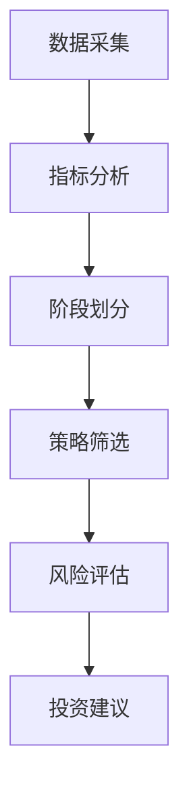
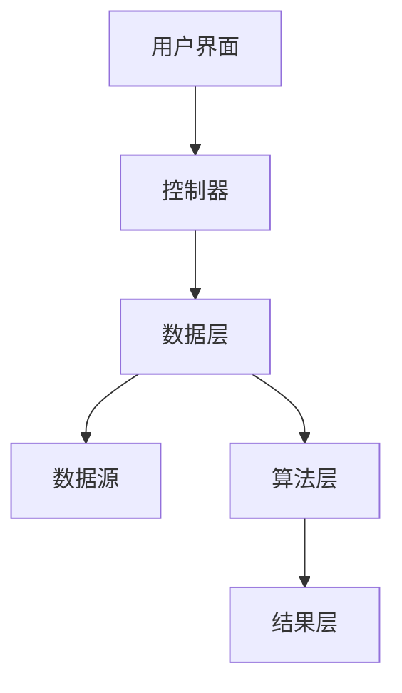
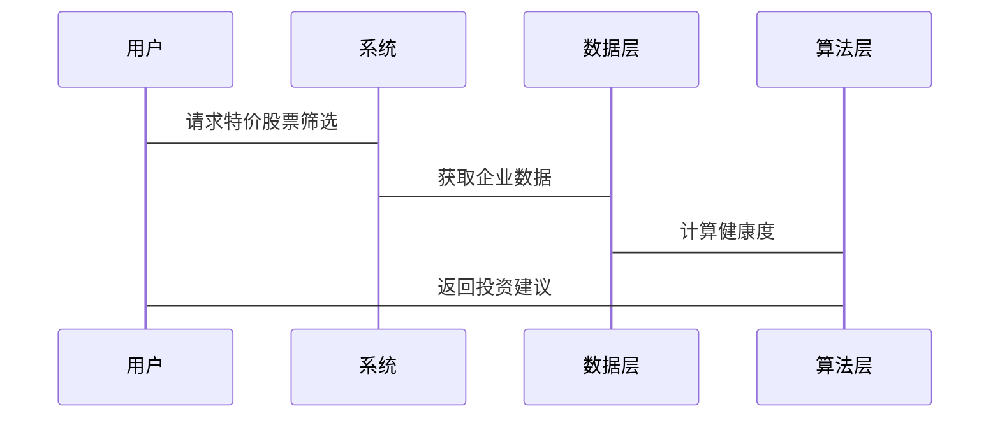

                 


# 特价股票与企业生命周期理论的结合

> **关键词**：特价股票、企业生命周期、投资策略、数学模型、算法原理

> **摘要**：本文探讨了特价股票与企业生命周期理论的结合，分析了如何通过企业生命周期的阶段特征来指导特价股票的投资策略。文章从背景介绍、核心概念、算法原理、数学模型、系统分析到项目实战，全面阐述了两者结合的理论与实践。

---

## 第1章: 特价股票的基础知识

### 1.1 特价股票的定义与特点

#### 1.1.1 特价股票的定义
特价股票是指价格低于其内在价值的股票，通常被视为被市场低估的投资机会。这类股票可能因市场波动、公司短期困境或市场情绪而被低估，但具有长期增值的潜力。

#### 1.1.2 特价股票的核心特点
- **低估值**：市盈率、市净率等指标低于行业平均水平。
- **潜在增长**：公司可能处于成长期或恢复期，未来有增长空间。
- **风险较低**：相对于高增长股票，风险相对较低，但需注意公司基本面。

#### 1.1.3 特价股票的分类与应用场景
- **周期性股票**：在经济周期波动中表现不佳，但周期性底部时可能成为特价股票。
- **价值股**：长期被市场低估，适合长期投资者。
- **成长股**：暂时被低估但具有高增长潜力的公司股票。

### 1.2 特价股票的投资价值
#### 1.2.1 特价股票的投资价值分析
特价股票的投资价值主要体现在其价格与内在价值的差异。投资者通过分析公司基本面，寻找被市场忽视或低估的股票，从而在市场恢复时获得超额收益。

#### 1.2.2 特价股票与企业生命周期的关系
企业生命周期的不同阶段影响其股票价格。例如，初创期企业可能因高增长预期而被高估，而成熟期企业可能因稳定收益被合理估值。特价股票往往出现在企业生命周期的特定阶段，如恢复期或衰退期的后期。

#### 1.2.3 特价股票投资的潜在风险与机会
- **风险**：公司基本面可能持续恶化，或市场长期低迷。
- **机会**：市场波动、行业整合或经济复苏时，特价股票可能迎来反弹。

---

## 第2章: 企业生命周期理论概述

### 2.1 企业生命周期的阶段划分

#### 2.1.1 企业生命周期的定义
企业生命周期是指企业从创立到衰退的整个过程，通常分为五个阶段：引入期、成长期、成熟期、衰退期和终止期。

#### 2.1.2 企业生命周期的五个阶段

| 阶段 | 特征 | 企业行为 | 投资机会 |
|------|------|----------|----------|
| 引入期 | 初创，资源有限 | 高风险，高增长 | 初创期股票，风险极高 |
| 成长期 | 快速增长，市场扩展 | 高增长，资金需求大 | 成长型股票，可能高价 |
| 成熟期 | 稳定增长，市场份额高 | 稳定收益，股息增长 | 价值股，可能低估 |
| 衰退期 | 市场份额下降，利润减少 | 资源收缩，寻求转型 | 低价股票，潜在反弹 |
| 终止期 | 退出市场或破产 | 结束运营 | 投资机会有限 |

#### 2.1.3 每个阶段的企业特征与行为变化
- **引入期**：企业面临高风险，资金需求大，股票可能被高估或低估。
- **成长期**：企业快速扩张，股票可能被高估，但成长型投资者可能愿意支付溢价。
- **成熟期**：企业稳定，股票可能被低估，适合价值投资者。
- **衰退期**：企业市场份额下降，股票可能被严重低估，适合风险承受能力强的投资者。
- **终止期**：企业退出市场，股票可能退市或成为 penny stock。

### 2.2 企业生命周期理论的核心要素

#### 2.2.1 企业生命周期的健康度评估
健康度评估是企业生命周期理论的关键，通过财务指标、市场表现和管理能力等多维度评估企业的健康状况。

#### 2.2.2 企业生命周期的阶段特征
每个阶段都有其独特的特征，投资者需要根据这些特征调整投资策略。例如，成熟期企业适合价值投资，而衰退期企业可能适合风险投资。

#### 2.2.3 企业生命周期与投资策略的结合
通过分析企业所处的生命周期阶段，投资者可以制定相应的投资策略。例如：
- 成长期企业：寻找高增长但合理估值的股票。
- 成熟期企业：关注低市盈率、高股息率的股票。
- 衰退期企业：寻找基本面改善或行业整合带来的机会。

---

## 第3章: 特价股票与企业生命周期的结合

### 3.1 特价股票与企业生命周期结合的必要性

#### 3.1.1 企业生命周期视角下的投资策略
从企业生命周期的角度分析股票，可以帮助投资者更好地理解股票价格波动的原因，并制定更有针对性的投资策略。

#### 3.1.2 特价股票在企业生命周期中的应用
特价股票通常出现在企业生命周期的特定阶段，例如成熟期或衰退期后期。投资者需要识别这些阶段，寻找被市场低估的股票。

### 3.2 特价股票与企业生命周期结合的核心机制

#### 3.2.1 企业生命周期阶段与股票价格的关系
企业生命周期的不同阶段影响股票价格的表现。例如：
- 引入期：股票可能波动大，但潜在回报高。
- 成长期：股票可能被高估，但增长潜力大。
- 成熟期：股票可能低估，适合价值投资。
- 衰退期：股票可能被严重低估，但风险较高。

#### 3.2.2 投资者如何利用企业生命周期理论进行投资
投资者可以通过分析企业所处的生命周期阶段，选择合适的股票进行投资。例如：
- 成熟期企业：寻找低市盈率、高股息率的股票。
- 衰退期企业：寻找基本面改善或行业整合带来的机会。

### 3.3 特价股票与企业生命周期结合的应用场景

#### 3.3.1 特价股票在成熟期企业的应用
成熟期企业通常处于稳定增长阶段，股票可能被低估。投资者可以通过分析企业的财务指标、市场份额和竞争优势，寻找被低估的股票。

#### 3.3.2 特价股票在衰退期企业的应用
衰退期企业可能因市场萎缩或管理不善而被低估。投资者需要识别那些基本面改善或行业整合的公司，寻找被市场忽视的机会。

---

## 第4章: 特价股票与企业生命周期结合的算法与数学模型

### 4.1 企业生命周期评估的算法原理

#### 4.1.1 企业生命周期评估的步骤
1. **数据收集**：收集企业的财务数据、市场数据和管理数据。
2. **指标分析**：通过市盈率、市净率、ROE等指标评估企业的健康状况。
3. **阶段划分**：根据企业的指标表现，将其划分为引入期、成长期、成熟期、衰退期或终止期。
4. **风险评估**：分析企业在不同阶段的风险和潜在回报。

#### 4.1.2 企业生命周期评估的算法实现
```python
def enterprise_life_stage(company_data):
    # 公司数据包括市盈率、市净率、ROE、收入增长率等指标
    pe = company_data['PE']
    pb = company_data['PB']
    roe = company_data['ROE']
    revenue_growth = company_data['Revenue_Growth']
    
    # 判断企业生命周期阶段
    if pe < 15 and pb < 1 and roe > 10 and revenue_growth > 10:
        return "成长期"
    elif pe < 10 or pb < 0.5 or roe < 5 or revenue_growth < 5:
        return "衰退期"
    elif pe > 15 or pb > 2 or roe > 15:
        return "成熟期"
    else:
        return "引入期"
```

#### 4.1.3 企业生命周期评估的数学模型
企业生命周期阶段的评估可以通过多维指标进行加权评分。例如：
$$
\text{企业健康度} = 0.3 \times \text{ROE} + 0.3 \times \text{Revenue\_Growth} + 0.2 \times \text{PE} + 0.2 \times \text{PB}
$$
根据健康度评分，将企业划分为不同的生命周期阶段。

### 4.2 特价股票投资策略的数学模型

#### 4.2.1 特价股票筛选的条件
$$
\text{筛选条件} = \begin{cases}
\text{PE} < 15 & \text{且} \\
\text{PB} < 1 & \text{且} \\
\text{ROE} > 5 & \text{且} \\
\text{行业排名} \in [\text{前50\%}] \\
\end{cases}
$$

#### 4.2.2 投资组合优化模型
$$
\text{投资组合收益} = \sum_{i=1}^{n} w_i \times r_i
$$
其中，\( w_i \) 是第 \( i \) 只股票的权重，\( r_i \) 是第 \( i \) 只股票的预期收益率。

#### 4.2.3 风险控制模型
$$
\text{投资组合风险} = \sqrt{\sum_{i=1}^{n} w_i^2 \times \sigma_i^2}
$$
其中，\( \sigma_i \) 是第 \( i \) 只股票的收益率标准差。

---

## 第5章: 系统分析与架构设计

### 5.1 系统功能设计

#### 5.1.1 系统目标
设计一个基于企业生命周期理论的特价股票筛选系统，帮助投资者识别被低估的股票。

#### 5.1.2 系统功能模块
- **数据采集模块**：收集企业财务数据、市场数据等。
- **指标分析模块**：计算企业健康度，划分生命周期阶段。
- **策略筛选模块**：根据筛选条件，推荐特价股票。
- **风险评估模块**：评估投资组合的风险和回报。

#### 5.1.3 系统功能流程图


### 5.2 系统架构设计

#### 5.2.1 系统架构图


#### 5.2.2 接口设计
- **API接口**：提供RESTful API，供用户调用。
- **数据接口**：与数据源（如Yahoo Finance）对接。

#### 5.2.3 交互流程图


---

## 第6章: 项目实战

### 6.1 环境安装与配置

#### 6.1.1 安装Python环境
```bash
python --version
pip install jupyter pandas numpy matplotlib
```

#### 6.1.2 数据源获取
使用Yahoo Finance获取股票数据。

### 6.2 核心代码实现

#### 6.2.1 数据清洗与预处理
```python
import pandas as pd

# 加载数据
data = pd.read_csv('stock_data.csv')

# 删除缺失值
data = data.dropna()

# 标准化数据
data['PE'] = (data['PE'] / data['PE'].max()) * 100
```

#### 6.2.2 企业生命周期阶段划分
```python
def classify_stage(pe, pb, roe, revenue_growth):
    if pe < 15 and pb < 1 and roe > 5 and revenue_growth > 5:
        return "成长期"
    elif pe < 10 or pb < 0.5 or roe < 5 or revenue_growth < 5:
        return "衰退期"
    else:
        return "成熟期"

# 应用分类函数
data['阶段'] = data.apply(lambda x: classify_stage(x['PE'], x['PB'], x['ROE'], x['Revenue_Growth']), axis=1)
```

#### 6.2.3 特价股票筛选
```python
# 筛选条件
data['是否特价'] = data.apply(lambda x: 
    x['PE'] < 15 and x['PB'] < 1 and x['ROE'] > 5 and x['Revenue_Growth'] > 5, axis=1)

# 获取特价股票列表
special_stocks = data[data['是否特价']]
```

### 6.3 案例分析

#### 6.3.1 案例背景
假设我们分析一家制造企业的数据，PE=12，PB=0.8，ROE=6%，Revenue_Growth=8%。

#### 6.3.2 分析过程
根据分类函数，该企业处于成长期，且符合特价股票筛选条件。

#### 6.3.3 结果解读
该企业股票可能被低估，适合成长型投资者。

### 6.4 项目总结

#### 6.4.1 项目成果
成功开发了一个基于企业生命周期理论的特价股票筛选系统。

#### 6.4.2 项目经验
- 数据清洗与预处理是关键。
- 算法的准确性和实时性需进一步优化。

---

## 第7章: 最佳实践与小结

### 7.1 最佳实践

#### 7.1.1 投资策略
- 定期评估企业生命周期阶段，动态调整投资组合。
- 结合市场环境和行业趋势，选择合适的股票。

#### 7.1.2 风险管理
- 设定止损点，控制投资风险。
- 分散投资，避免过度集中。

### 7.2 小结

本文详细探讨了特价股票与企业生命周期理论的结合，通过理论分析、算法实现和项目实战，展示了如何利用企业生命周期阶段指导投资策略。投资者可以通过分析企业的健康状况，识别被低估的股票，制定科学的投资计划。

### 7.3 注意事项

- 数据来源的可靠性至关重要。
- 模型的准确性和实时性需持续优化。
- 风险管理是投资成功的关键。

### 7.4 拓展阅读

- 《价值投资：/es/zh_cn/book/value-investing-the-essential-elements》
- 《企业生命周期理论与应用》

---

**结语**：通过本文的分析，读者可以更好地理解特价股票与企业生命周期理论的结合，并在实际投资中灵活运用这些方法。希望本文能为投资者提供有价值的参考和启发。

