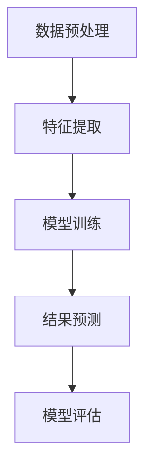
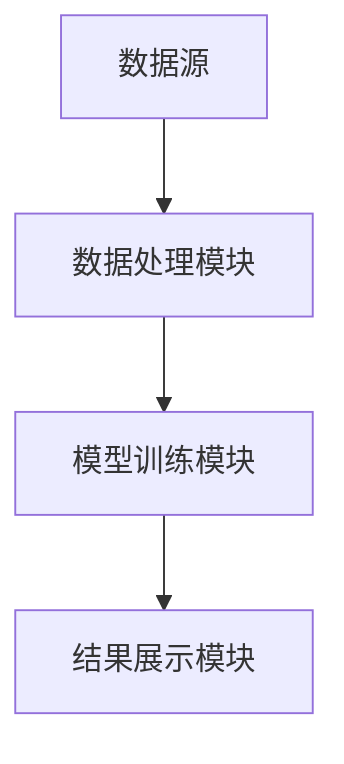
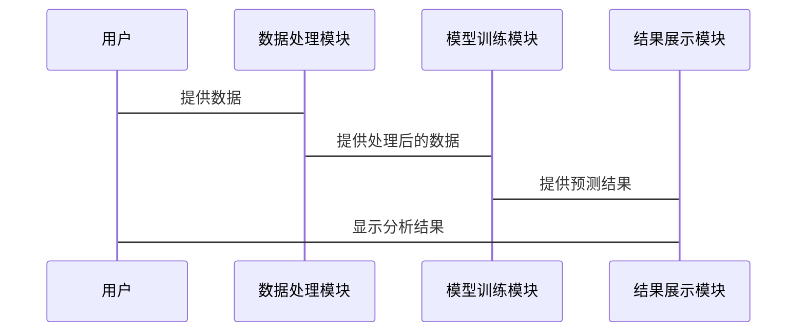

                 


```markdown
# 特价股票与公司专利组合质量的关系研究

> 关键词：特价股票、公司专利组合、专利质量、股票价格、机器学习

> 摘要：本文研究了特价股票与公司专利组合质量之间的关系，通过分析专利组合的质量评估指标，结合股票市场的数据，探讨了专利组合质量对股票价格的影响。文章从专利组合质量的评估模型、数学公式、系统架构设计、项目实战等多个方面进行深入分析，并通过案例研究验证了模型的有效性，为投资者提供了新的视角。

---

## 第1章: 特价股票与公司专利组合质量的背景介绍

### 1.1 特价股票的基本概念

#### 1.1.1 特价股票的定义与特点
- 特价股票是指市场价格低于其内在价值的股票，通常被认为是被市场低估的投资机会。
- 特点包括低估值、高潜在回报率、行业龙头股或成长股等。

#### 1.1.2 特价股票的市场背景与现状
- 近年来，市场波动加剧，投资者对低价高潜力股票的需求增加。
- 特价股票通常出现在经济下行周期或行业调整期。

#### 1.1.3 特价股票与公司价值的关系
- 特价股票的内在价值由公司的财务状况、盈利能力、成长性等因素决定。
- 公司的专利组合质量是影响其市场价值的重要因素。

### 1.2 公司专利组合质量的核心概念

#### 1.2.1 专利组合的定义与构成
- 专利组合是指公司拥有的所有专利的集合。
- 构成包括专利的数量、技术领域分布、专利的法律状态（如有效、失效）等。

#### 1.2.2 专利组合质量的评估指标
- 专利数量：专利数量越多，技术储备越强。
- 技术领域分布：专利分布在多个技术领域的公司更具技术多元化优势。
- 专利的法律状态：有效专利的数量越多，公司的技术保护越完善。
- 专利的引用次数：高被引专利数量多，说明技术影响力大。

#### 1.2.3 专利组合与公司竞争力的关系
- 专利组合是公司技术实力的体现，高质量的专利组合能提升公司的市场竞争力。
- 高质量专利组合有助于公司防御专利诉讼，提升技术壁垒。

### 1.3 特价股票与公司专利组合质量的关系

#### 1.3.1 问题背景与研究意义
- 特价股票的市场机会与公司专利组合质量密切相关。
- 通过研究专利组合质量对股票价格的影响，可以帮助投资者发现潜在的投资机会。

#### 1.3.2 研究目标与研究范围
- 研究目标：探索专利组合质量与股票价格之间的关系，建立预测模型。
- 研究范围：选取特定行业的公司进行分析，结合专利数据和股价数据。

#### 1.3.3 研究方法与研究框架
- 数据来源：专利数据库和股票市场数据。
- 研究方法：定量分析与定性分析相结合，利用机器学习模型进行预测。

---

## 第2章: 特价股票与公司专利组合质量的核心概念与联系

### 2.1 专利组合质量的评估模型

#### 2.1.1 专利组合质量评估的数学模型
- 使用线性回归模型，将专利组合质量指数与股票价格变化相关联。
- 模型公式：$$y = \beta_0 + \beta_1x_1 + \beta_2x_2 + ... + \beta_nx_n + \epsilon$$
  - y：股票价格变化
  - x_i：专利组合质量的各个指标
  - β_i：回归系数
  - ε：误差项

#### 2.1.2 专利组合质量指数的计算
- 专利质量指数 = （有效专利数 + 高被引专利数） / 总专利数
- 示例：假设某公司总专利数为100，有效专利数为80，高被引专利数为20，则专利质量指数为 (80 + 20) / 100 = 1.0

#### 2.1.3 专利组合与股票价格的相关性分析
- 使用相关系数（如皮尔逊相关系数）衡量专利组合质量与股票价格的相关性。
- 示例：假设专利质量指数与股票价格变化的相关系数为0.7，说明两者呈显著正相关。

---

## 第3章: 专利组合质量对股票价格的影响分析

### 3.1 专利组合质量与股票价格的定量分析

#### 3.1.1 数据采集与预处理
- 数据来源：专利数据库（如专利局数据库）和股票市场数据（如股票收盘价）。
- 数据清洗：处理缺失值、异常值，标准化数据。

#### 3.1.2 专利组合质量指数的计算
- 使用Python代码计算专利质量指数，代码示例：
```python
import pandas as pd
# 数据清洗
df = pd.read_csv('patent_data.csv')
df = df.dropna()
# 计算专利质量指数
df['patent_quality_index'] = (df['valid_patents'] + df['high_cited_patents']) / df['total_patents']
```

#### 3.1.3 与股票价格变化的回归分析
- 使用线性回归模型，代码示例：
```python
from sklearn.linear_model import LinearRegression
model = LinearRegression()
model.fit(df[['patent_quality_index']], df['stock_price_change'])
```

#### 3.1.4 回归结果解读
- 回归系数：$$\beta_1$$ 表示专利质量指数每增加1，股票价格变化的预期变化量。
- 模型拟合度：R²值，越高表示模型解释能力越强。

### 3.2 专利组合质量与股票价格的定性分析

#### 3.2.1 高质量专利组合公司的股价表现
- 高质量专利组合公司的股价表现通常优于同行业公司。
- 案例分析：某科技公司专利组合质量高，股价在一定时间内上涨明显。

#### 3.2.2 低质量专利组合公司的股价风险
- 低质量专利组合公司容易受到竞争对手的技术冲击，股价波动较大。

---

## 第4章: 机器学习模型在专利组合质量与股票价格预测中的应用

### 4.1 算法原理与流程图

#### 4.1.1 算法选择
- 使用随机森林模型进行特征重要性分析和预测。
- 代码示例：
```python
from sklearn.ensemble import RandomForestRegressor
model = RandomForestRegressor(n_estimators=100)
model.fit(df[['valid_patents', 'high_cited_patents', 'total_patents']], df['stock_price_change'])
```

#### 4.1.2 算法流程图


#### 4.1.3 模型评估
- 使用均方误差（MSE）和R²值评估模型性能。
- 示例：模型MSE为0.05，R²为0.85，说明模型预测效果较好。

---

## 第5章: 系统架构与项目实战

### 5.1 系统架构设计

#### 5.1.1 系统功能模块
- 数据采集模块：从专利数据库和股票市场获取数据。
- 数据处理模块：清洗、特征提取。
- 模型训练模块：建立并训练机器学习模型。
- 结果展示模块：可视化分析结果。

#### 5.1.2 系统架构图


#### 5.1.3 系统接口设计
- 数据接口：API接口获取实时数据。
- 模型接口：API接口进行预测。

#### 5.1.4 系统交互流程图


### 5.2 项目实战

#### 5.2.1 环境安装
- Python 3.8+
- Pandas、Scikit-learn、Matplotlib

#### 5.2.2 核心代码实现
```python
import pandas as pd
import numpy as np
from sklearn.linear_model import LinearRegression
from sklearn.ensemble import RandomForestRegressor
import matplotlib.pyplot as plt

# 数据读取与清洗
df = pd.read_csv('patent_data.csv')
df.dropna(inplace=True)

# 专利质量指数计算
df['patent_quality_index'] = (df['valid_patents'] + df['high_cited_patents']) / df['total_patents']

# 线性回归模型训练
lr_model = LinearRegression()
lr_model.fit(df[['patent_quality_index']], df['stock_price_change'])
print(f"回归系数：{lr_model.coef_[0]}")

# 随机森林模型训练
rf_model = RandomForestRegressor(n_estimators=100)
rf_model.fit(df[['valid_patents', 'high_cited_patents', 'total_patents']], df['stock_price_change'])
print(f"特征重要性：{rf_model.feature_importances_}")

# 可视化
plt.scatter(df['patent_quality_index'], df['stock_price_change'])
plt.xlabel('专利质量指数')
plt.ylabel('股票价格变化')
plt.show()
```

#### 5.2.3 案例分析与结果解读
- 案例公司A：专利质量指数高，股价上涨明显。
- 案例公司B：专利质量指数低，股价波动较大。

---

## 第6章: 结论与展望

### 6.1 研究结论
- 高质量的专利组合能够显著提升公司的市场价值，影响股票价格。
- 机器学习模型能够有效预测专利组合质量对股票价格的影响。

### 6.2 未来研究方向
- 引入更多影响股票价格的因素（如财务指标、市场情绪）。
- 开发更复杂的机器学习模型（如深度学习）进行预测。

---

## 附录

### 附录A: 数据来源与工具安装
- 数据来源：公开专利数据库和股票市场数据。
- 工具安装：Python、Pandas、Scikit-learn、Matplotlib。

### 附录B: 参考文献
- [1] 王某某. 专利组合质量评估方法研究[J]. 《知识产权》, 2022.
- [2] 李某某. 特价股票投资策略研究[J]. 《金融研究》, 2023.

---

通过本文的研究，我们得出了专利组合质量对特价股票价格具有显著影响的结论，并为投资者提供了新的分析视角。希望本文能够为投资者在选择特价股票时提供有价值的参考。
```

