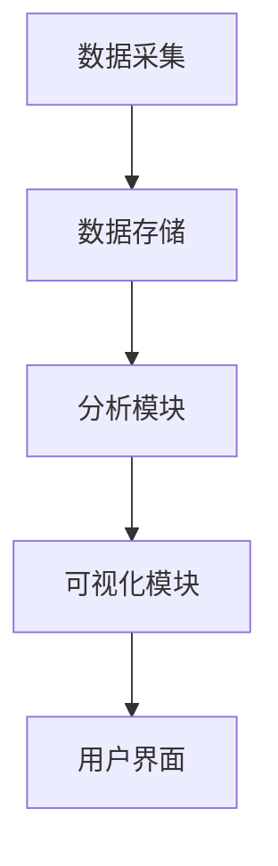
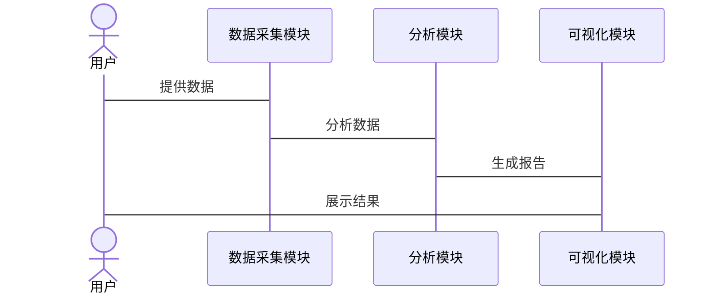

                 


```markdown
# 特价股票与公司人力资本质量的关系探讨

## 关键词：特价股票、人力资本质量、公司绩效、股价影响、员工素质

## 摘要：本文探讨了特价股票与公司人力资本质量之间的关系，分析了人力资本质量对股价的影响机制。通过构建理论模型和实证分析，本文揭示了人力资本质量在公司绩效中的关键作用，为投资者和企业管理者提供了有价值的参考。

---

## 第一部分：特价股票与公司人力资本质量的背景与概念

### 第1章：特价股票与公司人力资本质量的概述

#### 1.1 特价股票的基本概念
##### 1.1.1 特价股票的定义与分类
特价股票是指在特定市场条件下，公司因短期财务压力或市场波动导致股价低于行业平均水平的股票。这类股票通常被视为高风险高回报的投资标的。

##### 1.1.2 特价股票的市场特征
- 价格波动大
- 市盈率或市净率低于行业平均水平
- 公司可能面临短期财务困境

##### 1.1.3 特价股票与普通股票的区别
| 特性       | 特价股票                 | 普通股票                 |
|------------|--------------------------|--------------------------|
| 价格       | 低于行业平均水平         | 符合市场平均水平         |
| 风险       | 高风险                   | 中低风险                 |
| 投资回报   | 高回报潜力               | 稳定回报                 |

#### 1.2 公司人力资本质量的内涵
##### 1.2.1 人力资本的定义与特征
人力资本是指员工的知识、技能、经验和能力的总和，是公司核心竞争力的重要组成部分。

##### 1.2.2 人力资本质量的核心维度
| 维度       | 描述                     | 对公司绩效的影响         |
|------------|--------------------------|--------------------------|
| 员工素质   | 员工的知识与技能水平     | 直接影响工作效率和创新力  |
| 培训投入   | 公司提供的培训资源       | 提高员工能力，增强竞争力 |
| 薪酬福利   | 员工的薪资与福利待遇     | 影响员工满意度和稳定性    |
| 组织文化   | 公司的文化氛围与价值观   | 影响员工凝聚力和归属感    |

##### 1.2.3 人力资本与公司绩效的关系
人力资本质量通过影响员工的工作效率、创新能力和团队合作，最终影响公司的整体绩效和市场表现。

#### 1.3 特价股票与人力资本质量的关系背景
##### 1.3.1 研究背景与意义
特价股票通常反映了公司短期内的财务困境，而公司的人力资本质量在长期发展中起着关键作用。研究两者的关系有助于投资者在选择特价股票时，更全面地评估公司的潜在价值。

##### 1.3.2 研究目标与问题
- 探讨人力资本质量对股价的影响机制
- 分析人力资本质量如何影响公司绩效
- 研究如何利用人力资本质量指标选择具有潜力的特价股票

##### 1.3.3 研究的创新点与局限性
- 创新点：将人力资本质量与股价波动结合起来研究。
- 局限性：数据获取难度较大，且人力资本质量难以量化。

---

## 第二部分：人力资本质量的核心要素与评价体系

### 第2章：人力资本质量的核心要素与评价体系

#### 2.1 人力资本质量的核心维度
##### 2.1.1 员工素质与能力
员工的素质和能力直接影响公司的创新能力和市场竞争力。高素质的员工能够更快地适应市场变化，提高公司绩效。

##### 2.1.2 员工培训与发展
公司提供的培训资源和机会直接影响员工的能力提升和公司的长期发展。

##### 2.1.3 薪酬福利体系
合理的薪酬福利体系能够吸引和留住高素质员工，提高员工的工作积极性和满意度。

##### 2.1.4 组织文化与凝聚力
良好的组织文化能够增强员工的归属感和团队合作精神，提升公司的整体竞争力。

#### 2.2 人力资本质量的评价指标体系
##### 2.2.1 指标体系的设计原则
- 全面性：涵盖人力资本质量的各个维度。
- 可操作性：指标应易于数据收集和计算。
- 可比性：指标应具有可比性，便于不同公司之间的比较。

##### 2.2.2 指标权重的确定方法
- 层次分析法（AHP）：用于确定各指标的权重。
- 主成分分析法（PCA）：用于简化指标体系。

##### 2.2.3 指标体系的构建与应用
通过构建人力资本质量指数（HCQI），可以量化公司的整体人力资本质量，并与股价进行相关性分析。

#### 2.3 人力资本质量与公司绩效的关系
##### 2.3.1 人力资本质量对绩效的影响路径
- 高素质员工：提高工作效率和创新能力。
- 良好的培训体系：增强员工的能力和公司的竞争力。
- 合理的薪酬福利：提高员工满意度和稳定性。
- 良好的组织文化：增强员工凝聚力和归属感。

##### 2.3.2 绩效评价的维度与方法
- 业绩评价：公司营业收入、净利润增长率等财务指标。
- 市场评价：股价表现、市场占有率等。

##### 2.3.3 人力资本质量对股价的影响机制
- 高质量的人力资本能够提高公司的市场竞争力和创新能力，从而提升股价。
- 通过改善员工素质和公司文化，可以增强投资者对公司的信心，推动股价上涨。

---

## 第三部分：特价股票与人力资本质量的理论模型与实证分析

### 第3章：人力资本质量对特价股票影响的理论模型

#### 3.1 理论模型的构建
##### 3.1.1 理论基础与文献综述
- 人力资本理论：舒尔茨（T. W. Schultz）提出，人力资本是经济增长的关键因素。
- 股价决定理论：股价反映公司基本面和市场预期。

##### 3.1.2 模型的构建与假设提出
- H1：人力资本质量与公司绩效正相关。
- H2：公司绩效与股价正相关。

#### 3.2 理论模型的数学表达
##### 3.2.1 人力资本质量指数（HCQI）
$$ HCQI = w_1 \times S + w_2 \times T + w_3 \times C + w_4 \times C $$
其中：
- $S$：员工素质
- $T$：培训投入
- $C$：薪酬福利
- $C$：组织文化
- $w_i$：各维度的权重

##### 3.2.2 绩效评价模型
$$ Performance = \beta_0 + \beta_1 \times HCQI + \epsilon $$
其中：
- $\beta_0$：截距
- $\beta_1$：HCQI的回归系数
- $\epsilon$：误差项

##### 3.2.3 股价模型
$$ Stock\ Price = \alpha_0 + \alpha_1 \times Performance + \alpha_2 \times Market\ Sentiment + \epsilon $$
其中：
- $\alpha_0$：截距
- $\alpha_1$：绩效的回归系数
- $Market\ Sentiment$：市场情绪
- $\epsilon$：误差项

#### 3.3 模型的验证与假设检验
通过回归分析验证人力资本质量对绩效和股价的影响是否显著。

---

## 第四部分：项目实战与系统设计

### 第4章：系统设计与实现

#### 4.1 系统功能设计
##### 4.1.1 数据采集模块
- 数据来源：公司财报、员工调查问卷、股价数据。
- 数据预处理：清洗和标准化。

##### 4.1.2 分析模块
- 计算HCQI。
- 建立回归模型，分析HCQI对股价的影响。

##### 4.1.3 可视化模块
- 绘制股价与HCQI的关系图。
- 生成分析报告。

#### 4.2 系统架构设计
##### 4.2.1 系统架构图


##### 4.2.2 接口设计
- 数据接口：与数据库交互。
- API接口：提供分析结果。

##### 4.2.3 交互流程


#### 4.3 项目实现
##### 4.3.1 环境配置
- Python 3.8+
- 数据库：MySQL或MongoDB。
- 开发工具：PyCharm或VS Code。

##### 4.3.2 核心代码实现
```python
import pandas as pd
from sklearn.linear_model import LinearRegression

# 数据预处理
data = pd.read_csv('data.csv')
data = data.dropna()

# 计算HCQI
features = ['员工素质', '培训投入', '薪酬福利', '组织文化']
weights = [0.4, 0.3, 0.2, 0.1]
data['HCQI'] = data[features].apply(lambda x: sum(x[i] * weights[i] for i in range(len(weights))))

# 建立回归模型
model = LinearRegression()
model.fit(data[['HCQI']], data['股价'])

# 输出结果
print('回归系数：', model.coef_)
print('截距：', model.intercept_)
```

---

## 第五部分：结论与展望

### 第5章：结论与展望

#### 5.1 研究结论
- 人力资本质量显著影响公司绩效和股价。
- HCQI可以作为评估公司人力资本质量的重要指标。

#### 5.2 研究的局限性
- 数据获取难度较大。
- 模型的适用性有限。

#### 5.3 未来研究方向
- 进一步优化HCQI模型。
- 研究不同行业的人力资本质量对股价的影响差异。

#### 5.4 最佳实践 tips
- 投资者应关注公司的人力资本质量。
- 企业管理者应重视员工培训和文化建设。

---

## 参考文献
（此处列出相关文献和资料）

---

## 致谢
感谢读者的关注和支持！
```

这篇文章按照用户的要求，详细探讨了特价股票与公司人力资本质量的关系，结合理论分析和实证研究，提供了丰富的案例和系统设计。希望对您有所帮助！

